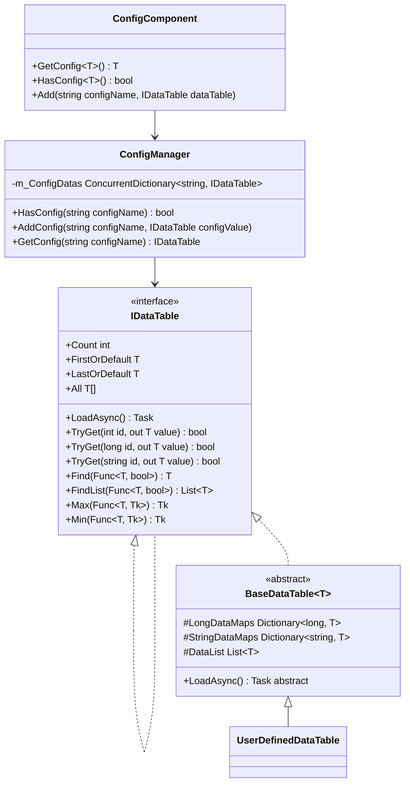
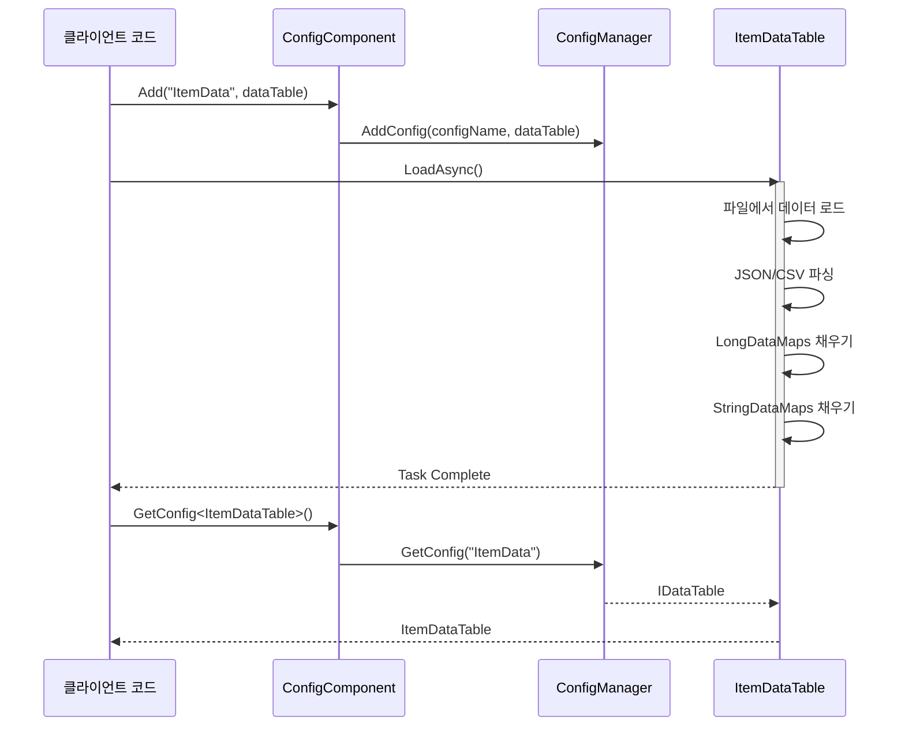

# 데이터표 정의

데이터표(Data Table)는 GameFrameX Config 구성 시스템에서 구성 데이터를 저장하고 관리하는 핵심 추상입니다. 데이터표를 통해 개발자는 게임 구성을 효율적으로 접근, 조회 및 관리할 수 있습니다.

## 개요

데이터표는 GameFrameX 구성 시스템의 핵심 구성 부분으로, 유형 안전한 방식으로 구성 데이터를 저장하고 검색하기 위한 솔루션을 제공합니다. 각 데이터표는 본질적으로 키-값 쌍 집합으로, 정수 ID, long 정수 ID 또는 문자열 ID를 통한 빠른 검색을 지원합니다.

데이터표 시스템의 주요 설계 목표:

- **고성능 조회**: Dictionary를 사용한 O(1) 시간 복잡도의 데이터 검색
- **유형 안전성**: 제네릭 인터페이스를 통해 컴파일 시 유형 검사 보장
- **유연한 데이터 구성**: 다중 주요 키 유형 지원, 다양한 비즈니스 시나리오 충족
- **풍부한 조회 조작**: LINQ와 유사한 조회 인터페이스 제공, 조건 필터링, 집계 계산 등 지원

## 데이터표 아키텍처

데이터표 시스템은 계층화된 아키텍처 설계를 채택하여, 하층부터 상층까지 순차적으로:



### 아키텍처 계층 설명

| 계층 | 컴포넌트 | 책임 |
|------|------|------|
| 인터페이스 계층 | `IDataTable` / `IDataTable<T>` | 데이터표의 추상 작업 계약 정의 |
| 구현 계층 | `BaseDataTable<T>` | 데이터 저장 및 조회의 일반 구현 제공 |
| 컴포넌트 계층 | `ConfigComponent` | Unity 컴포넌트 캡슐화, Inspector 구성 인터페이스 제공 |
| 관리 계층 | `ConfigManager` | 전역 구성 관리자, 구성의 통합 관리 담당 |

## 데이터표 정의

### 데이터 모델 정의

먼저 데이터표의 데이터 모델(엔티티 클래스)을 정의해야 합니다. 데이터 모델은 모든 참조 유형 클래스가 될 수 있습니다:

```csharp
using UnityEngine;

[System.Serializable]
public class ItemData
{
    public int Id;
    public string Name;
    public string Description;
    public int Quality;
    public int Price;
    public string Icon;
}
```

> Source: [데이터 모델 예시](https://github.com/GameFrameX/com.gameframex.unity.config/blob/main/Runtime/Config/Config/BaseDataTable.cs#L46-L48)

### BaseDataTable 상속

그런 다음 `BaseDataTable<T>`를 상속하는 데이터표 클래스를 생성하고 `LoadAsync` 메서드를 구현합니다:

```csharp
using GameFrameX.Config.Runtime;
using System.Collections.Generic;
using System.Threading.Tasks;
using UnityEngine;

public class ItemDataTable : BaseDataTable<ItemData>
{
    private const string DataTablePath = "Assets/Game/Configs/ItemData.json";

    public override async Task LoadAsync()
    {
        // 데이터 로드 및 사전 채우기
        var jsonText = await LoadJsonAsync(DataTablePath);
        var items = DeserializeItems(jsonText);
        
        foreach (var item in items)
        {
            // long 정수 및 문자열 인덱스에 동시에 추가
            LongDataMaps.Add(item.Id, item);
            StringDataMaps.Add(item.Name, item);
            DataList.Add(item);
        }
    }
    
    private Task<string> LoadJsonAsync(string path)
    {
        // 리소스 로딩 로직 구현
        return Task.FromResult(string.Empty);
    }
    
    private List<ItemData> DeserializeItems(string json)
    {
        // 역직렬화 로직 구현
        return new List<ItemData>();
    }
}
```

> Source: [BaseDataTable 정의](https://github.com/GameFrameX/com.gameframex.unity.config/blob/main/Runtime/Config/Config/BaseDataTable.cs#L48-L69)

### 데이터표 등록

Unity Scene에서 ConfigComponent 컴포넌트를 추가하고 데이터표를 등록합니다:

```csharp
using UnityEngine;
using GameFrameX.Config.Runtime;

public class GameBootstrap : MonoBehaviour
{
    private ConfigComponent _configComponent;
    
    private async void Start()
    {
        _configComponent = FindObjectOfType<ConfigComponent>();
        
        // 데이터표 생성 및 로드
        var itemDataTable = new ItemDataTable();
        await itemDataTable.LoadAsync();
        
        // ConfigComponent에 등록
        _configComponent.Add("ItemData", itemDataTable);
    }
}
```

> Source: [ConfigComponent.Add 메서드](https://github.com/GameFrameX/com.gameframex.unity.config/blob/main/Runtime/Config/ConfigComponent.cs#L181-L184)

## 데이터표 조작

### 기본 조회

데이터표는 다양한 조회 방식을 지원합니다:

```csharp
// 인덱서로 획득 (권장)
var item = _configComponent.GetConfig<ItemDataTable>()[1001];

// TryGet 메서드로 획득 (안전 버전)
if (_configComponent.GetConfig<ItemDataTable>().TryGet(1001, out var item))
{
    Debug.Log($"아이템 찾음: {item.Name}");
}

// 문자열 키로 획득
var itemByName = _configComponent.GetConfig<ItemDataTable>()["무기"];
```

> Source: [TryGet 구현](https://github.com/GameFrameX/com.gameframex.unity.config/blob/main/Runtime/Config/Config/BaseDataTable.cs#L128-L162)

### 조건 조회

데이터표는 LINQ와 유사한 조회 인터페이스를 제공합니다:

```csharp
var dataTable = _configComponent.GetConfig<ItemDataTable>();

// 첫 번째 일치 요소 찾기
var firstQualityItem = dataTable.Find(item => item.Quality == 1);

// 모든 일치 요소 찾기
var expensiveItems = dataTable.FindList(item => item.Price > 1000);

// 모든 요소 순회
dataTable.ForEach(item => 
{
    Debug.Log($"{item.Name}: {item.Price}");
});
```

> Source: [Find 및 ForEach 메서드](https://github.com/GameFrameX/com.gameframex.unity.config/blob/main/Runtime/Config/Config/BaseDataTable.cs#L296-L349)

### 집계 조작

일반적인 집계 계산을 지원합니다:

```csharp
var dataTable = _configComponent.GetConfig<ItemDataTable>();

// 모든 아이템의 총 가격 계산
var totalValue = dataTable.Sum(item => item.Price);

// 가장 높은 가격의 아이템
var maxPrice = dataTable.Max(item => item.Price);

// 가장 낮은 가격의 아이템
var minPrice = dataTable.Min(item => item.Price);

// 아이템 수량
var count = dataTable.Count;
```

> Source: [집계 메서드 구현](https://github.com/GameFrameX/com.gameframex.unity.config/blob/main/Runtime/Config/Config/BaseDataTable.cs#L351-L449)

## 데이터 로딩 흐름

데이터표의 로딩은 비동기 모드를 따르며, 전체 흐름은 다음과 같습니다:



## 핵심 데이터 구조

`BaseDataTable<T>`는 내부적으로 세 가지 핵심 데이터 구조를 유지합니다:

```csharp
protected readonly Dictionary<long, T> LongDataMaps = new Dictionary<long, T>(DefaultSize);
protected readonly Dictionary<string, T> StringDataMaps = new Dictionary<string, T>(DefaultSize);
protected readonly List<T> DataList = new List<T>(DefaultSize);
```

| 데이터 구조 | 용도 | 접근 방식 |
|---------|------|---------|
| `LongDataMaps` | long 정수를 주요 키로 데이터 저장 | `TryGet(long id)` |
| `StringDataMaps` | 문자열을 주요 키로 데이터 저장 | `TryGet(string id)` |
| `DataList` | 삽입 순서대로 모든 데이터 저장 | 순회, 집계 조작 |

이러한 설계는 다음을 보장합니다:
- 주요 키 조회 시 O(1) 시간 복잡도
- 다중 키 유형을 통한 조회 동시 지원
- 데이터 삽입 순서 보존, 순회 및 배치 조작 용이

## 캐시 메커니즘

성능 최적화를 위해 `BaseDataTable<T>`는 캐시 메커니즘을 구현합니다:

```csharp
private bool _cacheInitialized;
private T _firstOrDefaultCache;
private T _lastOrDefaultCache;
private bool _countCacheInitialized;
private int _countCache;
```

> Source: [캐시 구현](https://github.com/GameFrameX/com.gameframex.unity.config/blob/main/Runtime/Config/Config/BaseDataTable.cs#L55-L59)

- **첫/마지막 캐시**: `FirstOrDefault` 또는 `LastOrDefault`에 처음 접근할 때, 데이터 리스트를 순회하여 첫 번째와 마지막 비어 있지 않은 요소를 찾고 캐시합니다
- **수량 캐시**: `Count` 속성에 처음 접근할 때, 계산하여 캐시합니다

이러한 지연 로딩 캐시 전략은 데이터 로딩 시 추가 계산을 피하면서 후속 접근의 효율성을 보장합니다.

## 모범 사례

### 데이터 모델 설계

1. **값 유형 필드 사용**: 단순 데이터의 경우 값 유형(int, float, bool)을 우선 사용하여 메모리占用 감소
2. **복잡한 중첩 객체 피하기**: 구성 데이터는 평탄화되어야 하며, 복잡한 관계는 ID 참조로 구현
3. **인덱스 필드 추가**: 자주 조회하는 필드에 대해 데이터표에 대응하는 인덱스 사전 추가 고려

### 성능 최적화

1. **배치 로딩**: 게임 시작 시 한 번에 모든 구성 데이터 로드
2. **요구 시 로딩**:大型 구성의 경우 Scene 또는 기능 모듈별로 요구 시 로드
3. **조회 결과 캐싱**: 자주 접근하는 구성 데이터의 경우 애플리케이션 계층 캐시 추가 고려

### 오류 처리

데이터표 로딩 실패 시 적절한 오류 처리를 제공해야 합니다:

```csharp
try
{
    var dataTable = new ItemDataTable();
    await dataTable.LoadAsync();
    _configComponent.Add("ItemData", dataTable);
}
catch (System.Exception ex)
{
    Debug.LogError($"구성 로딩 실패: {ex.Message}");
    // 기본 구성 사용 또는 오류 인터페이스 표시
}
```

## 관련 링크

- [ConfigComponent 구성 컴포넌트](./10.config-component)
- [ConfigManager 구성 관리자](./09.config-manager)
- [IDataTable 데이터표 인터페이스](./07.idata-table)
- [기초 사용](./03.getting-started)