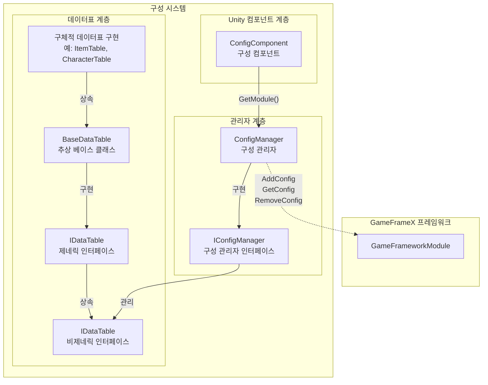
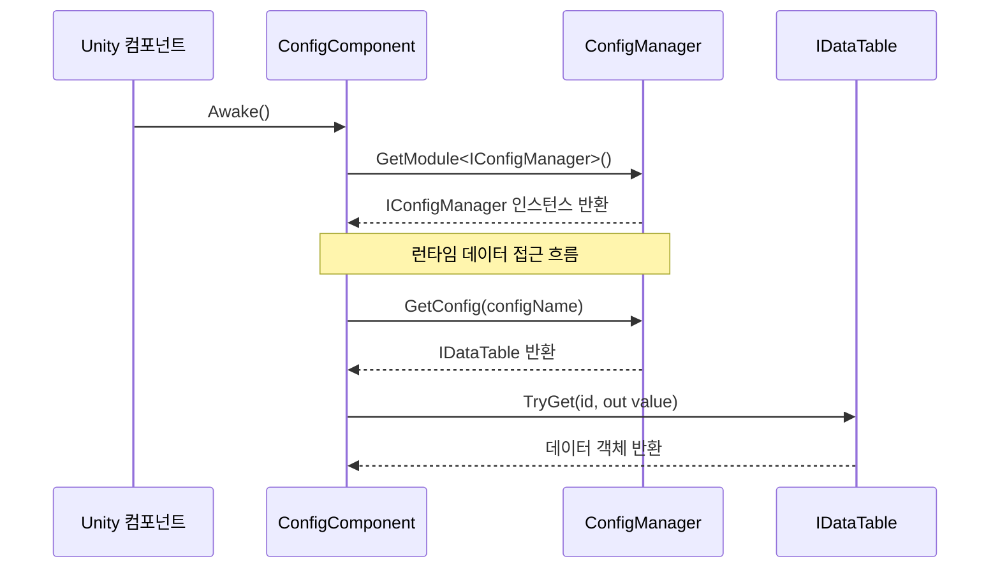

# ConfigManager 구성 관리자

ConfigManager는 GameFrameX 구성 시스템의 핵심 모듈로, 게임의 모든 구성 데이터표를 통합 관리합니다. 구성 데이터의 저장, 조회, 추가, 제거 등 핵심 기능을 제공하며, 게임 런타임 시 구성 데이터 접근의 주요 진입점입니다.

## 개요

ConfigManager는 전역 구성 관리자로, 구성 데이터 중앙 저장소 역할을 합니다. 게임 개발에서는 일반적으로 다량의 구성 데이터(아이템표, 캐릭터 속성표, 레벨 구성 등)가 있으며, 이러한 데이터는 효율적인 관리 메커니즘이 필요합니다. ConfigManager는 키-값 쌍 방식으로 `IDataTable` 유형의 구성 데이터표를 관리하며, 구성 이름을 통해 빠르고 간편하게 조회 및 획득할 수 있습니다.

해당 관리자는 스레드 안전한 `ConcurrentDictionary`를 사용하여 다중 스레드 환경에서도 안전하게 구성 데이터에 접근하고 수정할 수 있습니다. GameFramework의 핵심 모듈 중 하나로, 게임 시작 시 초기화되고 게임 종료 시 모든 구성 데이터를 정리합니다.

### 핵심 책임

- **구성 저장 관리**: 모든 게임 구성 데이터표의 저장 통합 관리
- **구성 조회**: 빠른 구성 데이터 검색 및 획득 기능 제공
- **구성 수명 주기**: 구성 데이터의 추가, 제거 및 비우기 작업 관리
- **스레드 안전 보장**: 다중 스레드 환경에서 안전하게 구성 데이터 접근

## 아키텍처 설계



상기 그림은 구성 시스템의 전체 아키텍처를 보여주며, Unity 컴포넌트 계층에서 데이터표 계층까지의 완전한 호출 체인을 나타냅니다.

### 핵심 클래스 설명

| 클래스명 | 책임 | 설명 |
|------|------|------|
| ConfigManager | 구성 관리자 핵심 구현 | GameFrameworkModule을 상속, 모든 구성 데이터표 관리 |
| IConfigManager | 구성 관리자 인터페이스 | 구성 관리자의 표준 작업 인터페이스 정의 |
| ConfigComponent | Unity 컴포넌트 | Unity 계층의 진입점, ConfigManager 인스턴스 획득용 |
| IDataTable | 데이터표 베이스 인터페이스 | 데이터표 기본 작업 정의 |
| `IDataTable<T>` | 제네릭 데이터표 인터페이스 | 강형 데이터표 조회 능력 제공 |
| `BaseDataTable<T>` | 데이터표 추상 베이스 클래스 | 사전 저장, 조회 등 데이터표 핵심 기능 구현 |

## 작업 흐름



## 핵심 기능

### 구성 데이터 저장

ConfigManager는 `ConcurrentDictionary<string, IDataTable>`를 사용하여 모든 구성 데이터표를 저장합니다. 이 설계는 다음 이점을 가집니다:

- **스레드 안전**: ConcurrentDictionary는 스레드安全的集合으로, 다중 스레드 환경에 적합
- **고성능 조회**: 사전의 O(1) 시간 복잡도는 구성 데이터의 고속 접근 보장
- **키-값 쌍 관리**: 구성 이름(문자열)을 키로 사용하여 관리 및 검색 용이

```csharp
// 소스 코드 위치: Runtime/Config/Config/ConfigManager.cs#L47-L61
public sealed partial class ConfigManager : GameFrameworkModule, IConfigManager
{
    private readonly ConcurrentDictionary<string, IDataTable> m_ConfigDatas;

    public ConfigManager()
    {
        m_ConfigDatas = new ConcurrentDictionary<string, IDataTable>(StringComparer.Ordinal);
    }
}
```
> Source: [ConfigManager.cs](https://github.com/GameFrameX/com.gameframex.unity.config/blob/main/Runtime/Config/Config/ConfigManager.cs#L47-L61)

### 구성 데이터 조작

ConfigManager는 완전한 구성 데이터 조작 인터페이스를 제공하며, 확인, 추가, 제거 및 구성 획득을 포함합니다:

```csharp
// 구성 존재 여부 확인
public bool HasConfig(string configName)
{
    return m_ConfigDatas.TryGetValue(configName, out _);
}

// 구성 추가
public void AddConfig(string configName, IDataTable configValue)
{
    m_ConfigDatas.TryAdd(configName, configValue);
}

// 구성 제거
public bool RemoveConfig(string configName)
{
    return m_ConfigDatas.TryRemove(configName, out _);
}

// 구성 획득
public IDataTable GetConfig(string configName)
{
    return m_ConfigDatas.TryGetValue(configName, out var value) ? value : null;
}

// 모든 구성 비우기
public void RemoveAllConfigs()
{
    m_ConfigDatas.Clear();
}
```
> Source: [ConfigManager.cs](https://github.com/GameFrameX/com.gameframex.unity.config/blob/main/Runtime/Config/Config/ConfigManager.cs#L99-L167)

이러한 메서드는 간결하고 직접적인 원칙을 따르며, 문자열 키로 구성 데이터표를 관리하여 동적 추가 및 제거를 지원합니다.

## 사용 예시

### ConfigComponent를 통해 구성 접근

게임 코드에서 일반적으로 ConfigComponent를 통해 구성 관리자에 접근합니다:

```csharp
// ConfigComponent 컴포넌트 획득
var configComponent = UnityEngine.Object.FindObjectOfType<ConfigComponent>();

// 구성 존재 여부 확인
if (configComponent.HasConfig<CharacterTable>())
{
    // 구성 데이터표 획득
    var characterTable = configComponent.GetConfig<CharacterTable>();
    
    // ID로 캐릭터 데이터 찾기
    if (characterTable.TryGet(1001, out var character))
    {
        UnityEngine.Debug.Log($"캐릭터 이름: {character.Name}");
    }
}
```
> Source: [ConfigComponent.cs](https://github.com/GameFrameX/com.gameframex.unity.config/blob/main/Runtime/Config/ConfigComponent.cs#L117-L142)

### 데이터표 조회 조작

데이터표는 풍부한 조회 메서드를 제공하여 다양한 조회 방식을 지원합니다:

```csharp
// ID로 찾기 (TryGet 사용 권장)
var item = itemTable.TryGet(1001, out var itemData) ? itemData : null;

// 인덱서로 찾기
var character = characterTable[1001];

// 모든 조건을 만족하는 객체 찾기
var allWarriors = characterTable.FindList(c => c.Type == "Warrior");

// 속성 합계 계산
var totalAttack = characterTable.Sum(c => c.Attack);

// 모든 데이터 순회
characterTable.ForEach(character => {
    UnityEngine.Debug.Log(character.Name);
});
```
> Source: [BaseDataTable.cs](https://github.com/GameFrameX/com.gameframex.unity.config/blob/main/Runtime/Config/Config/BaseDataTable.cs#L296-L349)

### 사용자 정의 데이터표 구현

개발자는 BaseDataTable을 상속하여 자신만의 데이터표 구현을 생성할 수 있습니다:

```csharp
// 예시: 캐릭터 데이터표 정의
public class CharacterData
{
    public int Id { get; set; }
    public string Name { get; set; }
    public int Attack { get; set; }
    public int Defense { get; set; }
}

public class CharacterTable : BaseDataTable<CharacterData>
{
    public override async Task LoadAsync()
    {
        // 여기서 데이터 로딩 로직 구현
        // Resources, AssetBundle 또는 네트워크에서 데이터 로드 가능
    }
}
```

## API 참고

### IConfigManager 인터페이스

구성 관리자의 핵심 인터페이스로, 구성 데이터 기본 작업을 정의합니다:

| 메서드 | 반환 유형 | 설명 |
|------|----------|------|
| `HasConfig(configName)` | `bool` | 지정 이름의 구성 존재 여부 확인 |
| `AddConfig(configName, configValue)` | `void` | 새 구성 데이터표 추가 |
| `RemoveConfig(configName)` | `bool` | 지정 이름의 구성 데이터표 제거 |
| `GetConfig(configName)` | `IDataTable` | 지정 이름의 구성 데이터표 획득 |
| `RemoveAllConfigs()` | `void` | 모든 구성 데이터표 비우기 |
| `Count` | `int` | 구성 데이터표 수량 획득 |

### IDataTable 인터페이스

데이터표의 베이스 인터페이스로, 데이터표의 메타데이터 및 로딩 능력 제공:

| 멤버 | 유형 | 설명 |
|------|------|------|
| `LoadAsync()` | `Task` | 비동기 로딩 데이터표 |
| `Count` | `int` | 데이터표 데이터 수량 |

### `IDataTable<T>` 제네릭 인터페이스

강형 데이터표 인터페이스로, 데이터 조회 및 통계 기능 제공:

#### 조회 메서드

| 메서드 | 설명 |
|------|------|
| `TryGet(int id, out T value)` | 정수 ID로 데이터 획득 시도 |
| `TryGet(long id, out T value)` | long 정수 ID로 데이터 획득 시도 |
| `TryGet(string id, out T value)` | 문자열 ID로 데이터 획득 시도 |
| `Find(Func<T, bool> func)` | 조건으로 첫 번째 일치 항목 찾기 |
| `FindList(Func<T, bool> func)` | 조건으로 모든 일치 항목 찾기 (리스트 반환) |
| `FindListArray(Func<T, bool> func)` | 조건으로 모든 일치 항목 찾기 (배열 반환) |

#### 인덱서

| 인덱서 | 설명 |
|--------|------|
| `this[int id]` | 정수 주요 키로 데이터 획득 |
| `this[long id]` | long 정수 주요 키로 데이터 획득 |
| `this[string id]` | 문자열 키로 데이터 획득 |

#### 집계 메서드

| 메서드 | 설명 |
|------|------|
| `Max<Tk>(Func<T, Tk> func)` | 지정 속성의 최대값 획득 |
| `Min<Tk>(Func<T, Tk> func)` | 지정 속성의 최소값 획득 |
| `Sum(Func<T, int> func)` | int 유형 속성의 합계 계산 |
| `Sum(Func<T, long> func)` | long 유형 속성의 합계 계산 |
| `Sum(Func<T, float> func)` | float 유형 속성의 합계 계산 |

#### 변환 메서드

| 메서드 | 설명 |
|------|------|
| `All` | 모든 데이터로 구성된 배열 획득 |
| `ToArray()` | 배열로 변환 |
| `ToList()` | 리스트로 변환 |
| `FirstOrDefault` | 첫 번째 요소 획득 |
| `LastOrDefault` | 마지막 요소 획득 |

## 관련 링크

- [ConfigComponent 구성 컴포넌트](./10.config-component) - Unity 컴포넌트 계층의 구성 진입점
- [IDataTable 데이터표 인터페이스](./07.idata-table) - 데이터표의 인터페이스 정의 및 상세 규범
- [빠른 시작 - 데이터표 정의](./03.getting-started) - 데이터표 정의 및 사용 방법
- [API 참고 - 인터페이스 정의](./06.interfaces) - 완전한 API 인터페이스 문서