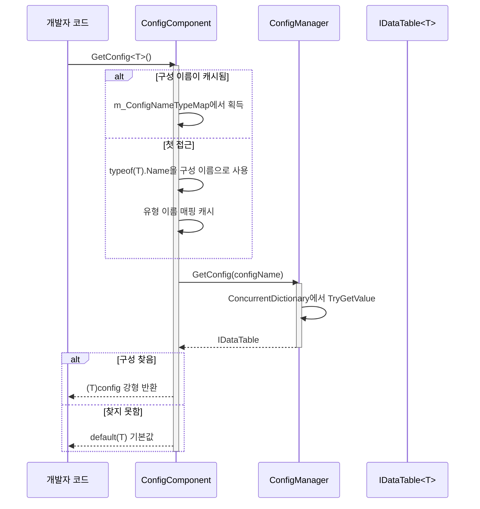
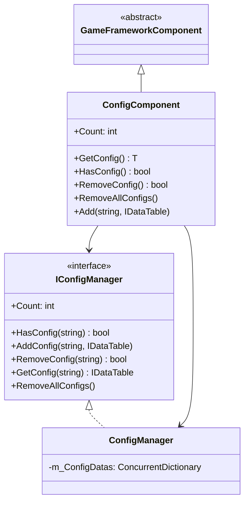

# ConfigComponent 구성 컴포넌트

ConfigComponent는 GameFrameX 구성 시스템의 Unity 컴포넌트 계층으로, 게임 구성 관리의 핵심 진입점이며, 유형 안전한 구성 데이터 접근 능력을 제공합니다.

## 개요

ConfigComponent는 Unity Scene의 `MonoBehaviour` 컴포넌트로, `GameFrameworkComponent`를 상속받습니다. 구성 관리 시스템과 Unity 엔진 사이의 다리 역할을 하며, 개발자가 게임 런타임 시 구성 데이터를 간편하게 획득하고 관리할 수 있게 합니다.

### 핵심 책임

- **유형 안전한 구성 접근**: 제네릭 메서드를 통해 컴파일 시 유형 검사 제공
- **구성 캐시 관리**: 유형에서 구성 이름으로의 매핑 관계 유지
- **통일된 구성 진입점**: ConfigManager의 복잡성 캡슐화, 간결한 API 제공
- **수명 주기 관리**: Awake 단계에서 구성 관리자 초기화 담당

### 설계 의도

ConfigComponent는 퍼사드 패턴(Facade Pattern)을 채택하여 구성 관리의 복잡성을 간소화합니다. 개발자는 ConfigManager와 직접 상호작용할 필요 없이, ConfigComponent를 통해 구성의 획득, 조회 및 관리 작업을 완료할 수 있습니다. 제네릭 메서드 사용은 컴파일 시 유형 안전성을 보장하여 런타임 오류를 줄입니다.

## 아키텍처

### 컴포넌트 계층 구조

```mermaid
graph TD
    subgraph Unity["Unity 계층 (Scene)"]
        ConfigComp["ConfigComponent<br/>(MonoBehaviour)"]
    end
    
    subgraph Framework["GameFrameX 핵심 계층"]
        IConfigMgr["IConfigManager<br/>(인터페이스)"]
        ConfigMgr["ConfigManager<br/>(구현)"]
    end
    
    subgraph Data["데이터 계층"]
        IDataTable["IDataTable<T><br/>(인터페이스)"]
        BaseDataTable["BaseDataTable<T><br/>(베이스 클래스)"]
        CustomDT["사용자 정의 데이터표<br/>(BaseDataTable 상속)"]
    end
    
    ConfigComp -->|"구성 획득"| IConfigMgr
    IConfigMgr <|.. ConfigMgr
    ConfigMgr -->|"저장/조회"| IDataTable
    IDataTable <|.. BaseDataTable
    BaseDataTable <|-- CustomDT
```

### 구성 접근 흐름



## 핵심 기능

### 구성 획득

ConfigComponent는 두 가지 방식으로 구성 획득을 제공합니다:

1. **제네릭 메서드 획득** (권장): 유형 이름을 구성 키로 자동 사용
2. **수동으로 구성 추가**: 구성 이름과 인스턴스를 명시적으로 지정 가능

### 유형 이름 매핑 메커니즘

내부는 `ConcurrentDictionary<Type, string>`을 사용하여 유형에서 이름으로의 매핑을 캐시하여 `typeof(T).Name`频繁 호출을 피합니다:

```csharp
private ConcurrentDictionary<Type, string> m_ConfigNameTypeMap = new ConcurrentDictionary<Type, string>();
```

> Source: [ConfigComponent.cs](https://github.com/GameFrameX/com.gameframex.unity.config/blob/main/Runtime/Config/ConfigComponent.cs#L51)

### 구성 수량 통계

`Count` 속성을 통해 현재 로드된 구성 항목总数的快速 획득이 가능합니다:

```csharp
public int Count
{
    get { return m_ConfigManager.Count; }
}
```

> Source: [ConfigComponent.cs](https://github.com/GameFrameX/com.gameframex.unity.config/blob/main/Runtime/Config/ConfigComponent.cs#L61-L64)

## 사용 예시

### Unity Scene에서 사용

1. Unity 편집기에서 빈 객체 생성
2. `GameFrameX/Config` 컴포넌트 추가 (ConfigComponent가 자동으로 추가됨)
3. 스크립트를 통해 구성 획득 및 사용

### 구성 데이터 획득

```csharp
using GameFrameX.Config.Runtime;

// 구성 컴포넌트 획득
var configComponent = UnityEngine.GameObject.Find("GameFrameX").GetComponent<ConfigComponent>();

// 구성 존재 여부 확인
if (configComponent.HasConfig<WeaponDataTable>())
{
    // 구성 획득
    var weaponTable = configComponent.GetConfig<WeaponDataTable>();
    
    // ID로 데이터 획득
    var weapon = weaponTable[1001];
    
    // TryGet으로 안전하게 획득
    if (weaponTable.TryGetValue(1001, out var weapon2))
    {
        // weapon2 사용
    }
}
```

> Source: [ConfigComponent.cs](https://github.com/GameFrameX/com.gameframex.unity.config/blob/main/Runtime/Config/ConfigComponent.cs#L117-L127)

### 사용자 정의 구성 추가

```csharp
// 수동으로 구성 추가
var customTable = new MyCustomDataTable();
configComponent.Add("MyCustomConfig", customTable);

// 지정 구성 제거
configComponent.RemoveConfig<WeaponDataTable>();

// 모든 구성 비우기
configComponent.RemoveAllConfigs();
```

> Source: [ConfigComponent.cs](https://github.com/GameFrameX/com.gameframex.unity.config/blob/main/Runtime/Config/ConfigComponent.cs#L153-L170)

### 데이터표 조회 예시

```csharp
var config = configComponent.GetConfig<ItemDataTable>();

// 모든 데이터 획득
var allItems = config.All;

// 조건 조회
var rareItems = config.FindList(item => item.Quality >= 4);

// 집계 조작
var maxPrice = config.Max(item => item.Price);
var totalCount = config.Sum(item => item.Count);

// 순회 조작
config.ForEach(item => {
    UnityEngine.Debug.Log(item.Name);
});
```

> Source: [BaseDataTable.cs](https://github.com/GameFrameX/com.gameframex.unity.config/blob/main/Runtime/Config/Config/BaseDataTable.cs#L296-L349)

## API 참고

### 속성

#### `Count: int`

전역 구성 항목 수량 획득.

```csharp
int count = configComponent.Count;
```

| 속성 | 값 |
|------|-----|
| 유형 | `int` |
| 접근 | 읽기 전용 |
| 설명 | ConfigManager에 저장된 구성 항목 총수 반환 |

### 메서드

#### `GetConfig<T>(): T`

지정 유형의 전역 구성 항목 획득.

```csharp
var config = configComponent.GetConfig<WeaponDataTable>();
```

| 매개변수 | 유형 | 설명 |
|------|------|------|
| T | 제네릭 매개변수 | 구성 항목 유형, 반드시 `IDataTable` 인터페이스를 구현해야 함 |

| 반환값 | 설명 |
|--------|------|
| T | 찾은 구성 항목; 찾지 못하면 `default(T)` 반환 |

> Source: [ConfigComponent.cs](https://github.com/GameFrameX/com.gameframex.unity.config/blob/main/Runtime/Config/ConfigComponent.cs#L117-L127)

---

#### `HasConfig<T>(): bool`

지정 유형의 구성 항목 존재 여부 확인.

```csharp
bool exists = configComponent.HasConfig<MonsterDataTable>();
```

| 매개변수 | 유형 | 설명 |
|------|------|------|
| T | 제네릭 매개변수 | 구성 항목 유형, 반드시 `IDataTable` 인터페이스를 구현해야 함 |

| 반환값 | 설명 |
|--------|------|
| `bool` | 구성 항목이 존재하면 `true`, 그렇지 않으면 `false` |

> Source: [ConfigComponent.cs](https://github.com/GameFrameX/com.gameframex.unity.config/blob/main/Runtime/Config/ConfigComponent.cs#L138-L142)

---

#### `RemoveConfig<T>(): bool`

지정 유형의 구성 항목 제거.

```csharp
bool success = configComponent.RemoveConfig<WeaponDataTable>();
```

| 매개변수 | 유형 | 설명 |
|------|------|------|
| T | 제네릭 매개변수 | 구성 항목 유형, 반드시 `IDataTable` 인터페이스를 구현해야 함 |

| 반환값 | 설명 |
|--------|------|
| `bool` | 제거 성공하면 `true`; 구성 존재하지 않으면 `false` |

> Source: [ConfigComponent.cs](https://github.com/GameFrameX/com.gameframex.unity.config/blob/main/Runtime/Config/ConfigComponent.cs#L153-L157)

---

#### `RemoveAllConfigs(): void`

모든 전역 구성 항목 비우기.

```csharp
configComponent.RemoveAllConfigs();
```

> Source: [ConfigComponent.cs](https://github.com/GameFrameX/com.gameframex.unity.config/blob/main/Runtime/Config/ConfigComponent.cs#L166-L170)

---

#### `Add(configName: string, dataTable: IDataTable): void`

지정 전역 구성 항목 추가.

```csharp
configComponent.Add("MyConfig", myDataTable);
```

| 매개변수 | 유형 | 설명 |
|------|------|------|
| configName | `string` | 전역 구성 항목의 이름 |
| dataTable | `IDataTable` | 전역 구성 항목의 데이터표 인스턴스 |

> Source: [ConfigComponent.cs](https://github.com/GameFrameX/com.gameframex.unity.config/blob/main/Runtime/Config/ConfigComponent.cs#L181-L184)

## 상속 구조



## 관련 링크

- [ConfigManager 구성 관리자](./09.config-manager)
- [IDataTable 데이터표 인터페이스](./07.idata-table)
- [인터페이스 정의](./06.interfaces)
- [이벤트 매개변수](./12.event-args)
- [바이너리 구성표](./11.binary-config)
- [스크립트 매크로 정의](./13.scripting-define-symbols)