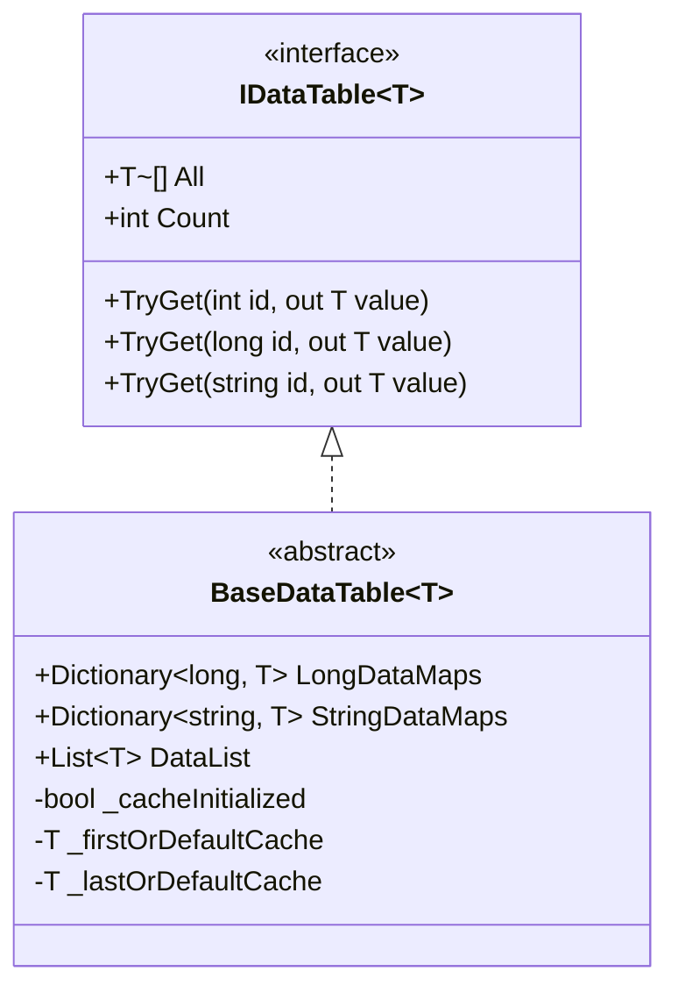

# 바이너리 구성표

바이너리 구성표는 GameFrameX Config 구성 시스템의 중요한 구성 부분으로, 바이너리 형식으로 게임 구성 데이터를 저장 및 로드하는 데 사용됩니다. 텍스트 형식과 비교하여 바이너리 구성표는 로딩 속도가 빠르고,占用 공간이 작으며, 파싱 효율이 높아 성능 요구가 높은 게임 시나리오에 특히 적합합니다.

## 개요

바이너리 구성표 기능을 통해 개발자는 Unity 프로젝트에서 `.bytes` 형식의 바이너리 구성 파일을 사용할 수 있습니다. 시스템은 파일 확장자를 통해 구성 유형을 자동으로 인식합니다: 구성 자원 이름이 `.bytes`로 끝나면 바이너리 데이터로 파싱됩니다; 그렇지 않으면 텍스트 형식으로 처리됩니다.

이러한 설계는 뛰어난 유연성을 제공하여, 개발자는 실제 수요에 따라 텍스트 구성표 또는 바이너리 구성표를 사용할 수 있으며,同一 프로젝트에서 두 가지 형식을 혼합하여 사용할 수도 있습니다.

### 바이너리 구성의 핵심 이점

**로딩 성능**: 바이너리 데이터는 문자열 파싱이 필요 없으며, BinaryReader를 통해 직접 읽으면 로딩 시간이 크게 단축됩니다.大型 게임或多配置 시나리오에서 이 이점이 특히 분명합니다.

**저장 효율**: 바이너리 형식은 데이터를緊密 저장하여, JSON, XML 등의 텍스트 형식과 비교하여 30%-50% 저장 공간을 절약하고 런타임 메모리占用도 감소시킵니다.

**보안성**: 바이너리 구성표는 직접 읽거나 수정하기 어려우며, 게임 데이터에 일정 수준의 보호를 제공합니다. 완전한 해독은 불가능하지만, 평문 저장 텍스트 구성 파일보다 보안 계수가 높습니다.

## 아키텍처 설계

```mermaid
flowchart TD
    subgraph ConfigSystem["구성 시스템 아키텍처"]
        subgraph UnityLayer["Unity 계층"]
            CC[ConfigComponent<br/>구성 컴포넌트]
        end
        
        subgraph ManagerLayer["관리 계층"]
            CM[ConfigManager<br/>구성 관리자]
        end
        
        subgraph DataLayer["데이터 계층"]
            DT[IDataTable&lt;T&gt;<br/>데이터표 인터페이스]
            BDT[BaseDataTable&lt;T&gt;<br/>데이터표 베이스 클래스]
        end
        
        subgraph StorageLayer["저장 계층"]
            DictLong[Dictionary&lt;long, T&gt;<br/>long 정수 인덱스]
            DictStr[Dictionary&lt;string, T&gt;<br/>문자열 인덱스]
            List[List&lt;T&gt;<br/>데이터 리스트]
        end
    end
    
    CC --> CM
    CM --> DT
    DT <|-- BDT
    BDT --> DictLong
    BDT --> DictStr
    BDT --> List
```

### 핵심 컴포넌트 책임

**ConfigComponent**는 Unity 계층의 진입 컴포넌트로, GameFrameworkComponent를 상속하고 게임 오브젝트에 마운트하여 구성 기능을 제공합니다. ConfigManager 초기화를 담당하고 구성 접근 인터페이스를 게임 로직 계층에 노출합니다.

**ConfigManager**는 IConfigManager 인터페이스를 구현하며, 전체 구성 시스템의 핵심 관리자입니다. 스레드 안전한 ConcurrentDictionary를 유지하여 모든 로드된 구성표 인스턴스를 저장하고, 구성의 조회, 추가, 제거 등의 작업을 제공합니다.

**`BaseDataTable<T>`**는 모든 데이터표의 제네릭 베이스 클래스로, 데이터 저장 및 조회의 완전한 구현을 제공합니다. 내부적으로 세 가지 데이터 구조를 유지합니다: LongDataMaps는 long 정수 ID 인덱스용, StringDataMaps는 문자열 ID 인덱스용, DataList는 순서 순회 및 배치 조작용입니다.

## 바이너리 구성 로딩 흐름

```mermaid
sequenceDiagram
    participant Game as 게임 로직
    participant CC as ConfigComponent
    participant CM as ConfigManager
    participant RC as ResourceComponent
    participant Parser as 구성 파서

    Game->>CC: 구성 로딩 요청
    CC->>CM: GetConfig&lt;T&gt;()
    CM->>RC: LoadAsset(configName.bytes)
    RC-->>CM: TextAsset.bytes 반환
    CM->>Parser: ParseData(bytes)
    
    alt 파일 확장자가 .bytes인 경우
        Parser->>Parser: BinaryReader를 사용하여 파싱
        Parser->>Parser: 문자열 key와 문자열 value 순회 읽기
    else 기타 확장자
        Parser->>Parser: 텍스트 파서 사용
    end
    
    Parser-->>CM: 파싱 결과 반환
    CM-->>CM: Dictionary에 저장
    CM-->>CC: IDataTable 반환
    CC-->>Game: 구성 데이터 반환
```

## 스크립트 매크로 정의

바이너리 구성 기능은 Unity 스크립트 매크로 정의(Scripting Define Symbols)를 통해 제어됩니다. Editor 디렉토리에 ConfigDefineSymbols 도구 클래스를 제공하여 이 매크로를 관리합니다.

### 바이너리 구성 활성화

Unity 편집기에서 메뉴 조작을 통해 바이너리 구성 기능을 활성화 또는 비활성화할 수 있습니다:

```csharp
// Source: [Editor/ConfigDefineSymbols.cs](https://github.com/GameFrameX/com.gameframex.unity.config/blob/main/Editor/ConfigDefineSymbols.cs#L1-L31)

namespace GameFrameX.Config.Editor
{
    /// <summary>
    /// 구성표 바이너리 기능 스크립트 매크로 정의.
    /// </summary>
    public static class ConfigDefineSymbols
    {
        public const string EnableBinaryConfigScriptingDefineSymbol = "ENABLE_BINARY_CONFIG";

        /// <summary>
        /// 구성표를 바이너리로 전환하는 스크립트 매크로 정의 활성화.
        /// </summary>
        [MenuItem("GameFrameX/Scripting Define Symbols/Enable Binary Config(开启二进制配置表)", false, 501)]
        public static void EnableBinaryConfig()
        {
            ScriptingDefineSymbols.AddScriptingDefineSymbol(EnableBinaryConfigScriptingDefineSymbol);
        }

        /// <summary>
        /// 구성표를 바이너리로 전환하는 스크립트 매크로 정의 비활성화.
        /// </summary>
        [MenuItem("GameFrameX/Scripting Define Symbols/Disable Binary Config(关闭二进制配置表)", false, 500)]
        public static void DisableBinaryConfig()
        {
            ScriptingDefineSymbols.RemoveScriptingDefineSymbol(EnableBinaryConfigScriptingDefineSymbol);
        }
    }
}
```

메뉴 **GameFrameX → Scripting Define Symbols → Enable Binary Config(开启二进制配置表)**를 통해 바이너리 구성 지원을 활성화할 수 있습니다.

## 바이너리 구성 형식

바이너리 구성표는 간단한 키-값 쌍 형식으로 데이터를 저장하며, 각 레코드에는 두 개의 문자열이 포함됩니다: 구성 이름(키)과 구성 값(값).

### 바이너리 형식 규범

바이너리 파일은 BinaryWriter를 사용하여 다음 순서로 데이터를 작성합니다:

```
[구성 이름1 (string)] [구성 값1 (string)]
[구성 이름2 (string)] [구성 값2 (string)]
...
```

각 문자열은 UTF-8 인코딩을 사용하며, BinaryWriter.Write(string) 메서드를 통해 작성됩니다.

### 데이터 파싱 구현

시스템은 BinaryReader를 사용하여 바이너리 데이터 파싱을 수행하며, 핵심 구현 로직은 다음과 같습니다:

```csharp
// Source: [Runtime/Config/DefaultConfigHelper.cs](https://github.com/GameFrameX/com.gameframex.unity.config/blob/main/Runtime/Config/DefaultConfigHelper.cs#L147-L184)

/// <summary>
/// 전역 구성 파싱 (바이너리 형식).
/// </summary>
public override bool ParseData(IConfigManager configManager, byte[] configBytes, int startIndex, int length, object userData)
{
    try
    {
        using (MemoryStream memoryStream = new MemoryStream(configBytes, startIndex, length, false))
        {
            using (BinaryReader binaryReader = new BinaryReader(memoryStream, Encoding.UTF8))
            {
                while (binaryReader.BaseStream.Position < binaryReader.BaseStream.Length)
                {
                    string configName = binaryReader.ReadString();
                    string configValue = binaryReader.ReadString();
                    if (!configManager.AddConfig(configName, configValue))
                    {
                        Log.Warning("Can not add config with config name '{0}' which may be invalid or duplicate.", configName);
                        return false;
                    }
                }
            }
        }

        return true;
    }
    catch (Exception exception)
    {
        Log.Warning("Can not parse config bytes with exception '{0}'.", exception);
        return false;
    }
}
```

파싱 과정에서 시스템은 문자열 쌍을 지속적으로 읽으며, 스트림 끝까지 각 구성 항목을 읽습니다. 각 구성 항목을 읽을 때마다 AddConfig 메서드를 호출하여 구성 관리자에 추가합니다.

### 파일 확장자 인식

시스템은 자원 파일 확장자를 통해 구성 유형을 자동으로 판단합니다:

```csharp
// Source: [Runtime/Config/DefaultConfigHelper.cs](https://github.com/GameFrameX/com.gameframex.unity.config/blob/main/Runtime/Config/DefaultConfigHelper.cs#L61-L78)

private static readonly string BytesAssetExtension = ".bytes";

public override bool ReadData(IConfigManager configManager, string configAssetName, object configAsset, object userData)
{
    TextAsset configTextAsset = configAsset as TextAsset;
    if (configTextAsset != null)
    {
        if (configAssetName.EndsWith(BytesAssetExtension, StringComparison.Ordinal))
        {
            // 바이너리 형식 파싱
            return configManager.ParseData(configTextAsset.bytes, userData);
        }
        else
        {
            // 텍스트 형식 파싱
            return configManager.ParseData(configTextAsset.text, userData);
        }
    }

    Log.Warning("Config asset '{0}' is invalid.", configAssetName);
    return false;
}
```

## 데이터표 저장 구조

`BaseDataTable<T>`는 다양한 조회 수요를 충족하기 위해 여러 데이터 구조를 사용하며, 이러한 설계는 기능 완전성을 보장하면서 일반 작업의 성능도 최적화합니다.



### 저장 구조 설명

**LongDataMaps**: Dictionary<long, T>를 사용하여 long 정수를 주요 키로 하는 구성 데이터를 저장하며, O(1) 시간 복잡도의 ID별 조회 제공.

**StringDataMaps**: Dictionary<string, T>를 사용하여 문자열을 주요 키로 하는 구성 데이터를 저장하며, 문자열 식별자를 사용해야 하는 시나리오에 적합.

**DataList**: `List<T>`를 사용하여 모든 구성 데이터 객체를 저장하며, 순서 순회, 배치 조작 및 First/Last 조회 지원.

**캐시 메커니즘**: BaseDataTable은 데이터표의 첫/마지막 요소 및 수량 통계를 캐시하여底层 데이터 구조의频繁 순회 방지.

## 구성 조회 예시

데이터표는 다양한 조회 방식을 지원하며, 개발자는 실제 시나리오에 따라 가장 적합한 방법을 선택할 수 있습니다:

```csharp
// Source: [Runtime/Config/Config/BaseDataTable.cs](https://github.com/GameFrameX/com.gameframex.unity.config/blob/main/Runtime/Config/Config/BaseDataTable.cs#L119-L162)

/// <summary>
/// 정수 ID로 객체 획득 시도.
/// </summary>
public bool TryGet(int id, out T value)
{
    return LongDataMaps.TryGetValue(id, out value);
}

/// <summary>
/// long 정수 ID로 객체 획득 시도.
/// </summary>
public bool TryGet(long id, out T value)
{
    return LongDataMaps.TryGetValue(id, out value);
}

/// <summary>
/// 문자열 ID로 객체 획득 시도.
/// </summary>
public bool TryGet(string id, out T value)
{
    return StringDataMaps.TryGetValue(id, out value);
}
```

### 일반 조회 메서드

| 메서드 | 설명 | 반환 유형 |
|------|------|----------|
| TryGet(int id) | 정수 ID로 데이터 획득 시도 | bool |
| TryGet(long id) | long 정수 ID로 데이터 획득 시도 | bool |
| TryGet(string id) | 문자열 ID로 데이터 획득 시도 | bool |
| Find(func) | 조건으로 첫 번째 일치 객체 찾기 | T |
| FindListArray(func) | 조건으로 모든 일치 객체 찾기 | T[] |
| FirstOrDefault | 첫 번째 객체 획득 | T |
| LastOrDefault | 마지막 객체 획득 | T |
| All | 모든 객체 배열 획득 | T[] |

## 관련 링크

- [Config 컴포넌트 소개](./01.overview)
- [기능 특성](./04.features)
- [설치 방식](./02.installation)
- [의존 요구](./05.dependencies)
- [기초 사용](./03.getting-started)
- [데이터표 정의](./08.data-table-definition)
- [ConfigComponent 구성 컴포넌트](./10.config-component)
- [ConfigManager 구성 관리자](./09.config-manager)
- [IDataTable 데이터표 인터페이스](./07.idata-table)
- [인터페이스 정의](./06.interfaces)
- [이벤트 매개변수](./12.event-args)
- [스크립트 매크로 정의](./13.scripting-define-symbols)
- [일반 문제](./14.troubleshooting)