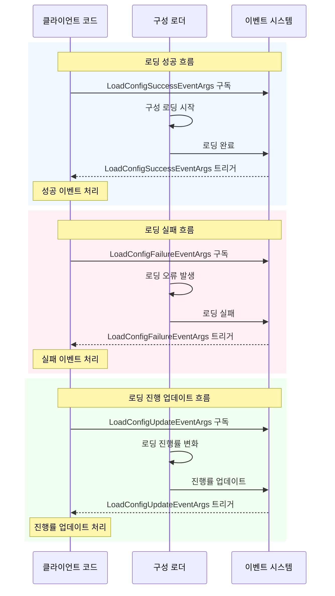

# 이벤트 매개변수

이 문서는 GameFrameX 구성 모듈에서 정의된 이벤트 매개변수 유형을 소개하며, 구성 로딩 과정에서 이벤트 데이터를 전달하는 데 사용됩니다.

## 개요

이벤트 매개변수는 GameFrameX 구성 시스템에서 옵저버 패턴의 중요한 구성 부분입니다. 구성 자원이 비동기 로딩될 때, 시스템은 이 프로세스에 관심을 갖는 코드에 알리기 위해 다양한 유형의 이벤트를 트리거합니다. 이러한 이벤트에는: 로딩 성공, 로딩 실패, 로딩 진행 업데이트가 포함됩니다.

이벤트 매개변수 클래스는 모두 `GameFrameX.Event.Runtime.GameEventArgs` 기본 클래스를 상속하며, 객체 풀 패턴을 사용하여 메모리 할당을 최적화합니다. 각 이벤트 클래스는 이벤트 식별을 위한 정적 `EventId` 속성과 이벤트 인스턴스 생성을 위한 정적 `Create` 팩토리 메서드를 제공합니다.

## 이벤트 매개변수 클래스

### 1. LoadConfigSuccessEventArgs - 로딩 성공 이벤트

전역 구성 자원 로딩 성공 시 이 이벤트가 트리거됩니다.

```csharp
public sealed class LoadConfigSuccessEventArgs : GameEventArgs
{
    /// <summary>
    /// 전역 구성 로딩 성공 이벤트 번호.
    /// </summary>
    public static readonly string EventId = typeof(LoadConfigSuccessEventArgs).FullName;

    /// <summary>
    /// 전역 구성 자원 이름 획득.
    /// </summary>
    public string ConfigAssetName { get; private set; }

    /// <summary>
    /// 로딩 소요 시간 획득.
    /// </summary>
    /// <remarks>
    /// 로딩 소요 시간, 초 단위
    /// </remarks>
    public float Duration { get; private set; }

    /// <summary>
    /// 사용자 정의 데이터 획득.
    /// </summary>
    public object UserData { get; private set; }

    /// <summary>
    /// 전역 구성 로딩 성공 이벤트 생성.
    /// </summary>
    public static LoadConfigSuccessEventArgs Create(string dataAssetName, float duration, object userData)
    {
        LoadConfigSuccessEventArgs loadConfigSuccessEventArgs = ReferencePool.Acquire<LoadConfigSuccessEventArgs>();
        loadConfigSuccessEventArgs.ConfigAssetName = dataAssetName;
        loadConfigSuccessEventArgs.Duration = duration;
        loadConfigSuccessEventArgs.UserData = userData;
        return loadConfigSuccessEventArgs;
    }

    /// <summary>
    /// 전역 구성 로딩 성공 이벤트 정리.
    /// </summary>
    public override void Clear()
    {
        ConfigAssetName = null;
        Duration = 0f;
        UserData = null;
    }
}
```

> Source: [LoadConfigSuccessEventArgs.cs](https://github.com/GameFrameX/com.gameframex.unity.config/blob/main/Runtime/EventArgs/LoadConfigSuccessEventArgs.cs#L43-L137)

### 2. LoadConfigFailureEventArgs - 로딩 실패 이벤트

전역 구성 자원 로딩 실패 시 이 이벤트가 트리거됩니다.

```csharp
public sealed class LoadConfigFailureEventArgs : GameEventArgs
{
    /// <summary>
    /// 전역 구성 로딩 실패 이벤트 번호.
    /// </summary>
    public static readonly string EventId = typeof(LoadConfigFailureEventArgs).FullName;

    /// <summary>
    /// 전역 구성 자원 이름 획득.
    /// </summary>
    public string ConfigAssetName { get; private set; }

    /// <summary>
    /// 오류 정보 획득.
    /// </summary>
    public string ErrorMessage { get; private set; }

    /// <summary>
    /// 사용자 정의 데이터 획득.
    /// </summary>
    public object UserData { get; private set; }

    /// <summary>
    /// 전역 구성 로딩 실패 이벤트 생성.
    /// </summary>
    public static LoadConfigFailureEventArgs Create(string dataAssetName, string errorMessage, object userData)
    {
        LoadConfigFailureEventArgs loadConfigFailureEventArgs = ReferencePool.Acquire<LoadConfigFailureEventArgs>();
        loadConfigFailureEventArgs.ConfigAssetName = dataAssetName;
        loadConfigFailureEventArgs.ErrorMessage = errorMessage;
        loadConfigFailureEventArgs.UserData = userData;
        return loadConfigFailureEventArgs;
    }

    /// <summary>
    /// 전역 구성 로딩 실패 이벤트 정리.
    /// </summary>
    public override void Clear()
    {
        ConfigAssetName = null;
        ErrorMessage = null;
        UserData = null;
    }
}
```

> Source: [LoadConfigFailureEventArgs.cs](https://github.com/GameFrameX/com.gameframex.unity.config/blob/main/Runtime/EventArgs/LoadConfigFailureEventArgs.cs#L43-L137)

### 3. LoadConfigUpdateEventArgs - 로딩 진행 업데이트 이벤트

전역 구성 자원 로딩 진행 업데이트 시 이 이벤트가 트리거됩니다.

```csharp
public sealed class LoadConfigUpdateEventArgs : GameEventArgs
{
    /// <summary>
    /// 전역 구성 로딩 업데이트 이벤트 번호.
    /// </summary>
    public static readonly string EventId = typeof(LoadConfigUpdateEventArgs).FullName;

    /// <summary>
    /// 전역 구성 자원 이름 획득.
    /// </summary>
    public string ConfigAssetName { get; private set; }

    /// <summary>
    /// 전역 구성 로딩 진행률 획득.
    /// </summary>
    /// <remarks>
    /// 로딩 진행률, 범위는 0.0에서 1.0
    /// </remarks>
    public float Progress { get; private set; }

    /// <summary>
    /// 사용자 정의 데이터 획득.
    /// </summary>
    public object UserData { get; private set; }

    /// <summary>
    /// 전역 구성 로딩 업데이트 이벤트 생성.
    /// </summary>
    public static LoadConfigUpdateEventArgs Create(string dataAssetName, float progress, object userData)
    {
        LoadConfigUpdateEventArgs loadConfigUpdateEventArgs = ReferencePool.Acquire<LoadConfigUpdateEventArgs>();
        loadConfigUpdateEventArgs.ConfigAssetName = dataAssetName;
        loadConfigUpdateEventArgs.Progress = progress;
        loadConfigUpdateEventArgs.UserData = userData;
        return loadConfigUpdateEventArgs;
    }

    /// <summary>
    /// 전역 구성 로딩 업데이트 이벤트 정리.
    /// </summary>
    public override void Clear()
    {
        ConfigAssetName = null;
        Progress = 0f;
        UserData = null;
    }
}
```

> Source: [LoadConfigUpdateEventArgs.cs](https://github.com/GameFrameX/com.gameframex.unity.config/blob/main/Runtime/EventArgs/LoadConfigUpdateEventArgs.cs#L43-L137)

## 이벤트 관계 클래스도

```mermaid
classDiagram
    class GameEventArgs {
        <<abstract>>
        +Id: string {get; abstract}
        +Clear() void$ abstract
    }
    
    class LoadConfigSuccessEventArgs {
        +EventId: string
        +ConfigAssetName: string
        +Duration: float
        +UserData: object
        +Create(dataAssetName, duration, userData)$ LoadConfigSuccessEventArgs
    }
    
    class LoadConfigFailureEventArgs {
        +EventId: string
        +ConfigAssetName: string
        +ErrorMessage: string
        +UserData: object
        +Create(dataAssetName, errorMessage, userData)$ LoadConfigFailureEventArgs
    }
    
    class LoadConfigUpdateEventArgs {
        +EventId: string
        +ConfigAssetName: string
        +Progress: float
        +UserData: object
        +Create(dataAssetName, progress, userData)$ LoadConfigUpdateEventArgs
    }
    
    GameEventArgs <|-- LoadConfigSuccessEventArgs
    GameEventArgs <|-- LoadConfigFailureEventArgs
    GameEventArgs <|-- LoadConfigUpdateEventArgs
```

## 이벤트 흐름



## API 참고

### LoadConfigSuccessEventArgs

**네임스페이스:** `GameFrameX.Config.Runtime`

**상속:** `GameEventArgs`

#### 속성

| 속성 | 유형 | 읽기 전용 | 설명 |
|------|------|------|------|
| EventId | string | 예 | 이벤트 고유 식별자, 유형의 완전히 검증된 이름 |
| ConfigAssetName | string | 예 | 로딩 성공한 구성 자원 이름 |
| Duration | float | 예 | 로딩에 소요된 시간, 초 단위 |
| UserData | object | 예 | 사용자 정의 데이터, 이벤트 간 컨텍스트 전달에 사용 |

#### 메서드

| 메서드 | 반환 유형 | 설명 |
|------|----------|------|
| Create(string, float, object) | LoadConfigSuccessEventArgs | 객체 풀에서 인스턴스를 획득하여 초기화하는 정적 팩토리 메서드 |
| Clear() | void | 모든 속성 값을 정리하고 인스턴스를 객체 풀에 반환 |

---

### LoadConfigFailureEventArgs

**네임스페이스:** `GameFrameX.Config.Runtime`

**상속:** `GameEventArgs`

#### 속성

| 속성 | 유형 | 읽기 전용 | 설명 |
|------|------|------|------|
| EventId | string | 예 | 이벤트 고유 식별자, 유형의 완전히 검증된 이름 |
| ConfigAssetName | string | 예 | 로딩 실패한 구성 자원 이름 |
| ErrorMessage | string | 예 | 실패 이유를 설명하는 오류 정보 |
| UserData | object | 예 | 사용자 정의 데이터, 이벤트 간 컨텍스트 전달에 사용 |

#### 메서드

| 메서드 | 반환 유형 | 설명 |
|------|----------|------|
| Create(string, string, object) | LoadConfigFailureEventArgs | 객체 풀에서 인스턴스를 획득하여 초기화하는 정적 팩토리 메서드 |
| Clear() | void | 모든 속성 값을 정리하고 인스턴스를 객체 풀에 반환 |

---

### LoadConfigUpdateEventArgs

**네임스페이스:** `GameFrameX.Config.Runtime`

**상속:** `GameEventArgs`

#### 속성

| 속성 | 유형 | 읽기 전용 | 설명 |
|------|------|------|------|
| EventId | string | 예 | 이벤트 고유 식별자, 유형의 완전히 검증된 이름 |
| ConfigAssetName | string | 예 | 로딩 중인 구성 자원 이름 |
| Progress | float | 예 | 로딩 진행률, 범위는 0.0에서 1.0 |
| UserData | object | 예 | 사용자 정의 데이터, 이벤트 간 컨텍스트 전달에 사용 |

#### 메서드

| 메서드 | 반환 유형 | 설명 |
|------|----------|------|
| Create(string, float, object) | LoadConfigUpdateEventArgs | 객체 풀에서 인스턴스를 획득하여 초기화하는 정적 팩토리 메서드 |
| Clear() | void | 모든 속성 값을 정리하고 인스턴스를 객체 풀에 반환 |

## 사용 예시

### 구성 로딩 이벤트 구독

```csharp
using GameFrameX.Event.Runtime;
using GameFrameX.Config.Runtime;

// 구성 로딩 성공 이벤트 구독
EventSystem.EventSubscribe<LoadConfigSuccessEventArgs>(OnLoadConfigSuccess);

// 구성 로딩 실패 이벤트 구독
EventSystem.EventSubscribe<LoadConfigFailureEventArgs>(OnLoadConfigFailure);

// 구성 로딩 진행 업데이트 이벤트 구독
EventSystem.EventSubscribe<LoadConfigUpdateEventArgs>(OnLoadConfigUpdate);

private void OnLoadConfigSuccess(object sender, LoadConfigSuccessEventArgs e)
{
    UnityEngine.Debug.Log($"구성 로딩 성공: {e.ConfigAssetName}, 소요 시간: {e.Duration}초");
    // 로딩 성공 로직 처리
    // 주의: 사용 완료 후 이벤트 객체를 객체 풀에 반환해야 함
    ReferencePool.Release(e);
}

private void OnLoadConfigFailure(object sender, LoadConfigFailureEventArgs e)
{
    UnityEngine.Debug.LogError($"구성 로딩 실패: {e.ConfigAssetName}, 오류: {e.ErrorMessage}");
    ReferencePool.Release(e);
}

private void OnLoadConfigUpdate(object sender, LoadConfigUpdateEventArgs e)
{
    UnityEngine.Debug.Log($"로딩 진행률: {e.ConfigAssetName} - {e.Progress * 100}%");
    ReferencePool.Release(e);
}
```

> Source: [LoadConfigSuccessEventArgs.cs](https://github.com/GameFrameX/com.gameframex.unity.config/blob/main/Runtime/EventArgs/LoadConfigSuccessEventArgs.cs#L116-L123)
> Source: [LoadConfigFailureEventArgs.cs](https://github.com/GameFrameX/com.gameframex.unity.config/blob/main/Runtime/EventArgs/LoadConfigFailureEventArgs.cs#L116-L123)
> Source: [LoadConfigUpdateEventArgs.cs](https://github.com/GameFrameX/com.gameframex.unity.config/blob/main/Runtime/EventArgs/LoadConfigUpdateEventArgs.cs#L116-L123)

## 관련 링크

- [인터페이스 정의](./06.interfaces) - 구성 관리자의 인터페이스 정의
- [ConfigComponent 구성 컴포넌트](./10.config-component) - 구성 컴포넌트의 상세 소개
- [ConfigManager 구성 관리자](./09.config-manager) - 구성 관리자의 상세 소개
- [IDataTable 데이터표 인터페이스](./07.idata-table) - 데이터표 인터페이스의 상세 정의