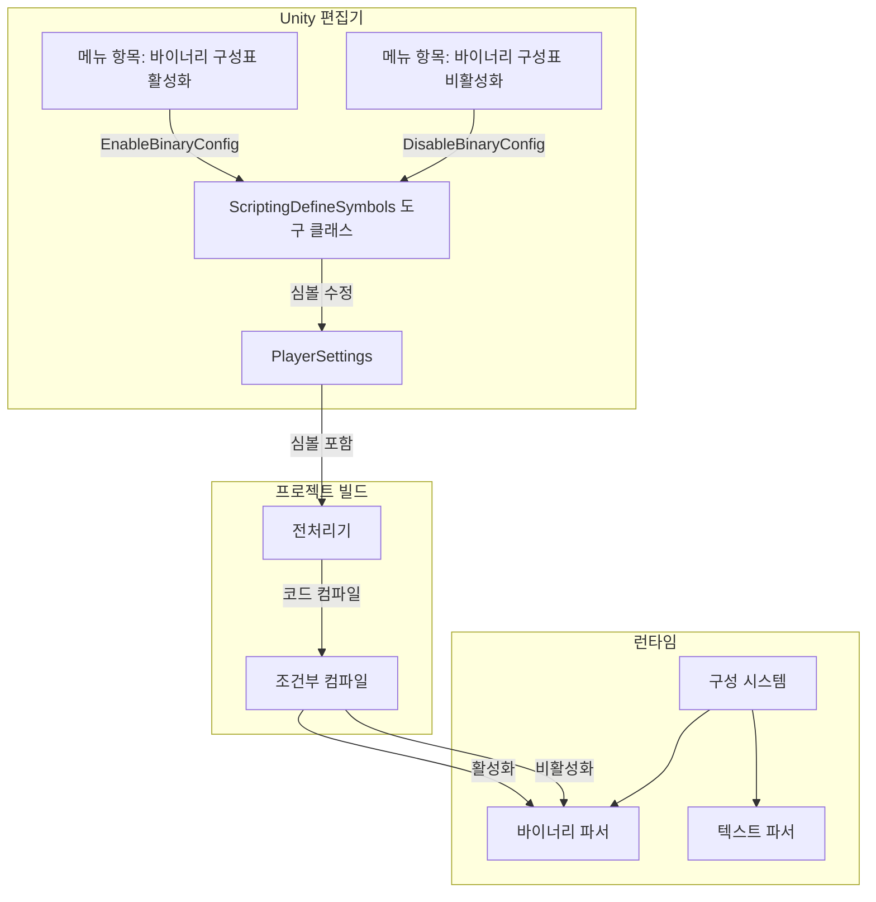
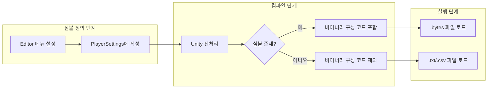

# 스크립트 매크로 정의

스크립트 매크로 정의(Scripting Define Symbols)는 Unity 프로젝트에서 조건부 컴파일에 사용되는 전처리기 심볼입니다. GameFrameX Config 컴포넌트는 스크립트 매크로 정의를 통해 바이너리 구성표 기능의 활성화 여부를 제어합니다.

## 개요

스크립트 매크로 정의는 Unity 컴파일러의 기능으로, 개발자가 코드에서 서로 다른 컴파일 조건에 따라 특정 코드段的 포함 또는 제외를 허용합니다. GameFrameX Config 컴포넌트는 `ENABLE_BINARY_CONFIG` 스크립트 매크로를 사용하여 바이너리 구성표 기능의 활성화 또는 비활성화를 제어합니다.

### 바이너리 구성표란 무엇입니까

바이너리 구성표는 바이너리 형식으로 구성 데이터를 저장하는 방식으로, 텍스트 형식(CSV, TSV)과 비교하여 다음 이점을 가집니다:

- **로딩 속도가 더 빠름**: 바이너리 데이터는 파싱이 필요 없으며, 직접 읽을 수 있습니다
- **파일 볼륨이 더 작음**: 데이터는緊密한 바이너리 형식으로 저장됩니다
- **보안성이 더 높음**: 바이너리 데이터는 직접 읽거나 수정하기 어렵습니다
- **파싱 오버헤드가 더 낮음**: 문자열 분할 및 유형 변환이 필요 없습니다

## 작업 원리

### 아키텍처 흐름



### 심볼 작용 메커니즘



## 사용 방법

### 바이너리 구성표 활성화

Unity 편집기에서 메뉴 조작을 통해 바이너리 구성 기능을 활성화합니다:

1. Unity 편집기 열기
2. 메뉴를 차례로 클릭합니다: `GameFrameX` → `Scripting Define Symbols` → `Enable Binary Config(开启二进制配置表)`
3. Unity가 스크립트를 자동으로 다시 컴파일할 때까지 대기

### 바이너리 구성표 비활성화

텍스트 형식 구성으로 다시 전환해야 하는 경우:

1. 메뉴를 차례로 클릭합니다: `GameFrameX` → `Scripting Define Symbols` → `Disable Binary Config(关闭二进制配置表)`
2. Unity가 스크립트를 자동으로 다시 컴파일할 때까지 대기

## API 참고

### ConfigDefineSymbols

네임스페이스: `GameFrameX.Config.Editor`

```csharp
public static class ConfigDefineSymbols
```

구성표 바이너리 기능의 스크립트 매크로 정의 클래스로, 바이너리 구성표 스위치 기능을 제공합니다.

#### 필드

| 필드 | 유형 | 설명 |
|------|------|------|
| `EnableBinaryConfigScriptingDefineSymbol` | `const string` | 바이너리 구성표 스크립트 매크로 정의의 상수 값: `"ENABLE_BINARY_CONFIG"` |

#### 메서드

##### EnableBinaryConfig

```csharp
[MenuItem("GameFrameX/Scripting Define Symbols/Enable Binary Config(开启二进制配置表)", false, 501)]
public static void EnableBinaryConfig()
```

바이너리 구성표 기능의 스크립트 매크로 정의 활성화.

**기능 설명:**
`ENABLE_BINARY_CONFIG` 심볼을 프로젝트의 PlayerSettings에 추가하여, 프로젝트가 컴파일 시 바이너리 구성 관련 코드를 포함하도록 합니다.

> Source: [ConfigDefineSymbols.cs](https://github.com/GameFrameX/com.gameframex.unity.config/blob/main/Editor/ConfigDefineSymbols.cs#L25-L29)

---

##### DisableBinaryConfig

```csharp
[MenuItem("GameFrameX/Scripting Define Symbols/Disable Binary Config(关闭二进制配置表)", false, 500)]
public static void DisableBinaryConfig()
```

바이너리 구성표 기능의 스크립트 매크로 정의 비활성화.

**기능 설명:**
프로젝트의 PlayerSettings에서 `ENABLE_BINARY_CONFIG` 심볼을 제거하여, 프로젝트가 컴파일 시 바이너리 구성 관련 코드를 포함하지 않도록 합니다.

> Source: [ConfigDefineSymbols.cs](https://github.com/GameFrameX/com.gameframex.unity.config/blob/main/Editor/ConfigDefineSymbols.cs#L16-L20)

## 구성 옵션

| 구성 항목 | 유형 | 기본값 | 설명 |
|--------|------|--------|------|
| `ENABLE_BINARY_CONFIG` | 스크립트 매크로 | 정의되지 않음 | 바이너리 구성표 기능의 스위치 제어 |

## 주의 사항

1. **컴파일 다시 로드**: 스크립트 매크로 정의를 수정한 후, Unity가 자동으로 스크립트를 다시 컴파일하며, 이 과정에서 짧은 시간 정지될 수 있으며 이는 정상적인 현상입니다.

2. **플랫폼 차이**: 스크립트 매크로 정의는全局적이며 모든 플랫폼에 적용됩니다. 특정 플랫폼에만 설정해야 하는 경우 PlayerSettings에서 수동으로 수정해야 합니다.

3. **자원 형식**: 바이너리 구성을 활성화한 후, 구성 자원 파일이 `.bytes` 형식인지 확인해야 합니다.

4. **데이터 호환성**: 바이너리 형식과 텍스트 형식의 데이터 구조가 다를 수 있으며, 전환 시 데이터가 올바르게 변환되었는지 확인해야 합니다.

## 관련 링크

- [바이너리 구성표](./11.binary-config)
- [ConfigComponent 구성 컴포넌트](./10.config-component)
- [ConfigManager 구성 관리자](./09.config-manager)
- [IDataTable 데이터표 인터페이스](./07.idata-table)