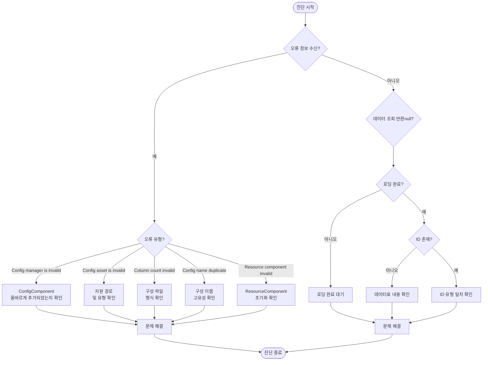

# 일반 문제

이 문서는 Config 구성표 컴포넌트 사용 시 발생할 수 있는 일반적인 문제, 오류 정보 및 해결책을 정리합니다.

## 개요

Config 구성표 컴포넌트는 Unity 게임을 위한 완전한 구성 데이터 관리 솔루션을 제공합니다. 실제 사용 과정에서 개발자는 구성 로딩 실패, 데이터 파싱 오류, 컴포넌트가 올바르게 초기화되지 않음 등의 문제를 직면할 수 있습니다. 이 문서는 개발자가 이러한 문제를 빠르게 파악하고 해결할 수 있도록 도와줍니다.

## 일반적인 문제 목록

### 1. Config Manager 미초기화

**오류 정보:**
```
Config manager is invalid.
```

**원인 분석:**
이 오류는 `ConfigComponent`가 초기화할 때 GameFrameworkEntry에서 `IConfigManager` 모듈을 가져올 수 없음을 나타냅니다. 이는 일반적으로 프레임워크 초기화 순서가不正确한 경우에 발생합니다.

**해결책:**

1. Scene에 `ConfigComponent` 컴포넌트가 올바르게 추가되었는지 확인합니다:
```csharp
// Unity Scene에 ConfigComponent 추가
// GameObject -> Add Component -> GameFrameX -> Config
```

2. GameFramework 핵심 컴포넌트가 올바르게 초기화되었는지 확인합니다. Scene에 `GameEntry` 객체가 있는지 확인합니다:
> 상세 내용은 [핵심 개념 - ConfigComponent](./10.config-component)를 참고하세요

---

### 2. 구성 자원 유형 유효하지 않음

**오류 정보:**
```
Config asset 'xxx' is invalid.
```

**원인 분석:**
이 경고는 시스템이 로드한 자산을 유효한 구성 자원으로 인식할 수 없음을 나타냅니다. 가능한 원인은 다음과 같습니다:
- 자원 경로가 올바르지 않음
- 자원 유형이 `TextAsset` 또는 `.bytes` 파일이 아님
- 자원 파일이 손상됨

**해결책:**

1. 구성 파일의 경로가 올바른지 확인합니다
2. 구성 파일이 순수 텍스트 파일(`.txt`) 또는 바이너리 파일(`.bytes`)인지 확인합니다
3. 자원이 최종 게임 빌드에 올바르게 포함되었는지 확인합니다

---

### 3. 구성 열 수 불일치

**오류 정보:**
```
Can not parse config line string 'xxx' which column count is invalid.
```

**원인 분석:**
텍스트 형식 구성 파일을 파싱할 때, 파서는 각 행이 4열의 데이터(Tab 구분)를 기대합니다. 열 수가 예상과 일치하지 않으면 파싱이 실패합니다.

구성 파일 형식 요구사항:
```
#ID    이름    설명    값
1      config1 예     value1
2      config2 예     value2
```

**해결책:**

1. 구성 파일의 열 수가 올바른지 확인합니다 (4열이어야 함)
2. Tab 문자가 열 구분자로 사용되었는지 확인합니다
3. 빈 행이 있거나 형식이 올바르지 않은 행이 있는지 확인합니다

> 상세 내용은 [구성 옵션 - 바이너리 구성표](./11.binary-config)를 참고하세요

---

### 4. 구성 이름 중복 또는 유효하지 않음

**오류 정보:**
```
Can not add config with config name 'xxx' which may be invalid or duplicate.
```

**원인 분석:**
이 경고는 추가하려는 구성 이름이 유효하지 않거나 이미 존재함을 나타냅니다. 각 구성 이름은 고유해야 합니다.

**해결책:**

1. 중복된 구성 이름이 있는지 확인합니다
2. 구성 이름이 빈 문자열이 아닌지 확인합니다
3. 고유 식별자를 구성 이름으로 사용합니다

---

### 5. Resource Component 찾지 못함

**오류 정보:**
```
Resource component is invalid.
```

**원인 분석:**
`DefaultConfigHelper`는 구성 자원을 로드하기 위해 `ResourceComponent`에 의존합니다. `ResourceComponent`가 올바르게 초기화되지 않은 경우 구성을 로드할 수 없습니다.

**해결책:**

1. Scene에 `ResourceComponent` 컴포넌트가 있는지 확인합니다
2. 자원 시스템의 초기화 순서를 확인합니다
3. 자원 번들이 올바르게 로드되었는지 확인합니다

---

### 6. 바이너리 구성표가 작동하지 않음

**문제 설명:**
`ENABLE_BINARY_CONFIG` 매크로 정의를 활성화한 후 바이너리 구성표 기능이 작동하지 않습니다.

**해결책:**

1. Unity 메뉴에서 바이너리 구성을 활성화합니다:
   - 메뉴를 엽니다: `GameFrameX -> Scripting Define Symbols -> Enable Binary Config(开启二进制配置表)`

2. 구성 파일 확장자가 `.bytes`인지 확인합니다

> 상세 내용은 [구성 옵션 - 스크립트 매크로 정의](./13.scripting-define-symbols)를 참고하세요

---

### 7. 데이터표 로딩 실패

**문제 설명:**
`IDataTable.LoadAsync()` 메서드를 호출한 후 데이터가 올바르게 로드되지 않았습니다.

**조사 단계:**

1. 비동기 로딩이 완료되었는지 확인합니다:
```csharp
// 로딩 완료 대기 올바르게 수행
IDataTable<MyConfig> configTable = component.GetConfig<MyConfigTable>();
await configTable.LoadAsync();

// 로딩 성공 여부 확인
if (component.HasConfig<MyConfigTable>()) {
    // 구성 로드됨
}
```

2. 이벤트에서 오류를捕获했는지 확인합니다:
> 상세 내용은 [API 참고 - 이벤트 매개변수](./12.event-args)를 참고하세요

---

### 8. 데이터 조회 반환 null

**문제 설명:**
`TryGet` 메서드로 구성 데이터를 조회할 때 `false` 또는 `null`을 반환합니다.

**가능한 원인:**

1. 데이터표가 아직 로드 완료되지 않음
2. 조회한 ID가 존재하지 않음
3. 데이터표 유형이 일치하지 않음

**해결책:**

1. 데이터 로드 완료 후 조회해야 합니다
2. `HasConfig<T>()` 메서드로 먼저 구성이 존재하는지 확인합니다
3. 조회한 ID 유형(int/long/string)이 데이터표 정의와 일치하는지 확인합니다

```csharp
// 올바른 데이터 조회 흐름
var configTable = component.GetConfig<MyConfigTable>();
if (component.HasConfig<MyConfigTable>()) {
    if (configTable.TryGet(1, out var config)) {
        // 구성 성공적으로 획득
    }
}
```

---

## 진단 흐름



## 디버깅 기술

### 1. 로그 디버깅 활성화

Config 컴포넌트는 상세한 로그 정보를 출력합니다. 개발 단계에서 로그 수준이 `Debug` 또는 `Info`로 설정되어 있는지 확인합니다:

```csharp
// 게임 시작 시 로그 수준 설정
Log.SetLogHelper(new DebugLogHelper());
```

### 2. 이벤트 감시 사용

구성 로딩 이벤트를 감시하면 문제를 빠르게 파악하는 데 도움이 됩니다:

```csharp
// 구성 로딩 성공 이벤트 감시
GameEntry.Event.Subscribe(LoadConfigSuccessEventArgs.EventId, OnLoadConfigSuccess);

// 구성 로딩 실패 이벤트 감시
GameEntry.Event.Subscribe(LoadConfigFailureEventArgs.EventId, OnLoadConfigFailure);

private void OnLoadConfigSuccess(object sender, LoadConfigSuccessEventArgs e)
{
    UnityEngine.Debug.Log($"구성 로딩 성공: {e.ConfigAssetName}, 소요 시간: {e.Duration}초");
}

private void OnLoadConfigFailure(object sender, LoadConfigFailureEventArgs e)
{
    UnityEngine.Debug.LogError($"구성 로딩 실패: {e.ConfigAssetName}, 오류: {e.ErrorMessage}");
}
```

### 3. 구성 수량 확인

디버깅 시 현재 로드된 구성 수량을 확인할 수 있습니다:

```csharp
var configComponent = GameEntry.GetComponent<ConfigComponent>();
UnityEngine.Debug.Log($"현재 구성 수량: {configComponent.Count}");
```

---

## 모범 사례

1. **항상 TryGet 메서드 사용**: 폐지된 `[Obsolete]`로 표시된 `Get` 메서드 대신 TryGet 메서드를 사용합니다
2. **구성 존재성 확인**: 구성 사용 전 `HasConfig<T>()` 메서드로 먼저 구성이 존재하는지 확인합니다
3. **비동기 로딩**: 구성 로딩은 비동기이므로 로드 완료 후 데이터를 사용해야 합니다
4. **오류 처리**: 로딩 실패 이벤트에 구독하여 오류를 적시에 파악하고 처리합니다

---

## 관련 링크

- [핵심 개념 - ConfigComponent](./10.config-component)
- [핵심 개념 - ConfigManager](./09.config-manager)
- [핵심 개념 - IDataTable](./07.idata-table)
- [API 참고 - 인터페이스 정의](./06.interfaces)
- [API 참고 - 이벤트 매개변수](./12.event-args)
- [구성 옵션 - 바이너리 구성표](./11.binary-config)
- [구성 옵션 - 스크립트 매크로 정의](./13.scripting-define-symbols)