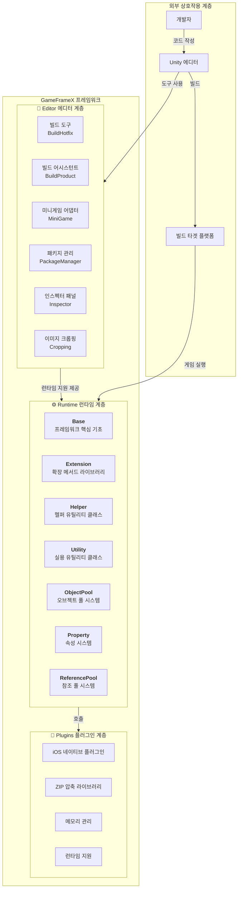
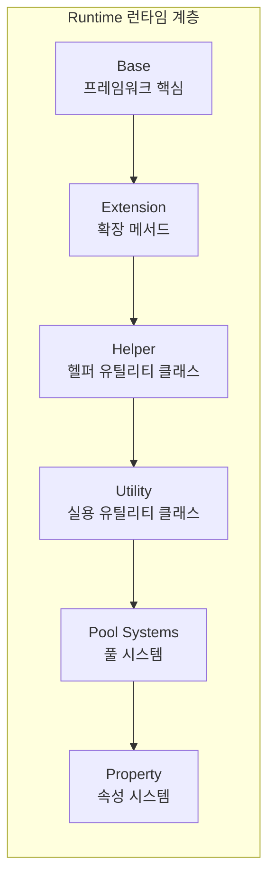

# 개요

GameFrameX는 독립 게임 개발자를 위해 설계된 최신 Unity 게임 프레임워크로, 완전한 프론트엔드-백엔드 통합 솔루션을 제공합니다. 프레임워크는 **3층 모듈식 아키텍처** 설계로, 풍부한 게임 개발 도구와 컴포넌트를 내장하여 개발자가 고품질 게임 프로젝트를 빠르게 구축할 수 있도록 도와줍니다.

> Source: [README.zh-CN.md](https://github.com/GameFrameX/com.gameframex.unity/blob/main/README.zh-CN.md#L1-L60)

---

## 프로젝트 소개

GameFrameX는 독립 게임 개발자에게 강력하고 사용하기 쉬우며 확장 가능한 게임 개발 프레임워크를 제공하는 것을 목표로 합니다. 프레임워크는 소규모 개인 프로젝트부터 중규모 상업용 게임까지 다양한 요구를 충족하도록 정밀하게 설계되었습니다.

### 핵심 기능

| 기능 | 설명 |
|------|------|
| **3층 아키텍처** | Runtime(런타임), Plugins(플러그인), Editor(에디터) 명확한 계층 분리 |
| **풍부한 도구集** | 다양한 개발 지원 도구 및 에디터 확장 내장 |
| **오브젝트 풀 관리** | 효율적인 메모리 관리 및 오브젝트 재사용 메커니즘 |
| **확장 메서드 라이브러리** | 풍부한 Unity 엔진 확장 메서드 |
| **유틸리티 클래스** | 암호화, 압축, 네트워크 등 필수 기능 포함 |
| **멀티 플랫폼 지원** | PC, 모바일, WebGL 등 멀티 플랫폼 배포 지원 |
| **핫 업데이트 지원** | HybridCLR 핫 업데이트 솔루션 내장 |
| **미니게임 어댑터** | 원클릭으로 여러 플랫폼 미니게임 환경 전환 |

### 시스템 요구사항

| 요구사항 | 사양 |
|------|------|
| **Unity 버전** | 2019.4 이상 |
| **플랫폼 지원** | Windows, macOS, Linux, iOS, Android, WebGL |
| **.NET 버전** | .NET Standard 2.0+ |

---

## 아키텍처 개요

GameFrameX는 명확한 3층 아키텍처 설계를 채택하여 각 모듈이 각자의 역할을 수행하고 협력합니다. 이러한 계층화 설계는 코드의 높은 응집도와 낮은 결합도를 보장하여 유지보수와 확장이 용이합니다.



### 아키텍처 설계 철학

1. **모듈식 설계**: 각 모듈은 특정 기능에 대해 독립적으로 책임지며, 개별 테스트 및 유지보수가 용이합니다.
2. **인터페이스 분리**: 인터페이스를 통한 디커플링으로 모듈 간 통신은 추상을 통해 이루어집니다.
3. **필요 시 로딩**: 컴포넌트를 필요할 때 초기화하여 불필요한 성능 오버헤드를 피합니다.
4. **확장성**: 풍부한 확장 포인트를 제공하여 개발자가 쉽게 커스텀 기능을 추가할 수 있습니다.

---

## 핵심 모듈 상세

### Runtime 런타임 계층

런타임 핵심 코드로, 게임 런타임에 필요한 모든 기능을 제공합니다.



| 하위 모듈 | 설명 | 주요 기능 |
|--------|------|----------|
| **Base** | 프레임워크 핵심 기초 | 컴포넌트 관리, 이벤트 풀, 로그 시스템, 참조 풀, 태스크 풀, 변수 시스템, 수명주기 관리, 싱글톤 패턴 |
| **Extension** | 확장 메서드 라이브러리 | 일반 확장(문자열, 컬렉션, 날짜), Unity 타입 확장(Transform, Vector), 시퀀스 리더, GameObject 확장 |
| **Helper** | 헬퍼 유틸리티 클래스 | Application, Camera, File, Path, Math, Random, Timer, Network, JSON, Rendering, Position 등全方位的 도우미 기능 |
| **ObjectPool** | 오브젝트 풀 시스템 | 오브젝트 재사용, 메모리 최적화, 성능 향상 |
| **Property** | 속성 시스템 | 바인딩 가능한 속성, 데이터 리스닝, MVVM 지원 |
| **ReferencePool** | 참조 풀 시스템 | 참조 타입 오브젝트 관리, GC 최적화 |
| **Utility** | 실용 유틸리티 클래스 | 암호화/복호화(AES/RSA/DSA), 압축/해제, 해시 계산(MD5/SHA1/HMAC), CRC 체크섬, JSON 직렬화, 파일 조작, ID 생성, 타입 변환, 텍스트 처리, 로그 등 |

### Plugins 플러그인 계층

네이티브 플랫폼 플러그인 및 서드파티 의존 라이브러리입니다.

| 하위 모듈 | 설명 | 의존 라이브러리 |
|--------|------|--------|
| **iOS 플러그인** | iOS 네이티브 플랫폼 기능 | GameFrameX.mm |
| **압축 라이브러리** | ZIP 파일 압축/해제 | SharpZipLib |
| **메모리 관리** | 효율적인 메모리 조작 | StringTools, Memory, Buffers |
| **런타임 지원** | .NET 런타임 확장 | CompilerServices.Unsafe |

### Editor 에디터 계층

에디터 도구 및 확장으로, 개발 효율성 향상을 위한 기능입니다.

| 하위 모듈 | 설명 | 주요 기능 |
|--------|------|----------|
| **BuildHotfix** | 핫 업데이트 빌드 | HybridCLR 핫 업데이트 어셈블리 빌드 및 관리 |
| **BuildProduct** | 제품 빌드 | 빌드 프로세스 자동화, 전후 처리 후크 |
| **BuildWebGLTools** | WebGL 빌드 | WebGL 플랫폼 전용 빌드 도구 |
| **Cropping** | 이미지 크롭핑 | 시각적 이미지 크롭핑 도구 |
| **Inspector** | 커스텀 인스펙터 패널 | 오브젝트 풀, 참조 풀 시각적 모니터링 |
| **InspectorLockShortcut** | 패널 잠금 | 단축키로 Inspector 패널 잠금 |
| **MiniGame** | 미니게임 어댑터 | 원클릭으로 21개 미니게임 플랫폼 전환 |
| **PackageManager** | 패키지 관리 | 시각적 패키지 관리 인터페이스 |
| **UpdatePackages** | 패키지 업데이트 | 프로젝트 의존성 일괄 업데이트 |
| **Welcome** | 환영 인터페이스 | 신규 사용자 안내 및 빠른 진입점 |

---

## 플랫폼 지원

### 운영체제 플랫폼

| 플랫폼 | 상태 | 지원 버전 |
|------|------|----------|
| Windows | ✅ 지원 | Unity 2019.4+ |
| macOS | ✅ 지원 | Unity 2019.4+ |
| Linux | ✅ 지원 | Unity 2019.4+ |
| iOS | ✅ 지원 | Unity 2019.4+ |
| Android | ✅ 지원 | Unity 2019.4+ |
| WebGL | ✅ 지원 | Unity 2019.4+ |

### 미니게임 플랫폼 어댑터

GameFrameX는 원클릭 전환 미니게임 플랫폼 어댑터를 제공하며, **전 세계 21개 주요 미니게임 플랫폼**을 지원합니다:

#### 🇨🇳 중국 미니게임 (9개)

위챗(微信), 알리페이, 디우인(抖音), 쿠아이쇼우(快手), 바이두, JD.com, 타오바오, 미탄(美团), Bilibili

#### 🌍 국제 미니게임 (7개)

Discord, YouTube, Facebook, Google Play, TikTok, CrazyGames, Poki

#### 📱 기기 제조사 (4개)

화웨이(Huawei), OPPO, Vivo, 샤오미(Xiaomi)

#### 🎮 게임 플랫폼 (1개)

TapTap

---

## 핵심 개념

### 게임 진입점

GameFrameX는 `GameEntry`를 게임 진입점으로 사용하며, `GameFrameworkEntry`를 통해 모든 프레임워크 모듈을 관리합니다.

```csharp
using GameFrameX.Runtime;

// 오브젝트 풀 컴포넌트 가져오기
var objectPool = GameEntry.GetComponent<ObjectPoolComponent>();

// 참조 풀 컴포넌트 가져오기
var referencePool = GameEntry.GetComponent<ReferencePoolComponent>();

// 확장 메서드 사용
transform.SetPositionX(10f);
gameObject.SetActiveOptimized(true);
```
> Source: [README.zh-CN.md](https://github.com/GameFrameX/com.gameframex.unity/blob/main/README.zh-CN.md#L366-L386)

### 컴포넌트 시스템

GameFrameX는 컴포넌트 기반 설계를 채택하며, 모든 기능은 컴포넌트(Component)를 통해 제공됩니다. 컴포넌트는 `GameFrameworkComponent` 基類를 상속하며, `GameEntry.GetComponent<T>()` 메서드를 통해 가져올 수 있습니다.

```csharp
public sealed class ObjectPoolComponent : GameFrameworkComponent
{
    // 오브젝트 풀 관리 구현
}
```
> Source: [Runtime/ObjectPool/ObjectPoolComponent.cs](https://github.com/GameFrameX/com.gameframex.unity/blob/main/Runtime/ObjectPool/ObjectPoolComponent.cs#L45-L46)

### 모듈 시스템

프레임워크 모듈(Module)은 인터페이스를 통해 상위 수준의 추상을 제공하며, 필요 시 생성 및 지연 로딩을 지원합니다.

```csharp
public static T GetModule<T>() where T : class
{
    // 모듈이 없으면 자동 생성
    return GetModule(moduleType) as T;
}
```
> Source: [Runtime/Base/GameFrameworkEntry.cs](https://github.com/GameFrameX/com.gameframex.unity/blob/main/Runtime/Base/GameFrameworkEntry.cs#L95-L120)

---

## 버전 정보

| 항목 | 정보 |
|------|------|
| **패키지명** | com.gameframex.unity |
| **버전** | 1.10.0 |
| **Unity 버전** | 2019.4+ |
| **라이선스** | MIT + Apache 2.0 |
| **저자** | Blank |

---

## 관련 링크

- [📖 전체 문서](https://gameframex.doc.alianblank.com)
- [🔧 설치 가이드](./2-installation)
- [🚀 빠른 시작](./3-quick-start)
- [💡 핵심 개념](./4-core-concepts)
- [📦 런타임 모듈](./5-runtime.base)
- [🛠️ 에디터 도구](./6-editor-tools.build-tools)
- [🌐 플랫폼 지원](./7-platforms)
- [📚 API 참고](./8-api-reference)
- [❓ 자주 묻는 질문](./9-troubleshooting)

---

## 커뮤니티 및 지원

- 💬 **QQ 토론방**: 467608841
- 🐛 **문제 보고**: [GitHub Issues](https://github.com/GameFrameX/com.gameframex.unity/issues)
- 💡 **기능 제안**: [GitHub Discussions](https://github.com/GameFrameX/com.gameframex.unity/discussions)

---

이 프로젝트가 도움이 되셨다면 ⭐ Star를 눌러주세요!