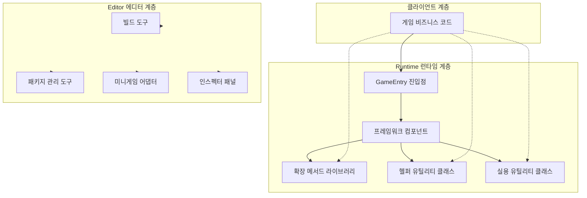
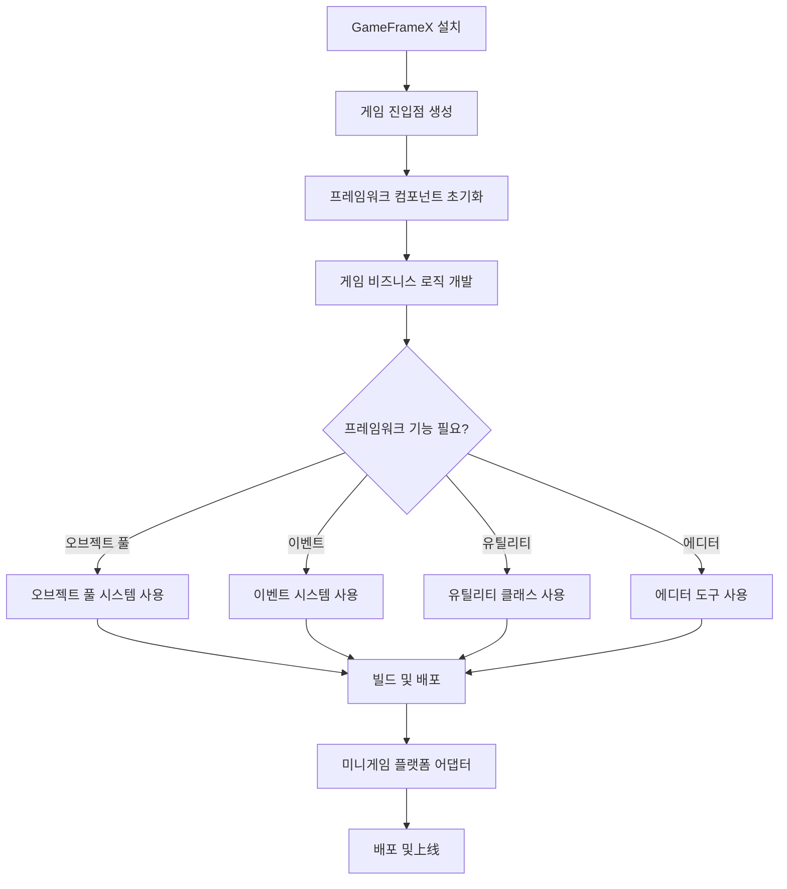
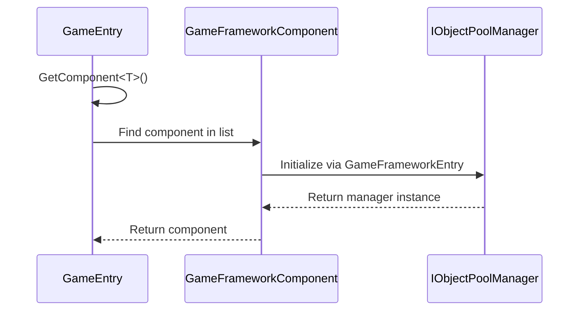

# 빠른 시작

GameFrameX는 독립 게임 개발자를 위해 설계된 최신 Unity 게임 프레임워크로, 3층 모듈식 아키텍처 설계를 채택하고 완전한 프론트엔드-백엔드 통합 솔루션을 제공하여 개발자가 고품질 게임 프로젝트를 빠르게 구축할 수 있도록 도와줍니다.

## 개요

GameFrameX 프레임워크는 풍부한 런타임 컴포넌트와 에디터 도구를 제공합니다:

- **오브젝트 풀 시스템**: 효율적인 메모리 관리 및 오브젝트 재사용 메커니즘
- **이벤트 시스템**: Publish-Subscribe 패턴 기반의 디커플링 통신
- **참조 풀 시스템**: 참조 타입 오브젝트의 메모리 최적화
- **확장 메서드 라이브러리**: 풍부한 Unity 엔진 확장 메서드
- **실용 유틸리티 클래스**: 암호화, 압축, 네트워크, JSON 등 필수 기능
- **에디터 도구**: 빌드 도구, 패키지 관리, 미니게임 플랫폼 어댑터 등

### 시스템 요구사항

| 요구사항 | 사양 |
|------|------|
| Unity 버전 | 2019.4 이상 |
| .NET 버전 | .NET Standard 2.0+ |
| 지원 플랫폼 | Windows, macOS, Linux, iOS, Android, WebGL |

## 아키텍처 개요



## 설치 가이드

### 방식 1: Unity Package Manager (권장)

1. Unity 에디터를 엶니다
2. `Window` → `Package Manager`를 엶니다
3. 왼쪽 상단 `+` 버튼을 클릭합니다
4. `Add package from git URL`를 선택합니다
5. 입력: `https://github.com/GameFrameX/com.gameframex.unity.git`

### 방식 2: 수동 다운로드

1. 최신 [Release](https://github.com/GameFrameX/com.gameframex.unity/releases)를 다운로드합니다
2. 프로젝트의 `Packages` 디렉토리에 압축 해제합니다

## 기본 사용

### 게임 진입점

GameFrameX는 `GameEntry`를 정적 진입점으로 사용하여 모든 프레임워크 컴포넌트에 접근합니다:

```csharp
using GameFrameX.Runtime;

public class GameManager : MonoBehaviour
{
    void Start()
    {
        // 오브젝트 풀 컴포넌트 가져오기
        var objectPool = GameEntry.GetComponent<ObjectPoolComponent>();
        
        // 참조 풀 컴포넌트 가져오기
        var referencePool = GameEntry.GetComponent<ReferencePoolComponent>();
        
        // 확장 메서드 사용
        transform.SetPositionX(10f);
        gameObject.SetActiveOptimized(true);
    }
}
```

> Source: [Runtime/Base/GameEntry.cs](https://github.com/GameFrameX/com.gameframex.unity/blob/main/Runtime/Base/GameEntry.cs#L46-L70)

### 프레임워크 컴포넌트

GameFrameX는 다양한 프레임워크 컴포넌트를 제공하며, 모두 `GameEntry.GetComponent<T>()`로 가져올 수 있습니다:

```csharp
// 오브젝트 풀 컴포넌트 - 재사용 가능한 오브젝트 효율적 관리
var objectPool = GameEntry.GetComponent<ObjectPoolComponent>();

// 참조 풀 컴포넌트 - 참조 타입 메모리 관리 최적화
var referencePool = GameEntry.GetComponent<ReferencePoolComponent>();
```

> Source: [Runtime/ObjectPool/ObjectPoolComponent.cs](https://github.com/GameFrameX/com.gameframex.unity/blob/main/Runtime/ObjectPool/ObjectPoolComponent.cs#L45-L72)

## 핵심 기능 예시

### 오브젝트 풀 시스템

오브젝트 풀 시스템은 게임 성능을 최적화하여频繁한 오브젝트 생성 및 파괴를 피합니다:

```csharp
// 오브젝트 풀 컴포넌트 가져오기
var objectPool = GameEntry.GetComponent<ObjectPoolComponent>();

// 오브젝트 풀 생성 (단일 스폰 모드)
objectPool.CreateSingleSpawnObjectPool<MyObject>("MyObjectPool", 10, 60f);

// 풀에서 오브젝트 가져오기
var obj = objectPool.Spawn<MyObject>("MyObjectPool");

// 오브젝트를 풀에 반환
objectPool.Unspawn(obj);

// 오브젝트 풀 생성 (다중 스폰 모드)
objectPool.CreateMultiSpawnObjectPool<MyObject>("MyObjectMultiPool", 100, 60f);

// 오브젝트 풀 파괴
objectPool.DestroyPool("MyObjectPool");
```

### 확장 메서드

GameFrameX는 풍부한 확장 메서드를 제공하여 일반적인 작업을 간소화합니다:

#### Transform 확장

```csharp
// 위치 성분 설정
transform.SetPositionX(10f);
transform.SetPositionY(20f);
transform.SetPositionZ(30f);

// 지역 스케일 성분 설정
transform.SetLocalScaleX(2f);
transform.SetLocalScaleY(2f);
transform.SetLocalScaleZ(2f);

// 지역 스케일 XYZ 설정
transform.SetLocalScaleXYZ(2f, 2f, 2f);

// 변환 초기화
transform.ResetTransformation();
```

> Source: [Runtime/Extension/UnityEngine.Transform/UnityEngine.TransformExtension.cs](https://github.com/GameFrameX/com.gameframex.unity/blob/main/Runtime/Extension/UnityEngine.Transform/UnityEngine.TransformExtension.cs#L55-L60)

#### Vector3 확장

```csharp
Vector3 pos = transform.position;

// 지정된 성분을 변경하여 새 벡터 생성
pos = pos.WithX(5f).WithY(10f);

// 벡터 연산 확장
Vector3 direction = Vector3.Right;
direction = direction.RotateBy(45f, Vector3.Up);
```

#### GameObject 확장

```csharp
// 최적화된 활성 상태 설정
gameObject.SetActiveOptimized(true);

// 재귀적으로 레이어 설정
gameObject.SetLayerRecursively(LayerMask.NameToLayer("UI"));

// 컴포넌트 가져오기 또는 추가
var component = gameObject.GetOrAddComponent<MyComponent>();
```

### 실용 유틸리티 클래스

GameFrameX는 다양한 필수 기능을 제공하는 정적 유틸리티 클래스를 제공합니다:

#### 파일 조작

```csharp
// 바이트 배열 쓰기
Utility.File.WriteAllBytes("path/to/file", data);

// 바이트 배열 읽기
byte[] content = Utility.File.ReadAllBytes("path/to/file");

// 텍스트 쓰기
Utility.File.WriteAllText("path/to/file", "content");

// 텍스트 읽기
string text = Utility.File.ReadAllText("path/to/file");
```

#### AES 암호화/복호화

```csharp
// AES 암호화
string encrypted = Utility.Encryption.Aes.Encrypt("plaintext", "key");

// AES 복호화
string decrypted = Utility.Encryption.Aes.Decrypt(encrypted, "key");
```

#### 해시 계산

```csharp
// MD5 해시
string md5 = Utility.Hash.Md5.ComputeHash("input");

// SHA1 해시
string sha1 = Utility.Hash.Sha1.ComputeHash("input");

// HMAC SHA256
string hmac = Utility.Hash.HMACSha256.ComputeHash("input", "key");
```

#### JSON 직렬화

```csharp
// 오브젝트를 JSON으로
string json = Utility.Json.ToJson(myObject);

// JSON을 오브젝트로
var obj = Utility.Json.FromJson<MyClass>(json);
```

#### 압축/해제

```csharp
// 데이터 압축
byte[] compressed = Utility.Compression.Compress(data);

// 데이터 해제
byte[] decompressed = Utility.Compression.Decompress(compressed);
```

### 이벤트 시스템

이벤트 시스템은 Publish-Subscribe 패턴을 채택하여 컴포넌트 간 디커플링 통신을 구현합니다:

```csharp
// 이벤트 인자 정의
public class PlayerDeadEventArgs : BaseEventArgs
{
    public int PlayerId { get; set; }
    public float Damage { get; set; }
    
    public static PlayerDeadEventArgs Create(int playerId, float damage)
    {
        var args = ReferencePool.Acquire<PlayerDeadEventArgs>();
        args.PlayerId = playerId;
        args.Damage = damage;
        return args;
    }
}

// 이벤트 구독
GameEntry.Event.Subscribe(PlayerDeadEventArgs.EventId, OnPlayerDead);

// 이벤트 발생
GameEntry.Event.Fire(this, PlayerDeadEventArgs.Create(playerId, damage));

// 구독 취소
GameEntry.Event.Unsubscribe(PlayerDeadEventArgs.EventId, OnPlayerDead);
```

> Source: [Runtime/Base/EventPool/EventPool.cs](https://github.com/GameFrameX/com.gameframex.unity/blob/main/Runtime/Base/EventPool/EventPool.cs)

## 에디터 도구

GameFrameX는 `GameFrameX` 메뉴 아래에 풍부한 에디터 도구를 제공합니다:

### 빌드 도구

```
GameFrameX/
├── Build/
│   ├── Windows X64
│   ├── Windows X32
│   ├── Mac Os
│   ├── Linux
│   ├── iOS
│   ├── Android
│   └── WebGL
├── Build Hotfix
└── Build WebGL With HybridCLR
```

### 패키지 관리 도구

```
GameFrameX/
├── Package Manager (패키지 관리자)
└── Update All Packages (모든 패키지 업데이트)
```

### 미니게임 플랫폼 어댑터

GameFrameX는 원클릭 전환 **21개 주요 미니게임 플랫폼**을 지원합니다:

```
GameFrameX/
├── Scripting Define Symbols/
│   ├── Domestic Mini Games/
│   │   ├── Enable WeChat Mini Game
│   │   ├── Enable Alipay Mini Game
│   │   ├── Enable DouYin Mini Game
│   │   ├── Enable KuaiShou Mini Game
│   │   ├── Enable Baidu Mini Game
│   │   ├── Enable JingDong Mini Game
│   │   ├── Enable Meituan Mini Game
│   │   ├── Enable Taobao Mini Game
│   │   └── Enable Bilibili Mini Game
│   ├── International Mini Games/
│   │   ├── Enable Discord Mini Game
│   │   ├── Enable YouTube Mini Game
│   │   ├── Enable Facebook Mini Game
│   │   ├── Enable Google Play Mini Game
│   │   ├── Enable TikTok Mini Game
│   │   ├── Enable CrazyGames Mini Game
│   │   └── Enable Poki Mini Game
│   ├── Device OEMs/
│   │   ├── Enable Huawei Mini Game
│   │   ├── Enable OPPO Mini Game
│   │   ├── Enable Vivo Mini Game
│   │   └── Enable Xiaomi Mini Game
│   └── Game Platforms/
│       └── Enable TapTap Mini Game
```

### 로그 제어

```
GameFrameX/
├── Scripting Define Symbols/
│   ├── Disable All Logs
│   ├── Enable All Logs
│   ├── Enable Debug And Above Logs
│   ├── Enable Info And Above Logs
│   ├── Enable Warning And Above Logs
│   ├── Enable Error And Above Logs
│   └── Enable Fatal And Above Logs
```

### 실용 도구

```
GameFrameX/
├── Open Folder/
│   ├── Data Path
│   ├── Persistent Data Path
│   ├── Streaming Assets Path
│   ├── Temporary Cache Path
│   └── Console Log Path
├── Cropping (이미지 크롭핑 도구)
└── Welcome (환영 창)
```

## 작업 흐름

### 일반적인 게임 개발 흐름



### 컴포넌트 초기화 흐름



## 빠른 시작 체크리스트

- [ ] GameFrameX 패키지 설치
- [ ] GameEntry 진입점 이해
- [ ] 오브젝트 풀 시스템 사용 학습
- [ ] 확장 메서드 사용 숙달
- [ ] 실용 유틸리티 클래스 익히기
- [ ] 에디터 도구로 효율성 향상
- [ ] 필요에 따라 미니게임 플랫폼 구성

## 관련 링크

- [핵심 개념](./4-core-concepts) - 프레임워크 핵심 설계 심층 이해
- [런타임 모듈](./5-runtime.base) - 기초 컴포넌트 상세
- [이벤트 시스템](./5-runtime.event-system) - 이벤트驱动 프로그래밍
- [오브젝트 풀 시스템](./5-runtime.object-pool) - 성능 최적화
- [확장 메서드 라이브러리](./5-runtime.extension-methods) - 확장 메서드 완전한 참고
- [실용 유틸리티 클래스](./5-runtime.utility-classes) - 유틸리티 클래스 상세
- [에디터 도구](./6-editor-tools.build-tools) - 빌드 도구
- [미니게임 플랫폼 어댑터](./6-editor-tools.mini-game-platform) - 21개 플랫폼 지원
- [플랫폼 지원](./7-platforms) - 멀티 플랫폼 배포 가이드
- [설치 가이드](./2-installation) - 상세 설치 설명