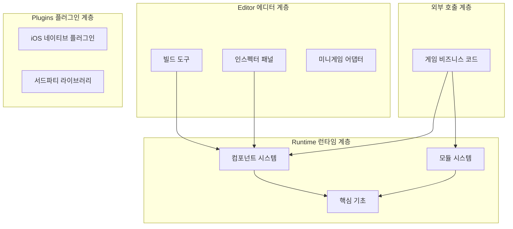
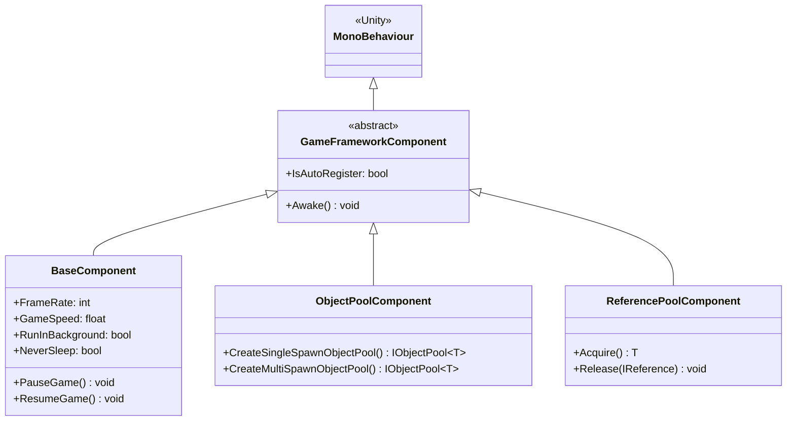
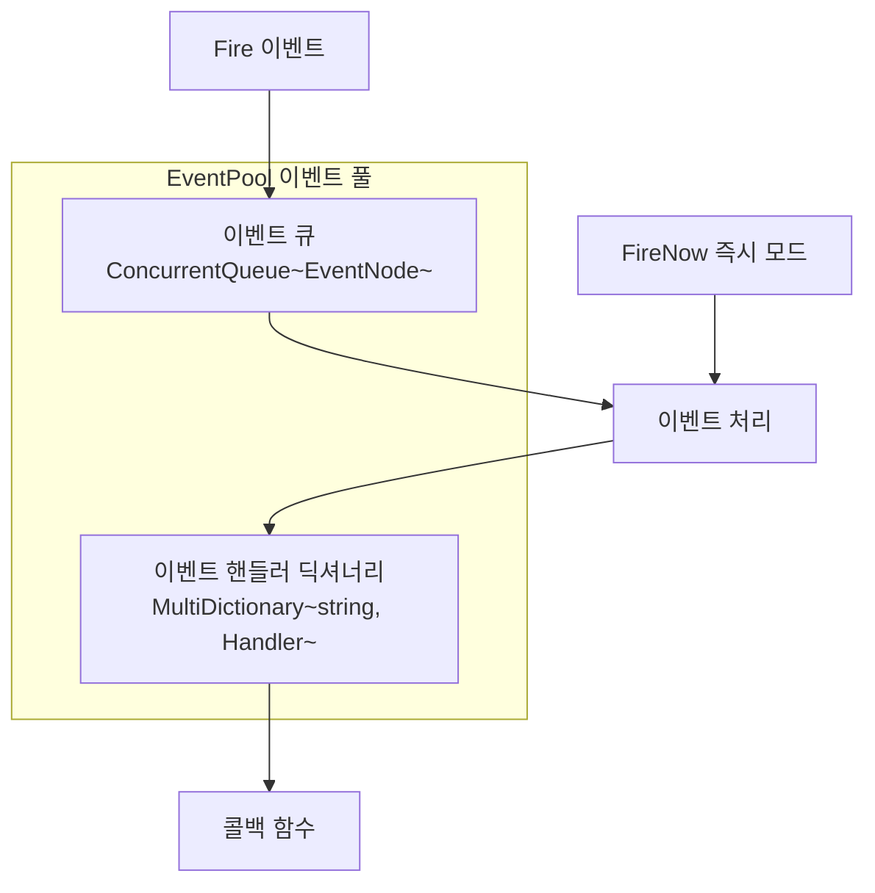
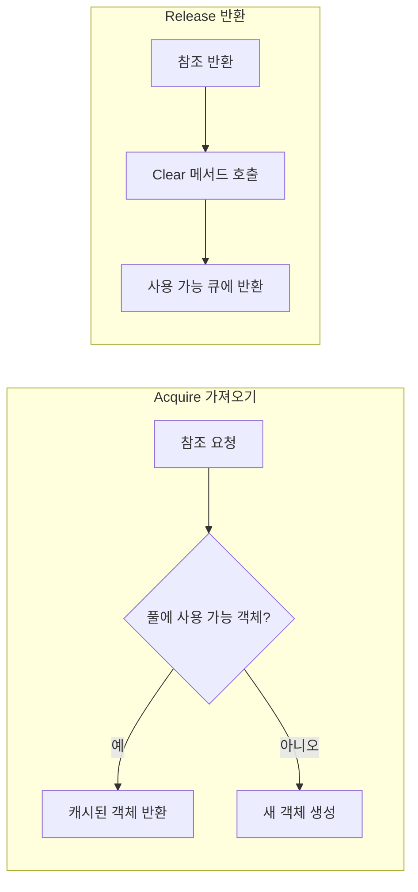

# 핵심 개념

GameFrameX 프레임워크는 최신 3층 모듈식 아키텍처 설계를 채택하여 독립 게임 개발자에게 완전한 프론트엔드-백엔드 통합 솔루션을 제공합니다. 이 문서는 프레임워크의 핵심 개념, 아키텍처 설계 및 주요 설계 패턴을 상세히 설명합니다.

## 개요

GameFrameX는 Unity 게임 개발자를 위해 설계된 최신 프레임워크로, 핵심 철학은 모듈식 아키텍처와 풍부한 내장 도구를 통해 개발자가 고품질 게임 프로젝트를 빠르게 구축할 수 있도록 하는 것입니다. 프레임워크는 **컴포넌트 기반 설계**를 채택하여 다양한 기능을 독립적인 컴포넌트로 캡슐화하고, 개발자는 프로젝트 요구에 따라 유연하게 조합하여 사용할 수 있습니다.

### 설계 목표

프레임워크 설계는 다음 핵심 원칙을 따릅니다:

1. **모듈식 설계**: 각 기능 모듈은 독립적으로 캡슐화되어 인터페이스를 통해 통신하며, 교체와 확장이 용이합니다.
2. **성능 우선**: 오브젝트 풀, 참조 풀 등의 기술로 메모리 할당을 최적화하고 가비지 컬렉션 부담을 줄입니다.
3. **개발 효율성**: 풍부한 확장 메서드, 유틸리티 클래스 및 에디터 도구를 제공하여 개발 효율성을 향상시킵니다.
4. **멀티 플랫폼 지원**: PC, 모바일, WebGL 및 다양한 미니게임 플랫폼을 지원합니다.

### 시스템 아키텍처

GameFrameX 프레임워크는 명확한 3층 아키텍처 설계를 채택합니다:



## 핵심 컴포넌트 시스템

GameFrameX의 핵심은 컴포넌트 시스템으로, 모든 기능은 컴포넌트(Component)를 통해 제공됩니다. 컴포넌트 시스템은 **컴포넌트(Component)**와 **모듈(Module)** 두 가지 유형으로 나뉩니다.

### 컴포넌트 (Component)

컴포넌트는 `MonoBehaviour`를 상속하며, Unity 게임 오브젝트에 부착되는 Unity 컴포넌트입니다. 각 컴포넌트는 게임 시작 시 자동으로 `GameEntry`에 등록되며, `GameEntry.GetComponent<T>()` 메서드를 통해 가져올 수 있습니다.



> Source: [GameFrameworkComponent.cs](https://github.com/GameFrameX/com.gameframex.unity/blob/main/Runtime/Base/GameFrameworkComponent.cs#L44-L95)

#### 컴포넌트 등록 메커니즘

컴포넌트는 `Awake()` 메서드에서 자동으로 `GameEntry`에 등록됩니다:

```csharp
protected virtual void Awake()
{
    GameEntry.RegisterComponent(this);
    if (IsAutoRegister)
    {
        GameFrameworkEntry.RegisterModule(InterfaceComponentType, ImplementationComponentType);
    }
}
```

> Source: [GameFrameworkComponent.cs](https://github.com/GameFrameX/com.gameframex.unity/blob/main/Runtime/Base/GameFrameworkComponent.cs#L85-L94)

### 모듈 (Module)

모듈은 순수 C# 클래스이며, Unity의 `MonoBehaviour`에 의존하지 않고 Unity 수명 주기와 무관한 로직 서비스를 구현하는 데 사용됩니다. 모듈은 우선순위 개념을 가지며, `Update` 폴링 및 `Shutdown` 시 우선순위에 따라 순서대로 실행됩니다.

```csharp
public abstract class GameFrameworkModule
{
    /// <summary>
    /// 게임 프레임워크 모듈 우선순위 가져오기
    /// </summary>
    protected internal virtual int Priority
    {
        get { return 0; }
    }

    /// <summary>
    /// 게임 프레임워크 모듈 폴링
    /// </summary>
    protected internal abstract void Update(float elapseSeconds, float realElapseSeconds);

    /// <summary>
    /// 게임 프레임워크 모듈 닫기 및 정리
    /// </summary>
    protected internal abstract void Shutdown();
}
```

> Source: [GameFrameworkModule.cs](https://github.com/GameFrameX/com.gameframex.unity/blob/main/Runtime/Base/GameFrameworkModule.cs#L40-L70)

### 프레임워크 진입점 (GameEntry)

`GameEntry`는 프레임워크의 정적 진입점으로, 모든 컴포넌트의 등록 및 가져오기를 관리합니다:

```csharp
public static class GameEntry
{
    private static readonly GameFrameworkLinkedList<GameFrameworkComponent> GameFrameworkComponents = new GameFrameworkLinkedList<GameFrameworkComponent>();

    /// <summary>
    /// 게임 프레임워크 컴포넌트 가져오기
    /// </summary>
    public static T GetComponent<T>() where T : GameFrameworkComponent
    {
        return (T)GetComponent(typeof(T));
    }

    /// <summary>
    /// 게임 프레임워크 컴포넌트 등록
    /// </summary>
    internal static void RegisterComponent(GameFrameworkComponent gameFrameworkComponent)
    {
        // 컴포넌트 등록 로직...
    }
}
```

> Source: [GameEntry.cs](https://github.com/GameFrameX/com.gameframex.unity/blob/main/Runtime/Base/GameEntry.cs#L46-L195)

## 이벤트 시스템

GameFrameX는 강력한 이벤트 풀 시스템을 제공하며, **스레드 안전한 비동기 이벤트分发**와 **동기 즉시 이벤트分发** 두 가지 모드를 지원합니다. 이벤트 시스템은 Publish-Subscribe 패턴을 채택하여 모듈 간의 느슨한 결합 통신을 구현합니다.

### 이벤트 풀 아키텍처



### 이벤트 사용 예시

```csharp
// 이벤트 인자 정의
public class PlayerDeadEventArgs : BaseEventArgs
{
    public static int EventId => typeof(PlayerDeadEventArgs).GetHashCode();
    public int PlayerId { get; private set; }
    public float Damage { get; private set; }
    
    public static PlayerDeadEventArgs Create(int playerId, float damage)
    {
        var args = ReferencePool.Acquire<PlayerDeadEventArgs>();
        args.PlayerId = playerId;
        args.Damage = damage;
        return args;
    }
    
    public override void Clear()
    {
        PlayerId = 0;
        Damage = 0;
    }
}

// 이벤트 구독
GameEntry.Event.Subscribe(PlayerDeadEventArgs.EventId, OnPlayerDead);

// 이벤트 발생 (비동기, 다음 프레임에서 처리)
GameEntry.Event.Fire(this, PlayerDeadEventArgs.Create(playerId, damage));

// 이벤트 발생 (동기, 즉시 처리)
GameEntry.Event.FireNow(this, PlayerDeadEventArgs.Create(playerId, damage));

// 구독 취소
GameEntry.Event.Unsubscribe(PlayerDeadEventArgs.EventId, OnPlayerDead);
```

> Source: [EventPool.cs](https://github.com/GameFrameX/com.gameframex.unity/blob/main/Runtime/Base/EventPool/EventPool.cs#L200-L335)

### 이벤트 풀 모드

이벤트 풀은 다양한 모드를 지원하며, 조합하여 다른 동작을 구현할 수 있습니다:

| 모드 | 설명 |
|------|------|
| `AllowMultiHandler` | 동일한 이벤트에 여러 핸들러 허용 |
| `AllowDuplicateHandler` | 중복 핸들러 허용 |
| `AllowNoHandler` | 이벤트에 핸들러가 없어도 허용 |

```csharp
// 다중 핸들러를 지원하는 이벤트 풀 생성
var eventPool = new EventPool<MyEventArgs>(EventPoolMode.AllowMultiHandler | EventPoolMode.AllowDuplicateHandler);
```

> Source: [EventPoolMode.cs](https://github.com/GameFrameX/com.gameframex.unity/blob/main/Runtime/Base/EventPool/EventPoolMode.cs)

## 참조 풀 시스템

참조 풀은 GameFrameX 프레임워크의 핵심 메모리 최적화 기술 중 하나로, **비 Unity 객체**의 메모리 할당을 관리하는 데 사용됩니다. 참조 풀을 통해频繁한 객체 생성 및 파괴로 인한 가비지 컬렉션 부담을 줄일 수 있습니다.

### 참조 풀 원리



### 사용 방식

참조 풀을 사용해야 하는 클래스는 `IReference` 인터페이스를 구현해야 합니다:

```csharp
public class MyData : IReference
{
    public int Id { get; set; }
    public string Name { get; set; }
    public float Value { get; set; }
    
    // Clear 메서드 반드시 구현
    public void Clear()
    {
        Id = 0;
        Name = null;
        Value = 0;
    }
}

// 참조 풀에서 객체 가져오기
var data = ReferencePool.Acquire<MyData>();
data.Id = 1;
data.Name = "Test";
data.Value = 100f;

// 참조 풀에 반환
ReferencePool.Release(data);

// 사전 할당된 참조 추가
ReferencePool.Add<MyData>(10);
```

> Source: [ReferencePool.cs](https://github.com/GameFrameX/com.gameframex.unity/blob/main/Runtime/Base/ReferencePool/ReferencePool.cs#L120-L167)

## 오브젝트 풀 시스템

오브젝트 풀 시스템은 **Unity 객체**(예: GameObject, Component) 재사용을 전문으로 관리하며, 게임 개발에서 성능을 최적화하는 중요한 수단입니다.

### 오브젝트 풀 유형

| 유형 | 설명 | 적용 시나리오 |
|------|------|----------|
| `SingleSpawnObjectPool` | 단일 스폰 풀 | 총알, 소품 등 일회성 객체 |
| `MultiSpawnObjectPool` | 다중 스폰 풀 | NPC, UI 요소 등 재사용 가능 객체 |

### 사용 예시

```csharp
// 오브젝트 풀 생성
var pool = GameEntry.ObjectPool.CreateMultiSpawnObjectPool<MyObject>("MyPool", 10, 60f, 100);

// 풀에서 객체 가져오기
var obj = pool.Spawn();

// 객체 풀에 반환
pool.Unspawn(obj);

// 오브젝트 풀 파괴
GameEntry.ObjectPool.DestroyObjectPool<MyObject>("MyPool");
```

> Source: [ObjectPoolComponent.cs](https://github.com/GameFrameX/com.gameframex.unity/blob/main/Runtime/ObjectPool/ObjectPoolComponent.cs#L650-L1045)

### 만료 시간 및 자동 해제

오브젝트 풀은 객체 만료 시간을 설정하는 것을 지원하며, 시간 초과 후 사용되지 않은 객체는 자동으로 해제됩니다:

```csharp
// 만료 시간이 있는 오브젝트 풀 생성 (60초 후 만료)
var pool = GameEntry.ObjectPool.CreateMultiSpawnObjectPool<MyObject>("ExpirePool", 60f);

// 자동 해제 간격 설정 (30초마다 확인)
pool.AutoReleaseInterval = 30f;
```

## 싱글톤 패턴

GameFrameX는 두 가지 유형의 싱글톤 基類를 제공하며, 각각 다른 시나리오에 사용됩니다.

### 일반 싱글톤 (GameFrameworkSingleton)

순수 C# 클래스에 적합하며, 이중 잠금 검사를 사용하여 스레드 안전성을 보장합니다:

```csharp
public class MySingleton : GameFrameworkSingleton<MySingleton>
{
    public void DoSomething()
    {
        // 비즈니스 로직
    }
}

// 사용
MySingleton.Instance.DoSomething();
```

> Source: [GameFrameworkSingleton.cs](https://github.com/GameFrameX/com.gameframex.unity/blob/main/Runtime/Base/GameFrameworkSingleton.cs#L11-L46)

### Mono 싱글톤 (GameFrameworkMonoSingleton)

GameObject에 부착해야 하는 컴포넌트에 적합합니다:

```csharp
public class MyMonoSingleton : GameFrameworkMonoSingleton<MyMonoSingleton>
{
    protected override void OnWake()
    {
        // 초기화 로직
    }
}

// 사용
MyMonoSingleton.Instance.DoSomething();
```

> Source: [GameFrameworkMonoSingleton.cs](https://github.com/GameFrameX/com.gameframex.unity/blob/main/Runtime/Base/GameFrameworkMonoSingleton.cs)

## 속성 시스템

속성 시스템 (BindableProperty)은 MVVM 아키텍처 패턴을 지원하여, 속성 값이 변경될 때 자동으로 옵저버에게 알립니다.

### 바인딩 가능한 속성

```csharp
// 바인딩 가능한 속성 정의
public BindableProperty<int> Score = new BindableProperty<int>(0);
public BindableProperty<string> PlayerName = new BindableProperty<string>("Player");

// 값 변경 이벤트 구독
Score.Add(OnScoreChanged);
PlayerName.RegisterWithInitValue(OnNameChanged);

// 값 변경 시 자동으로 콜백 트리거
Score.Value = 100;  // OnScoreChanged(100) 트리거

// 이벤트 제거
Score.Remove(OnScoreChanged);

// 모든 이벤트 지우기
Score.Clear();
```

> Source: [BindableProperty.cs](https://github.com/GameFrameX/com.gameframex.unity/blob/main/Runtime/Property/BindableProperty.cs#L7-L89)

### MVVM 패턴 적용

BindableProperty는 MVVM 아키텍처를 잘 지원할 수 있습니다:

```csharp
// Model - 데이터 모델
public class PlayerModel
{
    public BindableProperty<int> Health = new BindableProperty<int>(100);
    public BindableProperty<int> Mana = new BindableProperty<int>(50);
    public BindableProperty<Vector3> Position = new BindableProperty<Vector3>();
}

// ViewModel - 뷰 모델
public class PlayerViewModel
{
    private readonly PlayerModel _model;
    
    public PlayerViewModel(PlayerModel model)
    {
        _model = model;
    }
    
    public void TakeDamage(int damage)
    {
        _model.Health.Value -= damage;
    }
}

// View - 뷰 (UI 스크립트에서)
public class PlayerHUD : MonoBehaviour
{
    public Text healthText;
    private PlayerModel _model;
    
    public void Bind(PlayerModel model)
    {
        _model = model;
        _model.Health.RegisterWithInitValue(OnHealthChanged);
    }
    
    private void OnHealthChanged(int health)
    {
        healthText.text = $"HP: {health}";
    }
}
```

## 확장 메서드 라이브러리

GameFrameX는 문자열, 컬렉션, DateTime, Unity 타입 등 다양한 분야를 포괄하는 풍부한 확장 메서드 라이브러리를 제공합니다.

### Transform 확장

```csharp
// 위치 성분 설정
transform.SetPositionX(10f);
transform.SetPositionY(20f);
transform.SetPositionZ(30f);

// 일괄 설정
transform.SetLocalScaleXYZ(2f, 2f, 2f);

// 변환 초기화
transform.ResetTransformation();

// 하위 오브젝트 찾기
var child = transform.FindChildRecursive("ChildName");
```

### Vector 확장

```csharp
Vector3 pos = transform.position;
pos = pos.WithX(5f).WithY(10f);  // 새 값 생성, 다른 성분 유지
Vector3 direction = pos.NormalizeTo();
float angle = transform.forward.AngleTo(Vector3.forward);
```

### GameObject 확장

```csharp
// 최적화된 활성/비활성화
gameObject.SetActiveOptimized(true);

// 재귀적으로 레이어 설정
gameObject.SetLayerRecursively(LayerMask.NameToLayer("UI"));

// 컴포넌트 가져오기 또는 추가
var component = gameObject.GetOrAddComponent<MyComponent>();
```

> Source: [UnityEngage.GameObjectExtension.cs](https://github.com/GameFrameX/com.gameframex.unity/blob/main/Runtime/Extension/UnityEngage.GameObject/UnityEngage.GameObjectExtension.cs)

## 실용 유틸리티 클래스

프레임워크는 암호화, 압축, 파일 조작, 네트워크 등 다양한 측면을 포괄하는 완전한 유틸리티 클래스를 제공합니다.

### 암호화/복호화

```csharp
// AES 암호화
string encrypted = Utility.Encryption.Aes.Encrypt("plaintext", "key");
string decrypted = Utility.Encryption.Aes.Decrypt(encrypted, "key");

// MD5 해시
string md5 = Utility.Hash.Md5.ComputeHash("input");

// SHA1 해시
string sha1 = Utility.Hash.Sha1.ComputeHash("input");
```

### 파일 조작

```csharp
// 파일 읽기
byte[] data = Utility.File.ReadAllBytes("path/to/file");
string content = Utility.File.ReadAllString("path/to/file");

// 파일 쓰기
Utility.File.WriteAllBytes("path/to/file", data);
Utility.File.WriteAllString("path/to/file", content);
```

### JSON 직렬화

```csharp
// 오브젝트를 JSON으로
string json = Utility.Json.ToJson(myObject);

// JSON을 오브젝트로
var obj = Utility.Json.FromJson<MyClass>(json);
```

## 관련 링크

- [기초 컴포넌트](./5-runtime.base)
- [이벤트 시스템](./5-runtime.event-system)
- [오브젝트 풀 시스템](./5-runtime.object-pool)
- [참조 풀 시스템](./5-runtime.reference-pool)
- [속성 시스템](./5-runtime.property-system)
- [확장 메서드 라이브러리](./5-runtime.extension-methods)
- [유틸리티 클래스](./5-runtime.utility-classes)
- [API 참고](./8-api-reference)