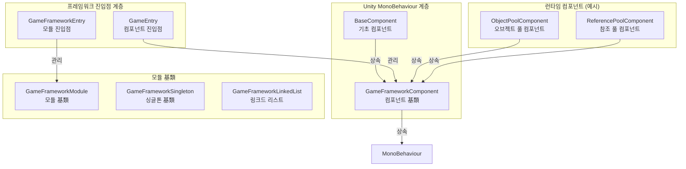
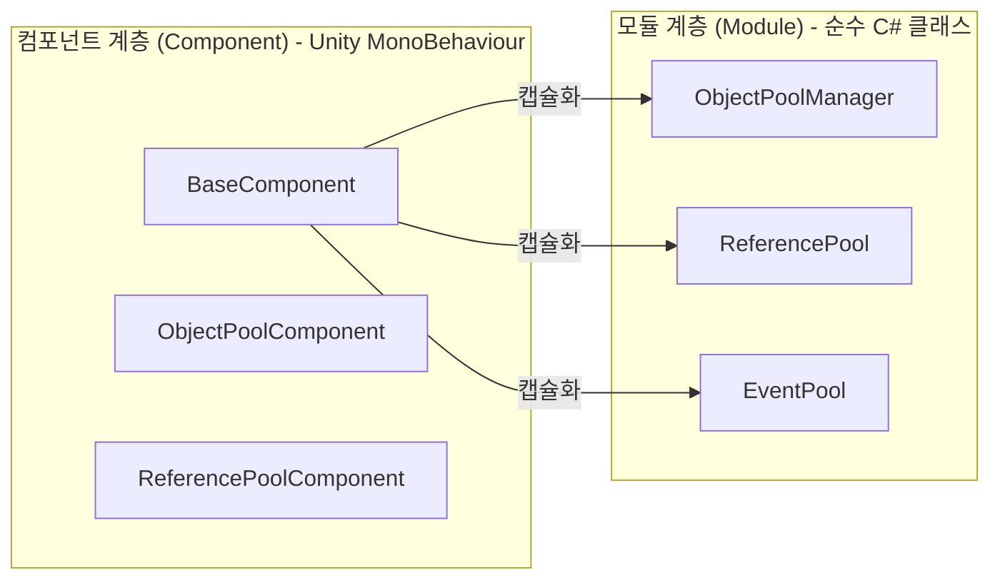
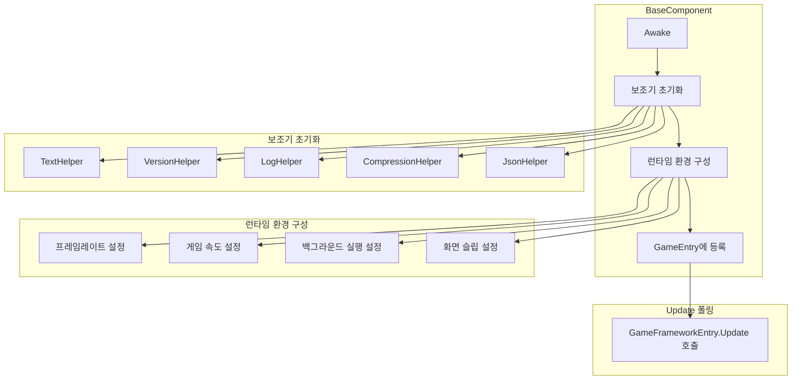
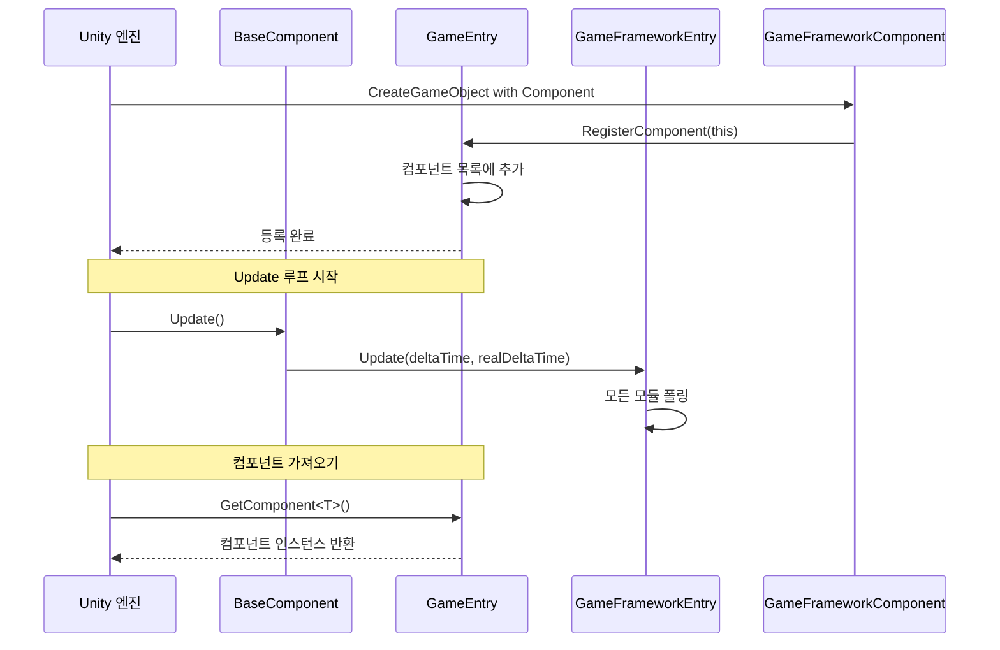

# 기초 컴포넌트

기초 컴포넌트는 GameFrameX 프레임워크의 핵심 하위 아키텍처로, 게임 런타임에 필요한 기초 기능과 컴포넌트 관리 메커니즘을 제공합니다. 이 컴포넌트는 전체 프레임워크의 기둥 역할을 하며, 다른 모든 기능 모듈은 이 기초 컴포넌트에 의존합니다.

## 개요

GameFrameX의 기초 컴포넌트는 `Runtime/Base` 디렉토리에 위치하며, 프레임워크 핵심 진입점, 컴포넌트 基類, 모듈 基類 및 기초 데이터 구조를 포함합니다. 이 컴포넌트는 다음을 담당합니다:

- **게임 런타임 환경 구성**: 프레임레이트, 게임 속도, 백그라운드 실행, 화면 슬립 등
- **컴포넌트 수명주기 관리**: 등록, 가져오기, 파괴
- **모듈 시스템**: 모듈 생성, 폴링, 닫기
- **싱글톤 및 데이터 구조**: 일반적으로 사용되는 디자인 패턴 구현

### 핵심 클래스 관계



## 아키텍처 상세

### 컴포넌트 시스템 아키텍처

GameFrameX는 双层 아키텍처 설계: 컴포넌트 계층 (Component)과 모듈 계층 (Module)을 채택합니다.



**설계 의도:**
- **컴포넌트 계층**은 `MonoBehaviour`를 상속하며, Unity 씬의 GameObject에 직접 부착 가능
- **모듈 계층**은 순수 C# 클래스로, 구체적인 비즈니스 로직 구현을 담당
- 컴포넌트 계층은 모듈 계층의 파사드(Facade)로, 외부에 통일된 접근 방식 제공

### BaseComponent 상세

`BaseComponent`는 프레임워크의 핵심 컴포넌트로, 씬에 반드시 부착해야 하며 게임 런타임 환경과 다양한 보조 도구를 초기화하는 역할을 합니다.



### 컴포넌트 등록 및 가져오기 흐름



## 핵심 기능

### 1. 런타임 환경 제어

BaseComponent는 게임 런타임 환경에 대한 완전한 제어 능력을 제공합니다:

| 기능 | 속성 | 설명 |
|------|------|------|
| 프레임레이트 제어 | `FrameRate` | `Application.targetFrameRate` 설정 |
| 게임 속도 | `GameSpeed` | `Time.timeScale` 제어, 슬로모션 지원 |
| 일시정지 상태 | `IsGamePaused` | 게임이 일시정지되었는지 읽기 |
| 정상 속도 | `IsNormalGameSpeed` | 1배속으로 실행 중인지 확인 |
| 백그라운드 실행 | `RunInBackground` | `Application.runInBackground` 설정 |
| 화면 슬립 | `NeverSleep` | `Screen.sleepTimeout` 제어 |

**코드 예시:**

```csharp
// 기초 컴포넌트 가져오기
var baseComponent = GameEntry.GetComponent<BaseComponent>();

// 프레임레이트 제어
baseComponent.FrameRate = 60;

// 게임 일시정지
baseComponent.PauseGame();

// 게임 재개
baseComponent.ResumeGame();

// 슬립 금지
baseComponent.NeverSleep = true;
```
> Source: [BaseComponent.cs](https://github.com/GameFrameX/com.gameframex.unity/blob/main/Runtime/Base/BaseComponent.cs#L220-L243)

### 2. 컴포넌트 접근

`GameEntry` 정적 클래스를 통해 모든 등록된 프레임워크 컴포넌트에 접근할 수 있습니다:

```csharp
// 제네릭을 통해 컴포넌트 가져오기
var baseComponent = GameEntry.GetComponent<BaseComponent>();
var objectPool = GameEntry.GetComponent<ObjectPoolComponent>();

// 타입을 통해 컴포넌트 가져오기
var component = GameEntry.GetComponent(typeof(BaseComponent));

// 타입 이름을 통해 컴포넌트 가져오기
var component = GameEntry.GetComponent("BaseComponent");
```
> Source: [GameEntry.cs](https://github.com/GameFrameX/com.gameframex.unity/blob/main/Runtime/Base/GameEntry.cs#L67-L121)

### 3. 모듈 관리

`GameFrameworkEntry`는 모든 프레임워크 모듈의 생성, 폴링 및 파괴를 관리합니다:

```csharp
// 모듈 가져오기 (인터페이스를 통해)
var module = GameFrameworkEntry.GetModule<IObjectPoolManager>();

// 모듈은 자동으로 우선순위에 따라 정렬됨
// Update는 매 프레임마다 호출됨
```
> Source: [GameFrameworkEntry.cs](https://github.com/GameFrameX/com.gameframex.unity/blob/main/Runtime/Base/GameFrameworkEntry.cs#L95-L120)

### 4. 프레임워크 닫기

프레임워크는 세 가지 닫기 모드를 지원합니다:

```csharp
// 프레임워크만 닫기 (종료 없음)
GameEntry.Shutdown(ShutdownType.None);

// 닫고 게임 다시 시작
GameEntry.Shutdown(ShutdownType.Restart);

// 닫고 게임 종료
GameEntry.Shutdown(ShutdownType.Quit);
```
> Source: [ShutdownType.cs](https://github.com/GameFrameX/com.gameframex.unity/blob/main/Runtime/Base/ShutdownType.cs#L41-L66)

## 기초 데이터 구조

### 싱글톤 패턴

GameFrameX는 스레드 안전한 싱글톤 基類를 제공합니다:

```csharp
public class MySingleton : GameFrameworkSingleton<MySingleton>
{
    public void DoSomething()
    {
        // 싱글톤 메서드
    }
}

// 사용
MySingleton.Instance.DoSomething();
```
> Source: [GameFrameworkSingleton.cs](https://github.com/GameFrameX/com.gameframex.unity/blob/main/Runtime/Base/GameFrameworkSingleton.cs#L1-L47)

### 링크드 리스트 데이터 구조

커스텀 링크드 리스트 구현으로, 노드 캐싱 메커니즘을 포함합니다:

```csharp
var list = new GameFrameworkLinkedList<GameFrameworkComponent>();
list.AddLast(component);
var node = list.First;
// ... 링크드 리스트 사용
```
> Source: [GameFrameworkLinkedList.cs](https://github.com/GameFrameX/com.gameframex.unity/blob/main/Runtime/Base/GameFrameworkLinkedList.cs#L47-L59)

## 구성 옵션

Unity 에디터에서 BaseComponent는 다음 구성 항목을 제공합니다:

| 구성 항목 | 타입 | 기본값 | 설명 |
|--------|------|--------|------|
| TextHelperTypeName | string | "UnityGameFramework.Runtime.DefaultTextHelper" | 텍스트 보조기 타입 |
| VersionHelperTypeName | string | "UnityGameFramework.Runtime.DefaultVersionHelper" | 버전 보조기 타입 |
| LogHelperTypeName | string | "UnityGameFramework.Runtime.DefaultLogHelper" | 로그 보조기 타입 |
| CompressionHelperTypeName | string | "UnityGameFramework.Runtime.DefaultCompressionHelper" | 압축 보조기 타입 |
| JsonHelperTypeName | string | "UnityGameFramework.Runtime.DefaultJsonHelper" | JSON 보조기 타입 |
| FrameRate | int | 30 | 게임 목표 프레임레이트 |
| GameSpeed | float | 1f | 게임 실행 속도 |
| RunInBackground | bool | true | 백그라운드 실행 허용 여부 |
| NeverSleep | bool | true | 화면 슬립 금지 여부 |

## API 참고

### `BaseComponent`

게임 기초 컴포넌트로, 런타임 환경 구성을 제공합니다.

#### 속성

| 속성 | 타입 | 설명 |
|------|------|------|
| `FrameRate` | int | 게임 프레임레이트 가져오기 또는 설정 |
| `GameSpeed` | float | 게임 속도 가져오기 또는 설정 |
| `IsGamePaused` | bool | 게임이 일시정지되었는지 가져오기 |
| `IsNormalGameSpeed` | bool | 게임이 정상 속도로 실행 중인지 가져오기 |
| `RunInBackground` | bool | 백그라운드 실행 허용 여부 가져오기 또는 설정 |
| `NeverSleep` | bool | 슬립 금지 여부 가져오기 또는 설정 |

#### 메서드

| 메서드 | 반환 타입 | 설명 |
|------|----------|------|
| `PauseGame()` | void | 게임 일시정지 |
| `ResumeGame()` | void | 게임 재개 |
| `ResetNormalGameSpeed()` | void | 정상 게임 속도로 초기화 |

### `GameEntry`

프레임워크 컴포넌트 접근 진입점입니다.

#### 메서드

| 메서드 | 반환 타입 | 설명 |
|------|----------|------|
| `GetComponent<T>()` | T | 지정된 타입의 컴포넌트 가져오기 |
| `GetComponent(Type)` | GameFrameworkComponent | 타입을 통해 컴포넌트 가져오기 |
| `GetComponent(string)` | GameFrameworkComponent | 타입 이름을 통해 컴포넌트 가져오기 |
| `Shutdown(ShutdownType)` | void | 프레임워크 닫기 |

### `GameFrameworkEntry`

프레임워크 모듈 관리 진입점입니다.

#### 메서드

| 메서드 | 반환 타입 | 설명 |
|------|----------|------|
| `GetModule<T>()` | T | 지정된 인터페이스의 모듈 가져오기 |
| `GetModule(Type)` | GameFrameworkModule | 타입을 통해 모듈 가져오기 |
| `Update(float, float)` | void | 모든 모듈 폴링 |
| `Shutdown()` | void | 모든 모듈 닫기 |

### `GameFrameworkComponent`

컴포넌트 추상 基類입니다.

#### 속성

| 속성 | 타입 | 설명 |
|------|------|------|
| `IsAutoRegister` | bool | 자동 등록 여부 가져오기 또는 설정 |
| `ImplementationComponentType` | Type | 구현 클래스 타입 |
| `InterfaceComponentType` | Type | 인터페이스 클래스 타입 |

### `GameFrameworkModule`

모듈 추상 基類입니다.

#### 속성

| 속성 | 타입 | 설명 |
|------|------|------|
| `Priority` | int | 모듈 우선순위, 높은 우선순위가 먼저 폴링됨 |

#### 메서드

| 메서드 | 반환 타입 | 설명 |
|------|----------|------|
| `Update(float, float)` | void | 모듈 폴링 |
| `Shutdown()` | void | 모듈 닫기 및 정리 |

## 사용 예시

### 프레임워크 초기화

1. Unity 씬에서 빈 GameObject를 생성하고 "GameFrame"으로 이름 짓습니다
2. `BaseComponent` 컴포넌트를 추가합니다
3. 필요에 따라各项 매개변수를 구성합니다
4. 게임 실행

```csharp
// GameEntry.cs는 자동으로 생성됨
// BaseComponent가 Awake에서 초기화 완료
```
> Source: [BaseComponent.cs](https://github.com/GameFrameX/com.gameframex.unity/blob/main/Runtime/Base/BaseComponent.cs#L153-L192)

### 게임 일시정지/재개

```csharp
var baseComponent = GameEntry.GetComponent<BaseComponent>();

// 게임 일시정지 (시간 정지)
baseComponent.PauseGame();

// 일시정지 상태 확인
if (baseComponent.IsGamePaused)
{
    Debug.Log("게임이 일시정지됨");
}

// 게임 재개
baseComponent.ResumeGame();

// 또는 정상 속도로 초기화
baseComponent.ResetNormalGameSpeed();
```
> Source: [BaseComponent.cs](https://github.com/GameFrameX/com.gameframex.unity/blob/main/Runtime/Base/BaseComponent.cs#L216-L257)

### 커스텀 모듈 생성

```csharp
public interface IMyModule : GameFramework.IModule
{
    void DoSomething();
}

public class MyModule : GameFrameworkModule, IMyModule
{
    // 우선순위: 값이 클수록 먼저 처리됨
    internal override int Priority => 10;

    // 매 프레임 폴링
    protected internal override void Update(float elapseSeconds, float realElapseSeconds)
    {
        // 폴링 로직
    }

    // 닫을 때 리소스 정리
    protected internal override void Shutdown()
    {
        // 정리 로직
    }

    public void DoSomething()
    {
        // 비즈니스 로직
    }
}
```
> Source: [GameFrameworkModule.cs](https://github.com/GameFrameX/com.gameframex.unity/blob/main/Runtime/Base/GameFrameworkModule.cs#L40-L70)

## 관련 링크

- [이벤트 시스템](./5-runtime.event-system) - 프레임워크 내장 이벤트 시스템
- [오브젝트 풀 시스템](./5-runtime.object-pool) - 오브젝트 풀 관리
- [참조 풀 시스템](./5-runtime.reference-pool) - 참조 풀 관리
- [태스크 풀 시스템](./5-runtime.task-pool) - 비동기 태스크 관리
- [확장 메서드 라이브러리](./5-runtime.extension-methods) - 일반 확장 메서드
- [API 참고](./8-api-reference) - 완전한 API 문서