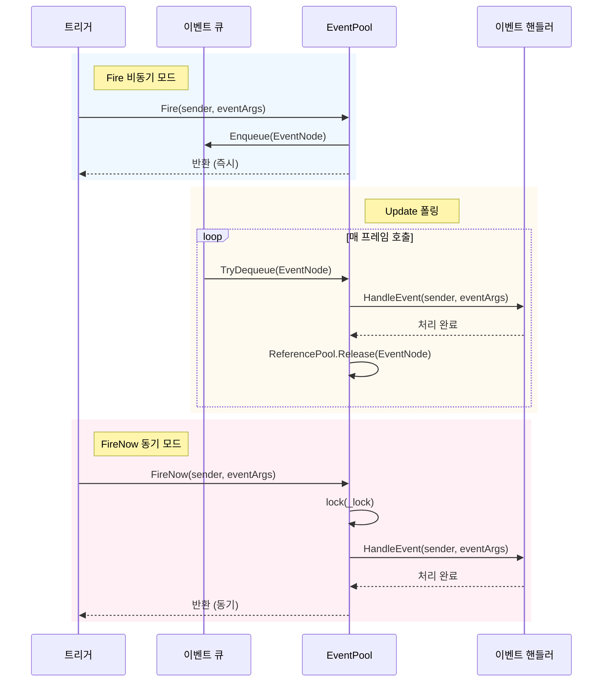
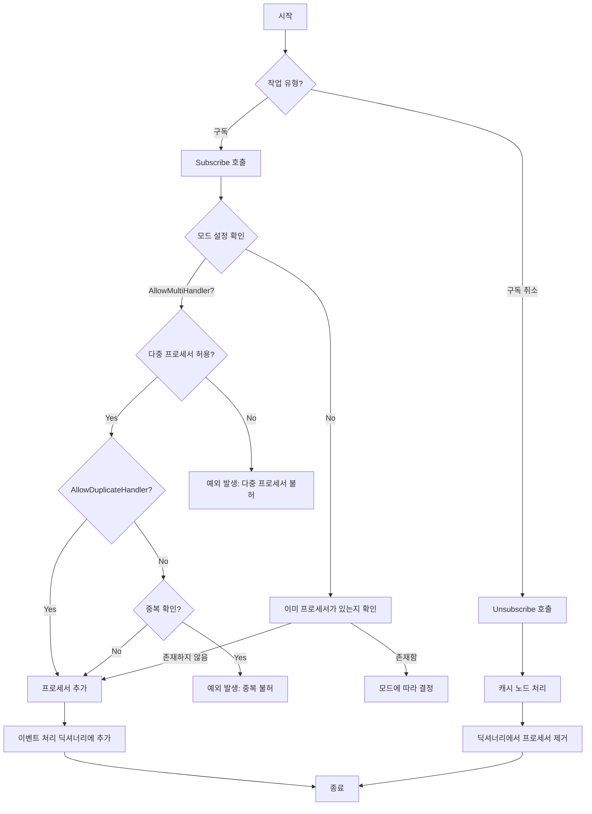

# 이벤트 시스템

GameFrameX 이벤트 시스템은 가볍고高性能な跨 컴포넌트 통신 솔루션으로, Publish-Subscribe 패턴을 구현하여 디커플링합니다.

## 개요

이벤트 시스템은 GameFrameX 프레임워크의 핵심 모듈 중 하나로, 완전한 게임 이벤트 관리 메커니즘을 제공합니다. **Publish-Subscribe (발행-구독) 패턴**을 채택하여 게임의 서로 다른 모듈이 서로 직접 의존하지 않고 통신할 수 있습니다.

### 핵심 기능

- **제네릭 이벤트 풀**: `EventPool<T>` 제네릭 클래스에 기반하여 타입 안전한 이벤트 처리 지원
- **스레드 안전**: 백그라운드 스레드에서 이벤트 트리거를 지원하며, 메인 스레드에서 콜백 처리
- **이중 모드分发**: 비동기 큐 모드 (`Fire`)와 동기 즉시 모드 (`FireNow`) 지원
- **유연한 구성**: `EventPoolMode` 플래그 열거형을 통해 다중 프로세서, 중복 프로세서 등 허용 여부 구성 가능
- **메모리 최적화**: 참조 풀 기술을 사용하여 이벤트 노드를 재사용하고 가비지 컬렉션 부담을 줄임

### 적용 시나리오

- UI와 게임 로직의 디커플링 통신
- 모듈 간의 느슨한 결합 상호작용
- 비동기 이벤트 처리 (예: 네트워크 응답, 리소스 로딩 완료 등)
- 멀티 모듈 상태 동기화

## 아키텍처

```mermaid
classDiagram
    class GameFrameworkEventArgs {
        <<abstract>>
        +Clear() void
    }
    
    class BaseEventArgs {
        <<abstract>>
        +Id: string { get }
    }
    
    class EventPoolMode {
        <<enum>>
        +Default
        +AllowNoHandler
        +AllowMultiHandler
        +AllowDuplicateHandler
    }
    
    class EventPool~T~ {
        -_lock: object
        -_eventHandlers: GameFrameworkMultiDictionary
        -_events: ConcurrentQueue~EventNode~
        -_eventPoolMode: EventPoolMode
        +Subscribe(id, handler) void
        +Unsubscribe(id, handler) void
        +Fire(sender, e) void
        +FireNow(sender, e) void
        +Update(elapseSeconds, realElapseSeconds) void
    }
    
    class EventNode {
        <<internal>>
        -_sender: object
        -_eventArgs: T
        +Sender: object
        +EventArgs: T
        +Create(sender, e): EventNode
        +Clear() void
    }
    
    GameFrameworkEventArgs <|-- BaseEventArgs
    BaseEventArgs <|-- T
    EventPoolMode --* EventPool
    EventPool *-- EventNode
    EventNode ..> T
```

### 컴포넌트 설명

| 컴포넌트 | 설명 |
|------|------|
| `GameFrameworkEventArgs` | 모든 이벤트 인자의 基類로, `EventArgs`를 상속하고 `IReference` 인터페이스를 구현 |
| `BaseEventArgs` | 프레임워크 이벤트 인자 基類로, 이벤트 ID 속성 정의 |
| `EventPool<T>` | 제네릭 이벤트 풀로, 특정 타입事件的 구독, 구독 취소 및分发 관리 |
| `EventNode` | 내부 클래스로, 이벤트 큐 처리를 위한 이벤트 래핑에 사용 |
| `EventPoolMode` | 이벤트 풀 모드 열거형으로, 이벤트 처리 동작 제어 |

## 핵심 개념

### 이벤트 인자

모든 커스텀 이벤트 인자는 `BaseEventArgs`를 상속해야 하며, 이벤트 타입을 식별하기 위해 `Id` 속성을 구현해야 합니다.

```csharp
public sealed class PlayerhpChangedEventArgs : BaseEventArgs
{
    public override string Id => "PlayerHpChanged";
    
    public int OldHp { get; private set; }
    public int NewHp { get; private set; }
    
    public static PlayerHpChangedEventArgs Create(int oldHp, int newHp)
    {
        var args = ReferencePool.Acquire<PlayerHpChangedEventArgs>();
        args.OldHp = oldHp;
        args.NewHp = newHp;
        return args;
    }
    
    public override void Clear()
    {
        OldHp = 0;
        NewHp = 0;
    }
}
```

> Source: [BaseEventArgs.cs](https://github.com/GameFrameX/com.gameframex.unity/blob/main/Runtime/Base/EventPool/BaseEventArgs.cs#L34-L54)

### 이벤트 풀 모드

`EventPoolMode`는 플래그 열거형으로, 다음 옵션을 지원합니다:

| 모드 | 설명 |
|------|------|
| `Default` | 기본 모드, 이벤트 처리 함수가 존재해야 하며 하나만 가능 |
| `AllowNoHandler` | 이벤트 처리 함수가 존재하지 않아도 이벤트 발생 허용 |
| `AllowMultiHandler` | 다중 이벤트 처리 함수 존재 허용 |
| `AllowDuplicateHandler` | 중복 이벤트 처리 함수 허용 (`AllowMultiHandler`와 함께 사용 필요) |

```csharp
[Flags]
public enum EventPoolMode : byte
{
    Default = 0,
    AllowNoHandler = 1,
    AllowMultiHandler = 2,
    AllowDuplicateHandler = 4
}
```

> Source: [EventPoolMode.cs](https://github.com/GameFrameX/com.gameframex.unity/blob/main/Runtime/Base/EventPool/EventPoolMode.cs#L37-L77)

## 작업 흐름

### 이벤트分发 흐름



### 이벤트 구독 및 구독 취소



## 사용 예시

### 기본 사용

#### 1. 이벤트 인자 정의

```csharp
public sealed class ScoreChangedEventArgs : BaseEventArgs
{
    public override string Id => "ScoreChanged";
    
    public int OldScore { get; private set; }
    public int NewScore { get; private set; }
    
    public static ScoreChangedEventArgs Create(int oldScore, int newScore)
    {
        var args = ReferencePool.Acquire<ScoreChangedEventArgs>();
        args.OldScore = oldScore;
        args.NewScore = newScore;
        return args;
    }
    
    public override void Clear()
    {
        OldScore = 0;
        NewScore = 0;
    }
}
```

#### 2. 이벤트 풀 생성 및 구독

```csharp
// 이벤트 풀 생성 (다중 프로세서 지원)
var eventPool = new EventPool<ScoreChangedEventArgs>(EventPoolMode.AllowMultiHandler);

// 이벤트 구독
EventHandler<ScoreChangedEventArgs> handler = (sender, e) =>
{
    Debug.Log($"점수 변화: {e.OldScore} -> {e.NewScore}");
};
eventPool.Subscribe("ScoreChanged", handler);

// 이벤트 트리거 (비동기, 다음 프레임에서 처리)
eventPool.Fire(this, ScoreChangedEventArgs.Create(100, 150));

// 이벤트 트리거 (동기, 즉시 처리)
eventPool.FireNow(this, ScoreChangedEventArgs.Create(150, 200));

// 구독 취소
eventPool.Unsubscribe("ScoreChanged", handler);
```

> Source: [EventPool.cs](https://github.com/GameFrameX/com.gameframex.unity/blob/main/Runtime/Base/EventPool/EventPool.cs#L200-L335)

#### 3. Update에서 폴링 처리

```csharp
private EventPool<ScoreChangedEventArgs> _eventPool;

void Update(float elapseSeconds, float realElapseSeconds)
{
    // 주기적으로 호출하여 큐의 이벤트 처리 필수
    _eventPool.Update(elapseSeconds, realElapseSeconds);
}
```

### 고급 사용

#### 기본 프로세서 설정

이벤트에 등록된 프로세서가 없을 때 기본 프로세서가 호출됩니다:

```csharp
var eventPool = new EventPool<ScoreChangedEventArgs>(EventPoolMode.AllowNoHandler);

eventPool.SetDefaultHandler((sender, e) =>
{
    Debug.Log($"기본 프로세서: 점수 변화 {e.OldScore} -> {e.NewScore}");
});

// 구독자가 없어도 기본 프로세서 호출됨
eventPool.Fire(this, ScoreChangedEventArgs.Create(0, 100));
```

#### 모드 조합

다중 모드 플래그를 조합할 수 있습니다:

```csharp
// 다중 프로세서 허용 및 핸들러 없음 허용
var mode = EventPoolMode.AllowMultiHandler | EventPoolMode.AllowNoHandler;
var eventPool = new EventPool<ScoreChangedEventArgs>(mode);
```

#### 스레드 안전 이벤트 트리거

백그라운드 스레드에서 안전하게 이벤트를 트리거하면, 이벤트는 메인 스레드의 Update에서 처리됩니다:

```csharp
// 백그라운드 스레드에서 트리거
Task.Run(() =>
{
    // 스레드 안전 - 이벤트가 큐에 추가됨
    eventPool.Fire(networkClient, ScoreChangedEventArgs.Create(oldScore, newScore));
});

// 메인 스레드의 Update에서 처리
void Update(float elapseSeconds, float realElapseSeconds)
{
    eventPool.Update(elapseSeconds, realElapseSeconds);
}
```

## API 참고

### EventPool<T>

제네릭 이벤트 풀 클래스로, 특정 타입事件的 구독, 구독 취소 및분산 관리.

#### 생성자

```csharp
public EventPool(EventPoolMode mode)
```

**매개변수:**
- `mode` (EventPoolMode): 이벤트 풀 모드로, 프로세서 동작 제어

**예시:**
```csharp
var eventPool = new EventPool<ScoreChangedEventArgs>(EventPoolMode.Default);
```

#### 속성

| 속성 | 타입 | 설명 |
|------|------|------|
| `EventHandlerCount` | int | 등록된 이벤트 처리 함수 수량 |
| `EventCount` | int | 큐에서 대기 중인 이벤트 수량 |

#### 메서드

##### Subscribe

이벤트 처리 함수를 구독합니다.

```csharp
public void Subscribe(string id, EventHandler<T> handler)
```

**매개변수:**
- `id` (string): 이벤트 타입 식별자
- `handler` (EventHandler<T>): 구독할 이벤트 처리 함수

**예외:**
- `GameFrameworkException`: 다중 프로세서를 허용하지 않는데 이미 프로세서가 있거나, 중복 프로세서를 허용하지 않을 때

---

##### Unsubscribe

이벤트 처리 함수 구독을 취소합니다.

```csharp
public void Unsubscribe(string id, EventHandler<T> handler)
```

**매개변수:**
- `id` (string): 이벤트 타입 식별자
- `handler` (EventHandler<T>): 구독 취소할 이벤트 처리 함수

---

##### Fire

비동기 모드로 이벤트를 트리거합니다 (스레드 안전, 이벤트는 다음 프레임에분산).

```csharp
public void Fire(object sender, T e)
```

**매개변수:**
- `sender` (object): 이벤트 발신자
- `e` (T): 이벤트 인자

**예외:**
- `GameFrameworkException`: 이벤트 인자가 null일 때

---

##### FireNow

동기 모드로 즉시 이벤트를 트리거합니다 (스레드 안전하지 않음).

```csharp
public void FireNow(object sender, T e)
```

**매개변수:**
- `sender` (object): 이벤트 발신자
- `e` (T): 이벤트 인자

---

##### Update

큐의 모든 이벤트를 폴링 및 처리합니다.

```csharp
public void Update(float elapseSeconds, float realElapseSeconds)
```

**매개변수:**
- `elapseSeconds` (float): 로직 경과 시간 (초)
- `realElapseSeconds` (float): 실제 경과 시간 (초)

---

##### Shutdown

이벤트 풀을 닫고 정리합니다.

```csharp
public void Shutdown()
```

---

##### Check

지정된 이벤트 처리 함수가 존재하는지 확인합니다.

```csharp
public bool Check(string id, EventHandler<T> handler)
```

**매개변수:**
- `id` (string): 이벤트 타입 식별자
- `handler` (EventHandler<T>): 확인할 이벤트 처리 함수

**반환:** 해당 처리 함수가 존재하는지 여부

---

##### Count

지정된 이벤트 타입의 처리 함수 수량을 가져옵니다.

```csharp
public int Count(string id)
```

**매개변수:**
- `id` (string): 이벤트 타입 식별자

**반환:** 처리 함수 수량

---

##### SetDefaultHandler

기본 이벤트 처리 함수를 설정합니다.

```csharp
public void SetDefaultHandler(EventHandler<T> handler)
```

**매개변수:**
- `handler` (EventHandler<T>): 기본 이벤트 처리 함수

---

### BaseEventArgs

모든 커스텀 이벤트 인자의 基類입니다.

```csharp
public abstract class BaseEventArgs : GameFrameworkEventArgs
{
    public abstract string Id { get; }
}
```

**속성:**
- `Id` (string): 이벤트 타입 고유 식별자 (추상 속성, 반드시 구현 필요)

---

### EventPoolMode

이벤트 풀 모드 열거형 (Flags)입니다.

```csharp
[Flags]
public enum EventPoolMode : byte
{
    Default = 0,
    AllowNoHandler = 1,
    AllowMultiHandler = 2,
    AllowDuplicateHandler = 4
}
```

## 모범 사례

### 이벤트 정의 규범

1. **의미 있는 ID 사용**: 이벤트 ID는 이벤트 타입을 명확하게 설명해야 합니다, 예: `"PlayerHpChanged"`, `"GameStart"`
2. **Create 팩토리 메서드 구현**: 참조 풀에서 인스턴스를 가져오는 정적 Create 메서드 제공
3. **Clear 메서드 구현**: Clear 메서드를 재정의하여 모든 데이터를 정리하고 객체 재사용 보장
4. **참조 풀 사용**: ReferencePool을 통해 이벤트 인자를 가져오고 해제하여 메모리 할당 줄이기

### 성능 최적화

1. **频繁한 구독/구독 취소 피하기**: 모듈 초기화 시 구독하고 파괴 시 구독 취소
2. **비동기 모드 사용**: 백그라운드 스레드에서 트리거되는 이벤트에는 Fire而非 FireNow 사용
3. **모드 합리적으로 설정**: 실제 요구에 따라 적합한 EventPoolMode를 선택하고 불필요한 확인 피하기

### 오류 처리

1. **프로세서 존재 확인**: 구독 취소 전에 Check 메서드로 확인
2. **예외 포착**: 이벤트 프로세서의 예외는 포착 및 기록되지만 다른 프로세서를 중단시키지 않음
3. **null 값 확인**: Fire와 FireNow는 이벤트 인자에 대해 null 확인을 수행함

## 관련 링크

- [참조 풀 시스템](./5-runtime.reference-pool) - 이벤트 시스템은 참조 풀을 사용하여 이벤트 노드 및 이벤트 인자 메모리 관리
- [오브젝트 풀 시스템](./5-runtime.object-pool) - 유사한 풀링 기술을 게임 객체 관리에 사용
- [태스크 풀 시스템](./5-runtime.task-pool) - 이벤트 시스템과 함께 사용할 비동기 태스크 관리
- [기초 컴포넌트](./5-runtime.base) - GameFrameX 프레임워크의 기초 컴포넌트 아키텍처