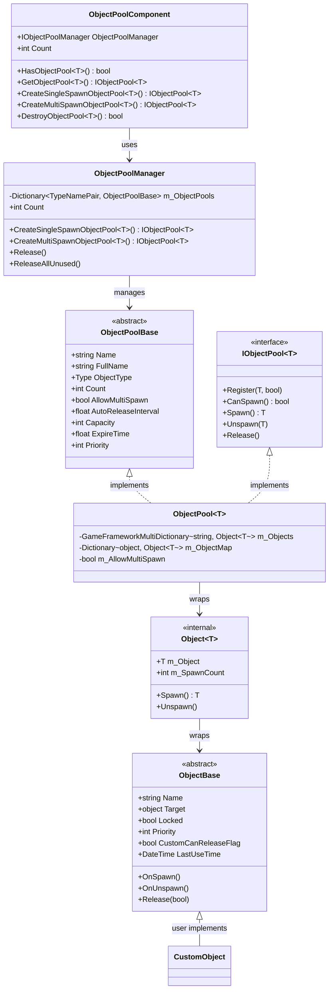
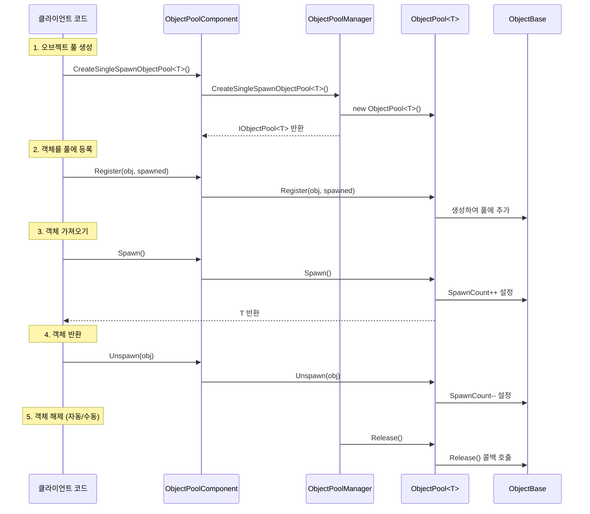

# 오브젝트 풀 시스템

오브젝트 풀 시스템은 GameFrameX 프레임워크의 핵심 모듈 중 하나로, 게임 객체의 재사용을 관리하여频繁한 객체 생성 및 파괴로 인한 성능 오버헤드와 GC 압력을 줄입니다. 이 시스템은 완전한 객체 수명주기 관리를 제공하며, 객체 가져오기, 반환, 자동 해제 등의 기능을 포함합니다.

## 개요

게임 개발에서子弹、特效、UI 요소 등의频繁한 생성 및 파괴는 일반적인 성능 병목 현상입니다. 오브젝트 풀 시스템은 일정 수량의 객체를 사전에 생성하고 재사용하여显著的内存分配开销와 GC触发 빈도를 줄입니다.

GameFrameX 오브젝트 풀 시스템은 다음 핵심 기능을 제공합니다:

- **타입 안전한 제네릭 풀 관리**: 강한 타입의 오브젝트 풀 작업 지원
- **단일/다중 가져오기 모드**: 객체 재사용 전략을 유연하게 제어
- **자동 해제 메커니즘**: 시간 만료 및 용량 임계값 기반 자동 회수
- **우선순위 시스템**: 객체 해제 우선순위를 세밀하게 제어
- **잠금 메커니즘**: 중요한 객체가 의도치 않게 해제되는 것을 보호

## 아키텍처



### 컴포넌트 설명

| 컴포넌트 | 설명 | 계층 |
|------|------|------|
| `ObjectPoolComponent` | Unity 컴포넌트로, GameObject에 부착하여 씬에서 사용 | API 계층 |
| `ObjectPoolManager` | 핵심 관리자로, 모든 오브젝트 풀 관리 | 핵심 계층 |
| `ObjectPoolBase` | 오브젝트 풀 추상 基類 | 추상 계층 |
| `ObjectPool<T>` | 제네릭 오브젝트 풀 구현 | 구현 계층 |
| `ObjectBase` | 풀링 가능한 객체의 추상 基類 | 추상 계층 |
| `Object<T>` | 내부 객체 래퍼 | 내부 구현 |

## 핵심 개념

### 오브젝트 풀 유형

시스템은 두 가지 유형의 오브젝트 풀을 지원합니다:

**1. 단일 가져오기 오브젝트 풀 (Single Spawn)**
-同一 시간에 오직 한 명의 소비자가 객체를 사용 가능
- 독점적 리소스에 적합, 예: 플레이어 캐릭터, 차량 등

```csharp
// 단일 가져오기 오브젝트 풀 생성
IObjectPool<Bullet> bulletPool = objectPoolComponent.CreateSingleSpawnObjectPool<Bullet>("Bullet Pool", 100, 60f, 10);
```

> Source: [Runtime/ObjectPool/ObjectPoolComponent.cs](https://github.com/GameFrameX/com.gameframex.unity/blob/main/Runtime/ObjectPool/ObjectPoolComponent.cs#L257-L260)

**2. 다중 가져오기 오브젝트 풀 (Multi Spawn)**
-同一 시간에 여러 소비자가 동시에 사용 가능
- 재사용 가능한 리소스에 적합, 예: 총알, 이펙트 등

```csharp
// 다중 가져오기 오브젝트 풀 생성
IObjectPool<Effect> effectPool = objectPoolComponent.CreateMultiSpawnObjectPool<Effect>("Effect Pool", 50, 30f, 5);
```

> Source: [Runtime/ObjectPool/ObjectPoolComponent.cs](https://github.com/GameFrameX/com.gameframex.unity/blob/main/Runtime/ObjectPool/ObjectPoolComponent.cs#L655-L658)

### 핵심 매개변수

| 매개변수 | 설명 | 기본값 |
|------|--------|--------|
| `name` | 오브젝트 풀 이름으로, 식별 및 검색에 사용 | 빈 문자열 |
| `capacity` | 오브젝트 풀 용량으로, 최대 객체 수량 | int.MaxValue |
| `expireTime` | 객체 만료 시간 (초)으로, 이 시간 동안 사용되지 않으면 해제될 수 있음 | float.MaxValue (만료 없음) |
| `autoReleaseInterval` | 자동 해제 간격 (초)으로, 매 이 시간마다 만료 객체 해제 시도 | 생성 매개변수에 따름 |
| `priority` | 오브젝트 풀 우선순위로, 해제 순서에 영향 | 0 |

## 사용 흐름



## 풀링 가능 객체 생성

오브젝트 풀 시스템을 사용하려면 `ObjectBase` 클래스를 상속하고 관련 메서드를 구현해야 합니다:

```csharp
using GameFrameX.ObjectPool;
using GameFrameX.Runtime;

public class Bullet : ObjectBase
{
    private BulletController m_Controller;
    
    // 객체 초기화
    public void Initialize(BulletController controller)
    {
        Initialize(null, controller.Target, 0);
        m_Controller = controller;
    }
    
    // 객체가 가져올 때 호출
    protected internal override void OnSpawn()
    {
        base.OnSpawn();
        m_Controller.gameObject.SetActive(true);
    }
    
    // 객체가 반환될 때 호출
    protected internal override void OnUnspawn()
    {
        base.OnUnspawn();
        m_Controller.gameObject.SetActive(false);
    }
    
    // 객체가 해제될 때 호출
    protected internal override void Release(bool isShutdown)
    {
        if (isShutdown || m_Controller == null)
        {
            if (m_Controller != null)
            {
                UnityEngine.Object.Destroy(m_Controller.gameObject);
            }
        }
        m_Controller = null;
    }
}
```

> Source: [Runtime/ObjectPool/ObjectBase.cs](https://github.com/GameFrameX/com.gameframex.unity/blob/main/Runtime/ObjectPool/ObjectBase.cs#L201-L223)

### 확장 메서드

시스템은 사용자 편의를 위한 확장 메서드도 제공합니다:

```csharp
// 확장 메서드 예시 (의사 코드)
public static class ObjectPoolExtensions
{
    public static T Spawn<T>(this IObjectPool<T> pool) where T : ObjectBase
    {
        return pool.Spawn();
    }
    
    public static void Unspawn<T>(this IObjectPool<T> pool, T obj) where T : ObjectBase
    {
        pool.Unspawn(obj);
    }
}
```

## 사용 예시

### 기본 사용

```csharp
using GameFrameX.Runtime;
using GameFrameX.ObjectPool;
using UnityEngine;

// 1. 오브젝트 풀 컴포넌트 가져오기
var objectPoolComponent = UnityEngine.Object.FindObjectOfType<ObjectPoolComponent>();

// 2. 오브젝트 풀 생성 (다중 가져오기 모드, 총알에 적합)
var bulletPool = objectPoolComponent.CreateMultiSpawnObjectPool<Bullet>("Bullet Pool", 100, 60f);

// 3. 객체를 풀에 등록
var bulletObj = new Bullet();
bulletObj.Initialize(bulletController);
bulletPool.Register(bulletObj, false);

// 4. 풀에서 객체 가져오기
var bullet = bulletPool.Spawn();

// 5. 사용完毕后 객체를 풀에 반환
bulletPool.Unspawn(bullet);
```

> Source: [Runtime/ObjectPool/ObjectPoolManager.ObjectPool.cs](https://github.com/GameFrameX/com.gameframex.unity/blob/main/Runtime/ObjectPool/ObjectPoolManager.ObjectPool.cs#L256-L292)

### 고급 사용: 커스텀 해제 전략

```csharp
// 커스텀 해제 필터
IObjectPool<Bullet> bulletPool = objectPoolComponent.GetObjectPool<Bullet>("Bullet Pool");

// 조건에 부합하는 객체 해제
bulletPool.Release(10, (candidateObjects, toReleaseCount, expireTime) =>
{
    // 우선순위가 낮은 객체 먼저 해제
    var releaseList = new List<Bullet>();
    var sorted = candidateObjects.OrderByDescending(b => b.Priority)
                                 .ThenBy(b => b.LastUseTime);
    
    int count = 0;
    foreach (var bullet in sorted)
    {
        if (count >= toReleaseCount) break;
        releaseList.Add(bullet);
        count++;
    }
    return releaseList;
});
```

> Source: [Runtime/ObjectPool/ObjectPoolManager.ObjectPool.cs](https://github.com/GameFrameX/com.gameframex.unity/blob/main/Runtime/ObjectPool/ObjectPoolManager.ObjectPool.cs#L498-L529)

### 고급 사용: 객체 잠금

```csharp
// 객체 잠금으로 자동 해제 방지
bulletPool.SetLocked(bullet, true);

// 객체 잠금 해제로 해제 허용
bulletPool.SetLocked(bullet, false);
```

> Source: [Runtime/ObjectPool/ObjectPoolManager.ObjectPool.cs](https://github.com/GameFrameX/com.gameframex.unity/blob/main/Runtime/ObjectPool/ObjectPoolManager.ObjectPool.cs#L336-L374)

### 고급 사용: 우선순위 설정

```csharp
// 객체 우선순위 설정 (값이 클수록 우선순위가 높고, 늦게 해제됨)
bulletPool.SetPriority(bullet, 100);
```

> Source: [Runtime/ObjectPool/ObjectPoolManager.ObjectPool.cs](https://github.com/GameFrameX/com.gameframex.unity/blob/main/Runtime/ObjectPool/ObjectPoolManager.ObjectPool.cs#L376-L414)

## 구성 옵션

### ObjectPoolComponent 구성

Unity 에디터에서 `ObjectPoolComponent` 컴포넌트는 다음 구성 항목을 제공합니다:

| 구성 항목 | 타입 | 설명 |
|--------|------|------|
| ImplementationComponentType | Type | 오브젝트 풀 관리자 구현 타입 |
| InterfaceComponentType | Type | 오브젝트 풀 관리자 인터페이스 타입 |

> 상세 내용은 ObjectPoolComponent 소스 코드 참조

### 오브젝트 풀 매개변수 구성

| 매개변수 | 타입 | 기본값 | 설명 |
|------|--------|--------|------|
| name | string | "" | 오브젝트 풀 이름 |
| capacity | int | int.MaxValue | 오브젝트 풀 용량 |
| expireTime | float | float.MaxValue | 객체 만료 시간 (초) |
| autoReleaseInterval | float | float.MaxValue | 자동 해제 간격 |
| priority | int | 0 | 오브젝트 풀 우선순위 |

## API 참고

### ObjectPoolComponent

```csharp
// 단일 가져오기 오브젝트 풀 생성
IObjectPool<T> CreateSingleSpawnObjectPool<T>(string name, float autoReleaseInterval, int capacity, float expireTime, int priority)
```

**매개변수:**
- `name` (string): 오브젝트 풀 이름
- `autoReleaseInterval` (float): 자동 해제 간격 초
- `capacity` (int): 오브젝트 풀 용량
- `expireTime` (float): 객체 만료 초
- `priority` (int): 오브젝트 풀 우선순위

```csharp
// 다중 가져오기 오브젝트 풀 생성
IObjectPool<T> CreateMultiSpawnObjectPool<T>(string name, float autoReleaseInterval, int capacity, float expireTime, int priority)
```

> Source: [Runtime/ObjectPool/ObjectPoolComponent.cs](https://github.com/GameFrameX/com.gameframex.unity/blob/main/Runtime/ObjectPool/ObjectPoolComponent.cs#L1026-L1029)

### IObjectPool<T>

```csharp
// 풀에 객체 등록
void Register(T obj, bool spawned)

// 객체 가져올 수 있는지 확인
bool CanSpawn(string name)

// 객체 가져오기
T Spawn(string name)

// 객체 반환
void Unspawn(T obj)

// 객체 해제
void Release()
```

> Source: [Runtime/ObjectPool/IObjectPool.cs](https://github.com/GameFrameX/com.gameframex.unity/blob/main/Runtime/ObjectPool/IObjectPool.cs#L92-L129)

## 관련 링크

- [참조 풀 시스템](./5-runtime.reference-pool) - 또 다른 풀링 메커니즘으로, 참조 타입 객체 관리에 사용
- [태스크 풀 시스템](./5-runtime.task-pool) - 비동기 태스크 풀 관리
- [기초 컴포넌트](./5-runtime.base) - GameFramework 기초 컴포넌트
- [API 참고](./8-api-reference) - 완전한 API 문서