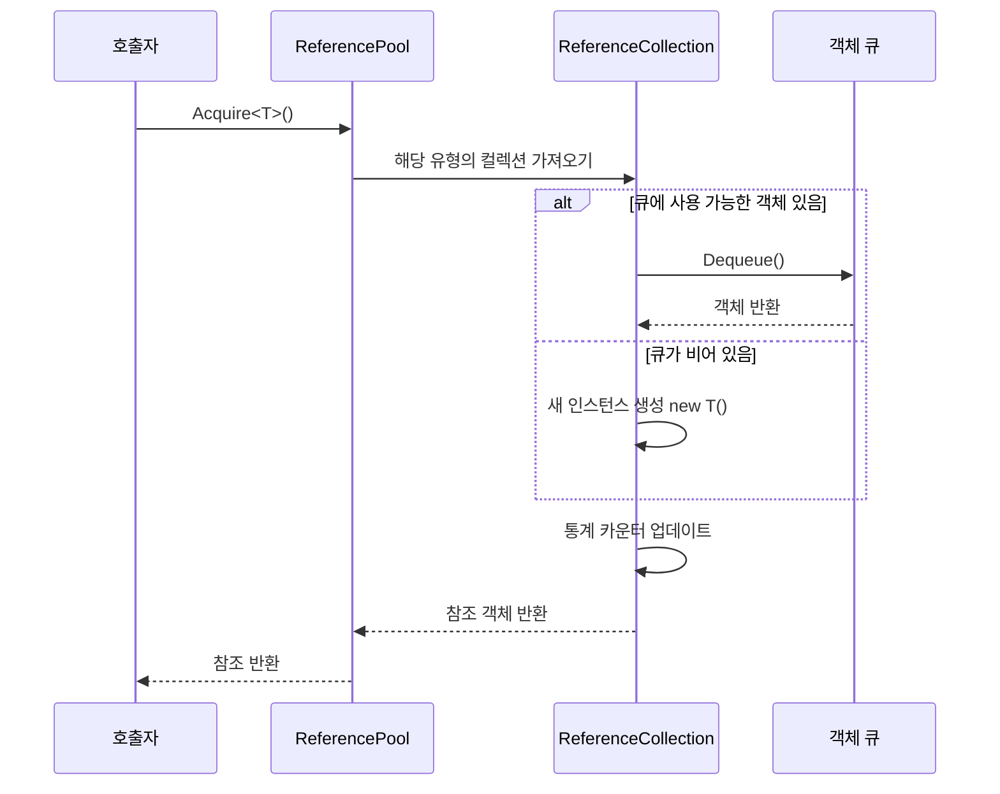
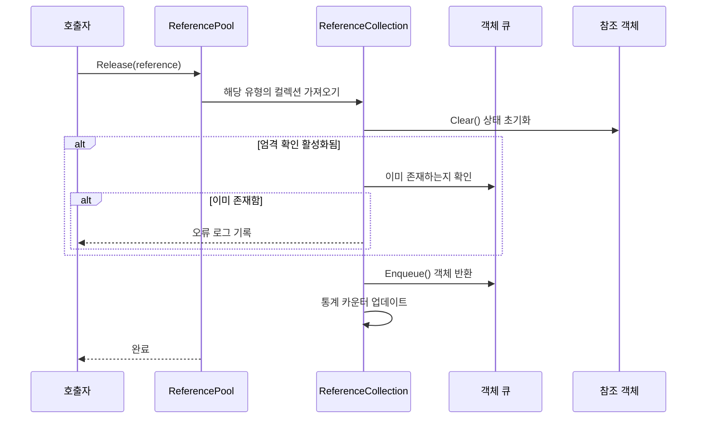

# 참조 풀 시스템

참조 풀 시스템은 GameFrameX 프레임워크의 핵심 컴포넌트 중 하나로, 재사용 가능한 참조 객체를 관리하여 객체 복제를 통해 가비지 컬렉션(GC)으로 인한 성능 오버헤드를 줄입니다.

## 개요

게임 개발에서频繁한 객체 생성 및 파괴는 성능 문제의 주요 원인 중 하나입니다. 특히高频 시나리오 (예: 파티클 시스템, 이벤트 시스템, 네트워크 메시지 처리 등)에서 매초 수천 개의 임시 객체가 생성될 수 있으며, 이는频繁한 가비지 컬렉션을 유발하여 게임이 멈출 수 있습니다.

참조 풀 시스템은 다음 방식으로 이 문제를 해결합니다:

1. **객체 재사용**: 풀에서 객체를 가져와 사용하고, 사용完毕后 풀에 반환하여频繁한 생성 및 파괴 피하기
2. **유형별 관리**: 각 유형의 참조는 독립적인 하위 풀을 가지며, 타입 안전성 보장
3. **상태 초기화**: 반환 시 `Clear()` 메서드를 자동으로 호출하여 객체 상태 초기화
4. **통계 모니터링**: 완전한 가져오기/반환/추가/제거 통계를 제공하여 성능 튜닝 용이

## 아키텍처

```mermaid
graph TD
    subgraph External["외부 호출"]
        Developer["개발자 코드"]
    end

    subgraph API["참조 풀 API"]
        RP["ReferencePool 정적 클래스"]
    end

    subgraph Internal["내부 구현"]
        RC["ReferenceCollection<br/>(유형별 하나)"]
        Queue["Queue~IReference~<br/>(객체 큐)"]
    end

    subgraph Data["데이터 모델"]
        IRef["IReference 인터페이스"]
        Info["ReferencePoolInfo<br/(통계 정보)"]
    end

    subgraph Unity["Unity 통합"]
        RPC["ReferencePoolComponent<br/>(Unity 컴포넌트)"]
        RSCT["ReferenceStrictCheckType<br/(확인 모드 열거형)"]
    end

    Developer --> RP
    RP --> RC
    RC --> Queue
    IRef -.->|"구현|", Queue
    RC --> Info
    RPC -.-> RP
    RP -.-> RSCT
```

### 핵심 컴포넌트

| 컴포넌트 | 타입 | 설명 |
|------|------|------|
| `IReference` | 인터페이스 | 모든 풀링 가능 객체가 구현해야 하는 인터페이스로, `Clear()` 메서드 포함 |
| `ReferencePool` | 정적 클래스 | 참조 풀의 주요 API로, 가져오기/반환/추가/제거 등 작업 제공 |
| `ReferenceCollection` | 내부 클래스 | 특정 유형 참조 객체의 내부 컬렉션 관리 |
| `ReferencePoolInfo` | 구조체 | 참조 풀의 통계 정보 포함 |
| `ReferencePoolComponent` | Unity 컴포넌트 | Unity 통합 컴포넌트로, 참조 풀 구성 및 모니터링에 사용 |

## 작동 원리

### 참조 가져오기 흐름



### 참조 반환 흐름



### 엄격 확인 모드

참조 풀은 `ReferenceStrictCheckType` 열거형을 통해 세 가지 엄격 확인 모드를 지원합니다:

| 모드 | 설명 | 적용 시나리오 |
|------|------|----------|
| `AlwaysEnable` | 항상 엄격 확인 활성화 | 디버깅 단계에서 중복 반환 포착 |
| `OnlyEnableWhenDevelopment` | 개발 빌드에서만 활성화 | 개발 시 디버깅, 제품 환경에서 성능 유지 |
| `OnlyEnableInEditor` | 에디터에서만 활성화 | 순수 에디터 디버깅 |
| `AlwaysDisable` | 항상 엄격 확인 비활성화 | 제품 환경에서 최대 성능 |

엄격 확인은 반환 시 해당 객체가 이미 풀에 있는지 검증하여 중복 반환으로 인한 메모리 문제를 방지합니다.

## 사용 예시

### 기본 사용

먼저 `IReference` 인터페이스를 구현하여 풀링 가능한 참조 클래스를 생성해야 합니다:

```csharp
using GameFrameX.Runtime;

public class MyData : IReference
{
    public string Name;
    public int Value;
    public Dictionary<string, object> ExtraData;

    public void Clear()
    {
        Name = null;
        Value = 0;
        ExtraData?.Clear();
    }
}
```

그런 다음 참조 풀을 사용하여 객체를 가져오고 반환합니다:

```csharp
// 풀에서 참조 가져오기
MyData data = ReferencePool.Acquire<MyData>();
data.Name = "Test";
data.Value = 100;

// 사용完毕后 풀에 반환
ReferencePool.Release(data);
```

### 풀 사전 예열

게임 시작 시 풀을 예열하여 일정 수량의 참조 객체를 사전 생성할 수 있습니다:

```csharp
// 예열: 특정 유형에 대해 100개의 참조 사전 추가
ReferencePool.Add<MyData>(100);
```

### 풀 통계 정보 가져오기

런타임에 참조 풀 상태를 모니터링합니다:

```csharp
// 모든 참조 풀의 통계 정보 가져오기
ReferencePoolInfo[] infos = ReferencePool.GetAllReferencePoolInfos();

foreach (var info in infos)
{
    Debug.Log($"Type: {info.Type.Name}");
    Debug.Log($"미사용: {info.UnusedReferenceCount}");
    Debug.Log($"사용 중: {info.UsingReferenceCount}");
    Debug.Log($"가져오기 횟수: {info.AcquireReferenceCount}");
    Debug.Log($"반환 횟수: {info.ReleaseReferenceCount}");
}
```

### 풀 비우기

적절한 시기에 모든 참조 풀을 비웁니다:

```csharp
// 모든 참조 풀 비우기
ReferencePool.ClearAll();
```

### Unity 컴포넌트를 사용하여 구성

Unity 씬에 참조 풀 컴포넌트를 추가합니다:

```csharp
// Inspector에서 엄격 확인 모드 구성
// ReferencePoolComponent는 자동으로 참조 풀 구성 초기화
```

> Source: [ReferencePoolComponent.cs](https://github.com/GameFrameX/com.gameframex.unity/blob/main/Runtime/ReferencePool/ReferencePoolComponent.cs#L42-L95)

## API 참고

### `ReferencePool`

참조 풀의 주요 정적 클래스로, 모든 풀 작업을 제공합니다.

#### `Acquire<T>() where T : class, IReference, new(): T`

참조 풀에서 지정된 유형의 참조를 가져옵니다.

```csharp
T item = ReferencePool.Acquire<T>();
```
> Source: [ReferencePool.cs](https://github.com/GameFrameX/com.gameframex.unity/blob/main/Runtime/Base/ReferencePool/ReferencePool.cs#L129-L132)

**매개변수:**
- 없음 (제네릭 매개변수 `T`가 참조 유형 지정)

**반환:** 가져온 참조 인스턴스

**설명:** 풀에 사용 가능한 참조가 있으면 꺼내고, 없으면 새 인스턴스 생성

---

#### `Acquire(Type referenceType): IReference`

참조 풀에서 지정된 유형의 참조를 가져옵니다 (Type 매개변수 사용).

```csharp
IReference item = ReferencePool.Acquire(typeof(MyData));
```
> Source: [ReferencePool.cs](https://github.com/GameFrameX/com.gameframex.unity/blob/main/Runtime/Base/ReferencePool/ReferencePool.cs#L143-L147)

**매개변수:**
- `referenceType` (Type): 참조의 유형

**반환:** 가져온 참조 인스턴스

---

#### `Release(IReference reference): void`

참조를 참조 풀에 반환합니다.

```csharp
ReferencePool.Release(myData);
```
> Source: [ReferencePool.cs](https://github.com/GameFrameX/com.gameframex.unity/blob/main/Runtime/Base/ReferencePool/ReferencePool.cs#L157-L167)

**매개변수:**
- `reference` (IReference): 반환할 참조

**예외:**
- `GameFrameworkException`: 참조가 null일 때

---

#### `Add<T>(int count) where T : class, IReference, new(): void`

참조 풀에 지정된 수량의 참조를 추가합니다.

```csharp
// 예열: 100개의 참조 추가
ReferencePool.Add<MyData>(100);
```
> Source: [ReferencePool.cs](https://github.com/GameFrameX/com.gameframex.unity/blob/main/Runtime/Base/ReferencePool/ReferencePool.cs#L178-L181)

**매개변수:**
- `count` (int): 추가할 수량

---

#### `Remove<T>(int count) where T : class, IReference: void`

참조 풀에서 지정된 수량의 미사용 참조를 제거합니다.

```csharp
ReferencePool.Remove<MyData>(10);
```
> Source: [ReferencePool.cs](https://github.com/GameFrameX/com.gameframex.unity/blob/main/Runtime/Base/ReferencePool/ReferencePool.cs#L207-L210)

**매개변수:**
- `count` (int): 제거할 수량

---

#### `RemoveAll<T>() where T : class, IReference: void`

참조 풀에서 지정된 유형의 모든 미사용 참조를 제거합니다.

```csharp
ReferencePool.RemoveAll<MyData>();
```
> Source: [ReferencePool.cs](https://github.com/GameFrameX/com.gameframex.unity/blob/main/Runtime/Base/ReferencePool/ReferencePool.cs#L235-L238)

---

#### `ClearAll(): void`

모든 참조 풀의 모든 참조를 비웁니다.

```csharp
ReferencePool.ClearAll();
```
> Source: [ReferencePool.cs](https://github.com/GameFrameX/com.gameframex.unity/blob/main/Runtime/Base/ReferencePool/ReferencePool.cs#L107-L118)

---

#### `GetAllReferencePoolInfos(): ReferencePoolInfo[]`

모든 참조 풀의 통계 정보를 가져옵니다.

```csharp
ReferencePoolInfo[] infos = ReferencePool.GetAllReferencePoolInfos();
```
> Source: [ReferencePool.cs](https://github.com/GameFrameX/com.gameframex.unity/blob/main/Runtime/Base/ReferencePool/ReferencePool.cs#L82-L98)

**반환:** 모든 참조 풀 정보가 포함된 배열

---

#### `EnableStrictCheck: bool`

엄격 확인 모드를 활성화할지 여부를 가져오거나 설정합니다.

```csharp
// 엄격 확인 활성화
ReferencePool.EnableStrictCheck = true;

// 현재 상태 확인
if (ReferencePool.EnableStrictCheck)
{
    // ...
}
```
> Source: [ReferencePool.cs](https://github.com/GameFrameX/com.gameframex.unity/blob/main/Runtime/Base/ReferencePool/ReferencePool.cs#L56-L60)

---

#### `Count: int`

현재 관리 중인 참조 풀 수량을 가져옵니다.

```csharp
int poolCount = ReferencePool.Count;
```
> Source: [ReferencePool.cs](https://github.com/GameFrameX/com.gameframex.unity/blob/main/Runtime/Base/ReferencePool/ReferencePool.cs#L69-L72)

---

### `IReference`

모든 풀링 가능 객체가 구현해야 하는 인터페이스입니다.

```csharp
public interface IReference
{
    void Clear();
}
```
> Source: [IReference.cs](https://github.com/GameFrameX/com.gameframex.unity/blob/main/Runtime/Base/ReferencePool/IReference.cs#L40-L49)

#### `Clear(): void`

참조를 정리하여 객체 상태를 초기 상태로 재설정합니다. 이 메서드는 객체가 풀에서 꺼낼 때 **호출되지 않으며**, 객체가 풀에 반환될 때 시스템이 자동으로 호출합니다.

```csharp
public class MyData : IReference
{
    public string Name;
    public int Value;

    public void Clear()
    {
        Name = null;
        Value = 0;
    }
}
```

**구현 권장 사항:**
- 모든 쓰기 가능 속성을 기본값으로 재설정
- 내부 참조의 관리되지 않는 리소스가 있으면 해제 또는 비우기 (해당되는 경우)
- 컬렉션 멤버 (예: List, Dictionary) 비우기

---

### `ReferencePoolInfo`

참조 풀 통계 정보를 포함하는 구조체입니다.

> Source: [ReferencePoolInfo.cs](https://github.com/GameFrameX/com.gameframex.unity/blob/main/Runtime/Base/ReferencePool/ReferencePoolInfo.cs#L44-L162)

| 속성 | 타입 | 설명 |
|------|------|------|
| `Type` | Type | 참조 풀이 관리하는 유형 |
| `UnusedReferenceCount` | int | 풀에서 미사용(사용 가능)인 참조 수량 |
| `UsingReferenceCount` | int | 현재 사용 중인 참조 수량 |
| `AcquireReferenceCount` | int | 총 참조 가져오기 횟수 |
| `ReleaseReferenceCount` | int | 총 참조 반환 횟수 |
| `AddReferenceCount` | int | 총 참조 추가 횟수 |
| `RemoveReferenceCount` | int | 총 참조 제거 횟수 |

---

### `ReferenceStrictCheckType`

참조 엄격 확인 모드의 열거형 유형입니다.

> Source: [ReferenceStrictCheckType.cs](https://github.com/GameFrameX/com.gameframex.unity/blob/main/Runtime/ReferencePool/ReferenceStrictCheckType.cs#L40-L61)

| 값 | 설명 |
|------|------|
| `AlwaysEnable` | 항상 엄격 확인 활성화 |
| `OnlyEnableWhenDevelopment` | 개발 빌드에서만 활성화 |
| `OnlyEnableInEditor` | 에디터에서만 활성화 |
| `AlwaysDisable` | 항상 엄격 확인 비활성화 |

## 성능 최적화 권장 사항

### 1. 풀 예열

게임 시작 또는 씬 전환 시 풀을 예열합니다:

```csharp
void WarmUpPools()
{
    // 예상 사용량에 따라 예열
    ReferencePool.Add<MyData>(50);
    ReferencePool.Add<AnotherData>(30);
}
```

### 2. Clear 메서드 효율적으로 구현

`Clear()` 메서드가 효율적으로 실행되도록 보장합니다:

```csharp
// ✅ 권장: 직접 할당而非 새 인스턴스 생성
public void Clear()
{
    Name = null;
    Value = 0;
    ExtraData.Clear(); // 비우기而非 새 객체 생성
}

// ❌ 피하기: 새 인스턴스 생성
public void Clear()
{
    ExtraData = new Dictionary<string, object>(); // 매번 새 객체 생성
}
```

### 3. 제품 환경에서 엄격 확인 비활성화

제품 버전에서 엄격 확인을 비활성화하여 최적의 성능을 얻습니다:

```csharp
// Release 빌드에서 설정
ReferencePool.EnableStrictCheck = false;

// 또는 컴포넌트로 구성
// ReferencePoolComponent의 Strict Check Type을 AlwaysDisable으로 설정
```

### 4. 풀 상태 모니터링

주기적으로 풀 상태를 확인하여 잠재적인 메모리 문제를 식별합니다:

```csharp
void LogPoolStats()
{
    foreach (var info in ReferencePool.GetAllReferencePoolInfos())
    {
        // 누수 여부 확인 (사용 중 다수 그러나 미사용极少)
        if (info.UsingReferenceCount > 100 && info.UnusedReferenceCount < 5)
        {
            Debug.LogWarning($"Potential leak: {info.Type.Name}");
        }
    }
}
```

## 자주 묻는 질문

### Q: 참조 풀과 오브젝트 풀의 차이는?

참조 풀은 `IReference` 인터페이스를 구현하는 객체에 특화되어 있으며, 가벼운 재사용을 강조합니다. 오브젝트 풀 (Object Pool)은 더 넓은 개념으로, 재사용 가능한 모든 객체에 사용할 수 있습니다. GameFrameX는 참조 풀과 오브젝트 풀 시스템을 모두 제공하며, 자세한 내용은 [오브젝트 풀 시스템](./5-runtime.object-pool)을 참조하세요.

### Q: Clear 메서드가 가져올 때 호출되지 않는 이유는?

설계 결정 사항: 가져올 때 객체의 가장 최근 사용 데이터를 유지하면 캐시 적중률을 높일 수 있습니다. 깨끗한 객체가 필요한 경우 `Clear()`를 수동으로 호출하거나 `ReferencePool.Release()` 후 새 객체를 가져올 수 있습니다.

### Q: 참조 풀의 메모리 점유를 어떻게 처리하나요?

- `Remove()` 메서드를 사용하여 여분의 유휴 참조 제거
- 적절한 시나리오에서 `ClearAll()`를 사용하여 모든 풀 비우기
- `UnusedReferenceCount`를 모니터링하여过多한 유휴 객체 피하기

---

## 관련 링크

- [오브젝트 풀 시스템](./5-runtime.object-pool) - 또 다른 객체 재사용 메커니즘
- [태스크 풀 시스템](./5-runtime.task-pool) - 비동기 태스크 관리
- [API 참고](./8-api-reference) - 완전한 API 문서