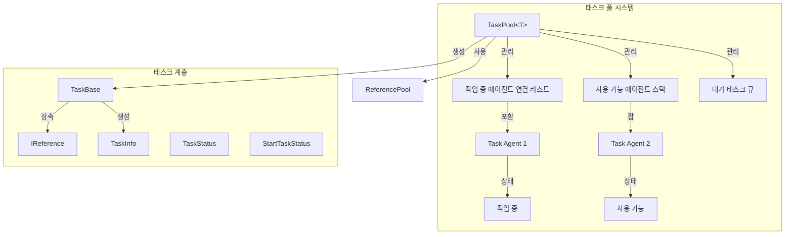
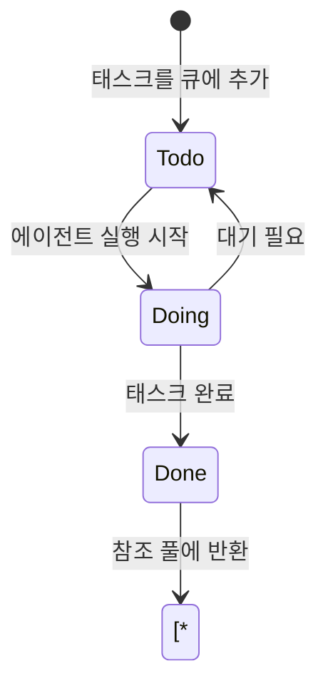
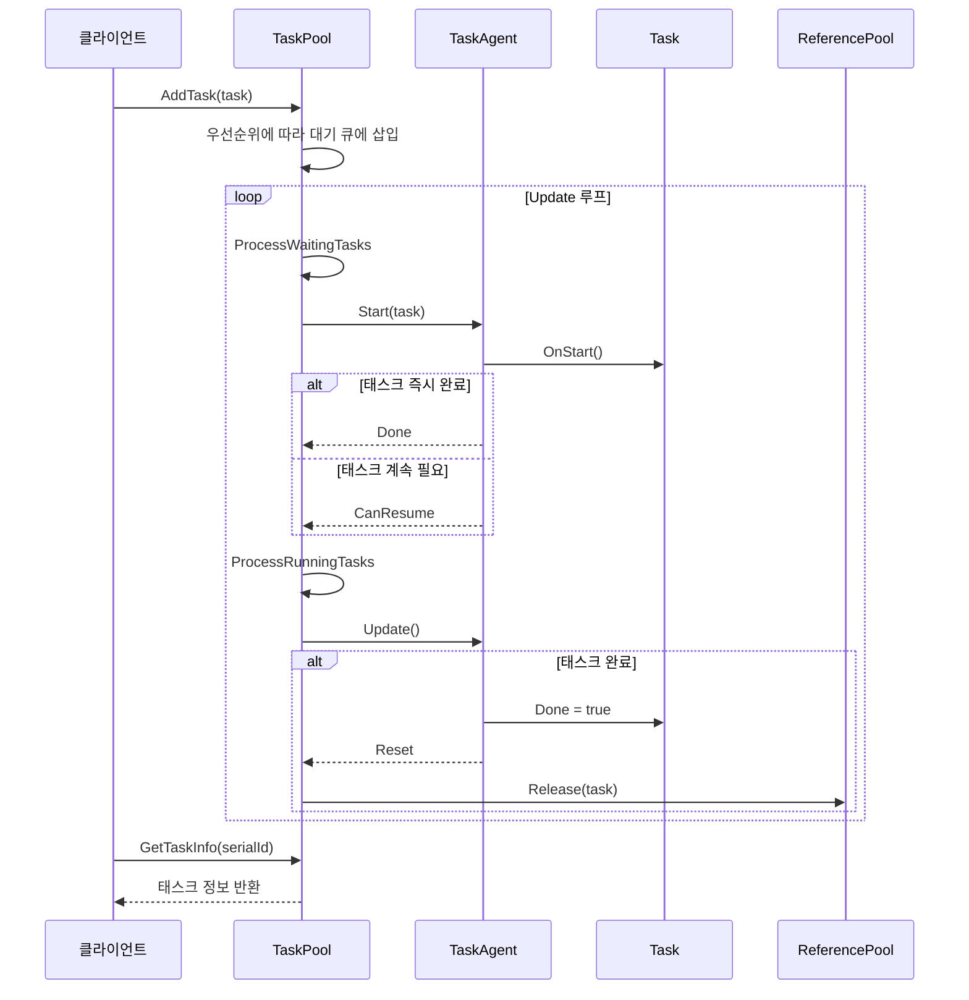

# 태스크 풀 시스템

태스크 풀 시스템은 GameFrameX 프레임워크의 핵심 모듈 중 하나로, 범용적인 태스크 관리 및 스케줄링 기능을 제공합니다. 태스크 풀을 통해 개발자는 시간 소요 작업을 태스크로 캡슐화하고, 다중 태스크 에이전트를 활용하여 병렬 처리하여 게임 성능 표현을 높일 수 있습니다.

## 개요

태스크 풀 시스템은 **에이전트-태스크** 패턴 설계를 채택하며, 다음 핵심 개념을 포함합니다:

- **태스크 에이전트 (Task Agent)**: 실제로 작업을 실행하는 worker로, 각 에이전트는 한 번에 하나의 태스크만 처리 가능
- **태스크 (Task)**: 구체적인 비즈니스 로직을 캡슐화한 실행 단위
- **태스크 풀 (Task Pool)**: 태스크 큐 및 태스크 에이전트 컨테이너를 관리하는 핵심 클래스

이 시스템은 다음을 지원합니다:
- 태스크 우선순위 스케줄링 (높은 우선순위 태스크 먼저 처리)
- 태스크 상태 조회 (대기 중, 실행 중, 완료됨)
- 태스크 태그 관리 (태그별로 태스크 查询 및 제거)
- 일시정지/재개 태스크 풀
- 참조 풀 통합으로 객체 재사용

## 아키텍처



### 핵심 컴포넌트 설명

| 컴포넌트 | 타입 | 책임 |
|------|------|------|
| `TaskPool<T>` | 클래스 | 태스크 풀 핵심으로, 태스크 에이전트 및 태스크 큐 관리 |
| `TaskBase` | 추상 클래스 | 태스크 基類로, 태스크 공통 속성 정의 |
| `ITaskAgent<T>` | 인터페이스 | 태스크 에이전트 인터페이스로, 태스크 실행 메서드 정의 |
| `TaskInfo` | 구조체 | 태스크 정보 컨테이너 |
| `TaskStatus` | 열거형 | 태스크 상태 (대기 중, 실행 중, 완료됨) |
| `StartTaskStatus` | 열거형 | 태스크 시작 결과 |

## 핵심 개념

### 태스크 상태 흐름



### 태스크 우선순위

태스크 풀은 **우선순위 큐**를 사용하여 태스크를 스케줄링합니다:
- 값이 클수록 우선순위가 높음
- 높은 우선순위 태스크가 낮은 우선순위 태스크 앞으로 삽입됨
- 기본 우선순위는 0

### 참조 풀 통합

태스크 완료 후 자동으로 참조 풀에 반환되어 객체 재사용을 구현합니다:
- 태스크 객체가 `IReference` 인터페이스를 구현
- 완료 시 `ReferencePool.Release(task)` 호출하여 반환

## 사용 예시

### 1. 커스텀 태스크 정의

```csharp
using GameFrameX.Runtime;

// TaskBase를 상속하여 커스텀 태스크 구현
public class DownloadTask : TaskBase
{
    private string m_Url;
    private string m_SavePath;
    
    public void Initialize(int serialId, string tag, int priority, string url, string savePath)
    {
        base.Initialize(serialId, tag, priority, null);
        m_Url = url;
        m_SavePath = savePath;
    }
    
    public override string Description
    {
        get { return $"파일 다운로드: {m_Url}"; }
    }
    
    protected internal override void OnStart()
    {
        base.OnStart();
        // 다운로드 로직 시작
    }
    
    protected internal override void OnUpdate(float elapseSeconds, float realElapseSeconds)
    {
        base.OnUpdate(elapseSeconds, realElapseSeconds);
        // 다운로드 진행 상황 업데이트
        // 완료 시 Done = true 설정
    }
    
    public override void Clear()
    {
        base.Clear();
        m_Url = null;
        m_SavePath = null;
    }
}
```
> Source: [TaskBase.cs](https://github.com/GameFrameX/com.gameframex.unity/blob/main/Runtime/Base/TaskPool/TaskBase.cs#L40-L182)

### 2. 태스크 에이전트 구현

```csharp
using GameFrameX.Runtime;

public class DownloadTaskAgent : ITaskAgent<DownloadTask>
{
    public DownloadTask Task { get; private set; }
    
    public void Initialize()
    {
        // 에이전트 리소스 초기화
    }
    
    public void Update(float elapseSeconds, float realElapseSeconds)
    {
        if (Task == null || Task.Done)
        {
            return;
        }
        
        // 태스크 로직 실행
    }
    
    public StartTaskStatus Start(DownloadTask task)
    {
        Task = task;
        task.OnStart();
        
        if (task.Done)
        {
            return StartTaskStatus.Done;
        }
        
        return StartTaskStatus.CanResume;
    }
    
    public void Reset()
    {
        if (Task != null)
        {
            Task.OnRelease();
            Task = null;
        }
    }
    
    public void Shutdown()
    {
        // 에이전트 리소스 해제
    }
}
```
> Source: [ITaskAgent.cs](https://github.com/GameFrameX/com.gameframex.unity/blob/main/Runtime/Base/TaskPool/ITaskAgent.cs#L41-L94)

### 3. 태스크 풀 사용

```csharp
// 태스크 풀 인스턴스 생성
var taskPool = new TaskPool<DownloadTask>();

// 태스크 에이전트 추가 (병렬 처리를 위해 여러 개 추가 가능)
taskPool.AddAgent(new DownloadTaskAgent());
taskPool.AddAgent(new DownloadTaskAgent());
taskPool.AddAgent(new DownloadTaskAgent());

// 태스크 생성 및 추가
var task = ReferencePool.Acquire<DownloadTask>();
task.Initialize(1, "다운로드", 10, "http://example.com/file.png", "Assets/file.png");
taskPool.AddTask(task);

// Update에서 호출
void Update()
{
    taskPool.Update(Time.deltaTime, Time.unscaledDeltaTime);
}

// 태스크 정보 조회
TaskInfo[] allTasks = taskPool.GetAllTaskInfos();
TaskInfo[] downloadTasks = taskPool.GetTaskInfos("다운로드");
TaskInfo singleTask = taskPool.GetTaskInfo(1);

// 일시정지/재개
taskPool.Paused = true;  // 일시정지
taskPool.Paused = false; // 재개

// 태스크 제거
taskPool.RemoveTask(1);           // 지정된 일련번호 태스크 제거
taskPool.RemoveTasks("다운로드");     // 지정된 태그의 모든 태스크 제거
taskPool.RemoveAllTasks();       // 모든 태스크 제거

// 태스크 풀 닫기
taskPool.Shutdown();
```
> Source: [TaskPool.cs](https://github.com/GameFrameX/com.gameframex.unity/blob/main/Runtime/Base/TaskPool/TaskPool.cs#L44-L525)

## 핵심 흐름

### 태스크 처리 흐름



## API 참고

### `TaskPool<T>`

태스크 풀 제네릭 클래스입니다.

```csharp
public sealed class TaskPool<T> where T : TaskBase
```
> Source: [TaskPool.cs](https://github.com/GameFrameX/com.gameframex.unity/blob/main/Runtime/Base/TaskPool/TaskPool.cs#L44-L525)

#### 속성

| 속성 | 타입 | 설명 |
|------|------|------|
| `Paused` | `bool` | 태스크 풀 일시정지 여부 가져오기 또는 설정 |
| `TotalAgentCount` | `int` | 태스크 에이전트 총 수량 |
| `FreeAgentCount` | `int` | 사용 가능 태스크 에이전트 수량 |
| `WorkingAgentCount` | `int` | 작업 중 태스크 에이전트 수량 |
| `WaitingTaskCount` | `int` | 대기 태스크 수량 |

#### 메서드

##### `AddAgent(agent)`

태스크 에이전트를 추가합니다.

```csharp
public void AddAgent(ITaskAgent<T> agent)
```

**매개변수:**
- `agent` (`ITaskAgent<T>`): 추가할 태스크 에이전트

> Source: [TaskPool.cs#L172-L181](https://github.com/GameFrameX/com.gameframex.unity/blob/main/Runtime/Base/TaskPool/TaskPool.cs#L172-L181)

##### `AddTask(task)`

태스크를 대기 큐에 추가합니다.

```csharp
public void AddTask(T task)
```

**매개변수:**
- `task` (T): 추가할 태스크

> Source: [TaskPool.cs#L326-L348](https://github.com/GameFrameX/com.gameframex.unity/blob/main/Runtime/Base/TaskPool/TaskPool.cs#L326-L348)

##### `Update(elapseSeconds, realElapseSeconds)`

태스크 풀 폴링 처리.

```csharp
public void Update(float elapseSeconds, float realElapseSeconds)
```

**매개변수:**
- `elapseSeconds` (float): 로직 경과 시간
- `realElapseSeconds` (float): 실제 경과 시간

> Source: [TaskPool.cs#L136-L145](https://github.com/GameFrameX/com.gameframex.unity/blob/main/Runtime/Base/TaskPool/TaskPool.cs#L136-L145)

##### `GetTaskInfo(serialId)`

일련 번호로 태스크 정보를 가져옵니다.

```csharp
public TaskInfo GetTaskInfo(int serialId)
```

**매개변수:**
- `serialId` (int): 태스크의 일련 번호

**반환:** TaskInfo - 태스크 정보 구조체

> Source: [TaskPool.cs#L191-L212](https://github.com/GameFrameX/com.gameframex.unity/blob/main/Runtime/Base/TaskPool/TaskPool.cs#L191-L212)

##### `GetTaskInfos(tag)`

태그로 태스크 정보 배열을 가져옵니다.

```csharp
public TaskInfo[] GetTaskInfos(string tag)
```

**매개변수:**
- `tag` (string): 태스크 태그

**반환:** TaskInfo[] - 태스크 정보 배열

> Source: [TaskPool.cs#L222-L228](https://github.com/GameFrameX/com.gameframex.unity/blob/main/Runtime/Base/TaskPool/TaskPool.cs#L222-L228)

##### `GetAllTaskInfos()`

모든 태스크 정보를 가져옵니다.

```csharp
public TaskInfo[] GetAllTaskInfos()
```

**반환:** TaskInfo[] - 모든 태스크 정보 배열

> Source: [TaskPool.cs#L272-L289](https://github.com/GameFrameX/com.gameframex.unity/blob/main/Runtime/Base/TaskPool/TaskPool.cs#L272-L289)

##### `RemoveTask(serialId)`

지정된 일련 번호의 태스크를 제거합니다.

```csharp
public bool RemoveTask(int serialId)
```

**매개변수:**
- `serialId` (int): 태스크의 일련 번호

**반환:** bool - 제거 성공 여부

> Source: [TaskPool.cs#L358-L390](https://github.com/GameFrameX/com.gameframex.unity/blob/main/Runtime/Base/TaskPool/TaskPool.cs#L358-L390)

##### `RemoveTasks(tag)`

지정된 태그의 모든 태스크를 제거합니다.

```csharp
public int RemoveTasks(string tag)
```

**매개변수:**
- `tag` (string): 태스크 태그

**반환:** int - 제거된 태스크 수량

> Source: [TaskPool.cs#L400-L439](https://github.com/GameFrameX/com.gameframex.unity/blob/main/Runtime/Base/TaskPool/TaskPool.cs#L400-L439)

##### `RemoveAllTasks()`

모든 태스크를 제거합니다.

```csharp
public int RemoveAllTasks()
```

**반환:** int - 제거된 태스크 수량

> Source: [TaskPool.cs#L448-L471](https://github.com/GameFrameX/com.gameframex.unity/blob/main/Runtime/Base/TaskPool/TaskPool.cs#L448-L471)

##### `Shutdown()`

태스크 풀을 닫고 정리합니다.

```csharp
public void Shutdown()
```

> Source: [TaskPool.cs#L154-L162](https://github.com/GameFrameX/com.gameframex.unity/blob/main/Runtime/Base/TaskPool/TaskPool.cs#L154-L162)

---

### TaskBase

태스크 基類입니다.

```csharp
public abstract class TaskBase : IReference
```
> Source: [TaskBase.cs](https://github.com/GameFrameX/com.gameframex.unity/blob/main/Runtime/Base/TaskPool/TaskBase.cs#L40-L182)

#### 속성

| 속성 | 타입 | 설명 |
|------|------|------|
| `SerialId` | `int` | 태스크의 일련 번호 |
| `Tag` | `string` | 태스크의 태그 |
| `Priority` | `int` | 태스크의 우선순위 |
| `UserData` | `object` | 태스크의 사용자 정의 데이터 |
| `Done` | `bool` | 태스크 완료 여부 가져오기 또는 설정 |
| `Description` | `string` | 태스크 설명 (가상 속성) |

#### 상수

| 상수 | 값 | 설명 |
|------|-----|------|
| `DefaultPriority` | 0 | 태스크 기본 우선순위 |

---

### TaskStatus

태스크 상태 열거형입니다.

```csharp
public enum TaskStatus : byte
```
> Source: [TaskStatus.cs](https://github.com/GameFrameX/com.gameframex.unity/blob/main/Runtime/Base/TaskPool/TaskStatus.cs#L41-L66)

| 멤버 | 값 | 설명 |
|------|-----|------|
| `Todo` | 0 | 미시작 |
| `Doing` | 1 | 실행 중 |
| `Done` | 2 | 완료됨 |

---

### StartTaskStatus

태스크 시작 상태 열거형입니다.

```csharp
public enum StartTaskStatus : byte
```
> Source: [StartTaskStatus.cs](https://github.com/GameFrameX/com.gameframex.unity/blob/main/Runtime/Base/TaskPool/StartTaskStatus.cs#L41-L74)

| 멤버 | 값 | 설명 |
|------|-----|------|
| `Done` | 0 | 태스크 즉시 완료 가능 |
| `CanResume` | 1 | 태스크 계속 처리 가능 |
| `HasToWait` | 2 | 다른 태스크 대기 필요 |
| `UnknownError` | 3 | 알 수 없는 오류 |

---

### TaskInfo

태스크 정보 구조체입니다.

```csharp
public struct TaskInfo
```
> Source: [TaskInfo.cs](https://github.com/GameFrameX/com.gameframex.unity/blob/main/Runtime/Base/TaskPool/TaskInfo.cs#L44-L209)

#### 속성

| 속성 | 타입 | 설명 |
|------|------|------|
| `IsValid` | `bool` | 태스크 정보가 유효한지 여부 |
| `SerialId` | `int` | 태스크 일련 번호 |
| `Tag` | `string` | 태스크 태그 |
| `Priority` | `int` | 태스크 우선순위 |
| `UserData` | `object` | 사용자 데이터 |
| `Status` | `TaskStatus` | 태스크 상태 |
| `Description` | `string` | 태스크 설명 |

---

### `ITaskAgent<T>`

태스크 에이전트 인터페이스입니다.

```csharp
public interface ITaskAgent<T> where T : TaskBase
```
> Source: [ITaskAgent.cs](https://github.com/GameFrameX/com.gameframex.unity/blob/main/Runtime/Base/TaskPool/ITaskAgent.cs#L41-L94)

#### 속성

| 속성 | 타입 | 설명 |
|------|------|------|
| `Task` | `T` | 현재 태스크 |

#### 메서드

##### `Initialize()`

태스크 에이전트를 초기화합니다.

```csharp
void Initialize()
```

##### `Update(elapseSeconds, realElapseSeconds)`

태스크 에이전트 폴링.

```csharp
void Update(float elapseSeconds, float realElapseSeconds)
```

##### `Start(task)`

태스크 처리를 시작합니다.

```csharp
StartTaskStatus Start(T task)
```

##### `Reset()`

태스크 에이전트를 초기화합니다.

```csharp
void Reset()
```

##### `Shutdown()`

태스크 에이전트를 닫습니다.

```csharp
void Shutdown()
```

## 모범 사례

### 1. 태스크 에이전트 풀링

태스크 유형과 부하에 따라 적절한 수량의 에이전트를 생성합니다:

```csharp
// CPU 집약적 태스크는 에이전트 수 = CPU 코어 수 권장
// IO 집약적 태스크는 더 많은 에이전트 생성 가능
int agentCount = SystemInfo.processorCount;
for (int i = 0; i < agentCount; i++)
{
    taskPool.AddAgent(new DownloadTaskAgent());
}
```

### 2. 태스크 우선순위 전략

- 중요 태스크 (UI 피드백, 네트워크 콜백): 높은 우선순위 (100)
- 일반 태스크 (리소스 로딩): 중간 우선순위 (50)
- 백그라운드 태스크 (로그 보고): 낮은 우선순위 (0)

### 3. 태스크 수명주기 관리

- `Clear()` 메서드에서 모든 참조 정리
- 태스크에서 과도한 객체 보유 피하기
- 필요하지 않은 태스크는 즉시 제거하여 메모리 해제

## 관련 링크

- [오브젝트 풀 시스템](./5-runtime.object-pool) - 객체 재사용 메커니즘
- [참조 풀 시스템](./5-runtime.reference-pool) - 참조 객체 관리
- [이벤트 시스템](./5-runtime.event-system) - 프레임워크 이벤트 메커니즘
- [기초 컴포넌트](./5-runtime.base) - 프레임워크 기초 컴포넌트
- [API 참고](./8-api-reference) - 완전한 API 문서