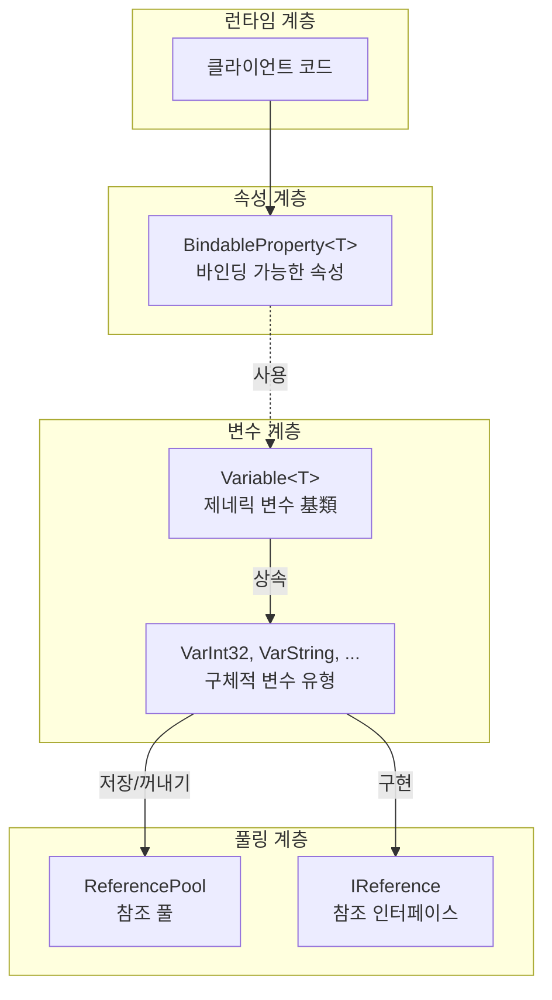
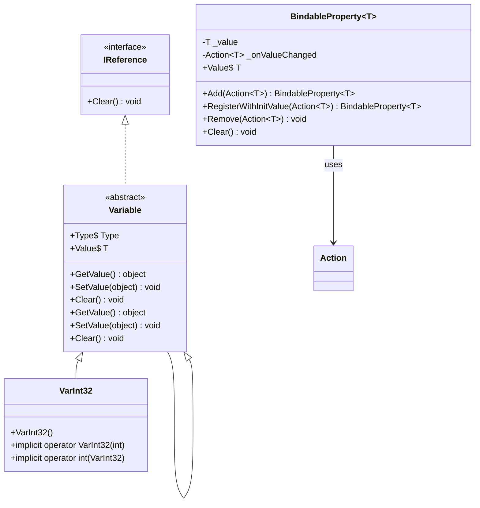
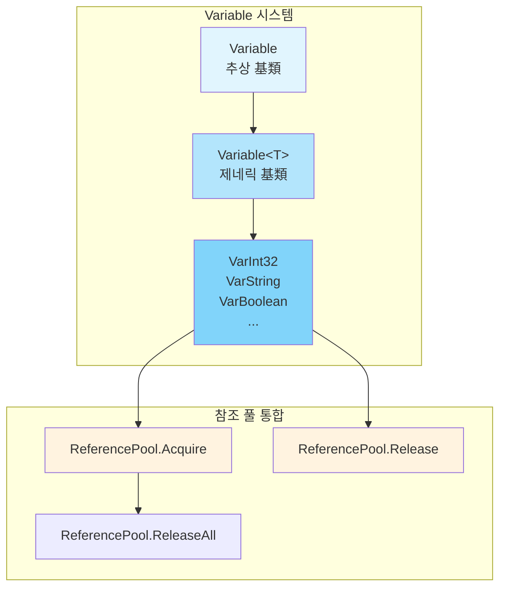

# 속성 시스템

GameFrameX 속성 시스템은 완전한 속성 및 변수 관리 메커니즘을 제공하며, 바인딩 가능한 속성(BindableProperty)과 타입화된 변수(Variable) 두 가지 핵심 컴포넌트로 구성됩니다. 이 시스템은 속성 값 변경 감시, 참조 풀 관리 및 제네릭 타입 안전 작업을 지원합니다.

## 개요

속성 시스템은 GameFrameX 프레임워크의 기초 컴포넌트 중 하나로, 주로 다음 두 부분으로 구성됩니다:

1. **BindableProperty<T>** - 바인딩 가능한 속성으로, 속성 값 변경 알림 메커니즘을 제공하며, 옵저버 패턴에 기반합니다
2. **Variable** 시스템 - 타입화된 변수 컨테이너로, 참조 풀을 통합하여 효율적인 메모리 관리を実現합니다

이 시스템은 다음 시나리오에 적합합니다:
- 속성 값 변경을 감시해야 하는 UI 바인딩
- 임시 변수를 효율적으로 관리해야 하는 게임 로직
- 타입 안전한 데이터 전달이 필요한 상황
- 가비지 컬렉션 압력을 줄여야 하는高性能 시나리오

## Architecture

속성 시스템의 아키텍처 설계는 모듈식 원칙을 따르며, 주요 계층은 다음과 같습니다:



### 핵심 컴포넌트 관계



## BindableProperty 바인딩 가능한 속성

`BindableProperty<T>`는 속성 시스템의 핵심 컴포넌트로, 속성 값 변경 알림 기능을 제공합니다. 옵저버 패턴에 기반하여 설계되었으며, 속성 값이 변경되면 자동으로 등록된 콜백을 트리거합니다.

### 핵심 기능

- **제네릭 지원** - 임의의 타입 T 지원
- **값 변경 감시** - Action<T> 콜백 메커니즘을 통해 변경 알림
- **메서드 체인 호출** - Fluent API 스타일의 등록 방식 지원
- **자동 비교** - 불필요한 업데이트를 피하기 위해 `Equals` 메서드 사용

### 사용 예시

#### 기본 사용

바인딩 가능한 속성을 생성하고 값 변경을 감시합니다:

```csharp
using GameFrameX.Runtime;

// 바인딩 가능한 속성 생성, 기본값 0
var health = new BindableProperty<int>(100);

// 값 변경 감시 등록
health.Add(newValue => 
{
    Debug.Log($"생명값이 변경됨: {newValue}");
});

// 값 수정 시 콜백 트리거
health.Value = 90; // 출력: "생명값이 변경됨: 90"
health.Value = 80; // 출력: "생명값이 변경됨: 80"

// 같은 값은 콜백 트리거하지 않음
health.Value = 80; // 콜백 트리거하지 않음
```
> Source: [BindableProperty.cs](https://github.com/GameFrameX/com.gameframex.unity/blob/main/Runtime/Property/BindableProperty.cs#L1-L90)

#### 등록 시 즉시 콜백 실행

`RegisterWithInitValue`를 사용하여 등록 시 즉시 콜백을 실행하며, 초기화 시나리오에 적합합니다:

```csharp
var score = new BindableProperty<int>(0);

// 등록 및 현재 값 즉시 가져오기
score.RegisterWithInitValue(currentScore =>
{
    Debug.Log($"현재 점수: {currentScore}");
});
// 출력: "현재 점수: 0"
```
> Source: [BindableProperty.cs](https://github.com/GameFrameX/com.gameframex.unity/blob/main/Runtime/Property/BindableProperty.cs#L63-L68)

#### 감시 제거

```csharp
var health = new BindableProperty<int>(100);

Action<int> listener = newValue => Debug.Log($"변화: {newValue}");
health.Add(listener);

// 특정 감시자 제거
health.Remove(listener);

// 모든 감시자 지우기
health.Clear();
```
> Source: [BindableProperty.cs](https://github.com/GameFrameX/com.gameframex.unity/blob/main/Runtime/Property/BindableProperty.cs#L70-L88)

### 실제 적용 시나리오

#### MVVM 패턴에서의 데이터 바인딩

```csharp
public class PlayerModel
{
    // 데이터 바인딩용 바인딩 가능한 속성
    public BindableProperty<int> Health { get; } = new BindableProperty<int>(100);
    public BindableProperty<int> Gold { get; } = new BindableProperty<int>(0);
    public BindableProperty<string> Name { get; } = new BindableProperty<string>("");
}

public class PlayerView
{
    private PlayerModel _model;
    
    public void Bind(PlayerModel model)
    {
        _model = model;
        
        // 생명값 변경 감시 등록
        _model.Health.Add(OnHealthChanged);
        
        // 골드 변경 감시 등록
        _model.Gold.Add(OnGoldChanged);
    }
    
    private void OnHealthChanged(int health)
    {
        Debug.Log($"UI 업데이트: 생명값 = {health}");
    }
    
    private void OnGoldChanged(int gold)
    {
        Debug.Log($"UI 업데이트: 골드 = {gold}");
    }
}
```

#### 상태 머신에서의 상태 변경 감시

```csharp
public class GameState
{
    public BindableProperty<GameStateType> CurrentState { get; } 
        = new BindableProperty<GameStateType>(GameStateType.Init);
    
    public void ChangeState(GameStateType newState)
    {
        CurrentState.Value = newState;
    }
}

// 상태 감시
gameState.CurrentState.Add(state => 
{
    switch (state)
    {
        case GameStateType.Playing:
            StartGame();
            break;
        case GameStateType.Paused:
            PauseGame();
            break;
    }
});
```

## Variable 변수 시스템

Variable 시스템은 타입 안전 변수 캡슐화를 제공하며, 참조 풀과 통합하여 효율적인 메모리 관리를 실현합니다. 각 Variable 유형은 `IReference` 인터페이스를 구현하여 참조 풀的统一 관리 가능합니다.

### 아키텍처 설계



### 내장 변수 유형

GameFrameX는 30+ 가지 사전 정의된 Variable 유형을 제공합니다:

| 분류 | 유형 |
|------|------|
| 기본 수치 | VarInt16, VarInt32, VarInt64, VarUInt16, VarUInt32, VarUInt64 |
| 부동 소수점 | VarSingle, VarDouble, VarDecimal |
| 기타 수치 | VarByte, VarSByte, VarChar |
| 문자열 | VarString |
| 부울 값 | VarBoolean |
| 날짜 시간 | VarDateTime |
| Unity 기초 | VarVector2, VarVector3, VarVector4, VarQuaternion, VarRect |
| Unity 객체 | VarColor, VarColor32, VarGameObject, VarMaterial, VarTexture, VarTransform, VarUnityObject |
| 배열 | VarByteArray, VarCharArray |
| 객체 | VarObject |

### 사용 예시

#### 기본 사용

```csharp
using GameFrameX.Runtime;

// 변수 생성
VarInt32 score = ReferencePool.Acquire<VarInt32>();
score.Value = 100;

// 암시적 변환 사용
int value = score; // 값 가져오기
score = 200;      // 값 설정

// 사용完毕后 참조 풀에 반환
ReferencePool.Release(score);
```
> Source: [VarInt32.cs](parameterNameValuePairs=)

#### 암시적 변환

Variable 유형은 C# 암시적 변환을 지원하여 코드를 더 간결하게 합니다:

```csharp
using GameFrameX.Runtime;

// 원시 유형에서 Variable 생성
VarString playerName = ReferencePool.Acquire<VarString>();
playerName.Value = "Player1";

// 암시적 변환 - 값 가져오기
string name = playerName; // name = "Player1"

// 암시적 변환 - 값 설정
playerName = "Player2";   // playerName.Value = "Player2"

// 사용完后 반환
ReferencePool.Release(playerName);
```
> Source: [VarString.cs](https://github.com/GameFrameX/com.gameframex.unity/blob/main/Runtime/Variable/VarString.cs#L42-L84)

#### 참조 풀 통합

Variable 시스템은 참조 풀과 깊이 통합되어 효율적인 메모리 관리를 제공합니다:

```csharp
// 참조 풀에서 가져오기
VarInt32 counter = ReferencePool.Acquire<VarInt32>();
counter.Value = 0;

// 사용
counter.Value++;

// 참조 풀에 반환
ReferencePool.Release(counter);

// Variable은 자동으로 Clear 메서드를 호출하여 상태 초기화
// 다시 가져올 때는 깨끗한 객체
VarInt32 counter2 = ReferencePool.Acquire<VarInt32>();
// counter2.Value는 0으로 재설정됨
```
> Source: [GenericVariable.cs](https://github.com/GameFrameX/com.gameframex.unity/blob/main/Runtime/Base/Variable/GenericVariable.cs#L106-L127)

### 변수 基類 구현

Variable 클래스의 핵심 구현:

```csharp
public abstract class Variable<T> : Variable
{
    private T m_Value;
    
    // 타입 안전한 값 접근
    public T Value
    {
        get { return m_Value; }
        set { m_Value = value; }
    }
    
    // 基類 추상 메서드 구현
    public override object GetValue()
    {
        return m_Value;
    }
    
    public override void SetValue(object value)
    {
        m_Value = (T)value;
    }
    
    // 비우기로, 참조 풀 반환에 사용
    public override void Clear()
    {
        m_Value = default(T);
    }
}
```
> Source: [GenericVariable.cs](https://github.com/GameFrameX/com.gameframex.unity/blob/main/Runtime/Base/Variable/GenericVariable.cs#L45-L127)

## Core Flow

### BindableProperty 값 변경 흐름

```mermaid
sequenceDiagram
    participant C as Client<br/>클라이언트
    participant BP as BindableProperty&lt;T&gt;<br/>바인딩 가능한 속성
    participant CB as Callback<br/>콜백 함수
    
    C->>BP: BindableProperty 생성
    BP->>BP: 기본값 저장
    
    C->>BP: Add(callback)
    BP->>BP: _onValueChanged에 콜백 등록
    
    C->>BP: Value = newValue
    BP->>BP: Equals(oldValue, newValue)?
    
    alt 값이 다름
        BP->>BP: _value 업데이트
        BP->>CB: _onValueChanged.Invoke(newValue)
        CB-->>C: 콜백 로직 실행
    else 값이 같음
        BP-->>C: 콜백 트리거하지 않음
    end
```

### Variable 참조 풀 흐름

```mermaid
sequenceDiagram
    participant C as Client
    participant RP as ReferencePool
    participant V as Variable&lt;T&gt;
    
    C->>RP: Acquire&lt;VarInt32&gt;()
    RP->>V: 인스턴스 생성 또는 재사용
    V->>RP: Variable 인스턴스 반환
    RP-->>C: 인스턴스 반환
    
    C->>V: 값 설정/읽기
    V-->>C: 작업 완료
    
    C->>RP: Release(variable)
    RP->>V: Clear() 상태 초기화
    RP->>RP: 사용 가능 큐에 추가
```

## API Reference

### BindableProperty<T>

```csharp
public sealed class BindableProperty<T>
```

바인딩 가능한 속성 클래스로, 속성 값 변경 알림 기능을 제공합니다.

#### 생성자

| 생성자 | 설명 |
|---------|------|
| `BindableProperty()` | 기본 생성자 |
| `BindableProperty(T defaultValue)` | 기본값이 있는 생성자 |

**매개변수:**
- `defaultValue` (T): 기본 속성 값

#### 속성

| 속성 | 타입 | 설명 |
|------|------|------|
| `Value` | `T` | 속성 값을 가져오거나 설정하며, 값이 변경되면 콜백 트리거 |

#### 메서드

##### `Add(Action<T> callback): BindableProperty<T>`

값 변경 콜백을 등록합니다.

**매개변수:**
- `callback` (Action<T>): 값이 변경될 때 실행할 콜백

**반환:** 자신을 반환하여 체인 호출 지원

---

##### `RegisterWithInitValue(Action<T> callback): BindableProperty<T>`

콜백을 등록하고 등록 시 즉시 한 번 실행합니다 (초기화에 자주 사용).

**매개변수:**
- `callback` (Action<T>): 콜백 함수

**반환:** 자신을 반환하여 체인 호출 지원

---

##### `Remove(Action<T> callback): void`

지정된 콜백을 제거합니다.

**매개변수:**
- `callback` (Action<T>): 제거할 콜백 함수

---

##### `Clear(): void`

모든 등록된 콜백을 지웁니다.

---

### Variable<T>

```csharp
public abstract class Variable<T> : Variable
```

제네릭 변수 基類로, 구체적 유형을 캡슐화하고 참조 풀을 지원합니다.

#### 속성

| 속성 | 타입 | 설명 |
|------|------|------|
| `Type` | `Type` (override) | 변수 유형 가져오기 |
| `Value` | `T` | 변수 값을 가져오거나 설정 |

#### 메서드

##### `GetValue(): object`

변수 값을 가져옵니다 (基類 추상 메서드 구현).

**반환:** 변수 값의 object 래퍼

---

##### `SetValue(object value): void`

변수 값을 설정합니다 (基類 추상 메서드 구현).

**매개변수:**
- `value` (object): 설정할 값

---

##### `Clear(): void`

변수 값을 비우고 기본값으로 재설정합니다 (참조 풀 반환용).

---

### VarInt32 예시

```csharp
public sealed class VarInt32 : Variable<int>
{
    public VarInt32() { }
    
    // 암시적 변환: int -> VarInt32
    public static implicit operator VarInt32(int value)
    {
        VarInt32 varValue = ReferencePool.Acquire<VarInt32>();
        varValue.Value = value;
        return varValue;
    }
    
    // 암시적 변환: VarInt32 -> int
    public static implicit operator int(VarInt32 value)
    {
        return value.Value;
    }
}
```
> Source: [VarInt32.cs](https://github.com/GameFrameX/com.gameframex.unity/blob/main/Runtime/Variable/VarInt32.cs#L41-L81)

## 모범 사례

### BindableProperty 사용 권장 사항

1. **Model 계층에서 사용** - BindableProperty는 데이터 모델의 데이터 캐리어로 적합
2. **자주 생성 피하기** - 클래스 초기화 시 생성 권장, Update에서 생성 피하기
3. **及时的 리스너 제거** - 객체 파괴 시 `Clear()` 또는 `Remove()`를 호출하여 메모리 누수 피하기

### Variable 사용 권장 사항

1. **참조 풀과 함께 사용** - Variable은 참조 풀과 함께 사용하도록 설계되었으므로 반드시 `ReferencePool.Acquire`로 가져오고 `ReferencePool.Release`로 반환
2. **적절한 유형 선택** - 해당 Var 유형을 사용하여 더 나은 성능 및 타입 안전성 확보
3. **수명 주기 주의** - Release 후 Variable 인스턴스不能再 사용

### 성능 최적화

```csharp
// ❌ 권장하지 않음: 매번 새 인스턴스 생성
public void ProcessScore(int score)
{
    VarInt32 var = new VarInt32();
    var.Value = score;
    // 처리...
}

// ✅ 권장: 참조 풀 사용
public void ProcessScore(int score)
{
    VarInt32 var = ReferencePool.Acquire<VarInt32>();
    var.Value = score;
    // 처리...
    ReferencePool.Release(var); // 사용完后 반환
}
```

## Related Links

- [기초 컴포넌트](./5-runtime.base) - BaseComponent 컴포넌트 문서
- [참조 풀 시스템](./5-runtime.reference-pool) - ReferencePool 상세 문서
- [이벤트 시스템](./5-runtime.event-system) - 이벤트 시스템 문서
- [오브젝트 풀 시스템](./5-runtime.object-pool) - 오브젝트 풀 시스템 문서