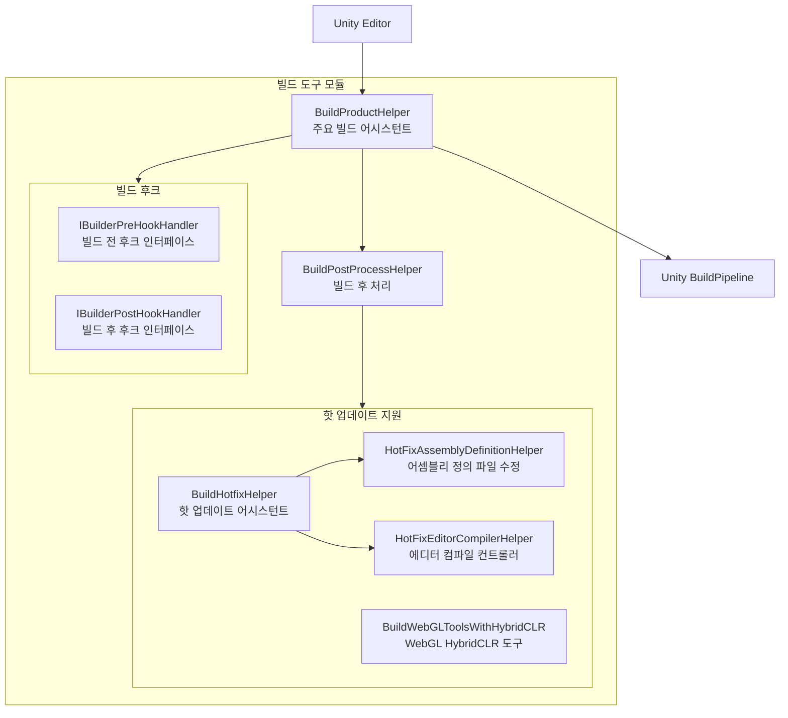
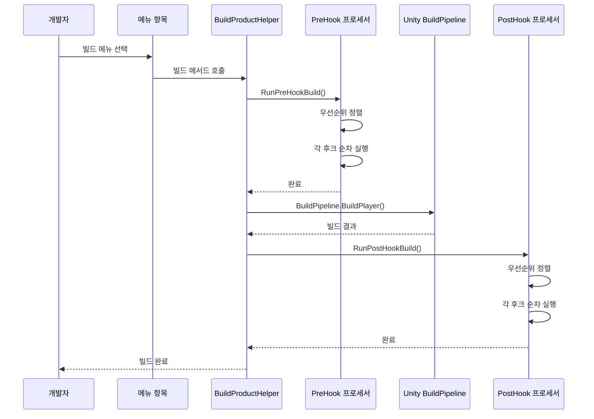

# 빌드 도구

GameFrameX는 완전한 Unity 에디터 빌드 도구를 제공하며, 멀티 플랫폼 빌드, 핫 업데이트(HybridCLR) 통합, 빌드 후크 확장 등을 지원합니다.

## 개요

빌드 도구 모듈은 `Editor/` 디렉토리에 위치하며, 주요 핵심 컴포넌트는 다음과 같습니다:

- **BuildProductHelper** - 주요 빌드 어시스턴트로, 멀티 플랫폼 빌드 기능 제공
- **BuildHotfixHelper** - 핫 업데이트 코드 관리 어시스턴트
- **Hook 메커니즘** - 빌드 전후의 확장 후크 인터페이스

이 도구들은 Unity 에디터 메뉴 `GameFrameX/Build`를 통해 통일된 빌드 진입점을 제공하여 크로스 플랫폼 빌드 프로세스를 간소화합니다.

## 아키텍처



### 핵심 컴포넌트 설명

| 컴포넌트 | 파일 경로 | 설명 |
|------|----------|------|
| BuildProductHelper | `Editor/BuildProduct/BuildProductHelper.cs` | 주요 빌드 어시스턴트로, Windows, Mac, Android, iOS, WebGL 플랫폼 빌드 지원 |
| BuildPostProcessHelper | `Editor/BuildProduct/BuildPostProcessHelper.cs` | 빌드 후 자동 버전 번호 업데이트 |
| IBuilderPreHookHandler | `Editor/BuildProduct/IBuilderPreHookHandler.cs` | 빌드 전 후크 인터페이스 |
| IBuilderPostHookHandler | `Editor/BuildProduct/IBuilderPostHookHandler.cs` | 빌드 후 후크 인터페이스 |
| BuildHotfixHelper | `Editor/BuildHotfix/BuildHotfixHelper.cs` | 핫 업데이트 코드 복사 및 관리 |
| HotFixEditorCompilerHelper | `Editor/BuildHotfix/HotFixEditorCompilerHelper.cs` | 에디터 컴파일 컨트롤러 |
| HotFixAssemblyDefinitionHelper | `Editor/BuildHotfix/HotFixAssemblyDefinitionHelper.cs` | 어셈블리 정의 파일 수정 |
| BuildWebGLToolsWithHybridCLR | `Editor/BuildWebGLTools/BuildWebGLToolsWithHybridCLR.cs` | WebGL HybridCLR 지원 |

## 메뉴 항목

빌드 도구는 Unity 에디터 메뉴를 통해 통일된 빌드 진입점을 제공하며, `GameFrameX/Build` 메뉴 하위에 위치합니다:

| 메뉴 항목 | 기능 |
|--------|------|
| Windows X64 | Windows x64 실행 파일 빌드 |
| Windows X32 | Windows x32 실행 파일 빌드 |
| Mac Os | macOS 애플리케이션 빌드 |
| WebGL | WebGL 버전 빌드 |
| Apk | Android APK 빌드 |
| AAB | Android AAB 패키지 빌드 |
| AndroidStudio Project Debug | Android Studio Debug 프로젝트 내보내기 |
| AndroidStudio Project Release | Android Studio Release 프로젝트 내보내기 |
| Xcode Project Debug | Xcode Debug 프로젝트 내보내기 |
| Xcode Project Release | Xcode Release 프로젝트 내보내기 |
| Copy HotFix Code | 핫 업데이트 코드를 Bundles/Code 디렉토리에 복사 |
| Copy AOT Code | AOT 코드를 Bundles/AOTCode 디렉토리에 복사 |
| HotFix Editor Compiler Add | 핫 업데이트 어셈블리의 에디터 컴파일 지시문 추가 |
| HotFix Editor Compiler Remove | 핫 업데이트 어셈블리의 에디터 컴파일 지시문 제거 |

## 핵심 기능

### 멀티 플랫폼 빌드

BuildProductHelper는 다음 플랫폼 빌드를 지원합니다:

```csharp
// Windows x64 빌드
[MenuItem("GameFrameX/Build/Windows X64", false, 100)]
public static void BuildPlayerToWindows64BuildTarget()

// Windows x32 빌드
[MenuItem("GameFrameX/Build/Windows X32", false, 100)]
public static void BuildPlayerToWindows32BuildTarget()

// macOS 빌드
[MenuItem("GameFrameX/Build/Mac Os", false, 200)]
public static void BuildPlayerToMacBuildTarget()

// WebGL 빌드
[MenuItem("GameFrameX/Build/WebGL", false, 300)]
private static void BuildPlayerToWebGL()

// Android APK 빌드
[MenuItem("GameFrameX/Build/Apk", false, 400)]
private static void BuildPlayerToAndroid()

// Android AAB 빌드
[MenuItem("GameFrameX/Build/AAB", false, 400)]
private static void BuildAppBundleForAndroid()

// Android Studio 프로젝트 내보내기 (Debug/Release)
[MenuItem("GameFrameX/Build/AndroidStudio Project Debug", false, 500)]
private static void ExportToAndroidStudioToDevelop()

[MenuItem("GameFrameX/Build/AndroidStudio Project Release", false, 500)]
private static void ExportToAndroidStudioToRelease()

// Xcode 프로젝트 내보내기 (Debug/Release)
[MenuItem("GameFrameX/Build/Xcode Project Debug", false, 250)]
private static void ExportToXcodeToDevelop()

[MenuItem("GameFrameX/Build/Xcode Project Release", false, 250)]
private static void ExportToXcodeToRelease()
```
> Source: [BuildProductHelper.cs](https://github.com/GameFrameX/com.gameframex.unity/blob/main/Editor/BuildProduct/BuildProductHelper.cs#L101-L662)

### 빌드 후크 메커니즘

`IBuilderPreHookHandler` 및 `IBuilderPostHookHandler` 인터페이스를 구현하여 빌드 전후에 커스텀 로직을 실행할 수 있습니다:

```csharp
using UnityEditor;

namespace MyProject.Editor
{
    /// <summary>
    /// 빌드 전 후크 예시
    /// </summary>
    public class MyPreBuildHook : IBuilderPreHookHandler
    {
        /// <summary>
        /// 우선순위로, 값이 클수록 우선순위 낮음
        /// </summary>
        public int Priority => 0;

        /// <summary>
        /// 빌드 전 로직 실행
        /// </summary>
        /// <param name="target">빌드 타겟 플랫폼</param>
        /// <param name="path">빌드 출력 경로</param>
        public void Run(BuildTarget target, string path)
        {
            // 빌드 전 커스텀 로직
            UnityEngine.Debug.Log($"{target} 빌드 시작, 출력 경로: {path}");
        }
    }

    /// <summary>
    /// 빌드 후 후크 예시
    /// </summary>
    public class MyPostBuildHook : IBuilderPostHookHandler
    {
        /// <summary>
        /// 우선순위
        /// </summary>
        public int Priority => 0;

        /// <summary>
        /// 빌드 후 로직 실행
        /// </summary>
        /// <param name="target">빌드 타겟 플랫폼</param>
        /// <param name="path">빌드 출력 경로</param>
        public void Run(BuildTarget target, string path)
        {
            // 빌드 후 커스텀 로직
            UnityEngine.Debug.Log($"{target} 빌드 완료, 출력 경로: {path}");
        }
    }
}
```
> Sources:
> - [IBuilderPreHookHandler.cs](https://github.com/GameFrameX/com.gameframex.unity/blob/main/Editor/BuildProduct/IBuilderPreHookHandler.cs#L39-L52)
> - [IBuilderPostHookHandler.cs](https://github.com/GameFrameX/com.gameframex.unity/blob/main/Editor/BuildProduct/IBuilderPostHookHandler.cs#L39-L52)

**후크 실행 흐름:**



### 핫 업데이트 지원 (HybridCLR)

GameFrameX는 HybridCLR 핫 업데이트 솔루션을 기본 지원합니다:

#### HybridCLR 활성화/비활성화

```csharp
// HybridCLR 비활성화
[MenuItem("GameFrameX/Scripting Define Symbols/Disable HybridCLR(关闭HybridCLR适配)", false, 5000)]
public static void DisableHybridCLR()
{
    ScriptingDefineSymbols.AddScriptingDefineSymbol(HybridCLRScriptingDefineSymbol);
}

// HybridCLR 활성화
[MenuItem("GameFrameX/Scripting Define Symbols/Enable HybridCLR(开启HybridCLR适配)", false, 5001)]
public static void EnableHybridCLR()
{
    ScriptingDefineSymbols.RemoveScriptingDefineSymbol(HybridCLRScriptingDefineSymbol);
}
```
> Source: [BuildHotfixHelper.cs](https://github.com/GameFrameX/com.gameframex.unity/blob/main/Editor/BuildHotfix/BuildHotfixHelper.cs#L107-L125)

#### 핫 업데이트 코드 복사

```csharp
// 핫 업데이트 DLL을 Assets/Bundles/Code에 복사
[MenuItem("GameFrameX/Build/Copy HotFix Code(复制热更新代码到Assets>Bundles>Code)", false, 10)]
public static void CopyHotfixCode()
{
    // Library/ScriptAssemblies의 Unity.HotFix.dll을 Assets/Bundles/Code에 복사
}

// AOT 코드를 Assets/Bundles/AOTCode에 복사
[MenuItem("GameFrameX/Build/Copy AOT Code(复制AOT代码到Assets>Bundles>AOTCode)", false, 11)]
public static void CopyAOTCode()
{
    // HybridCLRData/AssembliesPostIl2CppStrip의 AOT DLL 복사
}
```
> Source: [BuildHotfixHelper.cs](https://github.com/GameFrameX/com.gameframex.unity/blob/main/Editor/BuildHotfix/BuildHotfixHelper.cs#L43-L104)

#### 에디터 컴파일 컨트롤

빌드 과정에서 핫 업데이트 어셈블리의 컴파일 범위를 임시로 제어해야 합니다:

```csharp
// 핫 업데이트 어셈블리의 에디터 컴파일 지시문 제거
[MenuItem("GameFrameX/Build/HotFix Editor Compiler Remove(移除热更新程序集的编辑器编译指令)", false, 15)]
public static void RemoveEditor()
{
    var path = "Assets/Hotfix/Unity.HotFix.asmdef";
    HotFixAssemblyDefinitionHelper.RemoveEditor(path);
}

// 핫 업데이트 어셈블리의 에디터 컴파일 지시문 추가
[MenuItem("GameFrameX/Build/HotFix Editor Compiler Add(增加热更新程序集的编辑器编译指令)", false, 16)]
public static void AddEditor()
{
    var path = "Assets/Hotfix/Unity.HotFix.asmdef";
    HotFixAssemblyDefinitionHelper.AddEditor(path);
}
```
> Source: [HotFixEditorCompilerHelper.cs](https://github.com/GameFrameX/com.gameframex.unity/blob/main/Editor/BuildHotfix/HotFixEditorCompilerHelper.cs#L8-L29)

### 빌드 후 자동 처리

BuildPostProcessHelper는 매 빌드 후 자동으로 버전 번호를 업데이트합니다:

```csharp
[PostProcessBuild(999)]
public static void OnPostProcessBuild(BuildTarget target, string path)
{
    if (target == BuildTarget.Android)
    {
        // Android: bundleVersionCode + 1
        PlayerSettings.Android.bundleVersionCode = Convert.ToInt32(PlayerSettings.Android.bundleVersionCode) + 1;
    }

    if (target == BuildTarget.iOS)
    {
        // iOS: buildNumber + 1
        PlayerSettings.iOS.buildNumber = (Convert.ToInt32(PlayerSettings.iOS.buildNumber) + 1).ToString();
    }
}
```
> Source: [BuildPostProcessHelper.cs](https://github.com/GameFrameX/com.gameframex.unity/blob/main/Editor/BuildProduct/BuildPostProcessHelper.cs#L43-L57)

### 빌드 출력 경로 관리

빌드 출력 경로는 다음 규칙에 따라 자동으로 생성됩니다:

```csharp
// 경로 형식: Builds/{플랫폼}/{패키지명}/{버전}/{타임스탬프}
var pathName = $"{Application.identifier}_{_buildTime}_v_{PlayerSettings.bundleVersion}";

// Android 특수 형식
if (EditorUserBuildSettings.activeBuildTarget == BuildTarget.Android)
{
    pathName = $"{_buildTime}_code_{PlayerSettings.Android.bundleVersionCode}";
}

// iOS/macOS 특수 형식
else if (EditorUserBuildSettings.activeBuildTarget == BuildTarget.iOS || 
         EditorUserBuildSettings.activeBuildTarget == BuildTarget.StandaloneOSX)
{
    pathName = $"{_buildTime}_code_{PlayerSettings.iOS.buildNumber}";
}
```
> Source: [BuildProductHelper.cs](https://github.com/GameFrameX/com.gameframex.unity/blob/main/Editor/BuildProduct/BuildProductHelper.cs#L703-L746)

## 사용 예시

### 기본 빌드 흐름

1. **대상 플랫폼 선택**: Unity Editor에서 씬을 엶
2. **빌드 대상 설정**: `File > Build Settings`를 통해 대상 플랫폼 선택
3. **빌드 실행**: `GameFrameX/Build` 메뉴에서 해당 빌드 옵션 선택
4. **출력 확인**: 빌드 완료 후 `Builds/{플랫폼}/` 디렉토리에서 출력 확인

### 빌드 후크 확장 사용

오래된 리소스를 정리하는 커스텀 빌드 후크를 생성합니다:

```csharp
using UnityEditor;
using GameFrameX.Editor;

public class CustomBuildHook : IBuilderPreHookHandler
{
    public int Priority => 10; // 낮은 우선순위

    public void Run(BuildTarget target, string path)
    {
        // 오래된 빌드 캐시 정리
        string cachePath = $"{path}/Cache";
        if (System.IO.Directory.Exists(cachePath))
        {
            System.IO.Directory.Delete(cachePath, true);
        }
        
        UnityEngine.Debug.Log($"빌드 전 정리 완료: {target}");
    }
}
```

### API 프로그래밍 빌드

코드를 호출하여 자동화된 빌드를 구현할 수 있습니다:

```csharp
using GameFrameX.Editor;

// Android APK 빌드
string apkPath = BuildProductHelper.BuildPlayerAndroid();

// WebGL 빌드
string webglPath = BuildProductHelper.BuildPlayerWebGL();

// Xcode 프로젝트 빌드
string xcodePath = BuildProductHelper.BuildPlayerXcode();
```
> Source: [BuildProductHelper.cs](https://github.com/GameFrameX/com.gameframex.unity/blob/main/Editor/BuildProduct/BuildProductHelper.cs#L281-L368)

## 관련 링크

- [미니게임 플랫폼 어댑터](./6-editor-tools.mini-game-platform) - 위챗,字节跳动 등 미니게임 플랫폼 어댑션 방법
- [패키지 관리 도구](./6-editor-tools.package-management) - 패키지 관리 기능
- [런타임 모듈 개요](./5-runtime.base) - 런타임 기초 컴포넌트
- [이벤트 시스템](./5-runtime.event-system) - 이벤트 시스템
- [오브젝트 풀 시스템](./5-runtime.object-pool) - 오브젝트 풀 시스템