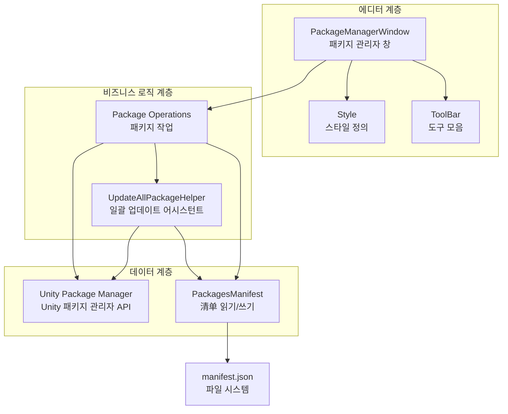
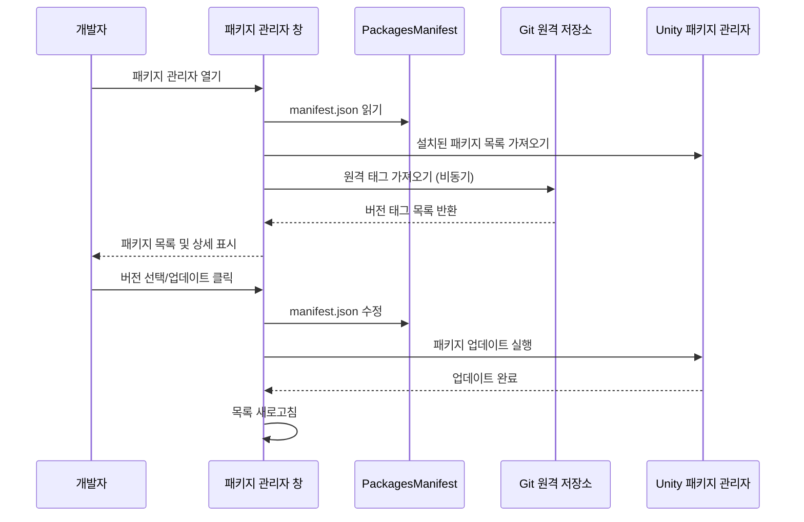

# 패키지 관리 도구

GameFrameX 패키지 관리 도구는 Git 기반 의존성 패키지를 관리하기 위한 완전한 Unity 에디터 확장입니다. 시각적인 패키지 관리 인터페이스와 일괄 업데이트 기능을 제공하여 개발자가 프로젝트 의존성을 더 효율적으로 관리할 수 있도록 도와줍니다.

## 개요

GameFrameX 패키지 관리 도구는 Unity 에디터 확장이며, `GameFrameX` 메뉴에 통합되어 있습니다. 이 도구는 주로 다음 문제를 해결합니다:

1. **시각적 패키지 관리** - 그래픽 인터페이스를 통해 모든 설치된 Git 패키지 및 상세 정보 확인
2. **버전 전환** -同一 패키지의 서로 다른 버전 간 자유롭게 전환 (업그레이드/다운그레이드)
3. **일괄 업데이트** - 원클릭으로 모든 Git 패키지를 최신 버전으로 업데이트
4. **미러 전환** - GitHub와 Gitee 미러 간 빠르게 전환

### 핵심 기능

| 기능 | 설명 |
|------|------|
| 패키지 목록 표시 | 모든 설치된 Git 패키지 표시 |
| 패키지 상세 보기 | 패키지 이름, 버전, 작성자, 설명 등 정보 확인 |
| 버전 전환 | 업그레이드/다운그레이드 지원 |
| 일괄 업데이트 | 원클릭으로 모든 패키지 최신 버전으로 업데이트 |
| 미러 전환 | GitHub/Gitee 미러 전환 지원 |
| 새로고침 기능 | 패키지 목록 다시 로드 |

## 아키텍처 설계



### 컴포넌트 설명

| 컴포넌트 | 파일 경로 | 책임 |
|------|----------|------|
| PackageManagerWindow | Editor/PackageManager/PackageManagerWindow.cs | 메인 창 인터페이스로, 패키지 목록 및 상세 표시 제공 |
| PackageManagerWindow.Package | Editor/PackageManager/PackageManagerWindow.Package.cs | 패키지 작업 로직으로, 로딩, 버전 가져오기 포함 |
| PackageManagerWindow.ToolBar | Editor/PackageManager/PackageManagerWindow.ToolBar.cs | 도구 모음 UI로, 새로고침, 업데이트, 미러 전환 제공 |
| PackageManagerWindow.Style | Editor/PackageManager/PackageManagerWindow.Style.cs | 스타일 정의 |
| PackagesManifest | Editor/PackageManager/PackagesManifest.cs | manifest.json 읽기/쓰기 캡슐화 |
| UpdateAllPackageHelper | Editor/UpdatePackages/UpdateAllPackageHelper.cs | 일괄 업데이트 기능 |

## 핵심 기능 상세

### 패키지 관리자 열기

`GameFrameX → Package Manager(GameFrameX의 패키지 관리자)` 메뉴를 통해 패키지 관리 창을 엽니다.

```csharp
[MenuItem("GameFrameX/Package Manager(GameFrameX의 패키지 관리자)", false, 2000)]
public static void ShowWindow()
{
    var window = GetWindow<PackageManagerWindow>("GameFrameX");
    window.minSize = new UnityEngine.Vector2(800, 600);
    window.Show();
}
```
> Source: [PackageManagerWindow.cs](https://github.com/GameFrameX/com.gameframex.unity/blob/main/Editor/PackageManager/PackageManagerWindow.cs#L11-L17)

### 패키지 정보 모델

```csharp
public sealed class PackageManagerInfo
{
    /// <summary>
    /// 패키지 이름
    /// </summary>
    public string Name { get; }
    
    /// <summary>
    /// 패키지 git 주소
    /// </summary>
    public string GitUrl { get; }
    
    /// <summary>
    /// 패키지 정보
    /// </summary>
    public PackageInfo Package { get; }
    
    /// <summary>
    /// 버전 목록, Tags
    /// </summary>
    public List<string> Versions { get; }
}
```
> Source: [PackageManagerWindow.Package.cs](https://github.com/GameFrameX/com.gameframex.unity/blob/main/Editor/PackageManager/PackageManagerWindow.Package.cs#L20-L49)

### Git 태그 버전 가져오기

도구는 git ls-remote를 호출하여 원격 저장소의 모든 태그를 가져옵니다:

```csharp
private void FetchGitTags(string gitUrl, PackageManagerInfo package)
{
    isLoadingPackageTagList = true;
    Task.Run(() =>
    {
        ProcessStartInfo startInfo = new ProcessStartInfo
        {
            FileName = "git",
            Arguments = $"ls-remote --tags {gitUrl}",
            RedirectStandardOutput = true,
            UseShellExecute = false,
            CreateNoWindow = true
        };
        using (Process process = Process.Start(startInfo))
        {
            using (StreamReader reader = process.StandardOutput)
            {
                string result = reader.ReadToEnd();
                string[] tags = result.Split('\n');
                foreach (var tag in tags)
                {
                    if (!string.IsNullOrEmpty(tag) && !tag.Contains("^{"))
                    {
                        // 태그명 추출
                        var tagName = tag.Split('\t')[1].Replace("refs/tags/", "").Trim();
                        package.Versions.Add(tagName);
                    }
                }
                package.Versions.Sort((x, y) => -x.CompareTo(y));
            }
        }
        isLoadingPackageTagList = false;
    });
}
```
> Source: [PackageManagerWindow.Package.cs](https://github.com/GameFrameX/com.gameframex.unity/blob/main/Editor/PackageManager/PackageManagerWindow.Package.cs#L103-L144)

### 버전 업데이트/다운그레이드

```csharp
void UpdateToVersion(string packageName, string version)
{
    StartLoadPackages();
    PackagesManifest saveManifest = new PackagesManifest
    {
        Dependencies = new Dictionary<string, string>(PackagesManifest.Dependencies),
    };
    foreach (var dependency in PackagesManifest.Dependencies)
    {
        if (dependency.Key.Equals(packageName, StringComparison.OrdinalIgnoreCase))
        {
            string packageUrl = dependency.Value;
            if (packageUrl.Contains(".git"))
            {
                int indexTag = packageUrl.LastIndexOf("#", StringComparison.InvariantCulture);
                string url;
                if (indexTag >= 0)
                {
                    // 이미 버전 있음
                    url = packageUrl.Substring(0, indexTag);
                    url = $"{url}#{version}";
                }
                else
                {
                    url = packageUrl.Split(new[] { ".git", }, StringSplitOptions.RemoveEmptyEntries)[0];
                    url = $"{url}.git#{version}";
                }
                saveManifest.Dependencies[dependency.Key] = url;
                UpdateAllPackageHelper.UpdatePackages(packageName, url);
                continue;
            }
            saveManifest.Dependencies[dependency.Key] = packageUrl;
        }
    }
    SavePackages(saveManifest);
    UpdateAllPackageHelper.StartUpdate();
    AssetDatabase.Refresh();
}
```
> Source: [PackageManagerWindow.cs](https://github.com/GameFrameX/com.gameframex.unity/blob/main/Editor/PackageManager/PackageManagerWindow.cs#L230-L271)

## 사용 흐름



## 일괄 업데이트 기능

### 메뉴 진입점

```csharp
[MenuItem("GameFrameX/Update All Packages(更新所有git包)", false, 2000)]
public static void UpdatePackages()
{
    var result = EditorUtility.DisplayDialog("패키지 업데이트 알림", "모든 패키지를 업데이트하시겠습니까?\n업데이트 완료 후 [재시작, 재시작, 재시작] Unity가 필요합니다", "예", "아니오");
    if (result)
    {
        var manifestPath = Path.Combine(Application.dataPath, "..", "Packages", "manifest.json");
        UpdatePackagesFromManifest(manifestPath);
    }
}
```
> Source: [UpdateAllPackageHelper.cs](https://github.com/GameFrameX/com.gameframex.unity/blob/main/Editor/UpdatePackages/UpdateAllPackageHelper.cs#L24-L33)

### 업데이트 진행 처리

```csharp
private static void UpdatingProgressHandler()
{
    if (_addRequest.IsCompleted)
    {
        if (_addRequest.Status == StatusCode.Success)
        {
            UnityEngine.Debug.Log($"패키지 업데이트: {_addRequest.Result.packageId}");
        }
        else if (_addRequest.Status >= StatusCode.Failure)
        {
            UnityEngine.Debug.LogError($"패키지 업데이트 실패: {_addRequest.Error.message}");
        }
        EditorApplication.update -= UpdatingProgressHandler;
        UpdateNextPackage();
    }
}
```
> Source: [UpdateAllPackageHelper.cs](https://github.com/GameFrameX/com.gameframex.unity/blob/main/Editor/UpdatePackages/UpdateAllPackageHelper.cs#L110-L126)

## 미러 전환 기능

도구는 GitHub와 Gitee 미러 간 전환을 지원하여 서로 다른 네트워크 환경에 적응합니다:

```csharp
private void OnGUIByToolBar()
{
    GUILayout.BeginHorizontal(EditorStyles.toolbar);
    GUILayout.Label("미러 목록:", EditorStyles.label, GUILayout.Width(100));
    int newDropdownIndex = EditorGUILayout.Popup(_selectedDropdownIndex, _dropdownOptions, EditorStyles.toolbarDropDown);
    if (newDropdownIndex != _selectedDropdownIndex)
    {
        var confirmed = EditorUtility.DisplayDialog("전환 알림", 
            $"모든 패키지의下载地址를 미러 주소로 전환합니다:\n{_dropdownOptions[newDropdownIndex]}\n일부 라이브러리가 누락될 수 있습니다. Issue를 제출하여 피드백 주세요", "확인", "취소");
        
        if (confirmed)
        {
            _selectedDropdownIndex = newDropdownIndex;
            // 모든 패키지 URL 업데이트
            foreach (var manifestDependency in PackagesManifest.Dependencies)
            {
                if (manifestDependency.Value.StartsWith("https://"))
                {
                    var path = manifestDependency.Value.Replace("https://", string.Empty).Replace("\\", "/");
                    var index = path.IndexOf("/", System.StringComparison.OrdinalIgnoreCase);
                    if (index >= 0)
                    {
                        path = path.Substring(index);
                    }
                    dependencies[manifestDependency.Key] = $"https://{_dropdownOptions[_selectedDropdownIndex]}{path}";
                }
            }
            PackagesManifest.Dependencies = dependencies;
            SavePackages(PackagesManifest);
        }
    }
    // ... 새로고침 및 업데이트 버튼
}
```
> Source: [PackageManagerWindow.ToolBar.cs](https://github.com/GameFrameX/com.gameframex.unity/blob/main/Editor/PackageManager/PackageManagerWindow.ToolBar.cs#L13-L49)

## 자주 묻는 질문

### Q: 패키지 업데이트 후 Unity 재시작이 필요한가요?

네, Unity 패키지 관리자의 제한으로 인해 패키지 업데이트 후에는 **Unity 에디터를 재시작해야만 적용됩니다**. 도구가 팝업 창으로 사용자에게 알립니다.

### Q: 특정 패키지가 버전 목록을 표시하지 않는 이유는?

다음과 같은 원인일 수 있습니다:
1. 원격 저장소에 Git Tag가 생성되지 않음
2. 네트워크 문제로 원격 태그를 가져올 수 없음
3. Git 저장소가 ls-remote 작업을 지원하지 않음

이 문제가 발생하면 "해당 라이브러리에 Tag또는 버전 표시가 누락되었나요? 피드백하기" 버튼을 클릭하여 Issue를 제출하세요.

### Q: 미러 전환 후 일부 패키지를 다운로드할 수 없는 경우?

Gitee 미러가 GitHub 저장소와 완전 동기화되지 않을 수 있어, 전환 후 일부 패키지를 다운로드할 수 없는 상황이 발생할 수 있습니다. Issue를 제출하면 개발자가 최대한 빨리 처리합니다.

### Q: 진행 중인 일괄 업데이트를 취소하는 방법은?

일괄 업데이트 과정에서 Progress Bar 오른쪽 상단에 닫기 버튼이 있어 클릭하면 업데이트를 취소할 수 있습니다.

## 관련 링크

- [빌드 도구](./6-editor-tools.build-tools)
- [미니게임 플랫폼 어댑터](./6-editor-tools.mini-game-platform)
- [인스펙터 패널 도구](./6-editor-tools.inspector-tools)
- [이미지 크롭핑 도구](./6-editor-tools.cropping-tool)
- [Unity Package Manager 문서](https://docs.unity3d.com/Manual/Packages.html)