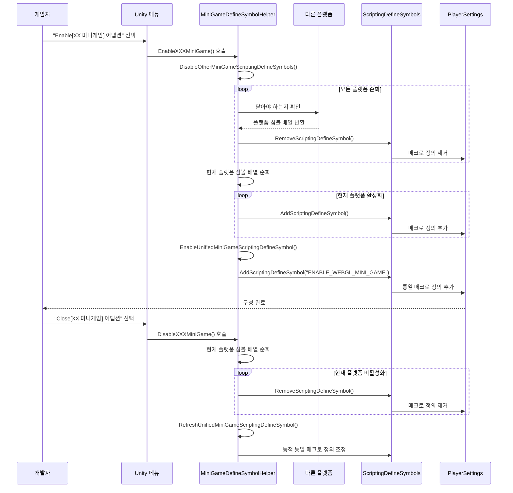

# 미니게임 플랫폼 어댑터

미니게임 플랫폼 어댑터 모듈은 21개 주요 미니게임 플랫폼에 대한 통일된 매크로 정의 관리 솔루션을 제공합니다. 이 모듈을 통해 개발자는 원클릭으로 대상 플랫폼을 전환할 수 있으며, 시스템은 플랫폼 간 상호 배타적 관계를 자동으로 처리하고 통일된 WebGL 미니게임 매크로를 생성합니다.

## 개요

Unity WebGL 미니게임 개발 시 서로 다른 플랫폼용으로 서로 다른 스크립트 매크로(Scripting Define Symbols)를 설정해야 합니다. 기존 방식은 PlayerSettings에서 수동으로 구성해야 하며 번거롭고 오류가 발생하기 쉽습니다.

미니게임 플랫폼 어댑터 모듈은 다음 설계로这些问题를 해결합니다:

- **원클릭 전환**: Unity 메뉴바를 통해 대상 플랫폼 빠르게 활성화/비활성화
- **자동 상호 배타**: 새 플랫폼 활성화 시 자동으로 다른 플랫폼 닫아 매크로 충돌 방지
- **통일 식별자**: `ENABLE_WEBGL_MINI_GAME` 통일 매크로를 자동으로 관리하여 크로스 플랫폼 공통 코드 작성 용이
- **플랫폼 분류**: 국내 미니게임, 해외 미니게임, 기기 제조사, 게임 플랫폼 4가지로 분류하여 관리 용이

## 아키텍처 설계

```mermaid
graph TB
    subgraph Core["핵심 계층 - MiniGameDefineSymbolHelper.cs"]
        Main["주요 클래스 정의<br/>MiniGameDefineSymbolHelper"]
        GetAll["모든 플랫폼 심볼 가져오기<br/>GetAllMiniGameScriptingDefineSymbols"]
        DisableOthers["다른 플랫폼 닫기<br/>DisableOtherMiniGameScriptingDefineSymbols"]
        EnableUnified["통일 심볼 활성화<br/>EnableUnifiedMiniGameScriptingDefineSymbol"]
        RefreshUnified["통일 심볼 새로고침<br/>RefreshUnifiedMiniGameScriptingDefineSymbol"]
    end
    
    subgraph Domestic["국내 미니게임 - DomesticMiniGames"]
        WC["위챗 WeChat"]
        DY["디우인 DouYin"]
        KS["쿠아이쇼우 KuaiShou"]
        BD["바이두 Baidu"]
        AL["알리페이 Alipay"]
        MT["미탄 Meituan"]
        BL["Bilibili"]
        JD["JD.com"]
        TB["타오바오 Taobao"]
        TT["TapTap"]
    end
    
    subgraph International["해외 미니게임 - InternationalMiniGames"]
        CG["CrazyGames"]
        DC["Discord"]
        FB["Facebook"]
        GP["Google Play"]
        PK["Poki"]
        TTInt["TikTok"]
        YT["YouTube"]
    end
    
    subgraph Device["기기 제조사 - DeviceOEMs"]
        HW["화웨이 Huawei"]
        OP["OPPO"]
        VI["Vivo"]
        XM["샤오미 Xiaomi"]
    end
    
    subgraph Utilities["도구 계층 - ScriptingDefineSymbols"]
        Util["ScriptingDefineSymbols<br/>도구 클래스"]
    end
    
    Main --> GetAll
    Main --> DisableOthers
    Main --> EnableUnified
    Main --> RefreshUnified
    
    GetAll --> WC
    GetAll --> DY
    GetAll --> KS
    GetAll --> BD
    GetAll --> AL
    GetAll --> MT
    GetAll --> BL
    GetAll --> JD
    GetAll --> TB
    GetAll --> TT
    GetAll --> CG
    GetAll --> DC
    GetAll --> FB
    GetAll --> GP
    GetAll --> PK
    GetAll --> TTInt
    GetAll --> YT
    GetAll --> HW
    GetAll --> OP
    GetAll --> VI
    GetAll --> XM
    
    DisableOthers --> Util
    EnableUnified --> Util
    RefreshUnified --> Util
```



### 아키텍처 설명

핵심 계층 `MiniGameDefineSymbolHelper`는 전체 모듈의 주요 컨트롤러로, 다음 핵심 기능을 제공합니다:

1. **모든 플랫폼 심볼 가져오기** (`GetAllMiniGameScriptingDefineSymbols`): 등록된 모든 미니게임 플랫폼 매크로 수집
2. **다른 플랫폼 닫기** (`DisableOtherMiniGameScriptingDefineSymbols`): 플랫폼 간 상호 배타 로직 구현
3. **통일 심볼 활성화** (`EnableUnifiedMiniGameScriptingDefineSymbol`): `ENABLE_WEBGL_MINI_GAME` 통일 매크로 관리
4. **통일 심볼 새로고침** (`RefreshUnifiedMiniGameScriptingDefineSymbol`): 현재 플랫폼 상태에 따라 통일 매크로 동적 조정

플랫폼 계층은 기능에 따라 4개의 폴더로 분류되며, 각 플랫폼은 partial class 형태로 주요 클래스를 확장하고 `[MenuItem]` 속성을 통해 Unity 메뉴바에 해당 활성화/비활성화 옵션을 생성합니다.

## 핵심 기능 흐름



### 설계 의도

해당 흐름 설계는 다음 원칙을 따릅니다:

1. **상호 배타성**: `DisableOtherMiniGameScriptingDefineSymbols`를 통해 동시에 하나의 플랫폼만 활성화되어 매크로 충돌로 인한 컴파일 오류 방지

2. **통일성**: 각 플랫폼 활성화 시 자동으로 `ENABLE_WEBGL_MINI_GAME` 통일 매크로를 추가하여 개발자는 해당 매크로를 사용하여 플랫폼无关 핵심 로직 작성 가능

3. **동적 새로고침**: 플랫폼 비활성화 시 다른 플랫폼이 여전히 활성화되어 있는지 확인하고, 없다면 자동으로 통일 매크로를 닫아 무효 매크로 존재 방지

## 지원 플랫폼

### 국내 미니게임 (Domestic Mini Games)

| 플랫폼 | 매크로 정의 | 메뉴 경로 |
|------|--------|----------|
| 위챗 WeChat | `ENABLE_WECHAT_MINI_GAME`, `WEIXINMINIGAME` | GameFrameX → Scripting Define Symbols → Domestic Mini Games |
| 디우인 DouYin | `ENABLE_DOUYIN_MINI_GAME`, `DOUYINMINIGAME`, `TTSDK_MIX_ENGINE` | GameFrameX → Scripting Define Symbols → Domestic Mini Games |
| 쿠아이쇼우 KuaiShou | `ENABLE_KUAISHOU_MINI_GAME`, `KUAISHOUMINIGAME` | GameFrameX → Scripting Define Symbols → Domestic Mini Games |
| 바이두 Baidu | `ENABLE_BAIDU_MINI_GAME`, `BAIDUMINIGAME` | GameFrameX → Scripting Define Symbols → Domestic Mini Games |
| 알리페이 Alipay | `ENABLE_ALIPAY_MINI_GAME`, `ALIPAYMINIGAME` | GameFrameX → Scripting Define Symbols → Domestic Mini Games |
| 미탄 Meituan | `ENABLE_MEITUAN_MINI_GAME`, `MEITUANMINIGAME` | GameFrameX → Scripting Define Symbols → Domestic Mini Games |
| Bilibili | `ENABLE_BILIBILI_MINI_GAME`, `BILIBILIMINIGAME` | GameFrameX → Scripting Define Symbols → Domestic Mini Games |
| JD.com | `ENABLE_JINGDONG_MINI_GAME`, `JINGDONGMINIGAME` | GameFrameX → Scripting Define Symbols → Domestic Mini Games |
| 타오바오 Taobao | `ENABLE_TAOBAO_MINI_GAME`, `TAOBAOMINIGAME` | GameFrameX → Scripting Define Symbols → Domestic Mini Games |
| TapTap | `ENABLE_TAPTAP_MINI_GAME`, `TAPTAPMINIGAME` | GameFrameX → Scripting Define Symbols → Game Platforms |

### 해외 미니게임 (International Mini Games)

| 플랫폼 | 매크로 정의 | 메뉴 경로 |
|------|--------|----------|
| CrazyGames | `ENABLE_CRAZYGAMES_MINI_GAME`, `CRAZYGAMESMINIGAME` | GameFrameX → Scripting Define Symbols → International Mini Games |
| Discord | `ENABLE_DISCORD_MINI_GAME`, `DISCORDMINIGAME` | GameFrameX → Scripting Define Symbols → International Mini Games |
| Facebook | `ENABLE_FACEBOOK_MINI_GAME`, `FACEBOOKMINIGAME` | GameFrameX → Scripting Define Symbols → International Mini Games |
| Google Play | `ENABLE_GOOGLEPLAY_MINI_GAME`, `GOOGLEPLAYMINIGAME` | GameFrameX → Scripting Define Symbols → International Mini Games |
| Poki | `ENABLE_POKI_MINI_GAME`, `POKIMINIGAME` | GameFrameX → Scripting Define Symbols → International Mini Games |
| TikTok | `ENABLE_TIKTOK_MINI_GAME`, `TIKTOKMINIGAME` | GameFrameX → Scripting Define Symbols → International Mini Games |
| YouTube | `ENABLE_YOUTUBE_MINI_GAME`, `YOUTUBEMINIGAME` | GameFrameX → Scripting Define Symbols → International Mini Games |

### 기기 제조사 (Device OEMs)

| 플랫폼 | 매크로 정의 | 메뉴 경로 |
|------|--------|----------|
| 화웨이 Huawei | `ENABLE_HUAWEI_MINI_GAME`, `HUAWEIMINIGAME` | GameFrameX → Scripting Define Symbols → Device OEMs |
| OPPO | `ENABLE_OPPO_MINI_GAME`, `OPPOSMINIGAME` | GameFrameX → Scripting Define Symbols → Device OEMs |
| Vivo | `ENABLE_VIVO_MINI_GAME`, `VIVOMINIGAME` | GameFrameX → Scripting Define Symbols → Device OEMs |
| 샤오미 Xiaomi | `ENABLE_XIAOMI_MINI_GAME`, `XIAOMIMINIGAME` | GameFrameX → Scripting Define Symbols → Device OEMs |

## 사용 예시

### 기본 사용: 플랫폼 활성화

Unity 에디터에서 메뉴바를 통해 해당 플랫폼 옵션을 선택하면 어댑션이 활성화됩니다:

```
GameFrameX → Scripting Define Symbols → Domestic Mini Games → Enable WeChat Mini Game
```

활성화 후 시스템은 자동으로 다음 작업을 수행합니다:
1. 다른 모든 미니게임 플랫폼의 매크로 정의 닫기
2. 위챗 미니게임의 매크로 정의 활성화 (`ENABLE_WECHAT_MINI_GAME`, `WEIXINMINIGAME`)
3. 통일 매크로 정의 활성화 (`ENABLE_WEBGL_MINI_GAME`)

### 코드에서 플랫폼 매크로 사용

```csharp
#if ENABLE_WECHAT_MINI_GAME
using WeChatMiniGame API;
// 위챗 미니게임 특정 코드
#elif ENABLE_DOUYIN_MINI_GAME
using DouYinMiniGameAPI;
// 디우인 미니게임 특정 코드
#elif ENABLE_WEBGL_MINI_GAME
// 일반 WebGL 미니게임 로직
#endif
```

> Source: [MiniGameDefineSymbolHelper.WeChat.cs](https://github.com/GameFrameX/com.gameframex.unity/blob/main/Editor/MiniGame/DomesticMiniGames/MiniGameDefineSymbolHelper.WeChat.cs#L20-L40)

### 플랫폼 비활성화

```
GameFrameX → Scripting Define Symbols → Domestic Mini Games → Disable WeChat Mini Game
```

비활성화 후 시스템은 해당 플랫폼의 매크로 정의를 제거하고 통일 매크로 정의 조정이 필요한지 확인합니다.

### 플랫폼 매크로 정의 예시

위챗 미니게임 플랫폼의 매크로 정의 구성:

```csharp
/// <summary>
/// 위챗 미니게임 어댑션 매크로 정의 집합.
/// Define symbols for WeChat mini game adaptation.
/// </summary>
public static readonly string[] EnableWeChatMiniGameScriptingDefineSymbol = new[] 
{ 
    "ENABLE_WECHAT_MINI_GAME", 
    "WEIXINMINIGAME" 
};
```

> Source: [MiniGameDefineSymbolHelper.WeChat.cs](https://github.com/GameFrameX/com.gameframex.unity/blob/main/Editor/MiniGame/DomesticMiniGames/MiniGameDefineSymbolHelper.WeChat.cs#L10-L14)

디우인 플랫폼은 추가적인巨量 엔진 심볼을 포함합니다:

```csharp
/// <summary>
/// 디우인 미니게임 어댑션 매크로 정의 집합.
/// Define symbols for DouYin mini game adaptation.
/// </summary>
public static readonly string[] EnableDouYinMiniGameScriptingDefineSymbol = new[] 
{ 
    "ENABLE_DOUYIN_MINI_GAME", 
    "DOUYINMINIGAME", 
    "TTSDK_MIX_ENGINE" 
};
```

> Source: [MiniGameDefineSymbolHelper.DouYin.cs](https://github.com/GameFrameX/com.gameframex.unity/blob/main/Editor/MiniGame/DomesticMiniGames/MiniGameDefineSymbolHelper.DouYin.cs#L10-L14)

### 핵심 구현 로직

플랫폼 활성화 시 핵심 상호 배타 로직:

```csharp
/// <summary>
/// 현재 플랫폼 외 다른 미니게임 플랫폼 매크로 정의 닫기.
/// Disables define symbols of other mini game platforms except the current one.
/// </summary>
/// <param name="currentMiniGameScriptingDefineSymbols">현재 플랫폼 매크로 정의 집합</param>
private static void DisableOtherMiniGameScriptingDefineSymbols(string[] currentMiniGameScriptingDefineSymbols)
{
#if UNITY_WEBGL
    var closedCount = 0;
    foreach (var defineSymbols in GetAllMiniGameScriptingDefineSymbols())
    {
        if (defineSymbols == null || object.ReferenceEquals(defineSymbols, currentMiniGameScriptingDefineSymbols))
        {
            continue;
        }

        foreach (var define in defineSymbols)
        {
            if (!ScriptingDefineSymbols.HasScriptingDefineSymbol(BuildTargetGroup.WebGL, define))
            {
                continue;
            }

            ScriptingDefineSymbols.RemoveScriptingDefineSymbol(define);
            closedCount++;
            UnityEngine.Debug.Log($"미니게임 매크로 [{define}] 닫힘");
        }
    }

    UnityEngine.Debug.Log($"미니게임 매크로 상호 배타 정리 완료, 총 {closedCount}개 매크로 닫힘");
#endif
}
```

> Source: [MiniGameDefineSymbolHelper.cs](https://github.com/GameFrameX/com.gameframex.unity/blob/main/Editor/MiniGame/MiniGameDefineSymbolHelper.cs#L52-L88)

## 구성 설명

### 통일 매크로 정의

임의의 미니게임 플랫폼을 활성화한 모든 프로젝트는 자동으로 `ENABLE_WEBGL_MINI_GAME` 매크로를 얻습니다. 이 매크로는 플랫폼无关 핵심 로직 작성에 사용됩니다:

```csharp
#if ENABLE_WEBGL_MINI_GAME
// 모든 미니게임 플랫폼 공통 코드
// 예: 통일된 리소스 로딩 인터페이스, 공통 이벤트 시스템 등
#endif
```

### 메뉴 항목 우선순위

메뉴 항목은 플랫폼 분류에 따라 구성되며, 우선순위는 다음과 같습니다:

| 분류 | 우선순위 범위 | 설명 |
|------|-----------|------|
| 국내 미니게임 | 2000-2099 | Domestic Mini Games |
| 게임 플랫폼 | 2500-2599 | Game Platforms |
| 해외 미니게임 | 3200-3499 | International Mini Games |
| 기기 제조사 | 3700-3999 | Device OEMs |

### 주의 사항

1. **WebGL만 지원**: 모든 미니게임 플랫폼 매크로 정의는 WebGL 빌드 대상에서만 유효하며, 코드에 `#if UNITY_WEBGL` 보호가 추가되어 있습니다
2. **상호 배타 설계**: 미니게임 플랫폼 간 상호 배타이며, 새 플랫폼 활성화 시 자동으로 이전 플랫폼 닫기
3. **매크로 정의 형식**: 플랫폼 매크로 정의는 일반적으로 두 부분을 포함합니다:
   - `ENABLE_XXX_MINI_GAME`: 통일 형식으로 인식 용이
   - `XXXMINIGAME`: 플랫폼特定 형식으로 각 플랫폼 SDK에 대응

## 관련 링크

- [빌드 도구](./6-editor-tools.build-tools) - 기타 빌드 관련 기능
- [패키지 관리 도구](./6-editor-tools.package-management) - 프로젝트 의존성 관리
- [인스펙터 패널 도구](./6-editor-tools.inspector-tools) - 런타임 모니터링 도구
- [API 참고](./8-api-reference) - 완전한 API 정의