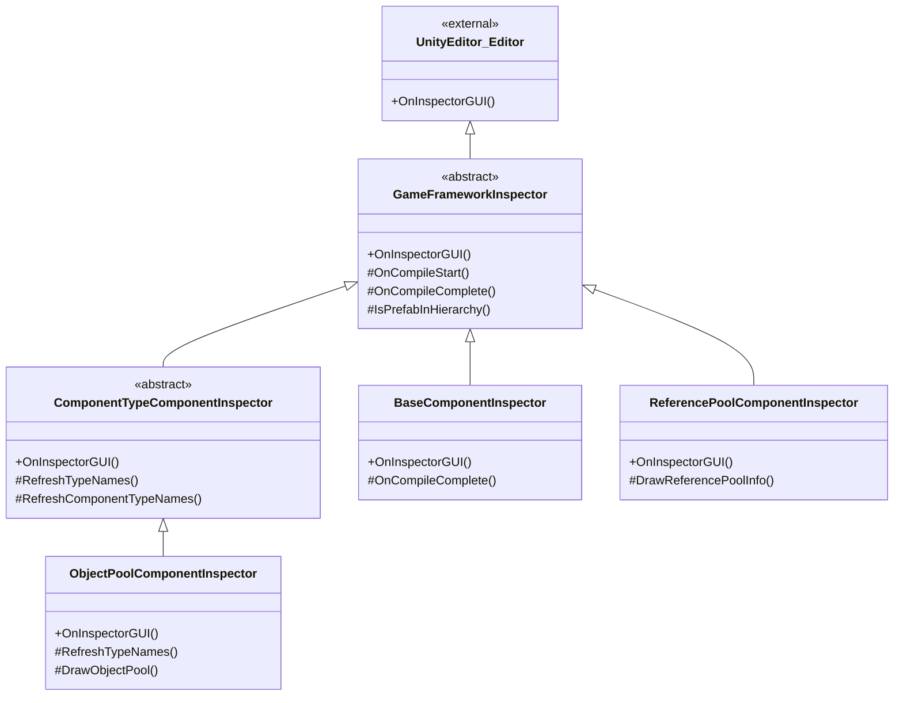

# 인스펙터 패널 도구

인스펙터 패널 도구는 GameFrameX가 Unity 에디터에 제공하는 일련의 커스텀 인스펙터 패널 확장으로, 에디터에서 프레임워크의 각 컴포넌트 런타임 상태와 매개변수를 직관적으로 보고 구성할 수 있습니다.

## 개요

GameFrameX의 인스펙터 패널 도구는 Unity 네이티브 Inspector 시스템을 확장하여 프레임워크 핵심 컴포넌트에 더욱 우호적이고 기능이 풍부한 구성 인터페이스를 제공합니다. 이 커스텀 인스펙터 패널은 에디터 모드에서 컴포넌트 속성 구성뿐만 아니라 런타임에 ObjectPool, ReferencePool 등의 시스템 내부 상태를 실시간으로 표시하여 개발자가 게임 성능을 더 잘 디버깅하고 최적화할 수 있도록 도와줍니다.

인스펙터 패널 도구의 주요 기능은 다음과 같습니다:
- **기초 컴포넌트 인스펙터**: 전역 헬퍼 유형 (텍스트, 버전, 로그, 압축, JSON) 및 런타임 매개변수 (프레임레이트, 게임 속도) 구성
- **오브젝트 풀 인스펙터**: 런타임에 오브젝트 풀 상태 표시, 수동 해제 및 CSV 데이터 내보내기 지원
- **참조 풀 인스펙터**: 어셈블리별로 참조 풀 통계 정보 표시, 데이터 내보내기 지원
- **인스펙터 패널 잠금 단축키**: 메뉴 단축키를 통해 Inspector 잠금 상태 빠르게 전환

## 아키텍처

인스펙터 패널 도구는 객체 지향 상속 구조를 채택하여 추상 基類를 통해 일반 기능을 정의하고 구체적인 인스펙터 구현은 사용자 정의 인터페이스를 제공합니다.



### 핵심 컴포넌트 설명

| 클래스명 | 책임 | 상속 관계 |
|------|------|----------|
| `GameFrameworkInspector` | 모든 커스텀 인스펙터의 추상 基類로, 컴파일 상태 감시 및 Prefab 계층 판단 등 일반 기능 제공 | `UnityEditor.Editor` 상속 |
| `ComponentTypeComponentInspector` | 컴포넌트 유형 선택기의 추상 基類로, 동적으로 컴포넌트 유형을 선택해야 하는 시나리오에 사용 | `GameFrameworkInspector` 상속 |
| `BaseComponentInspector` | `BaseComponent`의 사용자 정의 인스펙터로, 전역 헬퍼 유형 및 런타임 매개변수 구성 | `GameFrameworkInspector` 상속 |
| `ObjectPoolComponentInspector` | `ObjectPoolComponent`의 사용자 정의 인스펙터로, 오브젝트 풀 런타임 상태 표시 | `ComponentTypeComponentInspector` 상속 |
| `ReferencePoolComponentInspector` | `ReferencePoolComponent`의 사용자 정의 인스펙터로, 참조 풀 통계 정보 표시 | `GameFrameworkInspector` 상속 |

## 기능 상세

### 기초 인스펙터 基類

`GameFrameworkInspector`는 모든 커스텀 인스펙터의 基類로, 컴파일 상태 감시 및 Prefab 계층 판단 등 일반 기능을 제공합니다.

```csharp
public abstract class GameFrameworkInspector : UnityEditor.Editor
{
    protected const string NoneOptionName = "<None>";
    private bool m_IsCompiling = false;

    public override void OnInspectorGUI()
    {
        if (m_IsCompiling && !EditorApplication.isCompiling)
        {
            m_IsCompiling = false;
            OnCompileComplete();
        }
        else if (!m_IsCompiling && EditorApplication.isCompiling)
        {
            m_IsCompiling = true;
            OnCompileStart();
        }
    }

    protected bool IsPrefabInHierarchy(UnityEngine.Object obj)
    {
        // 객체가 Prefab 계층 보기에 있는지 판단
    }
}
```
> Source: [GameFrameworkInspector.cs](https://github.com/GameFrameX/com.gameframex.unity/blob/main/Editor/Inspector/GameFrameworkInspector.cs#L1-L57)

**설계 의도:**
- Unity 컴파일 상태 변화 감시하여 컴파일 완료 후 자동으로 유형 목록 새로고침
- Prefab 계층 판단 방법 제공하여 런타임 인스펙터 기능이 씬의 객체에서만 사용 가능하도록 보장

### BaseComponent 인스펙터

`BaseComponentInspector`는 기초 컴포넌트에 풍부한 구성 인터페이스를 제공하며, 전역 헬퍼 유형 선택 및 런타임 매개변수 제어를 포함합니다.

```csharp
[CustomEditor(typeof(BaseComponent))]
internal sealed class BaseComponentInspector : GameFrameworkInspector
{
    private static readonly float[] GameSpeed = new float[] { 0f, 0.01f, 0.1f, 0.25f, 0.5f, 1f, 1.5f, 2f, 4f, 8f };

    public override void OnInspectorGUI()
    {
        base.OnInspectorGUI();
        serializedObject.Update();
        
        // 전역 헬퍼 유형 구성
        EditorGUILayout.BeginVertical("box");
        {
            EditorGUILayout.LabelField("Global Helpers", EditorStyles.boldLabel);
            int textHelperSelectedIndex = EditorGUILayout.Popup("Text Helper", m_TextHelperTypeNameIndex, m_TextHelperTypeNames);
            // ... 기타 헬퍼 유형 구성
        }
        EditorGUILayout.EndVertical();

        // 프레임레이트 구성
        int frameRate = EditorGUILayout.IntSlider("Frame Rate", m_FrameRate.intValue, 1, 120);

        // 게임 속도 구성
        float gameSpeed = EditorGUILayout.Slider("Game Speed", m_GameSpeed.floatValue, 0f, 8f);

        serializedObject.ApplyModifiedProperties();
    }
}
```
> Source: [BaseComponentInspector.cs](https://github.com/GameFrameX/com.gameframex.unity/blob/main/Editor/Inspector/BaseComponentInspector.cs#L40-L193)

**기능 특성:**
- **헬퍼 유형 구성**: 드롭다운 메뉴를 통해 Text, Version, Log, Compression, JSON 등 헬퍼 유형 동적 선택
- **프레임레이트 제어**: 슬라이더로 게임 프레임레이트 (1-120) 제어
- **게임 속도**: 슬라이더 + 사전 설정 버튼으로 시간 배율 (0x - 8x) 제어
- **백그라운드 실행**: Toggle으로 애플리케이션 백그라운드 실행 여부 제어
- **화면 항상 켜짐**: Toggle으로 기기 슬립 금지 여부 제어

### 오브젝트 풀 인스펙터

`ObjectPoolComponentInspector`는 런타임에 오브젝트 풀의 상세 상태 정보를 표시합니다.

```csharp
[CustomEditor(typeof(ObjectPoolComponent))]
internal sealed class ObjectPoolComponentInspector : ComponentTypeComponentInspector
{
    private readonly HashSet<string> m_OpenedItems = new HashSet<string>();

    public override void OnInspectorGUI()
    {
        base.OnInspectorGUI();

        if (!EditorApplication.isPlaying)
        {
            EditorGUILayout.HelpBox("런타임에서만 사용 가능.", MessageType.Info);
            return;
        }

        ObjectPoolComponent t = (ObjectPoolComponent)target;
        if (IsPrefabInHierarchy(t.gameObject))
        {
            EditorGUILayout.LabelField("Object Pool Count", t.Count.ToString());
            ObjectPoolBase[] objectPools = t.GetAllObjectPools(true);
            foreach (ObjectPoolBase objectPool in objectPools)
            {
                DrawObjectPool(objectPool);
            }
        }
    }
}
```
> Source: [ObjectPoolComponentInspector.cs](https://github.com/GameFrameX/com.gameframex.unity/blob/main/Editor/Inspector/ObjectPoolComponentInspector.cs#L43-L72)

**기능 특성:**
- **런타임 사용 가능**: 상세 정보는 게임 실행 중에만 표시
- **접이식 목록**: 각 오브젝트 풀을 펼쳐서 상세 보기 가능
- **실시간 통계**: 풀 용량, 사용 카운트, 사용 가능 해제 수량, 만료 시간 등 표시
- **수동 해제**: Release 및 Release All Unused 버튼 제공
- **CSV 내보내기**: 오브젝트 풀 데이터를 CSV 파일로 내보내기 분석 지원

### 참조 풀 인스펙터

`ReferencePoolComponentInspector`는 어셈블리별로 참조 풀의 통계 정보를 표시합니다.

```csharp
[CustomEditor(typeof(ReferencePoolComponent))]
internal sealed class ReferencePoolComponentInspector : GameFrameworkInspector
{
    private readonly Dictionary<string, List<ReferencePoolInfo>> m_ReferencePoolInfos = new Dictionary<string, List<ReferencePoolInfo>>();

    public override void OnInspectorGUI()
    {
        base.OnInspectorGUI();
        serializedObject.Update();

        ReferencePoolComponent t = (ReferencePoolComponent)target;

        if (EditorApplication.isPlaying && IsPrefabInHierarchy(t.gameObject))
        {
            // 엄격 확인 스위치 표시
            bool enableStrictCheck = EditorGUILayout.Toggle("Enable Strict Check", t.EnableStrictCheck);
            
            // 어셈블리별로 참조 풀 정보 표시
            foreach (KeyValuePair<string, List<ReferencePoolInfo>> assemblyReferencePoolInfo in m_ReferencePoolInfos)
            {
                bool currentState = EditorGUILayout.Foldout(lastState, assemblyReferencePoolInfo.Key);
                // 상세 통계 정보 표시
            }
        }
    }
}
```
> Source: [ReferencePoolComponentInspector.cs](https://github.com/GameFrameX/com.gameframex.unity/blob/main/Editor/Inspector/ReferencePoolComponentInspector.cs#L42-L151)

**기능 특성:**
- **어셈블리 그룹화**: 어셈블리 이름별로 참조 풀 표시
- **상세 통계**: 미사용/사용 중/가져오기/반환/추가/제거 참조 카운트 표시
- **엄격 확인 스위치**: 런타임에 엄격 확인 활성화/비활성화 제어
- **축약/완전 클래스명 전환**: 짧은 클래스명 또는 완전한 클래스명 표시 선택
- **CSV 내보내기**: 데이터 내보내기 기능 지원

### 인스펙터 패널 잠금 단축키

`InspectorLockShortcut`은 Inspector 잠금 상태를 빠르게 전환하기 위한 에디터 창을 제공합니다.

```csharp
public sealed class InspectorLockShortcut : EditorWindow
{
    [MenuItem("Window/Toggle Inspector Lock %l")]
    private static void ToggleInspectorLock()
    {
        // Inspector 창 가져오기
        var inspectorType = typeof(UnityEditor.Editor).Assembly.GetType("UnityEditor.InspectorWindow");
        var inspectorWindow = EditorWindow.GetWindow(inspectorType);
        // 리플렉션을 사용하여 isLocked 속성 호출
        var isLockedProperty = inspectorType.GetProperty("isLocked");
        var isLocked = (bool)isLockedProperty.GetValue(inspectorWindow);
        isLockedProperty.SetValue(inspectorWindow, !isLocked);
    }
}
```
> Source: [InspectorLockShortcut.cs](https://github.com/GameFrameX/com.gameframex.unity/blob/main/Editor/InspectorLockShortcut/InspectorLockShortcut.cs#L5-L18)

**기능 특성:**
- **단축키**: `Ctrl+L` (Mac에서 `Cmd+L`)으로 빠르게 전환
- **메뉴 진입점**: `Window` 메뉴에 `Toggle Inspector Lock` 옵션 표시
- **리플렉션 구현**: Unity 내부 API를 호출하여 잠금 기능 구현

## 사용 방법

### 기초 컴포넌트 구성 보기

1. Unity 씬에서 빈 객체 생성, `BaseComponent` 컴포넌트 추가
2. 해당 객체를 선택하고 Inspector 패널에서 커스텀 인스펙터 확인
3. 드롭다운 메뉴에서 각종 헬퍼 유형 선택
4. 프레임레이트 및 게임 속도 슬라이더 조정

### 런타임 오브젝트 풀 상태 보기

1. 게임 씬 실행
2. `ObjectPoolComponent`가 포함된 게임 객체 선택
3. 각 오브젝트 풀을 펼쳐 상세 정보 확인
4. Release 버튼을 클릭하여 객체 수동 해제
5. Export CSV Data를 클릭하여 데이터 내보내기

### 런타임 참조 풀 상태 보기

1. 게임 씬 실행
2. `ReferencePoolComponent`가 포함된 게임 객체 선택
3. 어셈블리별로 펼쳐서各类 참조 통계 확인
4. Show Full Class Name 전환하여 완전한 클래스명 보기
5. CSV 데이터 내보내기 성능 분석

### 인스펙터 패널 잠금

1. `Ctrl+L` 누르기 (또는 `Window > Toggle Inspector Lock` 메뉴)
2. Inspector 패널이 현재 선택한 객체로 잠김
3. 다시 단축키를 누르면 잠금 해제

## 인스펙터 확장

프레임워크는 확장 가능한 基類를 제공하여 개발자가 이를 기반으로 커스텀 인스펙터를 생성할 수 있습니다.

### GameFrameworkInspector 상속

```csharp
[CustomEditor(typeof(MyComponent))]
public class MyComponentInspector : GameFrameworkInspector
{
    public override void OnInspectorGUI()
    {
        base.OnInspectorGUI();
        serializedObject.Update();
        
        // 커스텀 인스펙터 로직
        
        serializedObject.ApplyModifiedProperties();
    }

    protected override void OnCompileComplete()
    {
        base.OnCompileComplete();
        // 컴파일 완료 후 데이터 새로고침
    }
}
```

### ComponentTypeComponentInspector 상속

```csharp
[CustomEditor(typeof(MyComponentWithType))]
public class MyComponentWithTypeInspector : ComponentTypeComponentInspector
{
    protected override void RefreshTypeNames()
    {
        RefreshComponentTypeNames(typeof(IMyInterface));
    }

    protected override void Enable()
    {
        // 추가 초기화 로직
    }
}
```

## 관련 링크

- [런타임 모듈 개요](./5-runtime.base)
- [오브젝트 풀 시스템](./5-runtime.object-pool)
- [참조 풀 시스템](./5-runtime.reference-pool)
- [빌드 도구](./6-editor-tools.build-tools)
- [패키지 관리 도구](./6-editor-tools.package-management)