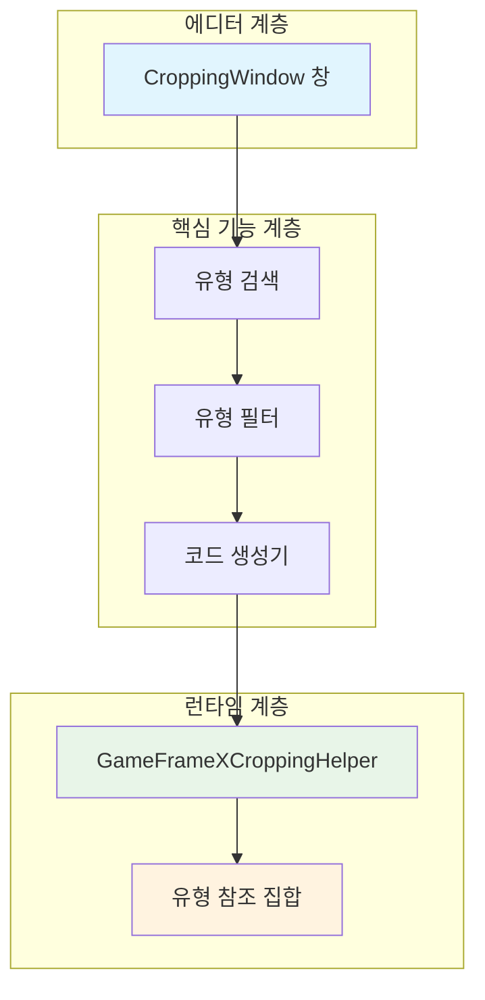
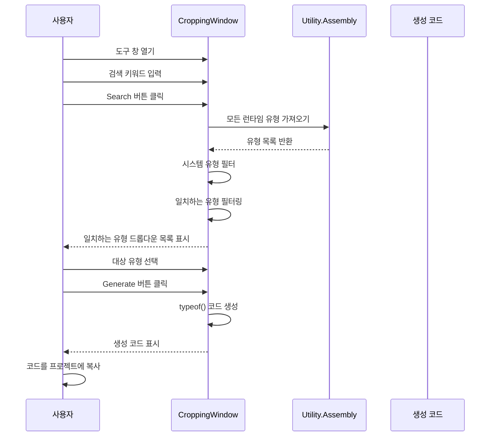

# 이미지 크롭핑 도구

이미지 크롭핑 도구 (실제 이름은 "防止裁剪代码生成工具", 즉 코드 차단 방지 도구) は GameFrameX가 Unity 에디터 확장으로, IL2CPP 빌드 시 코드가 잘못 제거되는 문제를 해결합니다.

## 개요

Unity 프로젝트에서 IL2CPP를 사용하여 빌드할 때 컴파일러는 직접 참조되지 않은 코드를 자동으로 제거합니다 (코드 차단). 그러나 코드가 리플렉션 또는 기타 동적 방식으로 사용될 때 이러한 유형은 잘못 제거되어 런타임에 `MissingMethodException` 또는 유형 해석 실패 문제가 발생할 수 있습니다.

이미지 크롭핑 도구는 다음 방식으로这个问题를 해결합니다:
1. 시각적 인터페이스를 제공하여 어셈블리의 유형 검색
2. `typeof(TypeName)` 코드를 생성하여 유형에 대한 참조 유지
3. 생성된 코드를 프로젝트에 추가하여 IL2CPP가 이러한 유형을 제거하지 않도록 보호

## 아키텍처



### 핵심 컴포넌트

| 컴포넌트 | 파일 경로 | 책임 |
|------|----------|------|
| CroppingWindow | `Editor/Cropping/CroppingWindow.cs` | 에디터 창 UI, 유형 검색, 코드 생성 |
| GameFrameXCroppingHelper | `Runtime/GameFrameXCroppingHelper.cs` | 런타임 유형 참조 유지 템플릿 |

## 작업 흐름



## 사용 가이드

### 도구 창 열기

Unity 에디터 메뉴바에서 `GameFrameX` → `Cropping(防止裁剪代码生成)` 을 클릭하여 도구 창을 엽니다.

```csharp
// 메뉴 항목 정의
[MenuItem("GameFrameX/Cropping(防止裁剪代码生成)", false, 2001)]
public static void ShowWindow()
{
    var window = GetWindow<CroppingWindow>("Cropping");
    window.minSize = new UnityEngine.Vector2(800, 600);
    window.maxSize = window.minSize;
    window.maximized = false;
    window.Show();
}
```
> Source: [CroppingWindow.cs](https://github.com/GameFrameX/com.gameframex.unity/blob/main/Editor/Cropping/CroppingWindow.cs#L45-L55)

### 유형 검색

1. "查询类型" 텍스트 상자에 검색할 유형 이름 키워드를 입력합니다
2. `Search(查询)` 버튼을 클릭합니다
3. 도구가 모든 런타임 어셈블리를 스캔하여 시스템 유형 (UnityEngine, UnityEditor, System 등)을 제외합니다
4. 드롭다운 목록에서 처리할 유형을 선택합니다

```csharp
// 유형 검색 로직
string searchText = _searchText.ToLower();
var types = Utility.Assembly.GetTypes();
var result = new List<string>();
foreach (var type in types)
{
    var fullName = type.FullName.ToLower();
    var isFind = false;
    foreach (var ignoredType in _ignoredTypes)
    {
        if (fullName.Contains(ignoredType))
        {
            isFind = true;
            break;
        }
    }
    if (isFind) continue;
    
    if (fullName.Contains(searchText))
    {
        result.Add(type.FullName);
    }
}
```
> Source: [CroppingWindow.cs](https://github.com/GameFrameX/com.gameframex.unity/blob/main/Editor/Cropping/CroppingWindow.cs#L76-L102)

### 방지 코드 생성

1. 드롭다운 목록에서 대상 유형을 선택합니다 (일반적으로 어셈블리의 루트 네임스페이스 유형 선택)
2. `Generate(生成)` 버튼을 클릭합니다
3. 도구가 해당 어셈블리의 모든 유형에 대한 `typeof()` 참조 코드를 생성합니다
4. 생성된 코드를 프로젝트의 `CroppingHelper.cs` 파일에 복사합니다

```csharp
// 코드 생성 로직
private void Generate(string targetTypeName)
{
    var targetType = Utility.Assembly.GetType(targetTypeName);
    if (targetType != null)
    {
        var types = targetType.Assembly.GetTypes();
        types = types.OrderBy(m => m.FullName).ToArray();
        StringBuilder stringBuilder = new StringBuilder();
        foreach (var type in types)
        {
            if (type.IsNestedPrivate) continue;
            if (type.FullName.Contains("PrivateImplementationDetails")) continue;
            
            stringBuilder.AppendLine(" _ = typeof(" + type.FullName.Replace("+", ".").Replace("`1", "<>").Replace("`2", "<,>") + ");");
        }
        _generatedText = stringBuilder.ToString();
    }
}
```
> Source: [CroppingWindow.cs](https://github.com/GameFrameX/com.gameframex.unity/blob/main/Editor/Cropping/CroppingWindow.cs#L136-L163)

### 생성된 코드 사용

생성된 코드를 Unity 프로젝트의 스크립트 파일에 복사합니다:

```csharp
using UnityEngine;

namespace GameFrameX.Runtime
{
    public class GameFrameXCroppingHelper : MonoBehaviour
    {
        private void Start()
        {
            // 생성된 코드 예시
            _ = typeof(GameFrameX.Runtime.SomeClass);
            _ = typeof(GameFrameX.Runtime.AnotherClass);
            // ... 더 많은 유형
        }
    }
}
```
> Source: [GameFrameXCroppingHelper.cs](https://github.com/GameFrameX/com.gameframex.unity/blob/main/Runtime/GameFrameXCroppingHelper.cs#L1-L10)

## 제외 시스템 유형

도구는 기본적으로 다음 어셈블리의 유형을 제외하여 불필요한 코드 생성을 피합니다:

| 제외 접두사 | 설명 |
|----------|------|
| unityengine | Unity 핵심 엔진 유형 |
| unityeditor | Unity 에디터 유형 |
| mono | Mono 런타임 유형 |
| system | .NET System 유형 |
| dnlib | 어셈블리 해석 라이브러리 |
| unity.hotfix | 핫 업데이트 유형 |
| unity.baselib | 기초 라이브러리 유형 |
| .editor | 에디터 관련 |
| jetbrains | JetBrains 도구 유형 |
| nunit | NUnit 테스트 프레임워크 |

```csharp
private readonly string[] _ignoredTypes = new string[] { 
    "unityengine".ToLower(), 
    "unityeditor".ToLower(), 
    "mono".ToLower(), 
    "system".ToLower(), 
    "dnlib".ToLower(), 
    "unity.hotfix".ToLower(), 
    "unity.baselib".ToLower(), 
    ".editor".ToLower(), 
    "jetbrains".ToLower(), 
    "nunit".ToLower() 
};
```
> Source: [CroppingWindow.cs](https://github.com/GameFrameX/com.gameframex.unity/blob/main/Editor/Cropping/CroppingWindow.cs#L58)

## 일반 사용 시나리오

### 시나리오 1: 리플렉션 호출 유형

리플렉션을 사용하여 동적으로 객체를 생성하거나 메서드를 호출할 때:

```csharp
// 이러한 코드로 인해 유형이 제거될 수 있음
var type = Type.GetType("GameFrameX.Runtime.DynamicClass");
var instance = Activator.CreateInstance(type);
```

### 시나리오 2: JSON 직렬화

JSON 직렬화 라이브러리를 사용할 때 유형 정보가 손실될 수 있습니다:

```csharp
// Newtonsoft.Json 또는 기타 직렬화 라이브러리
string json = JsonConvert.SerializeObject(someObject);
// 역직렬화 시 유형 존재 필요
var obj = JsonConvert.DeserializeObject<DynamicType>(json);
```

### 시나리오 3: 인터페이스와 구현 분리

의존성 주입 또는 팩토리 패턴을 사용할 때:

```csharp
// 구성 파일 또는 리플렉션을 통해 어셈블리 로드
var assembly = Assembly.Load("GameFrameX.Plugin");
var type = assembly.GetType("GameFrameX.Plugin.IPlugin");
```

## 생성된 코드 템플릿 구성

생성된 코드는 다음 유형을 제외합니다:

1. **중첩 비공개 유형** (`IsNestedPrivate`) - 일반적으로 내부 구현 세부 사항
2. **PrivateImplementationDetails** - 컴파일러가 생성한 보조 유형

```csharp
foreach (var type in types)
{
    if (type.IsNestedPrivate)
    {
        continue;  // 중첩 비공개 유형 건너뛰기
    }
    
    if (type.FullName.Contains("PrivateImplementationDetails"))
    {
        continue;  // 컴파일러 생성 세부 사항 건너뛰기
    }
    
    // typeof() 코드 생성
}
```
> Source: [CroppingWindow.cs](https://github.com/GameFrameX/com.gameframex.unity/blob/main/Editor/Cropping/CroppingWindow.cs#L147-L156)

## 관련 링크

- [빌드 도구](./6-editor-tools.build-tools) - Unity 프로젝트 빌드 자동화 도구
- [패키지 관리 도구](./6-editor-tools.package-management) - Unity 패키지 관리 도구
- [인스펙터 패널 도구](./6-editor-tools.inspector-tools) - 커스텀 Inspector 패널 도구
- [오브젝트 풀 시스템](./5-runtime.object-pool) - 오브젝트 풀 관리 시스템
- [참조 풀 시스템](./5-runtime.reference-pool) - 참조 풀 관리 시스템