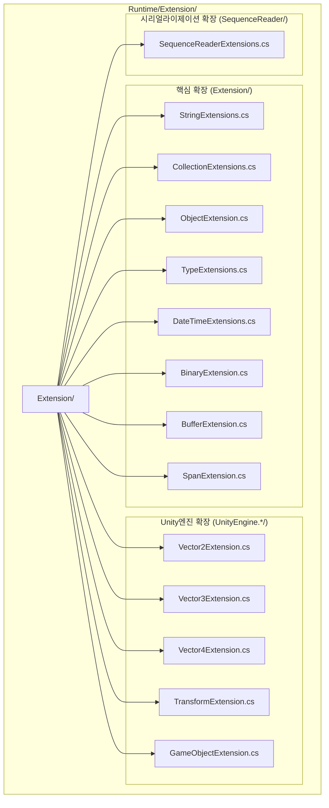

# 확장 메서드 라이브러리

GameFrameX 확장 메서드 라이브러리는 .NET 기본 타입과 Unity 엔진 타입을 위한 풍부한 확장 메서드를 제공하며, 일반적인 프로그래밍 작업을 간소화하고 개발 효율을 향상시키는 것을 목표로 합니다. 모든 확장 메서드는 Unity 패키징 시 코드 크롭핑(code stripping)을 방지하기 위해 `[UnityEngine.Scripting.Preserve]` 특성을 사용하여 표시되어 있습니다.

## 개요

확장 메서드 라이브러리는 GameFrameX 프레임워크의 핵심 기본 컴포넌트 중 하나로, 표준 라이브러리 타입과 Unity 엔진 타입에 대한 확장 기능을 제공합니다. 이러한 확장 메서드는 C# 확장 메서드 구문 규범을 따르며, 정적 클래스의 형태로 제공되어 확장 메서드를 지원하는 모든 위치에서 직접 사용할 수 있습니다.

### 설계 목표

확장 메서드 라이브러리는 다음 핵심 원칙을 따릅니다:

1. **일반 작업 간소화**: 복잡한 작업을 간결한 API 호출로 캡슐화
2. **성능 향상**:高频 작업에 성능 최적화 버전 제공 (예: 문자열 빠른 비교)
3. **타입 안전성**: 제네릭과 강타입을 최대한 활용하여 컴파일 타임 안전성 보장
4. **Unity 호환성**: 모든 메서드는 Unity 플랫폼의 특수 요구 사항을 고려

### 디렉토리 구조

확장 메서드 라이브러리의 소스 코드 조직 구조는 다음과 같습니다:



## 핵심 기능 분류

확장 메서드 라이브러리가 제공하는 기능은 다음 주요 카테고리로 분류됩니다:

### 1. 문자열 확장 메서드

문자열 확장 메서드는 문자열의 빠른 비교, 형식 변환, 인코딩 변환 등의 기능을 제공합니다.

**주요 기능:**

- 빠른 문자열 비교: `EqualsFast`, `StartsWithFast`, `EndsWithFast` - 문자열 끝에서부터 문자를 비교하여 표준 메서드보다 성능이 우수
- 문자열 인코딩 변환: `ToBytes`, `ToByteArray`, `ToUtf8` - 기본 인코딩 및 UTF-8 인코딩 지원
- 16진수 변환: `HexToBytes` - 16진수 문자열을 바이트 배열로 변환
- Null 값 검사: `IsNullOrEmpty`, `IsNullOrWhiteSpace`, `IsNotNullOrEmpty`, `IsNotNullOrWhiteSpace`
- 형식화 및 정리: `Format`, `TrimEmpty`, `TrimZhCn` - 공백 문자 또는 한글자 제거
- 네이밍 변환: `ConvertToSnakeCase` - 카멜 네이밍을 스네이크 네이밍으로 변환
- 문자열 분할: `SplitToIntArray`, `SplitTo2IntArray` - 문자열을 정수 배열로 분할

```csharp
// 빠른 문자열 비교 예시
string str = "Hello World";
bool isMatch = str.EqualsFast("hello world"); // false 반환 (대소문자 구분)
bool startsWithHello = str.StartsWithFast("Hello"); // true 반환
bool endsWithWorld = str.EndsWithFast("World"); // true 반환

// 문자열을 바이트 배열로
byte[] bytes = str.ToUtf8(); // UTF-8 인코딩
byte[] defaultBytes = str.ToByteArray(); // 기본 인코딩

// 16진수 문자열을 바이트 배열로
string hex = "48656C6C6F";
byte[] hexBytes = hex.HexToBytes(); // [72, 101, 108, 108, 111]

// Null 값 검사
string nullStr = null;
bool emptyCheck = nullStr.IsNullOrEmpty(); // true
bool whitespaceCheck = "   ".IsNullOrWhiteSpace(); // true
```
> Source: [StringExtensions.cs](https://github.com/GameFrameX/com.gameframex.unity/blob/main/Runtime/Extension/Extension/StringExtensions.cs#L31-L58)

### 2. 집합 확장 메서드

집합 확장 메서드는 Dictionary, List, HashSet 등 집합 타입에 편리한 작업 메서드를 제공합니다.

**주요 기능:**

- Dictionary 확장:
  - `Merge` - 키-값 쌍 병합, 커스텀 병합 함수 지원
  - `GetOrAdd` - 요소 가져오기 또는 추가, 기본값 및 팩토리 메서드 지원
  - `RemoveIf` - 조건에 따라 요소 제거
- List 확장:
  - `Shuffle` - Fisher-Yates 셔플 알고리즘으로 리스트 순서 무작위화
  - `RemoveIf` - 조건에 따라 요소 제거
  - `ListToString` - 리스트를 구분자로 연결된 문자열로 변환
- HashSet 확장:
  - `AddRange` -批量 추가 요소
- ICollection 확장:
  - `IsNullOrEmpty` - 집합이 비어있는지 검사

```csharp
// Dictionary 사용 예시
var dict = new Dictionary<string, int>();
dict.Merge("score", 100, (old, newVal) => old + newVal); // 값 병합
int value = dict.GetOrAdd("newKey", k => 100); // 가져오기 또는 생성

// List 사용 예시
var list = new List<int> { 1, 2, 3, 4, 5 };
list.Shuffle(); // 무작위 섞기
list.RemoveIf(x => x > 3); // 3보다 큰 요소 제거
string result = list.ListToString(","); // "1,2,3,"
```
> Source: [CollectionExtensions.cs](https://github.com/GameFrameX/com.gameframex.unity/blob/main/Runtime/Extension/Extension/CollectionExtensions.cs#L33-L77)

### 3. 객체 확장 메서드

객체 확장 메서드는 객체의 null 값 검사 및 검증 기능을 제공합니다.

**주요 기능:**

- `IsNull` - 객체가 null인지 검사
- `IsNotNull` - 객체가 null이 아닌지 검사
- `CheckNull` - 객체가 null인지 검사, null인 경우 ArgumentNullException 발생

```csharp
object obj = null;
bool isNull = obj.IsNull(); // true
bool isNotNull = obj.IsNotNull(); // false

object validObj = new object();
validObj.CheckNull("validObj"); // 예외 발생하지 않음
```
> Source: [ObjectExtension.cs](https://github.com/GameFrameX/com.gameframex.unity/blob/main/Runtime/Extension/Extension/ObjectExtension.cs#L18-L47)

### 4. 타입 확장 메서드

타입 확장 메서드는 타입이 특정 인터페이스를 구현했는지 검사하는 데 사용됩니다.

**주요 기능:**

- `IsImplWithInterface` - 타입이 지정된 인터페이스를 구현했는지 검사, 직접 구현만 검사 또는 상속 체인 포함 검사 지원

```csharp
// 타입이 인터페이스를 구현했는지 검사
Type type = typeof(List<string>);
bool implements = type.IsImplWithInterface(typeof(IEnumerable<object>), false); // true
bool directOnly = type.IsImplWithInterface(typeof(IList<string>), true); // true
```
> Source: [TypeExtensions.cs](https://github.com/GameFrameX/com.gameframex.unity/blob/main/Runtime/Extension/Extension/TypeExtensions.cs#L30-L58)

### 5. DateTime 확장 메서드

DateTime 확장 메서드는 날짜 시간 관련 계산 기능을 제공합니다.

**주요 기능:**

- `GetDaysFrom` - 지정된 날짜부터 현재 날짜까지의 일수 차이 계산
- `GetDaysFromDefault` - 1970년 1월 1일부터 현재 날짜까지의 일수 차이 계산

```csharp
DateTime now = DateTime.Now;
int days = now.GetDaysFrom(new DateTime(2020, 1, 1)); // 2020년 1월 1일로부터의 일수
int unixDays = now.GetDaysFromDefault(); // Unix 타임스탬프에 해당하는 일수
```
> Source: [DateTimeExtensions.cs](https://github.com/GameFrameX/com.gameframex.unity/blob/main/Runtime/Extension/Extension/DateTimeExtensions.cs#L23-L40)

### 6. 바이너리 확장 메서드

바이너리 확장 메서드는 BinaryReader 및 BinaryWriter를 위해 7비트 인코딩 정수 및 암호화된 문자열의 읽기/쓰기 기능을 제공합니다.

**주요 기능:**

- 7비트 인코딩 정수 읽기/쓰기:
  - `Read7BitEncodedInt32` / `Write7BitEncodedInt32`
  - `Read7BitEncodedUInt32` / `Write7BitEncodedUInt32`
  - `Read7BitEncodedInt64` / `Write7BitEncodedInt64`
  - `Read7BitEncodedUInt64` / `Write7BitEncodedUInt64`
- 암호화된 문자열 읽기/쓰기:
  - `ReadEncryptedString` - 암호화된 문자열 읽기
  - `WriteEncryptedString` - 암호화된 문자열 쓰기

7비트 인코딩은 가변 길이 인코딩 방식으로, 시리얼라이제이션 시 공간을 절약하며 작은 정수는 더 적은 바이트数を占用합니다.

### 7. 버퍼 확장 메서드

버퍼 확장 메서드는 바이트 배열에 타입화된 읽기/쓰기 작업을 제공하며, 빅 엔디안(네트워크 바이트 순서)을 지원합니다.

**쓰기 메서드:**

- `WriteInt`, `WriteUInt`, `WriteShort`, `WriteUShort`
- `WriteLong`, `WriteFloat`, `WriteDouble`
- `WriteByte`, `WriteSByte`, `WriteBool`
- `WriteBytes`, `WriteBytesWithoutLength`, `WriteString`

**읽기 메서드:**

- `ReadInt`, `ReadUInt`, `ReadShort`, `ReadUShort`
- `ReadLong`, `ReadFloat`, `ReadDouble`
- `ReadByte`, `ReadSByte`, `ReadBool`
- `ReadBytes`, `ReadString`

**변환 메서드:**

- `ToHex`, `ToHex(format)`, `ToHex(offset, count)` - 바이트 배열을 16진수 문자열로 변환
- `ToDefaultString`, `ToUtf8String` - 바이트 배열을 문자열로 변환

```csharp
byte[] buffer = new byte[1024];
int offset = 0;

// 다양한 타입 쓰기
buffer.WriteInt(12345, ref offset);
buffer.WriteFloat(3.14f, ref offset);
buffer.WriteString("Hello", ref offset);

// 다양한 타입 읽기
offset = 0;
int intVal = buffer.ReadInt(ref offset);
float floatVal = buffer.ReadFloat(ref offset);
string strVal = buffer.ReadString(ref offset);

// 바이트 배열을 16진수 문자열로
byte[] data = new byte[] { 0x48, 0x65, 0x6C, 0x6C, 0x6F };
string hex = data.ToHex(); // "48656C6C6F"
```
> Source: [BufferExtension.cs](https://github.com/GameFrameX/com.gameframex.unity/blob/main/Runtime/Extension/Extension/BufferExtension.cs#L90-L103)

### 8. Span 확장 메서드

Span 확장 메서드는 `Span<byte>`를 위해 BufferExtension과 유사한 읽기/쓰기 작업을 제공하며,高性能 시나리오에 사용됩니다.

## Unity 엔진 확장

### 1. Vector 확장 메서드

Vector 확장 메서드는不同维度 벡터 간의 변환 기능을 제공합니다.

**Vector2 확장:**

- `ToVector3` - Vector3으로 변환 (y分量은 0 또는 지정된 값으로 설정)
- `ToVector4` - Vector4으로 변환 (z, w分量은 0으로 설정)
- `AsVector3` - Vector3으로 변환 (z分量은 0으로 설정)

**Vector3 확장:**

- `ToVector2` - Vector2으로 변환 (x, z分量 취함)
- `ToVector3(Vector3Int)` - Vector3Int로부터 변환
- `ToVector4` - Vector4으로 변환 (w分量은 0으로 설정)

**Vector4 확장:**

- `ToVector2` - Vector2으로 변환 (x, y分量 취함)
- `ToVector3` - Vector3으로 변환 (x, y, z分量 취함)

```csharp
Vector2 v2 = new Vector2(1, 2);
Vector3 v3 = v2.ToVector3(); // (1, 0, 2)
Vector3 v3WithY = v2.ToVector3(5); // (1, 5, 2)
Vector4 v4 = v2.ToVector4(); // (1, 2, 0, 0)

Vector3 v3 = new Vector3(1, 2, 3);
Vector2 v2FromV3 = v3.ToVector2(); // (1, 3)
```
> Source: [UnityEngine.Vector2Extension.cs](https://github.com/GameFrameX/com.gameframex.unity/blob/main/Runtime/Extension/UnityEngine.Vector2/UnityEngine.Vector2Extension.cs#L17-L35)

### 2. Transform 확장 메서드

Transform 확장 메서드는便捷한 Transform 컴포넌트操作 기능을 제공합니다.

**위치操作:**

- 世界座標 설정: `SetPositionX`, `SetPositionY`, `SetPositionZ`
- 世界座標增量: `AddPositionX`, `AddPositionY`, `AddPositionZ`
- 로컬座標 설정: `SetLocalPositionX`, `SetLocalPositionY`, `SetLocalPositionZ`
- 로컬座標增量: `AddLocalPositionX`, `AddLocalPositionY`, `AddLocalPositionZ`

**스케일操作:**

- 스케일 설정: `SetLocalScaleX`, `SetLocalScaleY`, `SetLocalScaleZ`
- 스케일增量: `AddLocalScaleX`, `AddLocalScaleY`, `AddLocalScaleZ`

**기타操作:**

- `FindChildName` - 재귀적 하위 노드 검색
- `LookAt2D` - 2D 공간에서 목표를 향해 회전
- `Reset` - Transform 초기화 (위치, 회전, 스케일)
- `SetParentAndReset` - 부모 설정 및 초기화

```csharp
Transform transform = someObject.transform;

// 개별 좌표分量 설정
transform.SetPositionX(5f);
transform.AddPositionY(2f);

// 로컬 좌표 설정
transform.SetLocalPositionZ(0f);

// 스케일 설정
transform.SetLocalScaleX(2f);

// 하위 노드 검색
Transform child = transform.FindChildName("ChildName");

// 2D 방향 설정
transform.LookAt2D(new Vector2(10, 5));

// 초기화
transform.Reset();
```
> Source: [UnityEngine.TransformExtension.cs](https://github.com/GameFrameX/com.gameframex.unity/blob/main/Runtime/Extension/UnityEngine.Transform/UnityEngine.TransformExtension.cs#L55-L92)

### 3. GameObject 및 Component 확장 메서드

GameObject 및 Component 확장 메서드는 게임 객체 및 컴포넌트의便捷操作을 제공합니다.

**컴포넌트操作:**

- `GetOrAddComponent<T>` - 컴포넌트 가져오기 또는 추가
- `GetOrAddComponent(Type)` - 지정된 타입의 컴포넌트 가져오기 또는 추가
- `DestroyComponent<T>` - 지정된 타입의 컴포넌트销毁
- `DestroyComponent` - 자기 자신의 컴포넌트销毁

**게임 객체操作:**

- `InScene` - GameObject가 씬에 있는지 검사
- `SetLayerRecursively` - 게임 객체 및 하위 객체의 레이어를 재귀적으로 설정

```csharp
GameObject go = someGameObject;

// 컴포넌트 가져오기 또는 추가
Rigidbody rb = go.GetOrAddComponent<Rigidbody>();
AudioSource audio = go.GetOrAddComponent<AudioSource>();

// 컴포넌트销毁
go.DestroyComponent<Rigidbody>();

// 씬에 있는지 검사
bool inScene = go.InScene(); // true는 씬에 있음, false는 프리팹

// 레이어 재귀적으로 설정
go.SetLayerRecursively(LayerMask.NameToLayer("UI"));
```
> Source: [UnityEngage.GameObjectExtension.cs](https://github.com/GameFrameX/com.gameframex.unity/blob/main/Runtime/Extension/UnityEngage.GameObject/UnityEngage.GameObjectExtension.cs#L60-L90)

## 사용 예시

### 종합 예시

다음 예시는 프로젝트에서 확장 메서드 라이브러리를 실제로 사용하는 방법을 보여줍니다:

```csharp
using GameFrameX.Runtime;
using UnityEngine;
using System.Collections.Generic;

public class ExtensionMethodDemo : MonoBehaviour
{
    void Start()
    {
        // 문자열 작업
        string json = "{\"name\":\"Player\",\"score\":100}";
        if (json.IsNotNullOrWhiteSpace())
        {
            Debug.Log($"JSON 유효, 길이: {json.ToUtf8().Length}");
        }

        // 집합 작업
        var scores = new Dictionary<string, int>
        {
            { "Player1", 100 },
            { "Player2", 200 }
        };
        
        // 점수 병합
        scores.Merge("Player1", 50, (old, newVal) => old + newVal);
        
        // 새 플레이어 가져오기 또는 추가
        int player3Score = scores.GetOrAdd("Player3", k => 0);

        // Unity 객체 작업
        var child = transform.FindChildName("HealthBar");
        child?.SetPositionX(0);
        
        // 컴포넌트 가져오기 또는 추가
        var animator = gameObject.GetOrAddComponent<Animator>();
        
        // 리스트 작업
        var items = new List<string> { "Sword", "Shield", "Potion" };
        items.Shuffle(); // 무작위 정렬
        Debug.Log(items.ListToString(", "));
    }
}
```

## 성능 최적화 설명

확장 메서드 라이브러리는 성능 최적화 버전의 메서드를 포함합니다:

1. **문자열 빠른 비교**: `EqualsFast`, `StartsWithFast`, `EndsWithFast` 메서드는 문자열 끝에서부터 비교하여 공통 접미사/접두사를 가진 문자열 비교 시 더 나은 성능을 제공할 수 있습니다.

2. **버퍼 직접 操作**: `Span<T>`와不安全 포인터 操作을 사용하여 경계 검사를 피하고 네이티브에 가까운 성능을 제공합니다.

3. **7비트 인코딩 정수**: 가변 길이 인코딩으로 정수를 표현하여 작은 정수는 더 적은 바이트数を占用하므로, 대량 정수 시리얼라이제이션 시나리오에 적합합니다.

## 관련 링크

- [기초 컴포넌트](./5-runtime.base) - GameFrameX 기초 컴포넌트 시스템
- [보조 클래스](./5-runtime.helper-classes) - 보조 도구 클래스
- [도구 클래스](./5-runtime.utility-classes) - 유틸리티 도구 세트
- [GitHub 저장소](https://github.com/GameFrameX/com.gameframex.unity)
