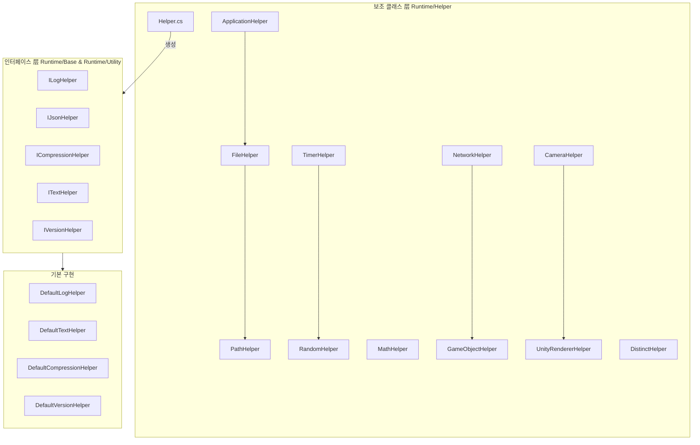

# 보조 클래스

GameFrameX 프레임워크가 제공하는 보조 클래스 모듈로, 애플리케이션, 파일, 경로, 수학, 난수, 시간, 네트워크, 게임 객체, 카메라, 렌더링 등 다양한 분야의 실용 도구 메서드를 포함합니다.

## 개요

보조 클래스(Helper Classes)는 GameFrameX 프레임워크의 기초 도구 层으로, 개발자에게 일상적인 개발에서常用的 정적 도구 메서드를 제공합니다. 이러한 보조 클래스는 Unity 개발 및 범용 프로그래밍의 일반적인 작업을 통일되고便捷한 방식으로 캡슐화하여, 개발자가 비즈니스 로직 구현에 더 집중할 수 있도록 도와줍니다.

### 설계 목표

GameFrameX 보조 클래스 시스템의 설계는 다음 원칙을 따릅니다:

1. **통일 진입점**: `Helper` 팩토리 클래스를 통해 통일된 보조기(Helper) 생성 메커니즘 제공
2. **플랫폼 어댑션**: Editor, Windows, Mac, Android, iOS, WebGL 등 다양한 Unity 플랫폼의 차이를 자동으로 처리
3. **성능 최적화**: `ThreadLocalRandom` 등의 메커니즘을 사용하여 멀티 스레드 안전성 보장
4. **확장성**: `ILogHelper`, `IJsonHelper` 등의 인터페이스를 통해 커스텀 구현 지원

### 보조 클래스 분류

GameFrameX의 보조 클래스는 다음 카테고리로 분류됩니다:

| 카테고리 | 보조 클래스 | 기능 설명 |
|------|--------|----------|
| 애플리케이션层 | `ApplicationHelper` | 플랫폼 감지, 애플리케이션 제어, URL 열기 |
| 파일/경로 | `FileHelper`, `PathHelper` | 파일 읽기/쓰기, 디렉토리操作, 경로 결합 |
| 수학 계산 | `MathHelper`, `PositionHelper` | 직사각형 교차 감지, 위치 계산 |
| 난수 | `RandomHelper` | 다양한 난수 생성 메서드 |
| 시간 | `TimerHelper` | Unix 타임스탬프, 로컬 시간, 서버 시간 동기화 |
| 네트워크 | `NetworkHelper` | 네트워크 도달 가능성 감지, WiFi/이동 네트워크 판단 |
| 게임 객체 | `GameObjectHelper` | GameObject 생성,销毁, 검색 |
| 렌더링 | `CameraHelper`, `UnityRendererHelper` | 스크린샷 캡처, 렌더러 가시성 감지 |
| 데이터 처리 | `DistinctHelper`, `NewtonsoftJsonHelper`, `ZipHelper` | 重複 제거, JSON 시리얼라이제이션, 압축 |

## 아키텍처

GameFrameX 보조 클래스는 계층화된 아키텍처 설계を採用하며, 핵심 컴포넌트는 정적 도구 클래스와 대체 가능한 인터페이스 구현을 포함합니다.



### 핵심 컴포넌트 설명

#### Helper.cs - 보조기 팩토리

`Helper.cs`는 전체 보조 클래스 시스템의 핵심 팩토리 클래스로, `MonoBehaviour` 기반의 보조기 생성 메커니즘을 제공합니다.

> Source: [Helper.cs](https://github.com/GameFrameX/com.gameframex.unity/blob/main/Runtime/Helper/Helper.cs#L44-L155)

```csharp
public static T CreateHelper<T>(string helperTypeName, T customHelper) where T : MonoBehaviour
{
    return CreateHelper(helperTypeName, customHelper, 0);
}

public static T CreateHelper<T>(string helperTypeName, T customHelper, int index) where T : MonoBehaviour
{
    // 타입명 또는 커스텀 보조기에 따라 인스턴스 생성
}
```

**설계 의도**: 팩토리 패턴을 통해 개발자가 런타임에 동적으로 기본 구현을 대체할 수 있어 프레임워크의 확장성을 향상시킵니다.

#### 정적 도구 클래스

모든 정적 보조 클래스는 `[UnityEngine.Scripting.Preserve]` 특성을 사용하여 IL2CPP 코드 크롭핑 시 제거되지 않도록 보장합니다.

## 핵심 기능 상세

### 애플리케이션层 보조 클래스

`ApplicationHelper`는 플랫폼 감지 및 애플리케이션 제어 기능을 제공하며, 크로스 플랫폼 게임 개발에 중요한 도구입니다.

> Source: [ApplicationHelper.cs](https://github.com/GameFrameX/com.gameframex.unity/blob/main/Runtime/Helper/ApplicationHelper.cs#L1-L305)

```csharp
// 플랫폼 감지
public static bool IsEditor => ...;
public static bool IsAndroid => ...;
public static bool IsIOS => ...;
public static bool IsWebGL => ...;
public static bool IsWindows => ...;
public static bool IsMacOsx => ...;
public static bool IsLinux => ...;

// 미니게임 플랫폼 감지
public static bool IsWebGLWeChatMiniGame => ...;
public static bool IsWebGLDouYinMiniGame => ...;

// 애플리케이션 제어
public static void Quit() => ...;
public static void OpenURL(string url) => ...;
public static void OpenSetting() => ...;
```

### 파일操作 보조 클래스

`FileHelper`는 크로스 플랫폼 파일 읽기/쓰기 操作을 제공하며, Android APK 내 리소스 읽기 문제를 자동으로 처리합니다.

> Source: [FileHelper.cs](https://github.com/GameFrameX/com.gameframex.unity/blob/main/Runtime/Helper/FileHelper.cs#L16-L357)

```csharp
// 파일 읽기
public static byte[] ReadAllBytes(string path) => ...;
public static string ReadAllText(string path) => ...;
public static string[] ReadAllLines(string path) => ...;

// 파일 쓰기
public static void WriteAllBytes(string path, byte[] buffer) => ...;
public static void WriteAllText(string path, string content) => ...;
public static void WriteAllLines(string path, string[] lines) => ...;

// 파일 操作
public static void Copy(string sourceFileName, string destFileName, bool overwrite = false) => ...;
public static void Delete(string path) => ...;
public static void Move(string sourceFileName, string destFileName) => ...;
public static bool IsExists(string path) => ...;

// 디렉토리 操作
public static void GetAllFiles(List<string> files, string dir) => ...;
public static void CleanDirectory(string dir) => ...;
public static void CopyDirectory(string srcDir, string targetDir) => ...;
```

**설계 의도**: 통일된 크로스 플랫폼 파일 操作 인터페이스, Android StreamingAssets 읽기 전용 경로의特殊情况를 자동으로 처리합니다.

### 경로 보조 클래스

`PathHelper`는 경로 정규화 및 결합 기능을 제공합니다.

> Source: [PathHelper.cs](https://github.com/GameFrameX/com.gameframex.unity/blob/main/Runtime/Helper/PathHelper.cs#L14-L130)

```csharp
//常用的 경로
public static string AppHotfixResPath => ...;  // 热更新资源路径
public static string AppResPath => ...;        // StreamingAssets 경로
public static string AppResPath4Web => ...;   // Web 요청 전용 경로

// 경로 操作
public static string NormalizePath(string path) => ...;
public static string Combine(params string[] paths) => ...;
```

### 시간 보조 클래스

`TimerHelper`는 Unix 타임스탬프 변환, 서버 시간 동기화 등 완전한 시간 처리 기능을 제공합니다.

> Source: [TimerHelper.cs](https://github.com/GameFrameX/com.gameframex.unity/blob/main/Runtime/Helper/TimerHelper.cs#L36-L525)

```csharp
// 타임스탬프 가져오기
public static long UnixTimeSeconds() => ...;
public static long UnixTimeMilliseconds() => ...;
public static long NowTimeSeconds() => ...;
public static long NowTimeMilliseconds() => ...;

// 클라이언트/서버 시간
public static long ClientNow() => ...;
public static long ClientNowSeconds() => ...;
public static long ServerNow() => ...;

// 시간 변환
public static long LocalTimeToUnixTimeSeconds(DateTime time) => ...;
public static long LocalTimeToUnixTimeMilliseconds(DateTime time) => ...;
public static DateTime UtcToLocalDateTime(long utcTimestamp) => ...;
public static DateTime UtcToUtcDateTime(long utcTimestamp) => ...;

// 서버 시간 동기화
public static void SetDifferenceTime(long timeSpan) => ...;
public static void SetDifferenceTime(DateTime serverTime, bool isUtc = false) => ...;
```

### 난수 보조 클래스

`RandomHelper`는 스레드 안전한 난수 생성을 제공합니다.

> Source: [RandomHelper.cs](https://github.com/GameFrameX/com.gameframex.unity/blob/main/Runtime/Helper/RandomHelper.cs#L12-L80)

```csharp
// 난수 생성
public static void SetSeed(int seed) => ...;
public static int Next(int lower, int upper) => ...;
public static float Next() => ...;
public static long NextInt64() => ...;
public static ulong NextUInt64() => ...;
```

### 수학 보조 클래스

`MathHelper`는 직사각형 교차 감지 등의 기능을 제공합니다.

> Source: [MathHelper.cs](https://github.com/GameFrameX/com.gameframex.unity/blob/main/Runtime/Helper/MathHelper.cs#L13-L148)

```csharp
// 직사각형 교차 감지
public static bool CheckIntersect(RectInt src, RectInt target) => ...;
public static bool CheckIntersect(int x1, int y1, int w1, int h1, int x2, int y2, int w2, int h2) => ...;
public static bool CheckIntersectPoints(int x1, int y1, int w1, int h1, int x2, int y2, int w2, int h2, int[] intersectPoints) => ...;
```

### 네트워크 보조 클래스

`NetworkHelper`는 네트워크 상태 감지를 제공합니다.

> Source: [NetworkHelper.cs](https://github.com/GameFrameX/com.gameframex.unity/blob/main/Runtime/Helper/NetworkHelper.cs#L14-L77)

```csharp
// 네트워크 상태 감지
public static string[] GetAddressIPs() => ...;
public static bool IsReachable() => ...;
public static bool IsWifi() => ...;
public static bool IsViaCarrierData() => ...;
```

### 게임 객체 보조 클래스

`GameObjectHelper`는 GameObject의 생성,销毁, 검색 등의 操作을 제공합니다.

> Source: [GameObjectHelper.cs](https://github.com/GameFrameX/com.gameframex.unity/blob/main/Runtime/Helper/GameObjectHelper.cs#L14-L213)

```csharp
// 생성
public static GameObject Create(Transform parent, string name) => ...;
public static GameObject Create(GameObject parent, string name) => ...;

//销毁
public static void Destroy(GameObject gameObject) => ...;
public static void DestroyObject(this GameObject gameObject) => ...;
public static void DestroyComponent(Component component) => ...;

// 검색
public static GameObject FindChildGamObjectByName(string nodeName, string sceneName = null) => ...;
public static GameObject FindChildGamObjectByName(GameObject gameObject, string name) => ...;

// Transform 操作
public static void RemoveChildren(GameObject go) => ...;
public static void ResetTransform(GameObject gameObject) => ...;

// 레이어 설정
public static void SetLayer(GameObject gameObject, int layer, bool children = true) => ...;
public static void SetSortingGroupLayer(GameObject gameObject, string sortingLayer) => ...;
```

### 렌더링 보조 클래스

`CameraHelper` 및 `UnityRendererHelper`는 스크린샷 캡처 및 렌더러 가시성 감지를 제공합니다.

> Source: [CameraHelper.cs](https://github.com/GameFrameX/com.gameframex.unity/blob/main/Runtime/Helper/CameraHelper.cs#L14-L47)

```csharp
// 스크린샷 캡처
public static Texture2D GetCaptureScreenshot(Camera main, float scale = 0.5f) => ...;
```

> Source: [UnityRendererHelper.cs](https://github.com/GameFrameX/com.gameframex.unity/blob/main/Runtime/Helper/UnityRendererHelper.cs#L12-L42)

```csharp
// 가시성 감지
public static bool IsVisibleFrom(Renderer renderer, Camera camera) => ...;
public static bool IsVisibleFrom(MeshRenderer renderer, Camera camera) => ...;
```

### 데이터 처리 보조 클래스

`DistinctHelper`는 키 기반의 집합 重복 제거 기능을 제공합니다.

> Source: [DistinctHelper.cs](https://github.com/GameFrameX/com.gameframex.unity/blob/main/Runtime/Helper/DistinctHelper.cs#L13-L39)

```csharp
// 重복 제거
public static IEnumerable<TSource> DistinctBy<TSource, TKey>(
    this IEnumerable<TSource> source, 
    Func<TSource, TKey> keySelector) => ...;
```

## 사용 예시

### 플랫폼 감지 및 어댑션

```csharp
using GameFrameX.Runtime;

// 현재 플랫폼 감지
if (ApplicationHelper.IsAndroid)
{
    Debug.Log("Android 플랫폼에서 실행 중");
}
else if (ApplicationHelper.IsIOS)
{
    Debug.Log("iOS 플랫폼에서 실행 중");
}
else if (ApplicationHelper.IsWebGL)
{
    Debug.Log("WebGL 플랫폼에서 실행 중");
}

// 미니게임 플랫폼 감지
if (ApplicationHelper.IsWebGLWeChatMiniGame)
{
    Debug.Log("위챗 미니게임 플랫폼에서 실행 중");
}

// 플랫폼 이름 가져오기
string platform = ApplicationHelper.PlatformName;
```

### 파일 읽기/쓰기 操作

```csharp
using GameFrameX.Runtime;

// 파일 읽기
string content = FileHelper.ReadAllText("path/to/file.txt");
byte[] data = FileHelper.ReadAllBytes("path/to/file.bin");
string[] lines = FileHelper.ReadAllLines("path/to/file.txt");

// 파일 쓰기
FileHelper.WriteAllText("path/to/output.txt", "Hello World");
FileHelper.WriteAllBytes("path/to/output.bin", data);

// 파일 존재 여부 검사
if (FileHelper.IsExists("path/to/file.txt"))
{
    Debug.Log("파일 존재");
}
```

### 타임스탬프 처리

```csharp
using GameFrameX.Runtime;

// 현재 타임스탬프 가져오기
long unixSeconds = TimerHelper.UnixTimeSeconds();
long unixMillis = TimerHelper.UnixTimeMilliseconds();

// 타임스탬프 변환
DateTime dateTime = TimerHelper.UtcToLocalDateTime(1699999999);
long timestamp = TimerHelper.LocalTimeToUnixTimeSeconds(DateTime.Now);

// 서버 시간 동기화 (서버에서 시간 가져온 후 호출)
TimerHelper.SetDifferenceTime(serverTimestamp);

// 서버 시간 가져오기
long serverTime = TimerHelper.ServerNow();
DateTime serverDateTime = TimerHelper.ServerToday();
```

### 게임 객체 操作

```csharp
using GameFrameX.Runtime;

// GameObject 생성
GameObject parent = someParent;
GameObject newObj = GameObjectHelper.Create(parent, "NewObject");

// Transform 초기화
GameObjectHelper.ResetTransform(newObj);

// 레이어 설정
GameObjectHelper.SetLayer(newObj, LayerMask.NameToLayer("UI"), true);

// 하위 객체 검색
GameObject child = GameObjectHelper.FindChildGamObjectByName(parent, "ChildName");

// 하위 객체销毁
GameObjectHelper.RemoveChildren(parent);
```

### 렌더러 가시성 감지

```csharp
using GameFrameX.Runtime;

// 오브젝트가 카메라 시야 내에 있는지 감지
Camera mainCamera = Camera.main;
Renderer[] renderers = FindObjectsOfType<Renderer>();

foreach (var renderer in renderers)
{
    if (UnityRendererHelper.IsVisibleFrom(renderer, mainCamera))
    {
        Debug.Log("오브젝트가 카메라 시야 내에 있음");
    }
}
```

### 스크린샷

```csharp
using GameFrameX.Runtime;

// 스크린샷 캡처
Texture2D screenshot = CameraHelper.GetCaptureScreenshot(Camera.main, 0.5f);

// 스크린샷 저장
byte[] pngData = screenshot.EncodeToPNG();
FileHelper.WriteAllBytes(Application.persistentDataPath + "/screenshot.png", pngData);
```

### 집합 重복 제거

```csharp
using GameFrameX.Runtime;

// 특정 키 기반 重복 제거
var list = new List<Player>();
list.Add(new Player { Id = 1, Name = "Alice" });
list.Add(new Player { Id = 1, Name = "Alice" });
list.Add(new Player { Id = 2, Name = "Bob" });

// Id 기반 重복 제거
var distinctList = list.DistinctBy(p => p.Id).ToList();
```

## API 참고

### Helper

#### `CreateHelper<T>(string helperTypeName, T customHelper): T`

보조기 인스턴스를 생성합니다.

**파라미터:**
- `helperTypeName` (string): 보조기 타입명
- `customHelper` (T): 커스텀 보조기 인스턴스

**반환:** 생성된 보조기 인스턴스

### ApplicationHelper

| 메서드/속성 | 반환 타입 | 설명 |
|----------|---------|------|
| `IsEditor` | `bool` | Unity 편집기에서 실행 중인지 여부 |
| `IsAndroid` | `bool` | Android 플랫폼에서 실행 중인지 여부 |
| `IsIOS` | `bool` | iOS 플랫폼에서 실행 중인지 여부 |
| `IsWebGL` | `bool` | WebGL 플랫폼에서 실행 중인지 여부 |
| `IsWindows` | `bool` | Windows 플랫폼에서 실행 중인지 여부 |
| `PlatformName` | `string` | 현재 플랫폼 이름 가져오기 |
| `Quit()` | `void` | 애플리케이션 종료 |
| `OpenURL(string url)` | `void` | 지정된 URL 열기 |

### FileHelper

| 메서드 | 설명 |
|------|------|
| `ReadAllBytes(string path)` | 파일 바이트 배열 읽기 |
| `ReadAllText(string path)` | 파일 텍스트 내용 읽기 |
| `WriteAllBytes(string path, byte[] buffer)` | 바이트 배열 쓰기 |
| `WriteAllText(string path, string content)` | 텍스트 내용 쓰기 |
| `Copy(string source, string dest, bool overwrite)` | 파일 복사 |
| `Delete(string path)` | 파일 삭제 |
| `IsExists(string path)` | 파일 존재 여부 검사 |
| `GetAllFiles(List<string> files, string dir)` | 디렉토리 내 모든 파일 가져오기 |
| `CleanDirectory(string dir)` | 디렉토리 정리 |

### TimerHelper

| 메서드 | 설명 |
|------|------|
| `UnixTimeSeconds()` | 현재 UTC Unix 타임스탬프(초) 가져오기 |
| `UnixTimeMilliseconds()` | 현재 UTC Unix 타임스탬프(밀리초) 가져오기 |
| `ServerNow()` | 서버 현재 시간 가져오기 |
| `ClientNow()` | 클라이언트 현재 시간(밀리초) 가져오기 |
| `UtcToLocalDateTime(long timestamp)` | UTC 타임스탬프를 로컬 시간으로 변환 |
| `SetDifferenceTime(long timeSpan)` | 서버 시간 차이 설정 |

### RandomHelper

| 메서드 | 설명 |
|------|------|
| `SetSeed(int seed)` | 난수 시드 설정 |
| `Next(int lower, int upper)` | 지정된 범위의 난수 정수 가져오기 |
| `Next()` | 0-1 사이 난수 부동소수점 가져오기 |
| `NextInt64()` | Int64 범위 난수 가져오기 |

### GameObjectHelper

| 메서드 | 설명 |
|------|------|
| `Create(Transform parent, string name)` | GameObject 생성 |
| `Destroy(GameObject gameObject)` | GameObject销毁 |
| `FindChildGamObjectByName(string name)` | 이름으로 하위 객체 검색 |
| `RemoveChildren(GameObject go)` | 모든 하위 객체销毁 |
| `ResetTransform(GameObject gameObject)` | Transform 컴포넌트 초기화 |
| `SetLayer(GameObject gameObject, int layer, bool children)` | 레이어 설정 |

### MathHelper

| 메서드 | 설명 |
|------|------|
| `CheckIntersect(RectInt src, RectInt target)` | 직사각형 교차 감지 |
| `CheckIntersect(int x1, int y1, int w1, int h1, int x2, int y2, int w2, int h2)` | 직사각형 교차 감지(파라미터 형태) |

### NetworkHelper

| 메서드 | 설명 |
|------|------|
| `IsReachable()` | 네트워크 연결 여부 감지 |
| `IsWifi()` | WiFi를 통해 연결되었는지 여부 |
| `IsViaCarrierData()` | 이동 데이터를 통해 연결되었는지 여부 |
| `GetAddressIPs()` | 로컬 IP 주소 목록 가져오기 |

### CameraHelper

| 메서드 | 설명 |
|------|------|
| `GetCaptureScreenshot(Camera main, float scale)` | 카메라 스크린샷 캡처 |

### UnityRendererHelper

| 메서드 | 설명 |
|------|------|
| `IsVisibleFrom(Renderer renderer, Camera camera)` | 렌더러가 카메라 시야 내에 있는지 감지 |

### DistinctHelper

| 메서드 | 설명 |
|------|------|
| `DistinctBy<TSource, TKey>(IEnumerable, Func)` | 키 선택기에 의한 重복 제거 |

## 관련 링크

- [확장 메서드 라이브러리](./5-runtime.extension-methods) - 확장 메서드에 대해 더 알아보기
- [도구 클래스](./5-runtime.utility-classes) - 프레임워크 핵심 도구 클래스
- [기초 컴포넌트](./5-runtime.base) - 프레임워크 핵심 컴포넌트
- [이벤트 시스템](./5-runtime.event-system) - 프레임워크 이벤트 메커니즘
