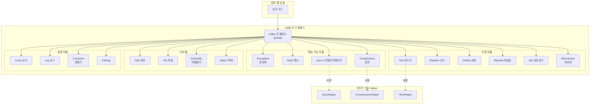

# 도구 클래스

GameFrameX 프레임워크가 제공하는 핵심 정적 도구 함수 라이브러리로, 암호화/복호화, 해시 계산, JSON 시리얼라이제이션, 압축/압축 해제, 문자열 처리, 난수 생성, 데이터 검증, 네트워크 操作, ID 생성 등常用的 기능을 포함합니다.

## 개요

Utility 도구 클래스는 GameFrameX 프레임워크의 인프라 层으로, 상위 비즈니스 로직을 위해 하층 기술 지원을 제공합니다. 이러한 도구 클래스는 **정적 클래스 설계**를 채택하여 인스턴스화 없이 직접 호출할 수 있어 일상적인 개발 작업을 크게 간소화합니다.

### 설계理念

1. **무상태 도구 메서드**: 모든 메서드는 부작용이 없는 정적 메서드로, 안전한 병렬 호출 가능
2. **확장 가능한 아키텍처**: 핵심 기능은 Helper 끼우기 메커니즘을 채택하여 커스텀 구현 지원
3. **Partial Class 조직**: C# partial class 특성을 사용하여 기능 모듈별로 코드를 여러 파일에分散하여 유지보수성 향상

### 모듈 분류

Utility 도구 클래스가 포함하는 기능 영역:

| 분류 | 기능 설명 |
|------|----------|
| 암호화 모듈 | XOR 배타적 OR 암호화 |
| 해시 모듈 | MD5, SHA1, SHA256, HMAC-SHA256, MurmurHash3, XxHash |
| 데이터 형식 | JSON 시리얼라이제이션/역시리얼라이제이션, 압축/압축 해제 |
| 텍스트 처리 | 문자열 형식화, 타입 변환, 확장 문자열 |
| 검증 모듈 | CRC32, CRC64 체크섬 계산 |
| 난수 | 난수 정수, 부동소수점, 바이트 배열 생성 |
| 시스템 操作 | 구조체 마샬링, 네트워크 포트/IP操作, 고유 ID 생성 |
| 입출력 | 경로 처리, 파일 操作 |
| 리플렉션 操作 | 어셈블리 로딩, 객체 操作 |

## 아키텍처



## 핵심 기능 상세

### 암호화 모듈 (Encryption)

경량 데이터混淆 시나리오에 적합한 XOR 배타적 OR 암호화 기능을 제공합니다.

```csharp
// XOR 암호화 예시
byte[] originalData = new byte[] { 0x01, 0x02, 0x03, 0x04 };
byte[] key = new byte[] { 0xAA, 0xBB, 0xCC, 0xDD };

// 암호화
byte[] encrypted = Utility.Encryption.GetXorBytes(originalData, key);

// 복호화 (XOR 암호화는 대칭)
byte[] decrypted = Utility.Encryption.GetXorBytes(encrypted, key);
```
> Source: [Utility.Encryption.cs](https://github.com/GameFrameX/com.gameframex.unity/blob/main/Runtime/Utility/Utility.Encryption.cs#L82-L90)

### 해시 모듈 (Hash)

데이터 무결성 검증 및 비밀번호 저장을 위한 다양한 해시 알고리즘 지원:

- **MD5**: 128비트 해시값, 파일 무결성 검증에 적합
- **SHA1**: 160비트 해시값
- **SHA256**: 256비트 해시값, 더 높은 보안 계수
- **HMAC-SHA256**: 키가 있는 해시, 메시지 인증에 사용
- **MurmurHash3**: 고성능 비상호작용 해시
- **XxHash**: 초고성능 비상호작용 해시

```csharp
// 문자열의 MD5 해시 계산
string input = "Hello GameFrameX";
string md5Hash = Utility.Hash.MD5.Hash(input);

// 해시값 검증
bool isValid = Utility.Hash.MD5.IsVerify(input, md5Hash);

// 파일 MD5 계산
string fileHash = Utility.Hash.MD5.FileHash("path/to/file");
```
> Source: [Utility.Hash.Md5.cs](https://github.com/GameFrameX/com.gameframex.unity/blob/main/Runtime/Utility/Utility.Hash.Md5.cs#L38-L42)

### JSON 모듈 (Json)

끼우기 가능한 Helper 구현을 지원하는 JSON 시리얼라이제이션 및 역시리얼라이제이션 기능 제공:

```csharp
// 커스텀 JSON Helper 설정
Utility.Json.SetJsonHelper(new NewtonsoftJsonHelper());

// 객체를 JSON으로 시리얼라이제이션
var user = new User { Name = "홍길동", Age = 25 };
string json = Utility.Json.ToJson(user);

// JSON을 객체로 역시리얼라이제이션
var user2 = Utility.Json.ToObject<User>(json);

// 지정된 타입으로 역시리얼라이제이션
object obj = Utility.Json.ToObject(typeof(User), json);
```
> Source: [Utility.Json.cs](https://github.com/GameFrameX/com.gameframex.unity/blob/main/Runtime/Utility/Utility.Json.cs#L68-L88)

### 압축 모듈 (Compression)

데이터 압축 및 압축 해제 기능 제공:

```csharp
// 압축 Helper 설정
Utility.Compression.SetCompressionHelper(new DefaultCompressionHelper());

// 바이트 배열 압축
byte[] originalData = File.ReadAllBytes("data.bin");
byte[] compressed = Utility.Compression.Compress(originalData);

// 압축 해제
byte[] decompressed = Utility.Compression.Decompress(compressed);

// 스트림 압축
using (var inputStream = File.OpenRead("data.bin"))
using (var outputStream = new MemoryStream())
{
    Utility.Compression.Compress(inputStream, outputStream);
}
```
> Source: [Utility.Compression.cs](https://github.com/GameFrameX/com.gameframex.unity/blob/main/Runtime/Utility/Utility.Compression.cs#L67-L75)

### 텍스트 모듈 (Text)

최대 16개 파라미터의 형식화를 지원하는 안전한 문자열 형식화 기능 제공:

```csharp
// 기본 형식화
string result = Utility.Text.Format("Hello {0}, you have {1} messages", "홍길동", 5);

// 다중 파라미터 형식화
string result2 = Utility.Text.Format(
    "Name: {0}, Age: {1}, Score: {2}, Rank: {3}",
    "이순신", 25, 98.5, "A"
);

// 커스텀 Text Helper 설정
Utility.Text.SetTextHelper(new DefaultTextHelper());
```
> Source: [Utility.Text.cs](https://github.com/GameFrameX/com.gameframex.unity/blob/main/Runtime/Utility/Utility.Text.cs#L68-L81)

### 난수 모듈 (Random)

高质量 난수 생성 제공:

```csharp
// 난수 시드 설정
Utility.Random.SetSeed(12345);

// 0부터 Int32.MaxValue 사이 난수 생성
int rand1 = Utility.Random.GetRandom();

// 0부터 100 사이 난수 생성 (100 미포함)
int rand2 = Utility.Random.GetRandom(100);

// 50부터 100 사이 난수 생성
int rand3 = Utility.Random.GetRandom(50, 100);

// 0.0부터 1.0 사이 난수 부동소수점 생성
double randFloat = Utility.Random.GetRandomDouble();

// 난수 바이트 배열 생성
byte[] buffer = new byte[16];
Utility.Random.GetRandomBytes(buffer);
```
> Source: [Utility.Random.cs](https://github.com/GameFrameX/com.gameframex.unity/blob/main/Runtime/Utility/Utility.Random.cs#L71-L103)

### 검증 모듈 (Verifier)

CRC32/CRC64 체크섬 계산을 제공하여 데이터 무결성 검증에 사용:

```csharp
// 바이트 배열의 CRC32 계산
byte[] data = new byte[] { 0x01, 0x02, 0x03, 0x04 };
int crc32 = Utility.Verifier.GetCrc32(data);

// 스트림의 CRC32 계산
using (var stream = File.OpenRead("data.bin"))
{
    int crc = Utility.Verifier.GetCrc32(stream);
}

// CRC64 계산
ulong crc64 = Utility.Verifier.GetCrc64(data);

// CRC32 바이트 배열 변환
byte[] crcBytes = Utility.Verifier.GetCrc32Bytes(crc32);
```
> Source: [Utility.Verifier.cs](https://github.com/GameFrameX/com.gameframex.unity/blob/main/Runtime/Utility/Utility.Verifier.cs#L95-L103)

### 네트워크 모듈 (Net)

네트워크 操作 보조 기능 제공:

```csharp
// 첫 번째 사용 가능한 포트 가져오기
int availablePort = Utility.Net.GetFirstAvailablePort(8000, 9000);

// 포트가 사용 가능한지 검사
bool isAvailable = Utility.Net.PortIsAvailable(8080);

// 사용 중인 포트 목록 가져오기
List<int> usedPorts = Utility.Net.PortIsUsed();

// 로컬 IP 주소 가져오기
string localIP = Utility.Net.GetIP();

// 도메인의 IPv4 주소 가져오기
string ipv4 = Utility.Net.GetHostIPv4("example.com");

// 도메인의 IPv6 주소 가져오기
string ipv6 = Utility.Net.GetHostIPv6("example.com");
```
> Source: [Utility.Net.cs](https://github.com/GameFrameX/com.gameframex.unity/blob/main/Runtime/Utility/Utility.Net.cs#L145-L158)

### ID생성 모듈 (IdGenerator)

타임스탬프+카운터 전략을 사용하는 분산 고유 ID 생성 기능 제공:

```csharp
// 고유한 long 타입 ID 생성
long uniqueId = Utility.IdGenerator.GetNextUniqueId();

// 고유한 int 타입 ID 생성
int uniqueIntId = Utility.IdGenerator.GetNextUniqueIntId();

// 시간 기준: 2020년 1월 1일 UTC
DateTime startTime = Utility.IdGenerator.UtcTimeStart;
```
> Source: [Utility.IdGenerator.cs](https://github.com/GameFrameX/com.gameframex.unity/blob/main/Runtime/Utility/Utility.IdGenerator.cs#L45-L49)

### Marshal 모듈

구조체와 바이트 배열 간의 상호 변환을 제공하여 하층 데이터 처리에 사용:

```csharp
// 구조체 정의
[StructLayout(LayoutKind.Sequential)]
public struct PlayerData
{
    public int Id;
    public int Level;
    public long Experience;
}

// 구조체를 바이트 배열로
PlayerData player = new PlayerData { Id = 1, Level = 10, Experience = 5000 };
byte[] bytes = Utility.Marshal.StructureToBytes(player);

// 바이트 배열을 구조체로
PlayerData player2 = Utility.Marshal.BytesToStructure<PlayerData>(bytes);

// 캐시 관리
Utility.Marshal.EnsureCachedHGlobalSize(4096);
Utility.Marshal.FreeCachedHGlobal();
```
> Source: [Utility.Marshal.cs](https://github.com/GameFrameX/com.gameframex.unity/blob/main/Runtime/Utility/Utility.Marshal.cs#L102-L105)

## 사용 예시

### 종합 사용 예시

다음 예시는 프로젝트에서 Utility 도구 클래스를 실제로 사용하는 방법을 보여줍니다:

```csharp
using GameFrameX.Runtime;

// 1. Helper 초기화 (선택사항, 커스텀 구현 필요 시)
Utility.Json.SetJsonHelper(new NewtonsoftJsonHelper());
Utility.Compression.SetCompressionHelper(new DefaultCompressionHelper());
Utility.Text.SetTextHelper(new DefaultTextHelper());

// 2. 데이터 처리 흐름
public class DataProcessor
{
    public void ProcessData(byte[] rawData)
    {
        // CRC32 검증 계산
        int crc = Utility.Verifier.GetCrc32(rawData);
        Console.WriteLine($"CRC32: {crc}");
        
        // MD5 해시 계산
        string md5 = Utility.Hash.MD5.Hash(rawData.ToString());
        
        // 데이터 압축
        byte[] compressed = Utility.Compression.Compress(rawData);
        
        // 고유 ID 생성
        long dataId = Utility.IdGenerator.GetNextUniqueId();
        
        // JSON으로 시리얼라이제이션
        var dataInfo = new 
        {
            Id = dataId,
            Crc = crc,
            Md5 = md5,
            Size = compressed.Length
        };
        string json = Utility.Json.ToJson(dataInfo);
        
        // 형식화된 출력
        string message = Utility.Text.Format(
            "데이터 처리 완료 - ID: {0}, CRC: {1}, 압축 후 크기: {2} bytes",
            dataId, crc, compressed.Length
        );
    }
}
```

### 게임 개발常用 시나리오

```csharp
// 시나리오1: 리소스 버전 검증
public bool VerifyResource(string filePath, string expectedHash)
{
    string actualHash = Utility.Hash.MD5.FileHash(filePath);
    return Utility.Hash.MD5.IsVerify(expectedHash, actualHash);
}

// 시나리오2: 설정 데이터 암호화 저장
public void SaveEncryptedConfig(byte[] configData, byte[] key)
{
    byte[] encrypted = Utility.Encryption.GetXorBytes(configData, key);
    byte[] compressed = Utility.Compression.Compress(encrypted);
    File.WriteAllBytes("config.dat", compressed);
}

// 시나리오3: 무작위 게임 아이템 생성
public Item GenerateRandomItem()
{
    int itemType = Utility.Random.GetRandom(1, 100);
    int itemLevel = Utility.Random.GetRandom(1, 10);
    long itemId = Utility.IdGenerator.GetNextUniqueId();
    
    return new Item 
    { 
        Id = itemId, 
        Type = itemType, 
        Level = itemLevel 
    };
}
```

## 관련 링크

- [보조 클래스](./5-runtime.helper-classes) - Unity 특정 시나리오의 보조 컴포넌트
- [확장 메서드 라이브러리](./5-runtime.extension-methods) - 체인 호출 확장 메서드
- [이벤트 시스템](./5-runtime.event-system) - 이벤트駆動 아키텍처
- [객체 풀 시스템](./5-runtime.object-pool) - 객체 재사용 관리
