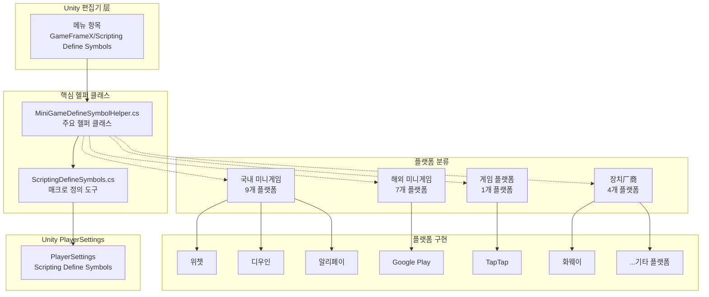
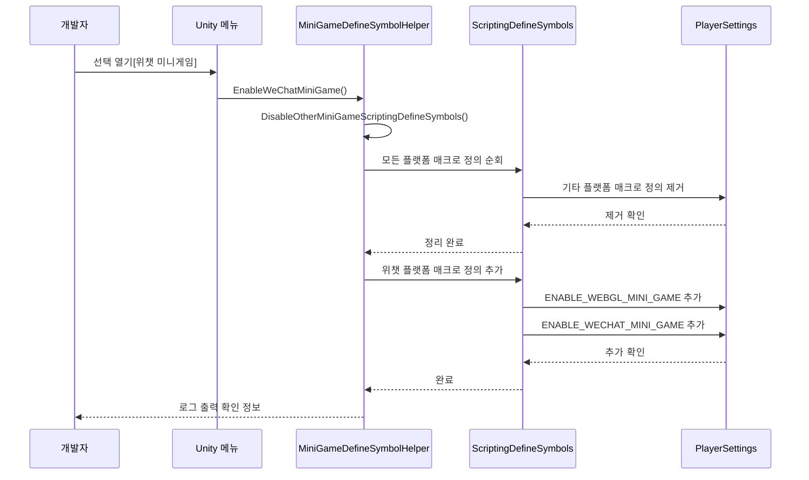

# 플랫폼 지원

GameFrameX는 운영 체제 플랫폼과 미니게임 플랫폼 두 가지カテゴリ로 구분되는 전면적인 멀티 플랫폼 지원을 제공합니다. 조건부 컴파일 메커니즘과 통일된 매크로 정의 관리를 통해 개발자가 프로젝트의 다양한 플랫폼 간 완벽한 전환을 쉽게 구현할 수 있습니다.

## 개요

GameFrameX의 플랫폼 지원 시스템은 Unity의 Scripting Define Symbols (스크립트 매크로 정의) 기술을 사용하여 21개 주요 미니게임 플랫폼의 원클릭 전환 지원을 구현합니다. 이 시스템의 설계는 다음 핵심 원칙을 따릅니다:

- **상호 배타 메커니즘**: 각 미니게임 플랫폼 간 상호 배타, 한 번에 하나의 플랫폼만 활성화 가능
- **통일 식별자**: 모든 미니게임 플랫폼이 통일 매크로 정의 `ENABLE_WEBGL_MINI_GAME` 공유
- **메뉴 통합**: Unity 메뉴를 통해 시각적 플랫폼 전환 操作 제공
- **조건부 컴파일**: `#if` 전처리 지시문을 사용하여 플랫폼 특정 코드 구현

## 아키텍처

플랫폼 지원 시스템의 아키텍처 설계는 `MiniGameDefineSymbolHelper`를 중심으로展开하며, 부분 클래스(partial class) 모드를 사용하여 모듈식 확장을 구현합니다.



**아키텍처 설명:**

1. **편집기 层**: Unity 메뉴를 통해 플랫폼 전환 操作 트리거
2. **핵심 헬퍼 클래스**:
   - `MiniGameDefineSymbolHelper`: 주요 헬퍼 클래스, 모든 플랫폼 매크로 정의 관리
   - `ScriptingDefineSymbols`: 하층 도구 클래스, PlayerSettings API 캡슐화
3. **플랫폼 분류**: 지역 및 유형에 따라 21개 플랫폼을 4개 그룹으로 분류
4. **Unity PlayerSettings**: 최종 매크로 정의 저장 위치

## 핵심 메커니즘

### 매크로 정의 체계

GameFrameX는双층 매크로 정의 체계를 사용하여 플랫폼 전환을 관리합니다:

```mermaid
flowchart LR
    subgraph DefineLayers["매크로 정의 계층"]
        Unified["통일 매크로 정의<br/>ENABLE_WEBGL_MINI_GAME"]
        Platform["플랫폼 매크로 정의<br/>ENABLE_XXX_MINI_GAME<br/>XXXMINIGAME"]
    end
    
    Unified -->|활성화 시점| Auto[임의의 플랫폼이 열릴 때<br/>자동 활성화]
    Platform -->|조건부 컴파일|#if UNITY_WEBGL<br/>& ENABLE_XXX_MINI_GAME
    
    style Unified fill:#e1f5fe
    style Platform fill:#fff3e0
```

**매크로 정의 설명:**

| 매크로 정의 유형 | 이름 | 용도 |
|-----------|------|------|
| 통일 매크로 정의 | `ENABLE_WEBGL_MINI_GAME` | 현재 빌드가 WebGL 미니게임임을 식별 |
| 플랫폼 매크로 정의 | `ENABLE_XXX_MINI_GAME` | 구체적인 미니게임 플랫폼 식별 |
| 플랫폼 매크로 정의 | `XXXMINIGAME` | 플랫폼 약어 식별 (서드파티 SDK 어댑션용) |

### 플랫폼 상호 배타 메커니즘



## 지원 플랫폼

### 운영 체제 플랫폼

GameFrameX는 다음 운영 체제 플랫폼 빌드를 지원합니다:

| 플랫폼 | 상태 | 지원 버전 | 빌드 대상 그룹 |
|------|------|----------|-----------|
| Windows | 지원됨 | Unity 2019.4+ | Standalone |
| macOS | 지원됨 | Unity 2019.4+ | Standalone |
| Linux | 지원됨 | Unity 2019.4+ | Standalone |
| iOS | 지원됨 | Unity 2019.4+ | iOS |
| Android | 지원됨 | Unity 2019.4+ | Android |
| WebGL | 지원됨 | Unity 2019.4+ | WebGL |

### 미니게임 플랫폼

GameFrameX는 21개 미니게임 플랫폼의 원클릭 전환 어댑션을 제공하며, 국내, 국제, 장치厂商 및 게임 플랫폼 4가지 카테고리로 분류됩니다.

#### 국내 미니게임 (9개)

| 플랫폼 | 매크로 정의 | 지역 | 메뉴 경로 |
|------|--------|------|----------|
| 위챗 미니게임 | `ENABLE_WECHAT_MINI_GAME` / `WEIXINMINIGAME` | 🇨🇳 중국 | Domestic Mini Games |
| 알리페이 미니게임 | `ENABLE_ALIPAY_MINI_GAME` / `ALIPAYMINIGAME` | 🇨🇳 중국 | Domestic Mini Games |
| 디우인 미니게임 | `ENABLE_DOUYIN_MINI_GAME` / `DOUYINMINIGAME` | 🇨🇳 중국 | Domestic Mini Games |
| 쿠아이쇼우 미니게임 | `ENABLE_KUAISHOU_MINI_GAME` / `KUAISHOUMINIGAME` | 🇨🇳 중국 | Domestic Mini Games |
| 바이두 미니게임 | `ENABLE_BAIDU_MINI_GAME` / `BAIDUMINIGAME` | 🇨🇳 중국 | Domestic Mini Games |
| 징둥 미니게임 | `ENABLE_JINGDONG_MINI_GAME` / `JINGDONGMINIGAME` | 🇨🇳 중국 | Domestic Mini Games |
| 타오바오 미니게임 | `ENABLE_TAOBAO_MINI_GAME` / `TAOBAOMINIGAME` | 🇨🇳 중국 | Domestic Mini Games |
| 미탄 미니게임 | `ENABLE_MEITUAN_MINI_GAME` / `MEITUANMINIGAME` | 🇨🇳 중국 | Domestic Mini Games |
| Bilibili 미니게임 | `ENABLE_BILIBILI_MINI_GAME` / `BILIBILIMINIGAME` | 🇨🇳 중국 | Domestic Mini Games |

#### 해외 미니게임 (7개)

| 플랫폼 | 매크로 정의 | 지역 | 메뉴 경로 |
|------|--------|------|----------|
| Discord | `ENABLE_DISCORD_MINI_GAME` / `DISCORDMINIGAME` | 🌍 전세계 | International Mini Games |
| YouTube | `ENABLE_YOUTUBE_MINI_GAME` / `YOUTUBEMINIGAME` | 🌍 전세계 | International Mini Games |
| Facebook | `ENABLE_FACEBOOK_MINI_GAME` / `FACEBOOKMINIGAME` | 🌍 전세계 | International Mini Games |
| Google Play | `ENABLE_GOOGLEPLAY_MINI_GAME` / `GOOGLEPLAYMINIGAME` | 🌍 전세계 | International Mini Games |
| TikTok | `ENABLE_TIKTOK_MINI_GAME` / `TIKTOKMINIGAME` | 🌍 전세계 | International Mini Games |
| CrazyGames | `ENABLE_CRAZYGAMES_MINI_GAME` / `CRAZYGAMESMINIGAME` | 🌍 전세계 | International Mini Games |
| Poki | `ENABLE_POKI_MINI_GAME` / `POKIMINIGAME` | 🌍 전세계 | International Mini Games |

#### 장치厂商 (4개)

| 플랫폼 | 매크로 정의 | 지역 | 메뉴 경로 |
|------|--------|------|----------|
| 화웨이 미니게임 | `ENABLE_HUAWEI_MINI_GAME` / `HUAWEIMINIGAME` | 🇨🇳 중국 | Device OEMs |
| OPPO 미니게임 | `ENABLE_OPPO_MINI_GAME` / `OPPOSMINIGAME` | 🇨🇳 중국 | Device OEMs |
| Vivo 미니게임 | `ENABLE_VIVO_MINI_GAME` / `VIVOMINIGAME` | 🇨🇳 중국 | Device OEMs |
| 샤오미 미니게임 | `ENABLE_XIAOMI_MINI_GAME` / `XIAOMIMINIGAME` | 🇨🇳 중국 | Device OEMs |

#### 게임 플랫폼 (1개)

| 플랫폼 | 매크로 정의 | 지역 | 메뉴 경로 |
|------|--------|------|----------|
| TapTap 미니게임 | `ENABLE_TAPTAP_MINI_GAME` / `TAPTAPMINIGAME` | 🇨🇳 중국 | Game Platforms |

## 사용 가이드

### 미니게임 플랫폼 활성화

Unity 편집기에서 메뉴 操作을 통해 미니게임 플랫폼을 빠르게 전환할 수 있습니다:

```
GameFrameX/
└── Scripting Define Symbols/
    ├── Domestic Mini Games(국내 미니게임)/
    │   ├── Enable WeChat Mini Game (열기[위챗 미니게임] 어댑션)
    │   ├── Enable Alipay Mini Game (열기[알리페이 미니게임] 어댑션)
    │   ├── Enable DouYin Mini Game (열기[디우인 미니게임] 어댑션)
    │   ├── Enable KuaiShou Mini Game (열기[쿠아이쇼우 미니게임] 어댑션)
    │   ├── Enable Baidu Mini Game (열기[바이두 미니게임] 어댑션)
    │   ├── Enable JingDong Mini Game (열기[징둥 미니게임] 어댑션)
    │   ├── Enable Meituan Mini Game (열기[미탄 미니게임] 어댑션)
    │   ├── Enable Taobao Mini Game (열기[타오바오 미니게임] 어댑션)
    │   └── Enable Bilibili Mini Game (열기[Bilibili 미니게임] 어댑션)
    ├── International Mini Games(해외 미니게임)/
    │   ├── Enable Discord Mini Game
    │   ├── Enable YouTube Mini Game
    │   ├── Enable Facebook Mini Game
    │   ├── Enable Google Play Mini Game
    │   ├── Enable TikTok Mini Game
    │   ├── Enable CrazyGames Mini Game
    │   └── Enable Poki Mini Game
    ├── Device OEMs(장치厂商)/
    │   ├── Enable Huawei Mini Game (열기[화웨이 미니게임] 어댑션)
    │   ├── Enable OPPO Mini Game (열기[OPPO 미니게임] 어댑션)
    │   ├── Enable Vivo Mini Game (열기[Vivo 미니게임] 어댑션)
    │   └── Enable Xiaomi Mini Game (열기[샤오미 미니게임] 어댑션)
    └── Game Platforms(게임 플랫폼)/
        └── Enable TapTap Mini Game (열기[TapTap 미니게임] 어댑션)
```

### 조건부 컴파일 사용

코드에서 조건부 컴파일 지시문을 사용하여 플랫폼 특정 로직을 구현할 수 있습니다:

```csharp
#if ENABLE_WEBGL_MINI_GAME
    // 모든 미니게임 플랫폼 공통 코드
#endif

#if ENABLE_WECHAT_MINI_GAME
    // 위챗 미니게임 특정 코드
    // 위챗 미니게임 전용 API 사용 가능
#endif

#if ENABLE_TAPTAP_MINI_GAME
    // TapTap 미니게임 특정 코드
    // TapTap 플랫폼 SDK 사용 가능
#endif

#if ENABLE_GOOGLEPLAY_MINI_GAME
    // Google Play 미니게임 특정 코드
    // Google Play 게임 서비스 사용 가능
#endif
```

> Source: [MiniGameDefineSymbolHelper.WeChat.cs](https://github.com/GameFrameX/com.gameframex.unity/blob/main/Editor/MiniGame/DomesticMiniGames/MiniGameDefineSymbolHelper.WeChat.cs#L14-L39)
> Source: [MiniGameDefineSymbolHelper.TapTap.cs](https://github.com/GameFrameX/com.gameframex.unity/blob/main/Editor/MiniGame/GamePlatforms/MiniGameDefineSymbolHelper.TapTap.cs#L14-L39)

### 미니게임 플랫폼 닫기

동일하게 메뉴를 통해 활성화된 미니게임 플랫폼을 닫을 수 있습니다:

```
GameFrameX/
└── Scripting Define Symbols/
    ├── Domestic Mini Games(국내 미니게임)/
    │   └── Disable WeChat Mini Game (닫기[위챗 미니게임] 어댑션)
    ├── International Mini Games(해외 미니게임)/
    │   └── Disable Google Play Mini Game (닫기[Google Play] 어댑션)
    ├── Device OEMs(장치厂商)/
    │   └── Disable Huawei Mini Game (닫기[화웨이 미니게임] 어댑션)
    └── Game Platforms(게임 플랫폼)/
        └── Disable TapTap Mini Game (닫기[TapTap 미니게임] 어댑션)
```

## 핵심 API 참고

### `MiniGameDefineSymbolHelper`

미니게임 플랫폼 매크로 정의 관리 주요 클래스.

#### `EnableWeChatMiniGame()`

```csharp
#if UNITY_WEBGL
[MenuItem("GameFrameX/Scripting Define Symbols/Domestic Mini Games(국내 미니게임)/Enable WeChat Mini Game(열기[위챗 미니게임] 어댑션)", false, 2000)]
#endif
public static void EnableWeChatMiniGame()
```

위챗 미니게임 어댑션을 활성화합니다. 활성화 시 자동으로:
1. 기타 모든 미니게임 플랫폼의 매크로 정의 닫기
2. 위챗 미니게임 전용 매크로 정의 활성화
3. 통일된 WebGL 미니게임 매크로 정의 활성화

> Source: [MiniGameDefineSymbolHelper.WeChat.cs](https://github.com/GameFrameX/com.gameframex.unity/blob/main/Editor/MiniGame/DomesticMiniGames/MiniGameDefineSymbolHelper.WeChat.cs#L20-L40)

#### `DisableWeChatMiniGame()`

```csharp
#if UNITY_WEBGL
[MenuItem("GameFrameX/Scripting Define Symbols/Domestic Mini Games(국내 미니게임)/Disable WeChat Mini Game(닫기[위챗 미니게임] 어댑션)", false, 2001)]
#endif
public static void DisableWeChatMiniGame()
```

위챗 미니게임 어댑션을 닫습니다.

> Source: [MiniGameDefineSymbolHelper.WeChat.cs](https://github.com/GameFrameX/com.gameframex.unity/blob/main/Editor/MiniGame/DomesticMiniGames/MiniGameDefineSymbolHelper.WeChat.cs#L46-L64)

### `ScriptingDefineSymbols`

스크립트 매크로 정의 하층 操作 도구 클래스.

#### `HasScriptingDefineSymbol(buildTargetGroup, scriptingDefineSymbol): bool`

```csharp
public static bool HasScriptingDefineSymbol(BuildTargetGroup buildTargetGroup, string scriptingDefineSymbol)
```

지정된 플랫폼에 지정된 스크립트 매크로 정의가 있는지 검사합니다.

**파라미터:**
- `buildTargetGroup` (BuildTargetGroup): 대상 플랫폼 그룹
- `scriptingDefineSymbol` (string): 검사할 매크로 정의

**반환:** 지정된 매크로 정의가 있는지 여부

> Source: [ScriptingDefineSymbols.cs](https://github.com/GameFrameX/com.gameframex.unity/blob/main/Editor/Misc/ScriptingDefineSymbols.cs#L57-L74)

#### `AddScriptingDefineSymbol(buildTargetGroup, scriptingDefineSymbol): void`

```csharp
public static void AddScriptingDefineSymbol(BuildTargetGroup buildTargetGroup, string scriptingDefineSymbol)
```

지정된 플랫폼에 스크립트 매크로 정의를 추가합니다.

**파라미터:**
- `buildTargetGroup` (BuildTargetGroup): 대상 플랫폼 그룹
- `scriptingDefineSymbol` (string): 추가할 매크로 정의

> Source: [ScriptingDefineSymbols.cs](https://github.com/GameFrameX/com.gameframex.unity/blob/main/Editor/Misc/ScriptingDefineSymbols.cs#L81-L99)

#### `RemoveScriptingDefineSymbol(buildTargetGroup, scriptingDefineSymbol): void`

```csharp
public static void RemoveScriptingDefineSymbol(BuildTargetGroup buildTargetGroup, string scriptingDefineSymbol)
```

지정된 플랫폼에서 스크립트 매크로 정의를 제거합니다.

**파라미터:**
- `buildTargetGroup` (BuildTargetGroup): 대상 플랫폼 그룹
- `scriptingDefineSymbol` (string): 제거할 매크로 정의

> Source: [ScriptingDefineSymbols.cs](https://github.com/GameFrameX/com.gameframex.unity/blob/main/Editor/Misc/ScriptingDefineSymbols.cs#L106-L125)

#### `GetScriptingDefineSymbols(buildTargetGroup): string[]`

```csharp
public static string[] GetScriptingDefineSymbols(BuildTargetGroup buildTargetGroup)
```

지정된 플랫폼의 스크립트 매크로 정의 배열을 가져옵니다.

**파라미터:**
- `buildTargetGroup` (BuildTargetGroup): 대상 플랫폼 그룹

**반환:** 매크로 정의 배열

> Source: [ScriptingDefineSymbols.cs](https://github.com/GameFrameX/com.gameframex.unity/blob/main/Editor/Misc/ScriptingDefineSymbols.cs#L166-L169)

## 모범 사례

### 플랫폼 어댑션 권장 사항

1. **통일된 WebGL 매크로 정의 사용**: 모든 미니게임 플랫폼 공통 코드에는 `ENABLE_WEBGL_MINI_GAME` 조건부 컴파일 사용

2. **플랫폼 특정 코드 분리**: 서로 다른 플랫폼의 코드를 독립된 디렉토리 또는 파일에 배치하여 유지보수 용이

3. **인터페이스 추상화**: 플랫폼 특정 API를 호출해야 하는 시나리오에서는 인터페이스 추상화 또는 의존성 주입 모드 권장

4. **테스트 커버리지**: 각 대상 플랫폼은 조건부 컴파일 코드가 올바르게 실행되는지 충분히 테스트해야 함

### 자주 묻는 질문

**Q: 새 플랫폼을 열면 이전 플랫폼의 매크로 정의가 자동으로 닫힙니까?**

네, 시스템은 상호 배타 메커니즘을 채택하여 임의의 미니게임 플랫폼을 열면 기타 모든 미니게임 플랫폼의 매크로 정의를 자동으로 닫습니다.

**Q: 여러 미니게임 플랫폼을 동시에 열 수 있습니까?**

불가능합니다. 미니게임 플랫폼 간 API와 SDK에 충돌이 있으므로, 시스템은 상호 배타 모드로 설계되어 한 번에 하나의 플랫폼만 활성화할 수 있습니다.

**Q: 현재 열린 플랫폼을 확인하려면 어떻게 해야 합니까?**

`Edit > Project Settings > Player > Other Settings > Scripting Define Symbols` 메뉴에서 WebGL 플랫폼下的 매크로 정의 목록을 확인할 수 있습니다.

## 관련 링크

- [편집기 도구](./6-editor-tools.mini-game-platform) - 미니게임 플랫폼 어댑션 상세 문서
- [빌드 도구](./6-editor-tools.build-tools) - 빌드 제품 관련 도구
- [API 참고](./8-api-reference) - 완전한 API 문서
- [프로젝트主页](https://github.com/GameFrameX/com.gameframex.unity)
- [공식 문서](https://gameframex.doc.alianblank.com)
