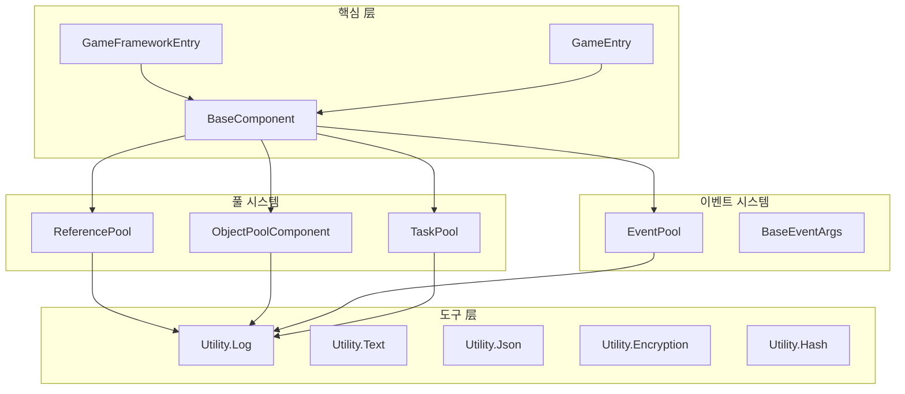

# API 참고

이 문서는 GameFrameX 프레임워크의 모든 공용 API에 대한 완전한 참고 자료를 제공하며, 핵심 클래스, 인터페이스, 메서드 시그니처 및 사용 설명을 포함합니다.

## 개요

GameFrameX 프레임워크는 모듈식 아키텍처 설계를 채택하여 핵심 API는 주로 다음 부분으로 구분됩니다:

- **프레임워크 진입점**: `GameFrameworkEntry` 및 `GameEntry`가 프레임워크 초기화 및 컴포넌트 관리 제공
- **기초 컴포넌트**: `BaseComponent`가 게임 런타임 기초 설정 제공
- **참조 풀**: `ReferencePool`이高性能 메모리 관리 제공
- **이벤트 시스템**: `EventPool<T>`가 타입 안전한 이벤트 메커니즘 제공
- **태스크 풀**: `TaskPool<T>`가 비동기 태스크 관리 제공
- **객체 풀**: `ObjectPoolComponent`가 게임 객체 재사용 제공
- **도구 클래스**: `Utility` 네임스페이스가各类 보조 기능 제공

## 아키텍처図



---

## 프레임워크 진입점

### GameFrameworkEntry

프레임워크 모듈 관리자로, 프레임워크 레벨 모듈의 등록, 가져오기 및 업데이트 담당.

> Source: [Runtime/Base/GameFrameworkEntry.cs](https://github.com/GameFrameX/com.gameframex.unity/blob/main/Runtime/Base/GameFrameworkEntry.cs#L44-L209)

#### 핵심 메서드

##### `Update(elapseSeconds: float, realElapseSeconds: float): void`

모든 등록된 프레임워크 모듈을 폴링합니다.

```csharp
GameFrameworkEntry.Update(deltaTime, unscaledDeltaTime);
```
> Source: [GameFrameworkEntry.cs#L58-L64](https://github.com/GameFrameX/com.gameframex.unity/blob/main/Runtime/Base/GameFrameworkEntry.cs#L58-L64)

##### `Shutdown(): void`

모든 게임 프레임워크 모듈을 닫고 정리하며, 참조 풀 및 캐시 released.

```csharp
GameFrameworkEntry.Shutdown();
```
> Source: [GameFrameworkEntry.cs#L73-L84](https://github.com/GameFrameX/com.gameframex.unity/blob/main/Runtime/Base/GameFrameworkEntry.cs#L73-L84)

##### `GetModule<T>(): T`

지정된 인터페이스 타입의 프레임워크 모듈을 가져옵니다. 모듈이 없으면 자동으로 생성됩니다.

```csharp
var objectPoolMgr = GameFrameworkEntry.GetModule<IObjectPoolManager>();
```
> Source: [GameFrameworkEntry.cs#L95-L120](https://github.com/GameFrameX/com.gameframex.unity/blob/main/Runtime/Base/GameFrameworkEntry.cs#L95-L120)

##### `RegisterModule(interfaceType: Type, implType: Type): void`

프레임워크 모듈의 인터페이스와 구현 타입 매핑을 등록합니다.

```csharp
GameFrameworkEntry.RegisterModule(typeof(IObjectPoolManager), typeof(ObjectPoolManager));
```
> Source: [GameFrameworkEntry.cs#L153-L169](https://github.com/GameFrameX/com.gameframex.unity/blob/main/Runtime/Base/GameFrameworkEntry.cs#L153-L169)

---

### GameEntry

Unity 컴포넌트 관리자로, 게임 프레임워크 컴포넌트의 등록 및 가져오기 제공.

> Source: [Runtime/Base/GameEntry.cs](https://github.com/GameFrameX/com.gameframex.unity/blob/main/Runtime/Base/GameEntry.cs#L46-L196)

#### 핵심 메서드

##### `GetComponent<T>(): T`

지정된 타입의 게임 프레임워크 컴포넌트를 가져옵니다.

```csharp
var objectPoolComp = GameEntry.GetComponent<ObjectPoolComponent>();
```
> Source: [GameEntry.cs#L67-L70](https://github.com/GameFrameX/com.gameframex.unity/blob/main/Runtime/Base/GameEntry.cs#L67-L70)

##### `Shutdown(shutdownType: ShutdownType): void`

게임 프레임워크를 닫습니다.

```csharp
GameEntry.Shutdown(ShutdownType.Quit);
```
> Source: [GameEntry.cs#L131-L162](https://github.com/GameFrameX/com.gameframex.unity/blob/main/Runtime/Base/GameEntry.cs#L131-L162)

---

## 기초 컴포넌트

### BaseComponent

게임 기초 컴포넌트로, 프레임레이트 제어, 게임 속도 관리, 백그라운드 실행 설정 등 핵심 기능 제공.

> Source: [Runtime/Base/BaseComponent.cs](https://github.com/GameFrameX/com.gameframex.unity/blob/main/Runtime/Base/BaseComponent.cs#L48-L403)

#### 속성

| 속성 | 타입 | 설명 |
|------|------|------|
| `FrameRate` | `int` | 게임 프레임레이트 가져오기 또는 설정 |
| `GameSpeed` | `float` | 게임 속도 가져오기 또는 설정 (0은 일시정지) |
| `IsGamePaused` | `bool` | 게임이 일시정지되었는지 가져오기 |
| `IsNormalGameSpeed` | `bool` | 게임이 정상 속도로 실행 중인지 가져오기 |
| `RunInBackground` | `bool` | 백그라운드 실행 허용 여부 가져오기 또는 설정 |
| `NeverSleep` | `bool` | 기기 슬립 금지 여부 가져오기 또는 설정 |

#### 메서드

##### `PauseGame(): void`

게임을 일시정지합니다.

```csharp
var baseComp = GameEntry.GetComponent<BaseComponent>();
baseComp.PauseGame();
```
> Source: [BaseComponent.cs#L220-L229](https://github.com/GameFrameX/com.gameframex.unity/blob/main/Runtime/Base/BaseComponent.cs#L220-L229)

##### `ResumeGame(): void`

게임을 재개합니다.

```csharp
baseComp.ResumeGame();
```
> Source: [BaseComponent.cs#L235-L243](https://github.com/GameFrameX/com.gameframex.unity/blob/main/Runtime/Base/BaseComponent.cs#L235-L243)

##### `ResetNormalGameSpeed(): void`

정상 게임 속도로 초기화합니다.

```csharp
baseComp.ResetNormalGameSpeed();
```
> Source: [BaseComponent.cs#L249-L257](https://github.com/GameFrameX/com.gameframex.unity/blob/main/Runtime/Base/BaseComponent.cs#L249-L257)

---

## 참조 풀

### ReferencePool

참조 풀 관리자로, 객체의 재사용을 통해 GC开销을 줄입니다.

> Source: [Runtime/Base/ReferencePool/ReferencePool.cs](https://github.com/GameFrameX/com.gameframex.unity/blob/main/Runtime/Base/ReferencePool/ReferencePool.cs#L44-L296)

#### 속성

| 속성 | 타입 | 설명 |
|------|------|------|
| `EnableStrictCheck` | `bool` | 강제 타입 검사 활성화 여부 가져오기 또는 설정 |
| `Count` | `int` | 참조 풀의 수 가져오기 |

#### 핵심 메서드

##### `Acquire<T>(): T`

참조 풀에서 지정된 타입의 참조를 가져옵니다.

```csharp
var myRef = ReferencePool.Acquire<MyReferenceClass>();
```
> Source: [ReferencePool.cs#L129-L132](https://github.com/GameFrameX/com.gameframex.unity/blob/main/Runtime/Base/ReferencePool/ReferencePool.cs#L129-L132)

##### `Release(reference: IReference): void`

참조를 참조 풀로 반환합니다.

```csharp
ReferencePool.Release(myRef);
```
> Source: [ReferencePool.cs#L157-L167](https://github.com/GameFrameX/com.gameframex.unity/blob/main/Runtime/Base/ReferencePool/ReferencePool.cs#L157-L167)

##### `Add<T>(count: int): void`

참조 풀에 지정된数量的 참조를追加합니다.

```csharp
ReferencePool.Add<MyReferenceClass>(10);
```
> Source: [ReferencePool.cs#L178-L181](https://github.com/GameFrameX/com.gameframex.unity/blob/main/Runtime/Base/ReferencePool/ReferencePool.cs#L178-L181)

##### `Remove<T>(count: int): void`

참조 풀에서 지정된数量的 참조를 제거합니다.

```csharp
ReferencePool.Remove<MyReferenceClass>(5);
```
> Source: [ReferencePool.cs#L207-L210](https://github.com/GameFrameX/com.gameframex.unity/blob/main/Runtime/Base/ReferencePool/ReferencePool.cs#L207-L210)

##### `ClearAll(): void`

모든 참조 풀을 지웁니다.

```csharp
ReferencePool.ClearAll();
```
> Source: [ReferencePool.cs#L107-L118](https://github.com/GameFrameX/com.gameframex.unity/blob/main/Runtime/Base/ReferencePool/ReferencePool.cs#L107-L118)

##### `GetAllReferencePoolInfos(): ReferencePoolInfo[]`

모든 참조 풀의 정보를 가져옵니다.

```csharp
var infos = ReferencePool.GetAllReferencePoolInfos();
```
> Source: [ReferencePool.cs#L82-L98](https://github.com/GameFrameX/com.gameframex.unity/blob/main/Runtime/Base/ReferencePool/ReferencePool.cs#L82-L98)

---

### IReference

참조 인터페이스로, 참조 풀에 넣을 수 있는 모든 객체는 반드시 이 인터페이스를 구현해야 합니다.

> Source: [Runtime/Base/ReferencePool/IReference.cs](https://github.com/GameFrameX/com.gameframex.unity/blob/main/Runtime/Base/ReferencePool/IReference.cs#L40-L52)

```csharp
public class MyReferenceClass : IReference
{
    public void Clear() { /* 상태 초기화 */ }
}
```
> Source: [IReference.cs#L40-L52](https://github.com/GameFrameX/com.gameframex.unity/blob/main/Runtime/Base/ReferencePool/IReference.cs#L40-L52)

---

## 이벤트 시스템

### EventPool<T>

타입 안전 이벤트 풀로, 스레드 안전한 이벤트 배포를 지원합니다.

> Source: [Runtime/Base/EventPool/EventPool.cs](https://github.com/GameFrameX/com.gameframex.unity/blob/main/Runtime/Base/EventPool/EventPool.cs#L47-L395)

#### 생성자

##### `EventPool(mode: EventPoolMode)`

이벤트 풀 인스턴스를 생성합니다.

```csharp
var eventPool = new EventPool<T>(EventPoolMode.AllowMultiHandler | EventPoolMode.AllowDuplicateHandler);
```
> Source: [EventPool.cs#L65-L73](https://github.com/GameFrameX/com.gameframex.unity/blob/main/Runtime/Base/EventPool/EventPool.cs#L65-L73)

#### 속성

| 속성 | 타입 | 설명 |
|------|------|------|
| `EventHandlerCount` | `int` | 이벤트 처리 함수의 수 가져오기 |
| `EventCount` | `int` | 대기 중인 이벤트 큐의 수 가져오기 |

#### 핵심 메서드

##### `Subscribe(id: string, handler: EventHandler<T>): void`

이벤트를 구독합니다.

```csharp
eventPool.Subscribe("PlayerDead", OnPlayerDead);
```
> Source: [EventPool.cs#L208-L234](https://github.com/GameFrameX/com.gameframex.unity/blob/main/Runtime/Base/EventPool/EventPool.cs#L208-L234)

##### `Unsubscribe(id: string, handler: EventHandler<T>): void`

이벤트 구독을 취소합니다.

```csharp
eventPool.Unsubscribe("PlayerDead", OnPlayerDead);
```
> Source: [EventPool.cs#L245-L280](https://github.com/GameFrameX/com.gameframex.unity/blob/main/Runtime/Base/EventPool/EventPool.cs#L245-L280)

##### `Fire(sender: object, e: T): void`

이벤트를 발생시킵니다 (스레드 안전, 비동기 배포).

```csharp
var eventArgs = ReferencePool.Acquire<PlayerDeadEventArgs>();
eventArgs.PlayerId = 123;
eventPool.Fire(this, eventArgs);
```
> Source: [EventPool.cs#L304-L313](https://github.com/GameFrameX/com.gameframex.unity/blob/main/Runtime/Base/EventPool/EventPool.cs#L304-L313)

##### `FireNow(sender: object, e: T): void`

즉시 이벤트를 발생시킵니다 (동기 배포).

```csharp
eventPool.FireNow(this, eventArgs);
```
> Source: [EventPool.cs#L324-L335](https://github.com/GameFrameX/com.gameframex.unity/blob/main/Runtime/Base/EventPool/EventPool.cs#L324-L335)

##### `Check(id: string, handler: EventHandler<T>): bool`

지정된 이벤트 처리 함수가 있는지 검사합니다.

```csharp
bool exists = eventPool.Check("PlayerDead", OnPlayerDead);
```
> Source: [EventPool.cs#L186-L197](https://github.com/GameFrameX/com.gameframex.unity/blob/main/Runtime/Base/EventPool/EventPool.cs#L186-L197)

##### `Update(elapseSeconds: float, realElapseSeconds: float): void`

이벤트 풀을 폴링하여 큐의 이벤트를 처리합니다.

```csharp
eventPool.Update(deltaTime, unscaledDeltaTime);
```
> Source: [EventPool.cs#L114-L121](https://github.com/GameFrameX/com.gameframex.unity/blob/main/Runtime/Base/EventPool/EventPool.cs#L114-L121)

##### `Shutdown(): void`

이벤트 풀을 닫고 정리합니다.

```csharp
eventPool.Shutdown();
```
> Source: [EventPool.cs#L129-L140](https://github.com/GameFrameX/com.gameframex.unity/blob/main/Runtime/Base/EventPool/EventPool.cs#L129-L140)

---

### BaseEventArgs

이벤트 파라미터基類로, 모든 커스텀 이벤트 파라미터는 반드시 이 클래스를 상속해야 합니다.

> Source: [Runtime/Base/EventPool/BaseEventArgs.cs](https://github.com/GameFrameX/com.gameframex.unity/blob/main/Runtime/Base/EventPool/BaseEventArgs.cs)

```csharp
public sealed class PlayerDeadEventArgs : BaseEventArgs
{
    public int PlayerId { get; set; }
    public string PlayerName { get; set; }
    
    public override void Clear()
    {
        PlayerId = 0;
        PlayerName = null;
    }
}
```

---

### EventPoolMode

이벤트 풀 모드枚举.

> Source: [Runtime/Base/EventPool/EventPoolMode.cs](https://github.com/GameFrameX/com.gameframex.unity/blob/main/Runtime/Base/EventPool/EventPoolMode.cs#L44-L56)

```csharp
[Flags]
public enum EventPoolMode : byte
{
    /// 빈 처리 함수 존재 허용 안 함
    AllowNoHandler = 1,
    /// 여러 처리 함수 존재 허용
    AllowMultiHandler = 2,
    /// 중복 처리 함수 존재 허용
    AllowDuplicateHandler = 4,
}
```

---

## 태스크 풀

### TaskPool<T>

비동기 태스크 실행 관리를 위한 태스크 풀 관리자.

> Source: [Runtime/Base/TaskPool/TaskPool.cs](https://github.com/GameFrameX/com.gameframex.unity/blob/main/Runtime/Base/TaskPool/TaskPool.cs#L44-L525)

#### 생성자

##### `TaskPool()`

태스크 풀 인스턴스를 생성합니다.

```csharp
var taskPool = new TaskPool<DownloadTask>();
```
> Source: [TaskPool.cs#L58-L64](https://github.com/GameFrameX/com.gameframex.unity/blob/main/Runtime/Base/TaskPool/TaskPool.cs#L58-L64)

#### 속성

| 속성 | 타입 | 설명 |
|------|------|------|
| `Paused` | `bool` | 태스크 풀이 일시정지되었는지 가져오기 또는 설정 |
| `TotalAgentCount` | `int` | 태스크 에이전트 총 수 가져오기 |
| `FreeAgentCount` | `int` | 사용 가능 태스크 에이전트 수 가져오기 |
| `WorkingAgentCount` | `int` | 작업 중 태스크 에이전트 수 가져오기 |
| `WaitingTaskCount` | `int` | 대기 중인 태스크 수 가져오기 |

#### 핵심 메서드

##### `AddAgent(agent: ITaskAgent<T>): void`

태스크 에이전트를 추가합니다.

```csharp
taskPool.AddAgent(new DownloadTaskAgent());
```
> Source: [TaskPool.cs#L172-L181](https://github.com/GameFrameX/com.gameframex.unity/blob/main/Runtime/Base/TaskPool/TaskPool.cs#L172-L181)

##### `AddTask(task: T): void`

태스크를 추가합니다.

```csharp
var task = ReferencePool.Acquire<DownloadTask>();
task.Url = "http://example.com/file.png";
task.Priority = 100;
taskPool.AddTask(task);
```
> Source: [TaskPool.cs#L327-L348](https://github.com/GameFrameX/com.gameframex.unity/blob/main/Runtime/Base/TaskPool/TaskPool.cs#L327-L348)

##### `RemoveTask(serialId: int): bool`

일련 번호에 따라 태스크를 제거합니다.

```csharp
bool removed = taskPool.RemoveTask(taskSerialId);
```
> Source: [TaskPool.cs#L359-L390](https://github.com/GameFrameX/com.gameframex.unity/blob/main/Runtime/Base/TaskPool/TaskPool.cs#L359-L390)

##### `RemoveTasks(tag: string): int`

태그에 따라 태스크를 제거합니다.

```csharp
int count = taskPool.RemoveTasks("download");
```
> Source: [TaskPool.cs#L401-L439](https://github.com/GameFrameX/com.gameframex.unity/blob/main/Runtime/Base/TaskPool/TaskPool.cs#L401-L439)

##### `RemoveAllTasks(): int`

모든 태스크를 제거합니다.

```csharp
int count = taskPool.RemoveAllTasks();
```
> Source: [TaskPool.cs#L449-L471](https://github.com/GameFrameX/com.gameframex.unity/blob/main/Runtime/Base/TaskPool/TaskPool.cs#L449-L471)

##### `GetTaskInfo(serialId: int): TaskInfo`

지정된 일련 번호의 태스크 정보를 가져옵니다.

```csharp
var info = taskPool.GetTaskInfo(serialId);
```
> Source: [TaskPool.cs#L192-L212](https://github.com/GameFrameX/com.gameframex.unity/blob/main/Runtime/Base/TaskPool/TaskPool.cs#L192-L212)

##### `GetAllTaskInfos(): TaskInfo[]`

모든 태스크 정보를 가져옵니다.

```csharp
var infos = taskPool.GetAllTaskInfos();
```
> Source: [TaskPool.cs#L273-L289](https://github.com/GameFrameX/com.gameframex.unity/blob/main/Runtime/Base/TaskPool/TaskPool.cs#L273-L289)

##### `Update(elapseSeconds: float, realElapseSeconds: float): void`

태스크 풀을 폴링하여 태스크를 처리합니다.

```csharp
taskPool.Update(deltaTime, unscaledDeltaTime);
```
> Source: [TaskPool.cs#L136-L145](https://github.com/GameFrameX/com.gameframex.unity/blob/main/Runtime/Base/TaskPool/TaskPool.cs#L136-L145)

##### `Shutdown(): void`

태스크 풀을 닫고 정리합니다.

```csharp
taskPool.Shutdown();
```
> Source: [TaskPool.cs#L154-L162](https://github.com/GameFrameX/com.gameframex.unity/blob/main/Runtime/Base/TaskPool/TaskPool.cs#L154-L162)

---

### TaskBase

태스크基類로, 모든 커스텀 태스크는 반드시 이 클래스를 상속해야 합니다.

> Source: [Runtime/Base/TaskPool/TaskBase.cs](https://github.com/GameFrameX/com.gameframex.unity/blob/main/Runtime/Base/TaskPool/TaskBase.cs)

```csharp
public class DownloadTask : TaskBase
{
    public string Url { get; set; }
    public byte[] Result { get; set; }
    
    public override void Clear()
    {
        Url = null;
        Result = null;
        base.Clear();
    }
}
```

---

### ITaskAgent<T>

태스크 에이전트 인터페이스.

> Source: [Runtime/Base/TaskPool/ITaskAgent.cs](https://github.com/GameFrameX/com.gameframex.unity/blob/main/Runtime/Base/TaskPool/ITaskAgent.cs#L41-L56)

```csharp
public interface ITaskAgent<T> where T : TaskBase
{
    TaskBase Task { get; }
    void Initialize();
    void Update(float elapseSeconds, float realElapseSeconds);
    void Shutdown();
    void Reset();
    StartTaskStatus Start(T task);
}
```

---

## 객체 풀

### ObjectPoolComponent

Unity 객체 풀 컴포넌트로, 게임 객체의 재사용 관리 제공.

> Source: [Runtime/ObjectPool/ObjectPoolComponent.cs](https://github.com/GameFrameX/com.gameframex.unity/blob/main/Runtime/ObjectPool/ObjectPoolComponent.cs#L45-L1135)

#### 속성

| 속성 | 타입 | 설명 |
|------|------|------|
| `Count` | `int` | 객체 풀의 수 가져오기 |

#### 핵심 메서드

##### `HasObjectPool<T>(): bool`

지정된 타입의 객체 풀이 존재하는지 검사합니다.

```csharp
bool exists = objectPoolComp.HasObjectPool<MyObject>();
```
> Source: [ObjectPoolComponent.cs#L80-L83](https://github.com/GameFrameX/com.gameframex.unity/blob/main/Runtime/ObjectPool/ObjectPoolComponent.cs#L80-L83)

##### `GetObjectPool<T>(): IObjectPool<T>`

지정된 타입의 객체 풀을 가져옵니다.

```csharp
var pool = objectPoolComp.GetObjectPool<MyObject>();
```
> Source: [ObjectPoolComponent.cs#L137-L140](https://github.com/GameFrameX/com.gameframex.unity/blob/main/Runtime/ObjectPool/ObjectPoolComponent.cs#L137-L140)

##### `CreateSingleSpawnObjectPool<T>(): IObjectPool<T>`

단일 스폰 객체 풀을 생성합니다.

```csharp
var pool = objectPoolComp.CreateSingleSpawnObjectPool<MyObject>("MyObjectPool");
```
> Source: [ObjectPoolComponent.cs#L257-L260](https://github.com/GameFrameX/com.gameframex.unity/blob/main/Runtime/ObjectPool/ObjectPoolComponent.cs#L257-L260)

##### `CreateMultiSpawnObjectPool<T>(): IObjectPool<T>`

다중 스폰 객체 풀을 생성합니다.

```csharp
var pool = objectPoolComp.CreateMultiSpawnObjectPool<MyObject>("MyObjectPool", 10, 300f);
```
> Source: [ObjectPoolComponent.cs#L655-L658](https://github.com/GameFrameX/com.gameframex.unity/blob/main/Runtime/ObjectPool/ObjectPoolComponent.cs#L655-L658)

##### `DestroyObjectPool<T>(): bool`

객체 풀을销毁합니다.

```csharp
bool destroyed = objectPoolComp.DestroyObjectPool<MyObject>();
```
> Source: [ObjectPoolComponent.cs#L1053-L1056](https://github.com/GameFrameX/com.gameframex.unity/blob/main/Runtime/ObjectPool/ObjectPoolComponent.cs#L1053-L1056)

##### `Release(): void`

객체 풀에서 release 가능한 객체를 release합니다.

```csharp
objectPoolComp.Release();
```
> Source: [ObjectPoolComponent.cs#L1120-L1124](https://github.com/GameFrameX/com.gameframex.unity/blob/main/Runtime/ObjectPool/ObjectPoolComponent.cs#L1120-L1124)

##### `ReleaseAllUnused(): void`

객체 풀에서 모든 미사용 객체를 release합니다.

```csharp
objectPoolComp.ReleaseAllUnused();
```
> Source: [ObjectPoolComponent.cs#L1130-L1134](https://github.com/GameFrameX/com.gameframex.unity/blob/main/Runtime/ObjectPool/ObjectPoolComponent.cs#L1130-L1134)

---

### IObjectPool<T>

객체 풀 인터페이스.

> Source: [Runtime/ObjectPool/IObjectPool.cs](https://github.com/GameFrameX/com.gameframex.unity/blob/main/Runtime/ObjectPool/IObjectPool.cs#L40-L58)

```csharp
public interface IObjectPool<T> where T : ObjectBase
{
    string Name { get; }
    int Count { get; }
    int CanReleaseCount { get; }
    T Spawn();
    void Release(T obj);
    void ReleaseAllUnused();
}
```

---

### ObjectBase

객체 풀 객체基類.

> Source: [Runtime/ObjectPool/ObjectBase.cs](https://github.com/GameFrameX/com.gameframex.unity/blob/main/Runtime/ObjectPool/ObjectBase.cs)

```csharp
public class MyObject : ObjectBase
{
    public string Data { get; set; }
    
    public override void Clear() 
    {
        Data = null;
    }
    
    public override void OnSpawn() { }
    public override void OnRelease() { }
}
```

---

## 도구 클래스

### Utility.Log

분급 로그 출력을 제공하는 로그 도구 클래스.

> Source: [Runtime/Utility/Log.cs](https://github.com/GameFrameX/com.gameframex.unity/blob/main/Runtime/Utility/Log.cs#L40-L2000+)

#### 로그 레벨

| 메서드 | 설명 |
|------|------|
| `Debug(message)` | 디버그 레벨 로그 |
| `Info(message)` | 정보 레벨 로그 |
| `Warning(message)` | 경고 레벨 로그 |
| `Error(message)` | 오류 레벨 로그 |
| `Fatal(message)` | 치명적 오류 로그 |

```csharp
Log.Info("플레이어 {0}님이 게임에 입장했습니다", playerName);
Log.Warning("리소스 로딩 실패: {0}", url);
Log.Error("네트워크 요청 시간 초과");
```
> Source: [Log.cs#L557-L560](https://github.com/GameFrameX/com.gameframex.unity/blob/main/Runtime/Utility/Log.cs#L557-L560)

---

### Utility.Text

텍스트 형식화 도구.

> Source: [Runtime/Utility/Utility.Text.cs](https://github.com/GameFrameX/com.gameframex.unity/blob/main/Runtime/Utility/Utility.Text.cs)

```csharp
string formatted = Utility.Text.Format("{0} + {1} = {2}", 1, 2, 3);
```

---

### Utility.Json

JSON 시리얼라이제이션 도구.

> Source: [Runtime/Utility/Utility.Json.cs](https://github.com/GameFrameX/com.gameframex.unity/blob/main/Runtime/Utility/Utility.Json.cs)

```csharp
string json = Utility.Json.ToJson(myObject);
var obj = Utility.Json.FromJson<MyClass>(json);
```

---

### Utility.Encryption

암호화/복호화 도구.

> Source: [Runtime/Utility/Utility.Encryption.cs](https://github.com/GameFrameX/com.gameframex.unity/blob/main/Runtime/Utility/Utility.Encryption.cs)

```csharp
// AES 암호화
byte[] encrypted = Utility.Encryption.Aes.Encrypt(data, key, iv);

// AES 복호화
byte[] decrypted = Utility.Encryption.Aes.Decrypt(encrypted, key, iv);
```

---

### Utility.Hash

해시 도구.

> Source: [Runtime/Utility/Utility.Hash.Md5.cs](https://github.com/GameFrameX/com.gameframex.unity/blob/main/Runtime/Utility/Utility.Hash.Md5.cs#L25-L50)

```csharp
string md5 = Utility.Hash.MD5.Hash(data);
string sha1 = Utility.Hash.Sha1.Hash(data);
ulong xxhash = Utility.Hash.XXHash.Hash64(data, seed);
```

---

### Utility.Marshal

메모리 操作 도구.

> Source: [Runtime/Utility/Utility.Marshal.cs](https://github.com/GameFrameX/com.gameframex.unity/blob/main/Runtime/Utility/Utility.Marshal.cs#L45-L100)

```csharp
IntPtr ptr = Utility.Marshal.Alloc(size);
Utility.Marshal.Copy(data, 0, ptr, data.Length);
Utility.Marshal.FreeCachedHGlobal();
```

---

### Utility.File

파일 操作 도구.

> Source: [Runtime/Utility/Utility.File.cs](https://github.com/GameFrameX/com.gameframex.unity/blob/main/Runtime/Utility/Utility.File.cs#L12-L100)

```csharp
string[] lines = Utility.File.ReadAllLines(path);
byte[] data = Utility.File.ReadAllBytes(path);
Utility.File.WriteAllBytes(path, data);
```

---

### Utility.Path

경로 操作 도구.

> Source: [Runtime/Utility/Utility.Path.cs](https://github.com/GameFrameX/com.gameframex.unity/blob/main/Runtime/Utility/Utility.Path.cs#L45-L100)

```csharp
string normalizePath = Utility.Path.GetRegularPath(path);
string combinePath = Utility.Path.Combine(dir, file);
```

---

### Utility.Random

난수 도구.

> Source: [Runtime/Utility/Utility.Random.cs](https://github.com/GameFrameX/com.gameframex.unity/blob/main/Runtime/Utility/Utility.Random.cs#L46-L100)

```csharp
int randomInt = Utility.Random.GetRandom(0, 100);
float randomFloat = Utility.Random.GetRandomFloat(0f, 1f);
```

---

## 열거형 타입

### ShutdownType

닫기 유형.

> Source: [Runtime/Base/ShutdownType.cs](https://github.com/GameFrameX/com.gameframex.unity/blob/main/Runtime/Base/ShutdownType.cs#L41-L54)

```csharp
public enum ShutdownType : byte
{
    /// 아무 작업도 하지 않음
    None = 0,
    /// 닫은 후 게임 재시작
    Restart = 1,
    /// 닫은 후 게임 종료
    Quit = 2,
}
```

---

### GameFrameworkLogLevel

로그 레벨.

> Source: [Runtime/Base/Log/GameFrameworkLogLevel.cs](https://github.com/GameFrameX/com.gameframex.unity/blob/main/Runtime/Base/GameFrameworkLogLevel.cs#L42-L56)

```csharp
public enum GameFrameworkLogLevel : byte
{
    Debug = 0,
    Info = 1,
    Warning = 2,
    Error = 3,
    Fatal = 4,
}
```

---

### TaskStatus

태스크 상태.

> Source: [Runtime/Base/TaskPool/TaskStatus.cs](https://github.com/GameFrameX/com.gameframex.unity/blob/main/Runtime/Base/TaskPool/TaskStatus.cs#L41-L51)

```csharp
public enum TaskStatus : byte
{
    /// 미시작
    Todo = 0,
    /// 진행 중
    Doing = 1,
    /// 완료됨
    Done = 2,
}
```

---

### StartTaskStatus

태스크 시작 상태.

> Source: [Runtime/Base/TaskPool/StartTaskStatus.cs](https://github.com/GameFrameX/com.gameframex.unity/blob/main/Runtime/Base/TaskPool/StartTaskStatus.cs#L41-L54)

```csharp
public enum StartTaskStatus : byte
{
    /// 진행 가능
    CanStart = 0,
    /// 대기 필요
    HasToWait = 1,
    /// 즉시 완료
    Done = 2,
    /// 재개 가능
    CanResume = 3,
    /// 알 수 없는 오류
    UnknownError = 4,
}
```

---

## 관련 링크

- [개요](./1-overview)
- [핵심 개념](./4-core-concepts)
- [런타임 모듈 - 이벤트 시스템](./5-runtime.event-system)
- [런타임 모듈 - 객체 풀 시스템](./5-runtime.object-pool)
- [런타임 모듈 - 참조 풀 시스템](./5-runtime.reference-pool)
- [런타임 모듈 - 태스크 풀 시스템](./5-runtime.task-pool)
- [런타임 모듈 - 도구 클래스](./5-runtime.utility-classes)
- [자주 묻는 질문](./9-troubleshooting)
