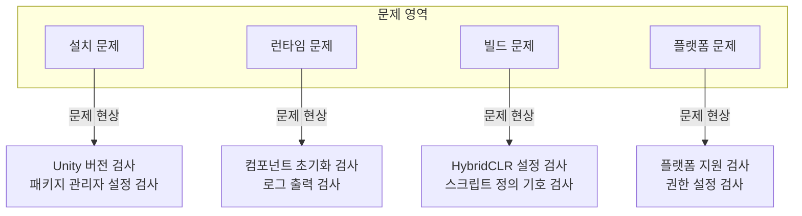

# 자주 묻는 질문

이 문서는 GameFrameX Unity 프레임워크 사용 과정에서遭遇할 수 있는 자주 묻는 질문과 그 해결책을 수집합니다.

## 개요

GameFrameX는 기능이 풍부한 Unity 게임 프레임워크로, 사용 과정에서 다양한 기술적 문제가 발생할 수 있습니다. 이 문서는 개발자가 문제를 빠르게 파악하고 해결하여 개발 효율을 향상시키는 것을 목표로 합니다.

## 아키텍처



## 설치 문제

### Unity 버전 비호환

**문제 설명**: 프레임워크 가져온 후 컴파일 오류 또는 기능 이상 발생.

**원인 분석**:
- Unity 버전이 프레임워크가 요구하는最低 버전 (2019.4+)보다 낮음
- .NET API 호환성 레벨 설정이不正确

**해결책**:

1. Unity 버전 검사:
   - Unity 2019.4 이상 버전 사용 확인
   - LTS 버전使用 권장하여 최적의 안정성 획득

2. API 호환성 레벨 설정:
   - `Edit` → `Project Settings` → `Player` 열기
   - `Other Settings`에서 `Api Compatibility Level`을 `.NET Standard 2.0` 이상으로 설정

> Source: [README.zh-CN.md](https://github.com/GameFrameX/com.gameframex.unity/blob/main/README.zh-CN.md#L57-L61)

### Package Manager 설치 실패

**문제 설명**: UPM을 통해 패키지 추가 시 네트워크 오류 또는 설치 실패 발생.

**해결책**:

1. 권장 설치 방식 사용:
   - Unity 편집기 열기
   - `Window` → `Package Manager` 선택
   - 좌측 상단 `+` 버튼 클릭
   - `Add package from git URL` 선택
   - 입력: `https://github.com/GameFrameX/com.gameframex.unity.git`

2. 대안 - 수동 설치:
   - GitHub Releases에서 최신 버전 다운로드
   - 프로젝트의 `Packages` 디렉토리에 압축 해제

> Source: [README.zh-CN.md](https://github.com/GameFrameX/com.gameframex.unity/blob/main/README.zh-CN.md#L349-L364)

## 런타임 문제

### 컴포넌트 가져오기 반환 Null

**문제 설명**: `GameEntry.GetComponent<T>()`가 null 반환.

**원인 분석**:
- 해당 컴포넌트가 씬에 추가되지 않음
- 컴포넌트가 올바르게 초기화되지 않음
- 컴포넌트 추가 순서가不正确

**해결책**:

1. 컴포넌트가 씬에 추가되었는지 확인:
   - 씬에 빈 객체 생성하여 필요한 컴포넌트 추가
   - 컴포넌트가 `GameFrameworkComponent`를 상속하는지 확인

2. 컴포넌트 초기화 코드 검사:
   > Source: [Runtime/Base/ObjectPoolComponent.cs](https://github.com/GameFrameX/com.gameframex.unity/blob/main/Runtime/ObjectPool/ObjectPoolComponent.cs#L61-L72)

```csharp
protected override void Awake()
{
    ImplementationComponentType = Type.GetType(componentType);
    InterfaceComponentType = typeof(IObjectPoolManager);
    base.Awake();
    m_ObjectPoolManager = GameFrameworkEntry.GetModule<IObjectPoolManager>();
    if (m_ObjectPoolManager == null)
    {
        Log.Fatal("Object pool manager is invalid.");
        return;
    }
}
```

3. GameEntry가 올바르게 초기화되었는지 확인

### 객체 풀 사용 문제

**문제 설명**: 객체 풀이 객체를 정상적으로 가져오거나 release할 수 없음.

**원인 분석**:
- 객체 타입이 `ObjectBase`를 상속하지 않음
- 객체 풀이 올바르게 생성되지 않음
- 풀 용량 설정이不合理

**해결책**:

1. 객체 타입이 올바르게 상속하는지 확인:
   > Source: [Runtime/ObjectPool/ObjectBase.cs](https://github.com/GameFrameX/com.gameframex.unity/blob/main/Runtime/ObjectPool/ObjectBase.cs)

2. 객체 풀을 올바르게 생성하고 사용:
```csharp
// 객체 풀 컴포넌트 가져오기
var objectPool = GameEntry.GetComponent<ObjectPoolComponent>();

// 객체 풀 생성
objectPool.CreatePool<MyObject>("MyObjectPool", 10, 100);

// 풀에서 객체 가져오기
var obj = objectPool.Spawn<MyObject>("MyObjectPool");

// 객체를 풀에 반환
objectPool.Unspawn(obj);
```

> Source: [README.zh-CN.md](https://github.com/GameFrameX/com.gameframex.unity/blob/main/README.zh-CN.md#L394-L411)

### 이벤트 시스템 무응답

**문제 설명**: 구독한 이벤트가 트리거되지 않음.

**원인 분석**:
- 이벤트 ID 불일치
- 구독/구독 취소가 올바르지 않음
- 이벤트가 만료되어 정리됨

**해결책**:

1. 이벤트 ID 정의가 올바른지 확인:
```csharp
// 이벤트 파라미터 정의
public class PlayerDeadEventArgs : BaseEventArgs
{
    public int PlayerId { get; set; }
    public float Damage { get; set; }
}

// 이벤트 구독
GameEntry.Event.Subscribe(PlayerDeadEventArgs.EventId, OnPlayerDead);

// 이벤트 발생
GameEntry.Event.Fire(this, PlayerDeadEventArgs.Create(playerId, damage));

// 구독 취소
GameEntry.Event.Unsubscribe(PlayerDeadEventArgs.EventId, OnPlayerDead);
```

> Source: [README.zh-CN.md](https://github.com/GameFrameX/com.gameframex.unity/blob/main/README.zh-CN.md#L450-L468)

2. 적절한 시기에 구독을 취소하여 메모리 누수 방지

## 빌드 문제

### HybridCLR 핫 업데이트 빌드 실패

**문제 설명**: 핫 업데이트 빌드 시 컴파일 오류 또는 파일 찾을 수 없음 발생.

**원인 분석**:
- HybridCLR이 올바르게 설치되지 않음
- AOT 코드가 올바르게 생성되지 않음
- 핫更新 DLL 경로 설정이 잘못됨

**해결책**:

1. HybridCLR이 올바르게 설치되었는지 확인:
   - `Project Settings` → `HybridCLR` 존재 여부 검사
   - HybridCLR 플러그인이 설치되었는지 확인

2. 프레임워크가 제공하는 빌드 도구 사용:
   ```
   GameFrameX/
   └── Build/
       ├── Build Hotfix (핫更新 빌드)
       ├── Build Product (제품 빌드)
       └── Build WebGL With HybridCLR (WebGL 핫更新 빌드)
   ```

3. 핫更新 코드 복사:
   - 메뉴 `GameFrameX/Build/Copy HotFix Code` 사용하여 핫更新 DLL 복사
   - 메뉴 `GameFrameX/Build/Copy AOT Code` 사용하여 AOT 코드 복사

> Source: [Editor/BuildHotfix/BuildHotfixHelper.cs](https://github.com/GameFrameX/com.gameframex.unity/blob/main/Editor/BuildHotfix/BuildHotfixHelper.cs#L43-L65)

### AOT 코드 디렉토리 찾을 수 없음

**문제 설명**: AOT 코드 복사 시 "HybridCLR 데이터 디렉토리를 찾을 수 없음" 프롬프트.

**원인 분석**:
- 프로젝트가 IL2CPP 빌드를 실행하지 않음
- HybridCLR이 AOT 데이터를 올바르게 생성하지 않음
- 빌드 대상 플랫폼이 올바르지 않음

**해결책**:

1. 프로젝트가 IL2CPP로 설정되었는지 확인:
   - `Project Settings` → `Player` → `Other Settings` 열기
   - `Scripting Backend`가 `IL2CPP`로 설정되었는지 확인

2. 먼저 AOT 메타데이터 생성:
   - HybridCLR 메뉴에서 `Generate AOT Hocking` 실행

3. 빌드 대상 플랫폼 검사:
   > Source: [Editor/BuildHotfix/BuildHotfixHelper.cs](https://github.com/GameFrameX/com.gameframex.unity/blob/main/Editor/BuildHotfix/BuildHotfixHelper.cs#L73-L91)

```csharp
DirectoryInfo directoryInfo = new DirectoryInfo(Application.dataPath);
string path = Path.Combine(directoryInfo.Parent.FullName, "HybridCLRData", "AssembliesPostIl2CppStrip", EditorUserBuildSettings.activeBuildTarget.ToString());

DirectoryInfo aotCodeDir = new DirectoryInfo(path);
if (!aotCodeDir.Exists)
{
    Debug.LogError($"HybridCLR 데이터 디렉토리를 찾을 수 없음:{path}");
    return;
}
```

### WebGL 빌드 관련 문제

**문제 설명**: WebGL 플랫폼 빌드 실패 또는 실행 이상.

**해결책**:

1. 전용 WebGL 빌드 도구 사용:
   - `GameFrameX/Build WebGL With HybridCLR` - 핫更新이 포함된 WebGL 빌드

2. WebGL 모듈 설치 여부 검사:
   - Unity Hub 열기 → 설치 → 모듈 추가 → WebGL Build Support

### 스크립트 정의 기호 충돌

**문제 설명**: 여러 플랫폼 매크로가 동시에 적용되어 컴파일 오류 발생.

**원인 분석**:
- 미니게임 플랫폼 매크로 상호 배타 메커니즘이 작동하지 않음
- 수동으로 추가한 매크로가 프레임워크와 충돌

**해결책**:

1. 프레임워크 메뉴를 통해 플랫폼 전환:
   ```
   GameFrameX/
   └── Scripting Define Symbols/
       ├── Domestic Mini Games (국내 미니게임)
       ├── International Mini Games (국제 미니게임)
       ├── Device OEMs (장치厂商)
       └── Game Platforms (게임 플랫폼)
   ```

2. 프레임워크가 자동으로 상호 배타 로직 처리:
   > Source: [Editor/MiniGame/MiniGameDefineSymbolHelper.cs](https://github.com/GameFrameX/com.gameframex.unity/blob/main/Editor/MiniGame/MiniGameDefineSymbolHelper.cs#L52-L88)

```csharp
/// <summary>
/// 현재 플랫폼 외 기타 미니게임 플랫폼 매크로 정의를 닫습니다.
/// </summary>
private static void DisableOtherMiniGameScriptingDefineSymbols(string[] currentMiniGameScriptingDefineSymbols)
{
#if UNITY_WEBGL
    var closedCount = 0;
    foreach (var defineSymbols in GetAllMiniGameScriptingDefineSymbols())
    {
        if (defineSymbols == null || object.ReferenceEquals(defineSymbols, currentMiniGameScriptingDefineSymbols))
        {
            continue;
        }

        foreach (var define in defineSymbols)
        {
            if (!ScriptingDefineSymbols.HasScriptingDefineSymbol(BuildTargetGroup.WebGL, define))
            {
                continue;
            }

            ScriptingDefineSymbols.RemoveScriptingDefineSymbol(define);
            closedCount++;
        }
    }
    Debug.Log($"미니게임 매크로 상호 배타 정리 완료, 총 {closedCount}개 매크로 닫힘");
#endif
}
```

## 플랫폼 문제

### iOS 플랫폼 컴파일 오류

**문제 설명**: iOS 플랫폼 빌드 시 컴파일 오류 또는原生 플러그인 문제 발생.

**해결책**:

1. iOS原生 플러그인 검사:
   - `Plugins/iOS/GameFrameX/GameFrameX.mm` 존재 여부 확인
   - 플러그인 가져오기 설정 검사

2. 올바른 권한 설정:
   - Xcode에서 필요한 권한 설명 설정
   - Info.plist 설정 검사

### Android 플랫폼 실행 크래시

**문제 설명**: Android 플랫폼 애플리케이션 시작 후 크래시 발생.

**해결책**:

1. IL2CPP 설정 검사:
   - 올바른 ABI 설정 사용 확인
   - armeabi-v7a 및 arm64-v8a 지원 검사

2. 권한 설정 검사:
   - 필요한 Android 권한이 선언되었는지 확인

### 미니게임 플랫폼 어댑션 문제

**문제 설명**: 미니게임 플랫폼 전환 후 기능 이상.

**원인 분석**:
- 대상 플랫폼의 매크로 정의가 올바르게 활성화되지 않음
- 플랫폼 특정 API가 올바르게 호출되지 않음
- 리소스 경로 설정 문제

**해결책**:

1. 플랫폼 매크로 정의가 활성화되었는지 확인:
   - 메뉴 `GameFrameX/Scripting Define Symbols/`를 통해 대상 플랫폼 선택
   - Console에서 매크로 정의 활성화 로그 확인

2. 조건부 컴파일 사용하여 플랫폼 차이 처리:
```csharp
#if ENABLE_WECHAT_MINI_GAME
    // 위챗 미니게임 특정 코드
#elif ENABLE_ALIPAY_MINI_GAME
    // 알리페이 미니게임 특정 코드
#endif
```

3. 통일 매크로 정의 검사:
   - 모든 미니게임 플랫폼이 `ENABLE_WEBGL_MINI_GAME` 매크로 정의 공유

> Source: [README.zh-CN.md](https://github.com/GameFrameX/com.gameframex.unity/blob/main/README.zh-CN.md#L583-L588)

## 로그와 디버깅

### 상세 로그 활성화

**문제 설명**: 디버깅을 위해 더 자세한 실행 정보 확인 필요.

**해결책**:

1. 프레임워크 로그 시스템 사용:
   > Source: [Runtime/Base/Log/GameFrameworkLog.cs](https://github.com/GameFrameX/com.gameframex.unity/blob/main/Runtime/Base/Log/GameFrameworkLog.cs)

2. 로그 레벨 설정:
```csharp
// 게임 초기화 시 설정
Log.SetLogLevel(LogLevel.Debug);
```

3. 프레임워크 내장 로그 확인:
   - 프레임워크가 `GameFrameworkLog` 사용하여 로그 출력
   - 커스텀 `ILogHelper`를 통해 로그 동작 변경 가능

### 예외 포착 및 처리

**문제 설명**: 프레임워크 예외를 포착하고 처리해야 함.

**해결책**:

1. 프레임워크가 정의한 예외 타입 사용:
   > Source: [Runtime/Base/GameFrameworkException.cs](https://github.com/GameFrameX/com.gameframex.unity/blob/main/Runtime/Base/GameFrameworkException.cs)

```csharp
try
{
    // 프레임워크 관련 작업
}
catch (GameFrameworkException ex)
{
    Log.Error($"프레임워크 예외: {ex.Message}");
}
catch (Exception ex)
{
    Log.Error($"시스템 예외: {ex.Message}");
}
```

2. 파라미터 검증 사용:
   > Source: [Runtime/Base/GameFrameworkGuard.cs](https://github.com/GameFrameX/com.gameframex.unity/blob/main/Runtime/Base/GameFrameworkGuard.cs)

```csharp
// 파라미터 non-null 검사
GameFrameworkGuard.NotNull(value, nameof(value));
GameFrameworkGuard.NotNullOrEmpty(text, nameof(text));
// 범위 검사
GameFrameworkGuard.NotRange(value, 0, 100, nameof(value));
```

## 성능 문제

### 메모리 누수

**문제 설명**: 장시간 실행 후 메모리가 지속적으로 증가.

**가능 원인**:
- 이벤트 구독이 취소되지 않음
- 객체 풀 객체가 반환되지 않음
- 참조 풀 객체가 released되지 않음

**해결책**:

1. 이벤트 구독을 올바르게 관리:
```csharp
void OnDestroy()
{
    // 모든 구독 취소
    GameEntry.Event.Unsubscribe<PlayerDeadEventArgs>(OnPlayerDead);
}
```

2. 객체 풀을 올바르게 사용:
```csharp
// 사용 완료 후 반환
objectPool.Unspawn(obj);

// 또는 using 문 사용 (지원 시)
```

3. Inspector로 모니터링:
   - 프레임워크가 객체 풀 및 참조 풀의 시각적 Inspector 제공
   - `Window` → `GameFrameX` → `Inspector`를 통해 확인

### 성능 최적화 권장 사항

1. 빈번하게 생성/销毁되는 객체에는 객체 풀 재사용
2. GC压力을 줄이려면 참조 풀 사용
3. Unity 객체 操作 최적화에는 확장 메서드 사용
4. 비동기 操作 처리에 태스크 풀을 합리적으로 사용

## 자주 묻는 오류 정보对照表

| 오류 정보 | 가능 원인 | 해결책 |
|----------|----------|------|
| `Object pool manager is invalid` | 컴포넌트가 올바르게 초기화되지 않음 | ObjectPoolComponent가 씬에 추가되었는지 확인 |
| `HybridCLR 데이터 디렉토리를 찾을 수 없음` | IL2CPP 빌드를 실행하지 않음 | 완전한 빌드流程 실행 |
| `can not be null` | 파라미터가 비어있음 | GameFrameworkGuard를 사용하여 검사 |
| `컴포넌트 가져오기 반환 null` | 컴포넌트가 씬에 추가되지 않음 | 컴포넌트가 올바르게 추가되었는지 확인 |
| `미니게임 매크로 충돌` | 여러 플랫폼이 동시에 활성화됨 | 프레임워크 메뉴를 통해 플랫폼 전환 |

## 더 많은 도움 받기

- **공식 문서**: [https://gameframex.doc.alianblank.com](https://gameframex.doc.alianblank.com)
- **GitHub Issues**: [https://github.com/GameFrameX/com.gameframex.unity/issues](https://github.com/GameFrameX/com.gameframex.unity/issues)
- **QQ 논의 그룹**: 467608841
- **기능 제안**: [GitHub Discussions](https://github.com/GameFrameX/com.gameframex.unity/discussions)

## 관련 링크

- [설치 가이드](./2-installation)
- [빠른 시작](./3-quick-start)
- [핵심 개념](./4-core-concepts)
- [런타임 모듈](./5-runtime.base)
- [편집기 도구](./6-editor-tools.build-tools)
- [플랫폼 지원](./7-platforms)
- [API 참고](./8-api-reference)
