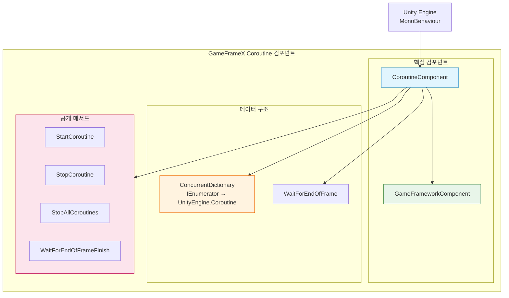
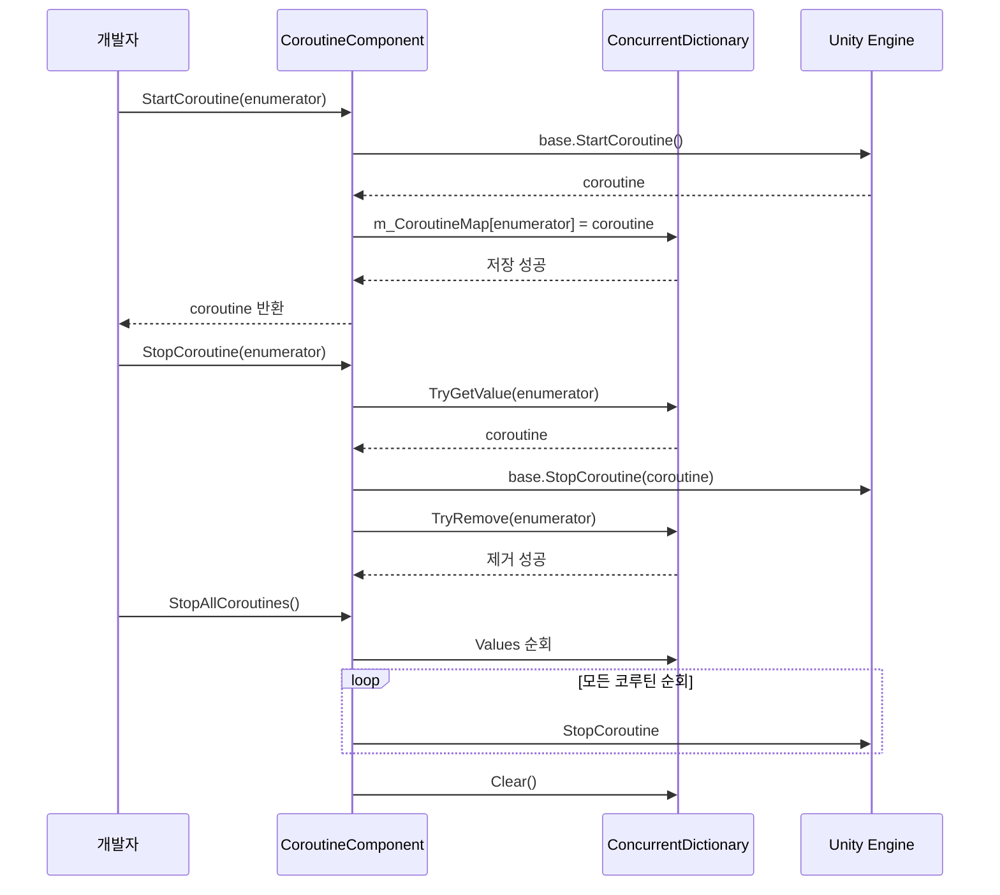

# 플러그인 소개

GameFrameX Coroutine 코루틴 컴포넌트는 Unity 확장 컴포넌트로, 향상된 코루틴 관리 기능을 제공합니다. ConcurrentDictionary를 사용하여 실행 중인 코루틴을 추적함으로써, 코루틴의 시작, 중지 및 정리을 위한 더 나은 제어와 접근성을 제공합니다.

## 개요

**CoroutineComponent**는 GameFrameX 게임 개발 프레임워크의 핵심 컴포넌트 중 하나로, Unity 코루틴的管理 및 실행을 전문으로 합니다. 이 컴포넌트는 Unity의 내장 코루틴 관리 기능을 확장하여,原生 코루틴 관리의いくつかの 문제점을 해결합니다.

### 해결하는 문제

Unity 개발에서原生 코루틴 관리에는 다음과 같은 문제가 있습니다:

1. **추적 어려움**: 시작된 코루틴의 상태를 얻기 어려움
2. **중지 복잡**: `IEnumerator`를 사용하여 코루틴을 중지하는 것이 직관적이지 않음
3. **메모리 누수 위험**: 코루틴이 올바르게 중지되지 않으면 메모리 누수가 발생할 수 있음
4. **일괄 관리 불가**: 모든 코루틴을 편리하게 중지할 수 없음

### 핵심 기능

| 기능 | 설명 |
|------|------|
| 코루틴 추적 | `ConcurrentDictionary`를 사용하여 모든 시작된 코루틴 기록 |
| 안전 중지 | 반복기와 코루틴 객체 두 가지方式进行 코루틴 중지 지원 |
| 일괄 관리 | 모든 코루틴 중지 기능 제공 |
| 프레임 종료 콜백 | 현재 프레임 렌더링 완료 후 콜백을 실행하는 편의 메서드 제공 |
| 싱글톤 제한 | `[DisallowMultipleComponent]`를 사용하여 중복 추가 방지 |

## 아키텍처



### 컴포넌트 구조 설명

**CoroutineComponent**는 `GameFrameworkComponent`를 상속하며, GameFrameX 프레임워크의 핵심 기능을 통합합니다. 컴포넌트 내부에는 `ConcurrentDictionary`를 유지하여 사용자가 전달한 `IEnumerator`를 Unity 내부의 `Coroutine` 객체에 매핑하여 더 편리한 코루틴 관리를 구현합니다.

### 핵심 파일

| 파일 | 경로 | 설명 |
|------|------|------|
| CoroutineComponent.cs | Runtime/Coroutine/ | 주요 컴포넌트 구현 |
| CoroutineComponentInspector.cs | Editor/Inspector/ | Unity 편집기 인스펙터 |
| GameFrameXCoroutineCroppingHelper.cs | Runtime/ | IL2CPP 코드 보존 보조 클래스 |

## 핵심 기능

### 1. 코루틴 시작

`StartCoroutine` 메서드는 Unity MonoBehaviour의同名 메서드를 재정의하여, 코루틴을 시작하는 동시에 내부 사전에 기록합니다:

```csharp
public new UnityEngine.Coroutine StartCoroutine(IEnumerator enumerator)
{
    var ret = base.StartCoroutine(enumerator);
    m_CoroutineMap[enumerator] = ret;
    return ret;
}
```

> Source: [CoroutineComponent.cs](https://github.com/GameFrameX/com.gameframex.unity.coroutine/blob/main/Runtime/Coroutine/CoroutineComponent.cs#L25-L30)

**설계 의도**: 시작 시 매핑 관계를 저장하여, 나중에 `IEnumerator`를 통해 특정 코루틴을 정확하게 중지할 수 있도록 합니다. 이는原生 Unity 코루틴 API가 IEnumerator로 중지할 수 없는 문제를 해결합니다.

### 2. 코루틴 중지

컴포넌트는 두 가지 코루틴 중지 방법을 제공합니다:

**IEnumerator를 통해 중지**:
```csharp
public new void StopCoroutine(IEnumerator enumerator)
{
    if (m_CoroutineMap.TryGetValue(enumerator, out var coroutine))
    {
        base.StopCoroutine(coroutine);
        m_CoroutineMap.TryRemove(enumerator, out _);
    }
    base.StopCoroutine(enumerator);
}
```

> Source: [CoroutineComponent.cs](https://github.com/GameFrameX/com.gameframex.unity.coroutine/blob/main/Runtime/Coroutine/CoroutineComponent.cs#L36-L45)

**UnityEngine.Coroutine를 통해 중지**:
```csharp
public new void StopCoroutine(UnityEngine.Coroutine coroutine)
{
    base.StopCoroutine(coroutine);
    foreach (var item in m_CoroutineMap)
    {
        if (item.Value == coroutine)
        {
            m_CoroutineMap.TryRemove(item.Key, out _);
            break;
        }
    }
}
```

> Source: [CoroutineComponent.cs](https://github.com/GameFrameX/com.gameframex.unity.coroutine/blob/main/Runtime/Coroutine/CoroutineComponent.cs#L51-L62)

**설계 의도**: 유연한 중지 방식을 제공하여, 개발자는手中持有的 참조 유형(IEnumerator 또는 Coroutine)에 따라 적절한 중지 방법을 선택할 수 있습니다.

### 3. 모든 코루틴 중지

```csharp
public new void StopAllCoroutines()
{
    foreach (var coroutine in m_CoroutineMap.Values)
    {
        base.StopCoroutine(coroutine);
    }
    m_CoroutineMap.Clear();
    base.StopAllCoroutines();
}
```

> Source: [CoroutineComponent.cs](https://github.com/GameFrameX/com.gameframex.unity.coroutine/blob/main/Runtime/Coroutine/CoroutineComponent.cs#L67-L76)

**설계 의도**: Scene 전환 또는 객체 파괴 시 모든 코루틴이 깨끗하게 중지되도록하여, 메모리 누수 및 날ポ인터 문제를 방지합니다.

### 4. 프레임 종료 콜백

```csharp
public void WaitForEndOfFrameFinish(System.Action callback)
{
    StartCoroutine(_WaitForEndOfFrameFinish(callback));
}
```

> Source: [CoroutineComponent.cs](https://github.com/GameFrameX/com.gameframex.unity.coroutine/blob/main/Runtime/Coroutine/CoroutineComponent.cs#L94-L97)

**설계 의도**: 현재 프레임의 렌더링 완료 후 콜백을 실행하는 편의 방법을 제공합니다. 이는 UI 업데이트 완료 후 계산을 수행해야 하는 시나리오에 특히 유용합니다.

## 코루틴 관리 흐름



## 사용 예시

### 기본 사용

```csharp
IEnumerator YourCoroutine()
{
    // 코루틴 실행 내용
    yield return null;
}

// 컴포넌트를 게임 객체에 추가
CoroutineComponent coroutineComponent = gameObject.AddComponent<CoroutineComponent>();

// 코루틴 시작
coroutineComponent.StartCoroutine(YourCoroutine());

// 코루틴 중지
coroutineComponent.StopCoroutine(YourCoroutine());
```

> Source: [README.md](https://github.com/GameFrameX/com.gameframex.unity.coroutine/blob/main/README.md#L29-L42)

### 프레임 종료 콜백

```csharp
void YourCallback()
{
    // 콜백 실행 내용
}

coroutineComponent.WaitForEndOfFrameFinish(YourCallback);
```

> Source: [README.md](https://github.com/GameFrameX/com.gameframex.unity.coroutine/blob/main/README.md#L59-L70)

## 주의 사항

1. **싱글톤 제한**: 컴포넌트는 `[DisallowMultipleComponent]` 속성을 사용하여 각 GameObject에 CoroutineComponent 인스턴스가 하나만 추가되도록 합니다.

2. **자동 등록**: `Awake` 메서드에서 `IsAutoRegister = false`를 설정하여, 해당 컴포넌트가 프레임워크의 핵심 시스템에 자동 등록되지 않음을 나타냅니다.

3. **코드 보존**: `GameFrameXCoroutineCroppingHelper` 클래스는 IL2CPP 构建使用時に CoroutineComponent가 코드 트리밍에 의해 제거되지 않도록确保합니다.

## 관련 링크

- [설치 방식](../2-installation.index)
- [사용 가이드](../3-getting-started.index)
- [API 참고](./4-api-reference.coroutine-component)
- [FAQ](../5-troubleshooting.index)
- [GitHub 저장소](https://github.com/GameFrameX/com.gameframex.unity.coroutine.git)
- [GameFrameX 공식 사이트](https://gameframex.doc.alianblank.com)