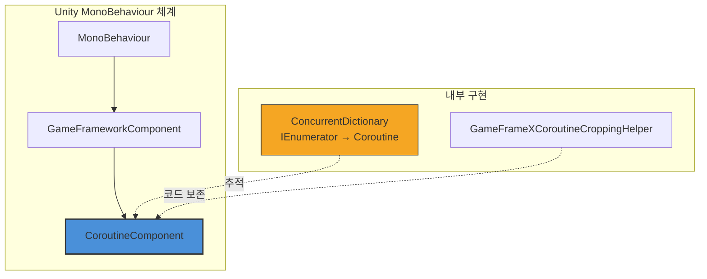

# CoroutineComponent

코루틴 컴포넌트(CoroutineComponent)는 GameFrameX 프레임워크의 핵심 컴포넌트 중 하나로, Unity 내장 코루틴 관리 기능을 확장한 인터페이스를 제공합니다. ConcurrentDictionary를 사용하여 실행 중인 코루틴을 추적함으로써, 코루틴의 중지와 정리에 대한 더 나은 제어를 제공합니다.

## 개요

`CoroutineComponent`는 Unity `MonoBehaviour` 컴포넌트로, `GameFrameworkComponent`를 상속합니다. Unity原生 코루틴 기능을 캡슐화하고 코루틴 추적 및 관리 기능을 추가하여, 개발자가 코루틴의 라이프사이클을 더 편리하게 제어하고, 코루틴이 올바르게 중지되지 않아 발생하는 메모리 누수 문제를 방지할 수 있도록 합니다.

### 핵심 기능

- **코루틴 추적**: `ConcurrentDictionary`를 사용하여 스레드 안전하게 모든 시작된 코루틴 추적
- **유연한 중지**: 반복기 또는 코루틴 객체를 통해 단일 코루틴 중지 지원
- **일괄 관리**: 모든 코루틴을一键 중지하는 기능 제공
- **프레임 종료 콜백**: 현재 프레임 렌더링 완료 후 콜백을 실행하는 편의 메서드 제공

## 아키텍처



### 컴포넌트 계층

- **MonoBehaviour**: Unity 컴포넌트 베이스 클래스
- **GameFrameworkComponent**: GameFrameX 프레임워크 컴포넌트 베이스 클래스
- **CoroutineComponent**: 코루틴 관리 컴포넌트 (현재 문서 주제)

### 핵심 데이터 구조

`CoroutineComponent`는 `ConcurrentDictionary<IEnumerator, UnityEngine.Coroutine>`를 사용하여 코루틴 매핑 테이블을 유지합니다:

```csharp
private readonly ConcurrentDictionary<IEnumerator, UnityEngine.Coroutine> m_CoroutineMap = new ConcurrentDictionary<IEnumerator, UnityEngine.Coroutine>();
```

> Source: [CoroutineComponent.cs](https://github.com/GameFrameX/com.gameframex.unity.coroutine/blob/main/Runtime/Coroutine/CoroutineComponent.cs#L18)

## 핵심 기능

### 코루틴 시작

`StartCoroutine` 메서드는 Unity 베이스 클래스 구현을 재정의하여, 코루틴을 시작할 뿐만 아니라 내부 추적 사전에도 추가합니다:

```csharp
public new UnityEngine.Coroutine StartCoroutine(IEnumerator enumerator)
{
    var ret = base.StartCoroutine(enumerator);
    m_CoroutineMap[enumerator] = ret;
    return ret;
}
```

> Source: [CoroutineComponent.cs](https://github.com/GameFrameX/com.gameframex.unity.coroutine/blob/main/Runtime/Coroutine/CoroutineComponent.cs#L25-L30)

**설계 의도**: 각 반복기와 해당 코루틴의 매핑 관계를 추적하여 정확한 코루틴 중지 제어를 구현합니다.

### 코루틴 중지

컴포넌트는 두 가지 코루틴 중지 방법을 제공합니다:

**방법 1: 반복기를 통해 중지**

```csharp
public new void StopCoroutine(IEnumerator enumerator)
{
    if (m_CoroutineMap.TryGetValue(enumerator, out var coroutine))
    {
        base.StopCoroutine(coroutine);
        m_CoroutineMap.TryRemove(enumerator, out _);
    }
    base.StopCoroutine(enumerator);
}
```

> Source: [CoroutineComponent.cs](https://github.com/GameFrameX/com.gameframex.unity.coroutine/blob/main/Runtime/Coroutine/CoroutineComponent.cs#L36-L45)

**방법 2: 코루틴 객체를 통해 중지**

```csharp
public new void StopCoroutine(UnityEngine.Coroutine coroutine)
{
    base.StopCoroutine(coroutine);
    foreach (var item in m_CoroutineMap)
    {
        if (item.Value == coroutine)
        {
            m_CoroutineMap.TryRemove(item.Key, out _);
            break;
        }
    }
}
```

> Source: [CoroutineComponent.cs](https://github.com/GameFrameX/com.gameframex.unity.coroutine/blob/main/Runtime/Coroutine/CoroutineComponent.cs#L51-L62)

### 모든 코루틴 중지

```csharp
public new void StopAllCoroutines()
{
    foreach (var coroutine in m_CoroutineMap.Values)
    {
        base.StopCoroutine(coroutine);
    }
    m_CoroutineMap.Clear();
    base.StopAllCoroutines();
}
```

> Source: [CoroutineComponent.cs](https://github.com/GameFrameX/com.gameframex.unity.coroutine/blob/main/Runtime/Coroutine/CoroutineComponent.cs#L67-L76)

**설계 의도**: 모든 코루틴이 올바르게 중지되고 내부 추적 데이터가 정리되도록하여 메모리 누수를 방지합니다.

### 프레임 종료 콜백

`WaitForEndOfFrameFinish` 메서드를 사용하면 현재 프레임 렌더링 완료 후 콜백을 실행할 수 있습니다:

```csharp
private readonly WaitForEndOfFrame _waitForEndOfFrame = new WaitForEndOfFrame();

public void WaitForEndOfFrameFinish(System.Action callback)
{
    StartCoroutine(_WaitForEndOfFrameFinish(callback));
}
```

> Source: [CoroutineComponent.cs](https://github.com/GameFrameX/com.gameframex.unity.coroutine/blob/main/Runtime/Coroutine/CoroutineComponent.cs#L78-L97)

**설계 의도**: 프레임 종료 콜백 기능을 제공하여, 전체 프레임 렌더링 완료 후 실행해야 하는 작업(예: UI 업데이트 후 데이터 동기화)에 자주 사용됩니다.

## 사용 예시

### 기본 사용

```csharp
using GameFrameX.Coroutine.Runtime;
using UnityEngine;
using System.Collections;

public class CoroutineExample : MonoBehaviour
{
    private CoroutineComponent _coroutineComponent;

    private void Start()
    {
        // CoroutineComponent 획득 또는 추가
        _coroutineComponent = gameObject.GetComponent<CoroutineComponent>();
        if (_coroutineComponent == null)
        {
            _coroutineComponent = gameObject.AddComponent<CoroutineComponent>();
        }

        // 코루틴 시작
        IEnumerator myCoroutine = MyCoroutine();
        _coroutineComponent.StartCoroutine(myCoroutine);
    }

    private IEnumerator MyCoroutine()
    {
        Debug.Log("코루틴 시작");
        yield return new WaitForSeconds(1f);
        Debug.Log("1초 후 계속 실행");
        yield return null;
        Debug.Log("다음 프레임 계속 실행");
    }
}
```

### 코루틴 중지 예시

```csharp
using GameFrameX.Coroutine.Runtime;
using UnityEngine;
using System.Collections;

public class StopCoroutineExample : MonoBehaviour
{
    private CoroutineComponent _coroutineComponent;
    private IEnumerator _runningCoroutine;

    private void Start()
    {
        _coroutineComponent = gameObject.AddComponent<CoroutineComponent>();
        
        // 코루틴 시작 및 참조 저장
        _runningCoroutine = LongRunningCoroutine();
        _coroutineComponent.StartCoroutine(_runningCoroutine);
        
        // 5초 후 자동 중지
        Invoke("StopMyCoroutine", 5f);
    }

    private IEnumerator LongRunningCoroutine()
    {
        int count = 0;
        while (true)
        {
            Debug.Log($"실행 중: {count++}");
            yield return new WaitForSeconds(1f);
        }
    }

    private void StopMyCoroutine()
    {
        // 반복기를 통해 코루틴 중지
        if (_runningCoroutine != null)
        {
            _coroutineComponent.StopCoroutine(_runningCoroutine);
        }
    }
}
```

### 프레임 종료 콜백 예시

```csharp
using GameFrameX.Coroutine.Runtime;
using UnityEngine;
using UnityEngine.UI;

public class FrameEndCallbackExample : MonoBehaviour
{
    public Text statusText;
    private CoroutineComponent _coroutineComponent;

    private void Start()
    {
        _coroutineComponent = gameObject.AddComponent<CoroutineComponent>();
        
        // 프레임 종료 후 UI 업데이트
        _coroutineComponent.WaitForEndOfFrameFinish(() =>
        {
            statusText.text = "UI가 업데이트됨";
        });
    }
}
```

## API 참고

### 속성

| 속성 | 유형 | 설명 |
|------|------|------|
| m_CoroutineMap | `ConcurrentDictionary<IEnumerator, UnityEngine.Coroutine>` | 모든 활성 코루틴의 매핑 테이블 저장 |

### 메서드

### `StartCoroutine(IEnumerator enumerator): UnityEngine.Coroutine`

코루틴을 시작하여 추적 테이블에 추가합니다.

**매개변수:**
- `enumerator` (IEnumerator): 코루틴 반복기

**반환:** UnityEngine.Coroutine - 시작된 코루틴 객체

**예시:**
```csharp
IEnumerator coroutine = MyRoutine();
UnityEngine.Coroutine running = coroutineComponent.StartCoroutine(coroutine);
```

---

### `StopCoroutine(IEnumerator enumerator): void`

반복기 참조를 통해 코루틴을 중지합니다.

**매개변수:**
- `enumerator` (IEnumerator): 중지할 코루틴 반복기

**설명:** 이 메서드는 추적 테이블에서 코루틴 참조도 함께 제거하여 완전한 정리를 보장합니다.

**예시:**
```csharp
IEnumerator myCoroutine = MyRoutine();
coroutineComponent.StartCoroutine(myCoroutine);
// ... 일부 로직 후
coroutineComponent.StopCoroutine(myCoroutine);
```

---

### `StopCoroutine(UnityEngine.Coroutine coroutine): void`

코루틴 객체를 통해 코루틴을 중지합니다.

**매개변수:**
- `coroutine` (UnityEngine.Coroutine): 중지할 코루틴 객체

**설명:** 코루틴이 추적 테이블에 존재하면 매핑 관계도 동기 정리됩니다.

**예시:**
```csharp
var running = coroutineComponent.StartCoroutine(MyRoutine());
coroutineComponent.StopCoroutine(running);
```

---

### `StopAllCoroutines(): void`

이 컴포넌트가 시작한 모든 코루틴을 중지합니다.

**설명:** 이 메서드는 추적 중인 모든 코루틴을 순회하여 중지하고 내부 추적 테이블을 비웁니다.

**예시:**
```csharp
// Scene 전환 시 모든 코루틴 정리
coroutineComponent.StopAllCoroutines();
```

---

### `WaitForEndOfFrameFinish(System.Action callback): void`

현재 프레임 렌더링 완료 후 콜백을 실행합니다.

**매개변수:**
- `callback` (System.Action): 실행할 콜백 메서드

**설명:** 내부적으로 `WaitForEndOfFrame`을 사용하여 구현되며, 전체 렌더링 프로세스 완료 후 실행해야 하는 작업에 자주 사용됩니다.

**예시:**
```csharp
coroutineComponent.WaitForEndOfFrameFinish(() =>
{
    Debug.Log("현재 프레임 렌더링 완료");
});
```

---

## 컴포넌트 구성

### Unity 편집기 구성

`CoroutineComponent`는 Unity 편집기에서 다음과 같은 특성을 가집니다:

| 특성 | 값 | 설명 |
|------|------|------|
| 메뉴 경로 | Game Framework/Coroutine | 컴포넌트 추가 시 메뉴 위치 |
| 중복 허용 | 아니오 | `[DisallowMultipleComponent]`로 제한 |
| 자동 등록 | 아니오 | `IsAutoRegister = false`, 수동 추가 필요 |

### 코드 보존 (IL2CPP)

IL2CPP 코드 트리밍으로 인해 컴포넌트가 제거되는 것을 방지하기 위해, 프레임워크는 `GameFrameXCoroutineCroppingHelper` 보조 클래스를 제공합니다:

```csharp
[Preserve]
public class GameFrameXCoroutineCroppingHelper : MonoBehaviour
{
    [Preserve]
    private void Start()
    {
        _ = typeof(CoroutineComponent);
    }
}
```

> Source: [GameFrameXCoroutineCroppingHelper.cs](https://github.com/GameFrameX/com.gameframex.unity.coroutine/blob/main/Runtime/GameFrameXCoroutineCroppingHelper.cs#L7-L14)

**설계 의도**: `CoroutineComponent` 유형을 참조하여 IL2CPP 构建時 해당 유형이 코드 트리밍에 의해 제거되지 않도록 보장합니다.

## 관련 링크

- [플러그인 소개](../1-overview.index)
- [설치 방식](../2-installation.index)
- [사용 가이드](../3-getting-started.index)
- [일반 문제](../5-troubleshooting.index)
- [GitHub 저장소](https://github.com/GameFrameX/com.gameframex.unity.coroutine.git)