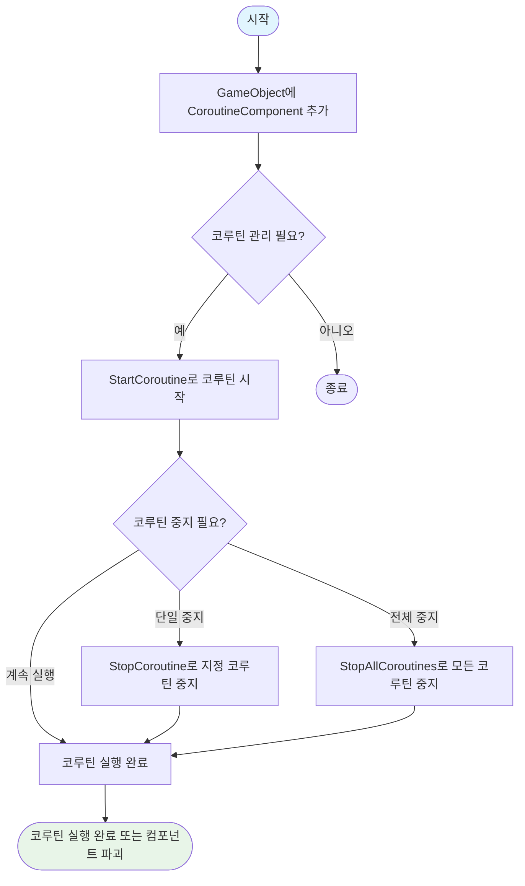
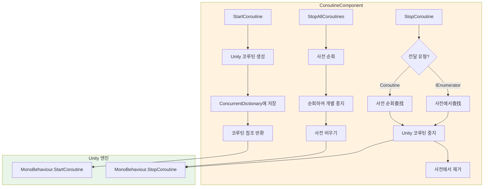

# 사용 가이드

이 가이드는 CoroutineComponent 코루틴 컴포넌트를 빠르게 시작하고, Unity 프로젝트에서 코루틴을 관리하고 제어하는 핵심 메서드를 마스터하도록 도와줍니다.

## 개요

CoroutineComponent는 GameFrameX 프레임워크가 제공하는 코루틴 관리 컴포넌트로, Unity 내장 코루틴 기능을 확장합니다. 이 컴포넌트는 ConcurrentDictionary를 사용하여 모든 시작된 코루틴을 추적하여 더 세밀한 라이프사이클 제어 기능을 제공하며, 개발자가 코루틴 누수 및 관리 혼란 문제를 피할 수 있도록 도와줍니다.

**CoroutineComponent를 사용하는 이유?**

대형 Unity 프로젝트에서 코루틴 관리는 종종 유지보수의难点가 됩니다. Scene 전환 또는 객체 파괴 시 코루틴이 올바르게 중지되지 않으면 메모리 누수, 로직 오류甚至는崩溃가 발생할 수 있습니다. CoroutineComponent는统一的 코루틴 관리 인터페이스를 제공하여 코루틴의 시작, 중지, 추적을 간단하고 제어 가능하게 만듭니다.

## 핵심 기능 개요

| 기능 | 설명 |
|------|------|
| 코루틴 시작 | 반복기를 사용하여 코루틴을 시작하고 자동 추적 |
| 단일 코루틴 중지 | 반복기 참조 또는 코루틴 객체를 통해 중지 |
| 모든 코루틴 중지 | 一键清理所有正在运行的 코루틴 |
| 프레임 종료 콜백 | 현재 프레임 렌더링 완료 후 콜백 실행 |

## 작업 흐름

다음 흐름도는 CoroutineComponent의典型 사용 흐름을 보여줍니다:



## 기초 사용

### 첫 번째 단계: 컴포넌트를 Scene에 추가

Unity 편집기에서 다음 방법으로 CoroutineComponent를 추가할 수 있습니다:

1. Hierarchy 패널에서 게임 객체를 우클릭합니다
2. **Game Framework → Coroutine** 메뉴 항목을 선택합니다
3. 컴포넌트가 선택한 게임 객체에 추가됩니다

> **주의**: `[DisallowMultipleComponent]` 속성을 사용하여 각 게임 객체에 CoroutineComponent가 하나만 추가될 수 있습니다.

### 두 번째 단계: 코드에서 사용

스크립트에서 컴포넌트 인스턴스를 획득하여 코루틴 기능을 사용합니다:

```csharp
using System.Collections;
using GameFrameX.Coroutine.Runtime;
using UnityEngine;

public class Example : MonoBehaviour
{
    private CoroutineComponent _coroutineComponent;

    private void Start()
    {
        // CoroutineComponent 획득 또는 추가
        _coroutineComponent = gameObject.GetComponent<CoroutineComponent>();
        if (_coroutineComponent == null)
        {
            _coroutineComponent = gameObject.AddComponent<CoroutineComponent>();
        }
    }
}
```
> Source: [CoroutineComponent.cs](https://github.com/GameFrameX/com.gameframex.unity.coroutine/blob/main/Runtime/Coroutine/CoroutineComponent.cs#L25-L30)

## 사용 예시

### 예시 1: 코루틴 시작 및 중지

다음 예시는 코루틴을 시작하고 일정 조건에서 중지하는 방법을 보여줍니다:

```csharp
using System.Collections;
using GameFrameX.Coroutine.Runtime;
using UnityEngine;

public class CoroutineExample : MonoBehaviour
{
    private CoroutineComponent _coroutineComponent;
    private IEnumerator _runningCoroutine;

    private void Start()
    {
        _coroutineComponent = gameObject.AddComponent<CoroutineComponent>();
        
        // 코루틴 시작 및 참조 저장
        _runningCoroutine = MyProcessCoroutine();
        _coroutineComponent.StartCoroutine(_runningCoroutine);
    }

    private IEnumerator MyProcessCoroutine()
    {
        while (true)
        {
            Debug.Log("코루틴 실행 중...");
            yield return null;
        }
    }

    private void OnDestroy()
    {
        // 객체 파괴 시 코루틴 중지 확인
        if (_runningCoroutine != null)
        {
            _coroutineComponent.StopCoroutine(_runningCoroutine);
        }
    }
}
```
> Sources:
> - [CoroutineComponent.cs](https://github.com/GameFrameX/com.gameframex.unity.coroutine/blob/main/Runtime/Coroutine/CoroutineComponent.cs#L25-L30)
> - [CoroutineComponent.cs](https://github.com/GameFrameX/com.gameframex.unity.coroutine/blob/main/Runtime/Coroutine/CoroutineComponent.cs#L36-L45)

### 예시 2: 모든 코루틴 중지

모든 실행 중인 코루틴을 정리해야 하는 경우(예: Scene 전환 시):

```csharp
using System.Collections;
using GameFrameX.Coroutine.Runtime;
using UnityEngine;

public class CleanupExample : MonoBehaviour
{
    private CoroutineComponent _coroutineComponent;

    private void Start()
    {
        _coroutineComponent = gameObject.AddComponent<CoroutineComponent>();
        
        // 여러 코루틴 시작
        _coroutineComponent.StartCoroutine(TaskA());
        _coroutineComponent.StartCoroutine(TaskB());
        _coroutineComponent.StartCoroutine(TaskC());
    }

    private IEnumerator TaskA()
    {
        for (int i = 0; i < 10; i++)
        {
            Debug.Log("Task A: " + i);
            yield return null;
        }
    }

    private IEnumerator TaskB()
    {
        for (int i = 0; i < 10; i++)
        {
            Debug.Log("Task B: " + i);
            yield return null;
        }
    }

    private IEnumerator TaskC()
    {
        for (int i = 0; i < 10; i++)
        {
            Debug.Log("Task C: " + i);
            yield return null;
        }
    }

    public void OnSceneChange()
    {
        // 모든 코루틴 중지
        _coroutineComponent.StopAllCoroutines();
        Debug.Log("모든 코루틴 중지됨");
    }
}
```
> Source: [CoroutineComponent.cs](https://github.com/GameFrameX/com.gameframex.unity.coroutine/blob/main/Runtime/Coroutine/CoroutineComponent.cs#L67-L76)

### 예시 3: 프레임 종료 콜백

`WaitForEndOfFrameFinish`를 사용하여 프레임 렌더링 완료 후 작업을 실행합니다. 스크린샷, UI 업데이트 등에 자주 사용됩니다:

```csharp
using GameFrameX.Coroutine.Runtime;
using UnityEngine;

public class EndOfFrameExample : MonoBehaviour
{
    private CoroutineComponent _coroutineComponent;

    private void Start()
    {
        _coroutineComponent = gameObject.AddComponent<CoroutineComponent>();
    }

    private void OnGUI()
    {
        if (GUI.Button(new Rect(10, 10, 200, 50), "스크린샷 캡처"))
        {
            CaptureScreenshot();
        }
    }

    private void CaptureScreenshot()
    {
        // 프레임 종료 후 스크린샷 실행
        _coroutineComponent.WaitForEndOfFrameFinish(() =>
        {
            ScreenCapture.CaptureScreenshot("screenshot.png");
            Debug.Log("스크린샷 저장됨");
        });
    }
}
```
> Source: [CoroutineComponent.cs](https://github.com/GameFrameX/com.gameframex.unity.coroutine/blob/main/Runtime/Coroutine/CoroutineComponent.cs#L94-L97)

### 예시 4: 코루틴 객체를 통해 중지

Unity의 Coroutine 객체 참조만 있는 경우 직접 중지할 수 있습니다:

```csharp
using System.Collections;
using GameFrameX.Coroutine.Runtime;
using UnityEngine;

public class StopByCoroutineExample : MonoBehaviour
{
    private CoroutineComponent _coroutineComponent;
    private UnityEngine.Coroutine _unityCoroutine;

    private void Start()
    {
        _coroutineComponent = gameObject.AddComponent<CoroutineComponent>();
        
        // 코루틴 시작
        _unityCoroutine = _coroutineComponent.StartCoroutine(LongRunningTask());
    }

    private IEnumerator LongRunningTask()
    {
        Debug.Log("작업 시작");
        yield return new WaitForSeconds(5f);
        Debug.Log("작업 완료");
    }

    private void Update()
    {
        // 스페이스바를 누르면 코루틴 중지
        if (Input.GetKeyDown(KeyCode.Space))
        {
            if (_unityCoroutine != null)
            {
                _coroutineComponent.StopCoroutine(_unityCoroutine);
                Debug.Log("코루틴 중지됨");
            }
        }
    }
}
```
> Source: [CoroutineComponent.cs](https://github.com/GameFrameX/com.gameframex.unity.coroutine/blob/main/Runtime/Coroutine/CoroutineComponent.cs#L51-L62)

## 내부 구현 메커니즘

컴포넌트의 내부 구현을 이해하면 더 잘 사용할 수 있습니다:



컴포넌트는 `ConcurrentDictionary<IEnumerator, UnityEngine.Coroutine>`를 사용하여 코루틴 매핑 테이블을 유지합니다. 이 설계는 다음을 보장합니다:
- **스레드 안전**: 다중 스레드 환경에서 안전하게 접근
- **양방향 추적**: 반복기 또는 코루틴 객체를 통해 중지 가능
- **자동 정리**: 코루틴 중지 시 사전에서 자동으로 제거

## 모범 사례

### 1. OnDestroy에서 코루틴 정리

항상 MonoBehaviour의 `OnDestroy` 라이프사이클 메서드에서 코루틴을 중지하여 메모리 누수를 방지합니다:

```csharp
private void OnDestroy()
{
    // 방법 1: 모든 코루틴 중지
    _coroutineComponent.StopAllCoroutines();
    
    // 방법 2: 특정 코루틴 중지
    // _coroutineComponent.StopCoroutine(_myCoroutine);
}
```

### 2. 중복 코루틴 시작 피하기

코루틴 시작 전 이미 실행 중인지 확인합니다:

```csharp
private bool _isCoroutineRunning = false;

private void TryStartCoroutine()
{
    if (!_isCoroutineRunning)
    {
        _isCoroutineRunning = true;
        _coroutineComponent.StartCoroutine(MyCoroutine());
    }
}

private IEnumerator MyCoroutine()
{
    try
    {
        yield return null;
    }
    finally
    {
        _isCoroutineRunning = false;
    }
}
```

### 3. Scene 전환 시 정리

Scene 전환 전 모든 코루틴을 중지하여 깨끗한 전환을 보장합니다:

```csharp
// Scene 관리자의 전환 로직에서 호출
public void ChangeScene(string sceneName)
{
    // 모든 코루틴 중지
    _coroutineComponent.StopAllCoroutines();
    
    // 새 Scene 로드
    SceneManager.LoadScene(sceneName);
}
```

## 관련 링크

- [플러그인 소개](./1-overview.index) - CoroutineComponent의 완전한 기능 및 설계 철학 이해
- [설치 방식](./2-installation.index) - 상세 설치 단계 및 의존 구성
- [API 참고](./4-api-reference.coroutine-component) - 완전한 API 메서드 시그니처 및 매개변수 설명
- [일반 문제](./5-troubleshooting.index) - 일반적인 문제 및 해결책

## 코드 예시 참고

이 가이드의 코드 예시는 다음 소스 파일을 기반으로 합니다:

- [CoroutineComponent.cs](https://github.com/GameFrameX/com.gameframex.unity.coroutine/blob/main/Runtime/Coroutine/CoroutineComponent.cs) - 핵심 코루틴 컴포넌트 구현
- [CoroutineComponentInspector.cs](https://github.com/GameFrameX/com.gameframex.unity.coroutine/blob/main/Editor/Inspector/CoroutineComponentInspector.cs) - Unity 편집기 검사기 창