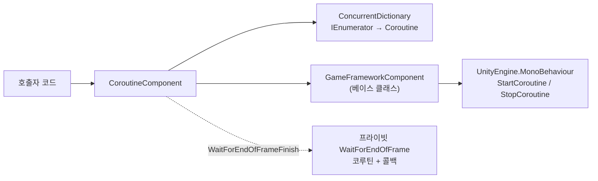

# Coroutine 코루틴 컴포넌트 알아보기

`CoroutineComponent`는 GameFrameX 프레임워크가 Unity 네이티브 코루틴 API를 래핑한 컴포넌트입니다. 핵심 가치는 **추적 및 관리**로, 이를 통해 시작된 모든 코루틴을 추적합니다 — 이터레이터 또는 `UnityEngine.Coroutine` 핸들로 개별 코루틴을 정확하게 정지할 수 있을 뿐만 아니라, 한 번에 모두 정리할 수 있으며, 「프레임 종료 콜백」의 편리한 인터페이스도 제공합니다.

## 빠른 시작

### 1. 패키지 설치

Unity 프로젝트의 `Packages/manifest.json`의 `scopedRegistries`에 GameFrameX 레지스트리를 추가한 다음, `dependencies`에 선언합니다:

```json
{
  "scopedRegistries": [
    {
      "name": "GameFrameX",
      "url": "https://gameframex.upm.alianblank.uk",
      "scopes": ["com.gameframex"]
    }
  ],
  "dependencies": {
    "com.gameframex.unity.coroutine": "1.0.3"
  }
}
```

Source: [README.zh-CN.md](https://github.com/GameFrameX/com.gameframex.unity.coroutine/blob/main/README.zh-CN.md#L50-L65)

### 2. 컴포넌트를 씬 오브젝트에 추가

클래스에 `[DisallowMultipleComponent]`와 `[AddComponentMenu("GameFrameX/Coroutine")]`가 표시되어 있으므로, 동일한 게임 오브젝트에는 하나만 부착할 수 있습니다. 프레임워크는 `[GameFrameXAutoComponent(-6500)]`를 통해 자동 등록합니다.

```csharp
CoroutineComponent coroutineComponent = gameObject.AddComponent<CoroutineComponent>();
```

Source: [CoroutineComponent.cs](https://github.com/GameFrameX/com.gameframex.unity.coroutine/blob/main/Runtime/Coroutine/CoroutineComponent.cs#L12-L15)

### 3. 코루틴 시작 및 관리

```csharp
IEnumerator YourCoroutine()
{
    // 코루틴 실행 내용
    yield return null;
}

coroutineComponent.StartCoroutine(YourCoroutine());
```

Source: [README.zh-CN.md](https://github.com/GameFrameX/com.gameframex.unity.coroutine/blob/main/README.zh-CN.md#L82-L91)

## 작동 원리 개요

컴포넌트 내부는 `ConcurrentDictionary<IEnumerator, UnityEngine.Coroutine>`을 사용하여 「이터레이터 → Unity 코루틴 핸들」 매핑 테이블을 유지합니다. 모든 `StartCoroutine`/`StopCoroutine`/`StopAllCoroutines`는 `new` 키워드를 통해 베이스 클래스 메서드를 숨기고, 먼저 이 매핑 테이블을 조작한 다음, `GameFrameworkComponent` 베이스 클래스에 실제 Unity 호출을 위임합니다.



## 핵심 API 개요

| 메서드 | 기능 | 핵심 사항 |
|------|------|--------|
| `StartCoroutine(IEnumerator)` | 코루틴을 시작하고 추적 테이블에 추가 | `UnityEngine.Coroutine` 반환 |
| `StopCoroutine(IEnumerator)` | 이터레이터로 정지 | `StartCoroutine`과 동일한 `IEnumerator` 인스턴스를 전달해야 함 |
| `StopCoroutine(UnityEngine.Coroutine)` | 핸들로 정지 | 내부적으로 딕셔너리를 순회하여 해당 key를 찾아 제거 |
| `StopAllCoroutines()` | 추적된 및 추적되지 않은 모든 코루틴 정지 | 추적 항목 정지, 딕셔너리 비우기, 그 다음 베이스 클래스 호출 |
| `WaitForEndOfFrameFinish(Action)` | 현재 프레임 렌더링 종료 후 콜백 실행 | 프레임 종료 전에 `StopCoroutine`으로 정지되면 콜백이 트리거되지 않음 |

## 다음 단계

- 단계별로 첫 번째 코루틴을 실행하려면:《코루틴 시작 및 정지 방법》 참조
- `StopCoroutine`이 작동하지 않거나, 콜백이 트리거되지 않는 등의 문제가 발생하면:《코루틴 관련 문제는 어떻게 처리하나요》 참조
- 전체 API 시그니처와 기본값이 필요하면:《CoroutineComponent API 참조》 참조