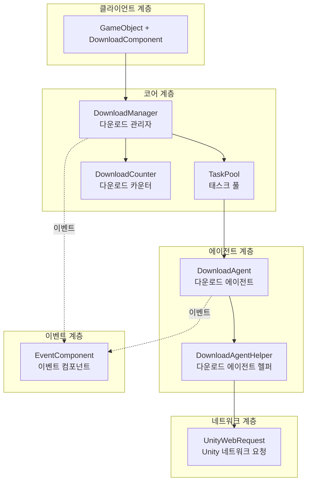

# 플러그인 소개

GameFrameX Download 다운로드 태스크 컴포넌트는 GameFrameX 게임 프레임워크의 핵심 모듈 중 하나로, Unity 게임 프로젝트에 효율적이고 신뢰할 수 있는 리소스 다운로드 솔루션을 제공합니다. 이 컴포넌트는 모듈화 설계로 되어 있으며, 멀티스레드 동시 다운로드,断点续传(중단점 재개), 태스크 우선순위 관리 등 엔터프라이즈급 기능을 지원합니다.

## 개요

GameFrameX Download 컴포넌트는 기능이 완벽한 다운로드 관리 시스템으로, Unity 개발자가 게임 리소스의 원격 다운로드 및 업데이트 기능을 쉽게 구현할 수 있도록 도와줍니다. 이 컴포넌트는 높은 응집도와 낮은 결합도의 원칙을 따르며, 이벤트驱动 방식( 이벤트 기반 메커니즘)을 통해 다운로드 전체 프로세스의 상태 추적을 제공합니다. 이를 통해 개발자는 다운로드 태스크의 생성, 관리 및 모니터링을 유연하게 제어할 수 있습니다.

이 컴포넌트의 핵심 가치는 즉시 사용 가능한 다운로드 기능을 제공하는 것입니다. 개발자는 복잡한 네트워크 구현의 세부 사항을 알 필요 없이 간단한 API를 호출하여 복잡한 다운로드 태스크를 완료할 수 있습니다. 또한 컴포넌트는 사용자 정의 다운로드 에이전트 헬퍼를 지원하여 프로젝트 요구사항에 따라 다운로드 구현 방식을 교체하거나 확장할 수 있습니다.

아키텍처 관점에서 Download 컴포넌트는 GameFrameX 프레임워크의 모듈 시스템 위에 구축되어 있으며 Event 컴포넌트와 긴밀하게 통합되어 있습니다. 통합된 이벤트 메커니즘을 통해 외부로 다운로드 상태 변경을 전달합니다. 이러한 설계는 다운로드 로직과 비즈니스 로직을 완전히 분리하여 코드를 더 명확하고 유지 관리하기 쉽게 만듭니다.

## 핵심 기능

이 다운로드 컴포넌트는 다양한 복잡한 게임 리소스 다운로드 시나리오를 충족할 수 있는 완전한 엔터프라이즈급 다운로드 관리 기능을 제공합니다. 다음은 컴포넌트의 주요 기능입니다:

### 멀티태스크 동시 다운로드

컴포넌트 내부에서 태스크 풀(TaskPool) 메커니즘을 사용하여 다운로드 태스크를 관리하며, 여러 다운로드 에이전트가 동시에 작동하도록 구성할 수 있습니다. 개발자는 실제 요구에 따라 동시성 수를 조정하여 다운로드 속도와 시스템 리소스 소비 사이의 균형을 맞출 수 있습니다. 태스크 풀은 자동으로 태스크 실행 순서를 스케줄링하여 높은 우선순위 태스크가 우선 처리되도록 하고 시스템 대역폭 리소스를 합리적으로 분배합니다.

```csharp
// 다운로드 에이전트 수 구성, 기본값은 3
[SerializeField] private int m_DownloadAgentHelperCount = 3;
```
> Source: [DownloadComponent.cs](https://github.com/GameFrameX/com.gameframex.unity.download/blob/main/Runtime/Download/DownloadComponent.cs#L37)

###断点续传(중단점 재개) 지원

컴포넌트에는内置断点续传(내장 중단점 재개) 기능이 있어, 다운로드 과정에서 데이터가 먼저 `.download` 임시 파일에 기록됩니다. 다운로드가 중단된 후(네트워크 문제 또는 앱 종료 여부) 다시 시작할 때 시스템이 자동으로 다운로드된 부분을 감지하고 중단된 위치에서 계속 다운로드하여 중복 다운로드로 인한 트래픽 낭비와 시간 손실을 방지합니다.

```csharp
// 미완료 다운로드 감지 및 재개
if (File.Exists(downloadFile))
{
    m_FileStream = File.OpenWrite(downloadFile);
    m_FileStream.Seek(0L, SeekOrigin.End);
    m_StartLength = m_SavedLength = m_FileStream.Length;
}
```
> Source: [DownloadManager.DownloadAgent.cs](https://github.com/GameFrameX/com.gameframex.unity.download/blob/main/Runtime/Download/Download/DownloadManager.DownloadAgent.cs#L173-L178)

### 태스크 우선순위 관리

각 다운로드 태스크에는 우선순위를 설정할 수 있으며(정수 값, 값이 높을수록 우선순위 높음), 태스크 풀은 우선순위에 따라 다운로드 순서를 스케줄링합니다. 게임 업데이트 시나리오에서 주요 리소스(초기 씬, 핵심 구성)를 높은 우선순위로 설정하여 중요한 콘텐츠가 먼저 다운로드되도록 할 수 있습니다.

### 실시간 진행 추적

컴포넌트는 완전한 다운로드 이벤트 시스템을 제공하며, 다운로드 시작, 진행 업데이트, 다운로드 성공 및 다운로드 실패의 네 가지 상태를 포함합니다. 개발자는 이러한 이벤트를 구독하여 실시간으로 다운로드 진행률, 속도 통계 등의 정보를 얻고, 이를 기반으로 사용자 인터페이스를 업데이트하거나 해당 비즈니스 로직을 실행할 수 있습니다.

### 다운로드 속도 통계

내장된 다운로드 카운터 모듈은 현재 다운로드 속도(바이트/초)를 실시간으로 계산할 수 있습니다. 이 기능은 사용자에게 다운로드 진행 상황을 표시하고 다운로드 경험을 최적화하는 데 매우 유용합니다. 개발자는 `CurrentSpeed` 속성을 통해 현재 다운로드 속도 값을 얻을 수 있습니다.

```csharp
/// <summary>
/// 현재 다운로드 속도를 가져옵니다.
/// </summary>
public float CurrentSpeed
{
    get { return m_DownloadManager.CurrentSpeed; }
}
```
> Source: [DownloadComponent.cs](https://github.com/GameFrameX/com.gameframex.unity.download/blob/main/Runtime/Download/DownloadComponent.cs#L105-L108)

### 태스크 태그 관리

다운로드 태스크에 태그(Tag)를 설정할 수 있으며, 태그로 관련 태스크를 일괄查询(쿼리)하거나 제거할 수 있습니다. 이 기능은 동일한 유형의 리소스(예: 언어 팩, 맵 데이터)를 관리할 때 특히 유용하며, 특정 유형의 리소스를 한 번에 일괄 작업할 수 있습니다.

## 아키텍처 설계

GameFrameX Download 컴포넌트는 계층화된 아키텍처 설계를 채택하며, 각 계층의 책임이 명확하고 계층 간 통신은 인터페이스를 통해 이루어져 좋은 解耦 효과(분리 효과)를 달성합니다.



### 각 계층 책임 설명

**클라이언트 계층(DownloadComponent)**

클라이언트 계층은 개발자가 직접 상호 작용하는 진입점이며, Unity 게임 오브젝트의 컴포넌트로 표시됩니다. DownloadComponent는 GameFrameworkComponent를 상속하며, 다운로드 관리자 초기화, 이벤트 콜백 등록, 태스크 추가 및 제거 등의 프론트엔드 작업을 담당합니다. 복잡한 내부 구현을 간단한 API로 캡슐화하여 비즈니스 코드에서 호출할 수 있도록 합니다.

Unity 컴포넌트로, DownloadComponent는 Unity 편집기에서 다운로드 매개변수(다운로드 에이전트 유형, 에이전트 수,超时时间(타임아웃 시간) 등)를 구성하기 위해 다양한 직렬화 필드를 제공합니다. 이 설계를 통해 개발자는 코드 작성 없이 컴포넌트의 기본 구성을 완료할 수 있습니다.

**코어 계층(DownloadManager + TaskPool + DownloadCounter)**

코어 계층은 다운로드 기능의 핵심으로, 다운로드 관리자(DownloadManager), 태스크 풀(TaskPool), 다운로드 카운터(DownloadCounter)의 세 가지 핵심 구성요소로 구성됩니다.

DownloadManager는 GameFrameworkModule을 상속하며 프레임워크의 모듈화된 구성요소입니다. IDownloadManager 인터페이스를 구현하여 다운로드 태스크의 추가, 삭제, 수정, 查询(쿼리), 일시 중지, 재개, 매개변수 구성 등의 관리 기능을 제공합니다. DownloadManager 내부에는 태스크 풀 인스턴스가 유지되어 구체적인 다운로드 실행을 태스크 풀에 위임합니다.

TaskPool은 DownloadTask 관리를 위해 특수하게 설계된 범용 태스크 풀 구현입니다. 처리 대기 중인 태스크 대기열, 유휴 다운로드 에이전트에 태스크 할당, 태스크 우선순위 정렬 등의 로직을 유지합니다. TaskPool은 동적 에이전트 추가 및 제거를 지원하며, 사용 가능한 에이전트 수와 태스크 대기열 상태에 따라 자동으로 태스크를 스케줄링합니다.

DownloadCounter는 다운로드 속도를 통계하는 데 사용됩니다. 시간 창을 유지하여 최근 시간 내에 다운로드된 데이터 양을 기록하여 실시간 다운로드 속도를 계산합니다. 이 슬라이딩 윈도우 알고리즘은 네트워크状况(네트워크 상황)의 변화를 빠르게 반영할 수 있습니다.

**에이전트 계층(DownloadAgent + DownloadAgentHelper)**

에이전트 계층은 실제 네트워크 다운로드 작업을 담당하며 외부 서버와 실제로 통신하는 계층입니다.

DownloadAgent는 Download 태스크를 구현하는 내부 구현 클래스로, ITaskAgent 인터페이스를 구현합니다. 각 다운로드 에이전트는 다운로드 에이전트 헬퍼에 바인딩되어 하나의 구체적인 다운로드 태스크를 처리합니다. DownloadAgent는 다운로드 전체 생명 주기를 관리하며, 임시 파일 생성, 네트워크 요청 시작, 다운로드 진행 처리,断点续传(중단점 재개) 유지,超时检测(타임아웃 감지), 완료 또는 오류 처리 등을 포함합니다.

DownloadAgentHelper는 네트워크 다운로드 기능의 추상화이며, 특정 네트워크 구현과 상호 작용하는 인터페이스를 정의합니다. 프레임워크는 UnityWebRequest 기반의 기본 구현을 제공하며, 개발자는 IDownloadAgentHelper 인터페이스를 구현하여 다른 네트워크 라이브러리(HttpClient, curl 등)를 사용할 수도 있습니다.

헬퍼는 교체 가능한 컴포넌트로 설계되어 있으며, 이러한 전략 패턴은 다양한 실행 환경 및 요구 사항에서 네트워크 구현을 전환할 수 있어 상위 코드 수정 없이도 가능합니다.

**태스크 풀(TaskPool)**

태스크 풀은 다운로드 관리의 핵심 스케줄러로, 모든 다운로드 태스크의 상태 및 대기열을 유지합니다. 태스크 풀은 처리 대기 중인 태스크의 우선순위 정렬, 사용 가능한 다운로드 에이전트에 태스크 할당, 태스크 완료 후 정리 작업 처리, 태스크 상태 查询 인터페이스 제공 등을 담당합니다.

태스크 풀의 설계는 객체 풀 패턴을 참고하여 에이전트 리소스를 재사용하여 빈번한 객체 생성 및销毁(소멸)의 오버헤드를 줄이고 시스템 성능을 향상시킵니다.

## 사용 흐름

### 컴포넌트 초기화

Unity 씬에서 빈 게임 오브젝트를 생성한 다음 DownloadComponent 컴포넌트를 추가합니다. 컴포넌트는 Awake 단계에서 다운로드 관리자 모듈을 가져오고 Start 단계에서 지정된 수의 다운로드 에이전트 헬퍼를 초기화합니다.

```csharp
protected override void Awake()
{
    ImplementationComponentType = Utility.Assembly.GetType(componentType);
    InterfaceComponentType = typeof(IDownloadManager);
    base.Awake();
    m_DownloadManager = GameFrameworkEntry.GetModule<IDownloadManager>();
    // ...
}
```
> Source: [DownloadComponent.cs](https://github.com/GameFrameX/com.gameframex.unity.download/blob/main/Runtime/Download/DownloadComponent.cs#L142-L152)

### 다운로드 태스크 추가

DownloadComponent의 AddDownload 메서드를 호출하여 다운로드 태스크를 추가합니다. 이 메서드는 다양한 오버로드 형태를 가지며, 경로와 주소만 지정하거나 태그, 우선순위 및 사용자 정의 데이터를 추가로 지정할 수 있습니다.

```csharp
// 기본 사용법: 다운로드 태스크 추가
int serialId = downloadComponent.AddDownload("로컬 저장 경로", "다운로드 링크");

// 우선순위 포함 사용법
int serialId = downloadComponent.AddDownload("로컬 저장 경로", "다운로드 링크", 10);

// 태그 포함 사용법
int serialId = downloadComponent.AddDownload("로컬 저장 경로", "다운로드 링크", "resource");

// 전체 매개변수 사용법
int serialId = downloadComponent.AddDownload("로컬 저장 경로", "다운로드 링크", "resource", 10, customData);
```
> Source: [DownloadComponent.cs](https://github.com/GameFrameX/com.gameframex.unity.download/blob/main/Runtime/Download/DownloadComponent.cs#L238-L350)

AddDownload 메서드는 태스크의 직렬 번호(SerialId)를 반환하며, 이는 증가하는 고유 식별자로 후속 태스크 상태 查询 또는 런타임에 태스크 제거에 사용할 수 있습니다.

### 비동기 대기 다운로드 완료

컴포넌트는 Task 기반의 비동기 대기 메커니즘을 제공하며, async/await 모드에 적합합니다:

```csharp
// 비동기 대기 다운로드 완료
public async Task<bool> DownloadAsync(string downloadPath, string downloadUri)
{
    var serialId = AddDownload(downloadPath, downloadUri);
    if (m_Downloads.TryGetValue(serialId, out var value))
    {
        return await value.TCS.Task;
    }
    return false;
}
```
> Source: [DownloadComponent.cs](https://github.com/GameFrameX/com.gameframex.unity.download/blob/main/Runtime/Download/DownloadComponent.cs#L273-L282)

### 다운로드 이벤트 구독

GameFrameX의 이벤트 시스템을 통해 다운로드 진행률 및 결과를 구독합니다:

```csharp
// 다운로드 성공 이벤트 구독
eventComponent.Subscribe(DownloadSuccessEventArgs.EventId, OnDownloadSuccess);

// 다운로드 실패 이벤트 구독
eventComponent.Subscribe(DownloadFailureEventArgs.EventId, OnDownloadFailure);

// 다운로드 성공 콜백
private void OnDownloadSuccess(object sender, GameEventArgs e)
{
    DownloadSuccessEventArgs ne = (DownloadSuccessEventArgs)e;
    Debug.Log($"다운로드 완료: {ne.DownloadPath}, 크기: {ne.CurrentLength}");
}
```
> Source: [README.md](https://github.com/GameFrameX/com.gameframex.unity.download/blob/main/README.md#L88-L106)

### 다운로드 태스크 제거

직렬 번호, 태그 또는 전체 제거를 통해 다운로드 태스크를 관리할 수 있습니다:

```csharp
// 직렬 번호로 단일 태스크 제거
bool result = downloadComponent.RemoveDownload(serialId);

// 태그로 여러 태스크 제거
int count = downloadComponent.RemoveDownloads("resource");

// 모든 태스크 제거
int count = downloadComponent.RemoveAllDownloads();
```
> Source: [DownloadComponent.cs](https://github.com/GameFrameX/com.gameframex.unity.download/blob/main/Runtime/Download/DownloadComponent.cs#L357-L392)

## 구성 설명

### DownloadComponent 구성항목

| 구성항목 | 유형 | 기본값 | 설명 |
|--------|------|--------|------|
| DownloadAgentHelperTypeName | string | UnityWebRequestDownloadAgentHelper | 다운로드 에이전트 헬퍼 유형 이름 |
| CustomDownloadAgentHelper | DownloadAgentHelperBase | null | 사용자 정의 다운로드 에이전트 헬퍼 인스턴스 |
| DownloadAgentHelperCount | int | 3 | 다운로드 에이전트 수, 동시 다운로드 수 |
| Timeout | float | 30f | 단일 태스크超时时间(타임아웃 시간) (초) |
| FlushSize | int | 1048576 (1MB) | 버퍼가 디스크에 기록되는 임계 크기 |

### FlushSize의 역할

FlushSize는 데이터가 메모리 버퍼에서 디스크에 기록되는 빈도를 제어합니다. 작은 값을 설정하면 다운로드 데이터가 더 자주 저장되어 예기치 않은 중단으로 인한 데이터 손실을 줄일 수 있지만, 디스크 I/O 작업이 증가합니다. 큰 값은 그 반대의 경우입니다. 실제 시나리오 및 네트워크 환경에 따라 이 매개변수를 조정하는 것이 좋습니다.

### Timeout의 역할

Timeout은 단일 다운로드 태스크의 응답 없음超时时间(타임아웃 시간)을 설정합니다. 네트워크 연결이 구축된 후 지정된 시간 내에 데이터가 수신되지 않으면 태스크가超时(타임아웃)으로 판단되어 실패 콜백이 트리거됩니다. 합리적인超时 설정은 네트워크가 불안정할 때 다운로드가 무한히 대기하는 것을 방지할 수 있습니다.

## 의존성 관계

GameFrameX Download 컴포넌트는 다음 모듈에 의존합니다:

- **GameFrameX.Runtime** - 코어 런타임 라이브러리로, 프레임워크 기본 기능을 제공합니다
- **GameFrameX.Event** - 이벤트 시스템으로, 다운로드 상태의 이벤트 알림에 사용됩니다

```json
{
   "com.gameframex.unity.event": "https://github.com/GameFrameX/com.gameframex.unity.event.git",
   "com.gameframex.unity.download": "https://github.com/GameFrameX/com.gameframex.unity.download.git"
}
```
> Source: [README.md](https://github.com/GameFrameX/com.gameframex.unity.download/blob/main/README.md#L112-L118)

## 플랫폼 지원

이 컴포넌트는 UnityWebRequest를 기본 네트워크 구현으로 사용하며, Unity가 지원하는 모든 플랫폼을 기본으로 지원합니다:

- Windows / macOS / Linux
- Android
- iOS
- WebGL
- PS4 / PS5
- Xbox One / Xbox Series X|S
- Nintendo Switch

## 관련 링크

- [기능 특성](./1-overview.features) - 더 많은 기능 상세 정보
- [설치 가이드](./2-installation) - 플러그인 설치 설명
- [기본 구성](./3-getting-started.basic-setup) - 빠른 구성
- [첫 번째 예제](./3-getting-started.first-example) - 완전한 코드 예제
- [아키텍처 개요](./4-core-concepts.architecture) - 심층 아키텍처 분석
- [DownloadComponent 상세](./4-core-concepts.download-component) - 컴포넌트 API 상세
- [다운로드 에이전트 상세](./4-core-concepts.download-agent) - 에이전트 구현 메커니즘
- [속성 참조](./5-api-reference.properties) - 속성 목록
- [메서드 참조](./5-api-reference.methods) - 메서드 시그니처
- [다운로드 이벤트](./6-events.download-events) - 이벤트 상세
- [에이전트 이벤트](./6-events.agent-events) - 에이전트 계층 이벤트
- [편집기 구성](./7-configuration.editor-configuration) - 편집기 설정
- [에이전트 구성](./7-configuration.agent-configuration) - 에이전트 구성 상세
- [자주 묻는 질문](./8-troubleshooting) - 문제 해결 가이드
