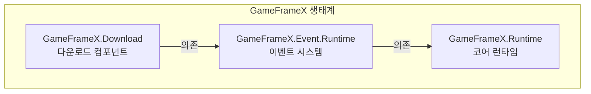

# 설치

이 문서는 Unity 프로젝트에서 Game Frame X Download 다운로드 컴포넌트를 설치하는 방법을 소개합니다.

## 개요

Game Frame X Download는 GameFrameX 프레임워크의 다운로드 관리 컴포넌트로, 완전한 멀티태스크 다운로드 솔루션을 제공합니다. 이 컴포넌트는断点续传(중단점 재개), 다운로드 우선순위, 실시간 진행 업데이트 등의 기능을 지원하며, 이벤트 시스템을 통해 다운로드 상태의 완전한 알림을 제공합니다.

> **주의**: 이 컴포넌트는 **Event 컴포넌트**(`com.gameframex.unity.event`)에 의존하므로, 설치 시 의존 항목을 함께 설치해야 합니다.

### 시스템 요구사항

| 요구사항 | 최소 버전 |
|------|----------|
| Unity | 2017.1+ |
| GameFrameX.Runtime | 최신 안정 버전 |
| GameFrameX.Event | 최신 안정 버전 |

## 설치 전 준비

설치를 시작하기 전에 다음을 확인してください:

1. Unity 2017.1 이상 버전이 설치되어 있습니다
2. Unity Package Manager의 기본 사용 방법을 알고 있습니다
3. 프로젝트 `Packages/manifest.json` 파일을 편집할 권한이 있습니다

## 설치 방법

### 방법 1: manifest.json을 통해 설치 (권장)

이것이 가장 권장되는 설치 방법으로, 버전 관리 및 팀 협업에 편리합니다.

1. 프로젝트의 `Packages/manifest.json` 파일을 엽니다
2. `dependencies` 노드 아래에 다음 내용을 추가합니다:

```json
{
  "dependencies": {
    "com.gameframex.unity.event": "https://github.com/GameFrameX/com.gameframex.unity.event.git",
    "com.gameframex.unity.download": "https://github.com/GameFrameX/com.gameframex.unity.download.git"
  }
}
```

3. 파일을 저장하면 Unity가 자동으로 의존성 패키지를 다운로드하여 설치합니다
4. Unity 컴파일이 완료될 때까지 기다립니다

> Source: [README.md](https://github.com/GameFrameX/com.gameframex.unity.download/blob/main/README.md#L112-L118)

### 방법 2: Unity Package Manager를 통해 설치

Unity 편집기의 GUI를 선호하는 경우:

1. Unity 편집기를 엽니다
2. **Window → Package Manager** 메뉴로 이동합니다
3. 왼쪽 상단의 **+** 버튼을 클릭합니다
4. **Add package from git URL...** 을 선택합니다
5. 입력 상자에 다음 URL을 입력합니다:

```
https://github.com/GameFrameX/com.gameframex.unity.download.git
```

6. **Add** 버튼을 클릭하여 설치를 시작합니다
7. 이벤트 컴포넌트도 설치해야 하며, 3-6단계를 반복하여 다음 URL을 추가합니다:

```
https://github.com/GameFrameX/com.gameframex.unity.event.git
```

8. 다운로드 및 설치가 완료될 때까지 기다립니다

### 방법 3: 소스 코드 직접 배치

소스 코드를 수정하거나 오프라인으로 사용해야 하는 경우에 적합합니다:

1. GitHub 저장소에서 소스 코드를 다운로드하거나 클론합니다:

```bash
git clone https://github.com/GameFrameX/com.gameframex.unity.download.git
```

2. 다운로드한 폴더를 Unity 프로젝트의 `Packages` 디렉토리에 복사합니다
3. Unity가 자동으로 패키지를 인식하여 로드합니다
4. Event 컴포넌트의 소스 코드 또는 사전 컴파일된 패키지도 함께 설치해야 합니다

## 의존 항목 설명

Download 컴포넌트를 설치하면 시스템이 자동으로 다음 의존성을解析(파싱)합니다:



| 의존 패키지 | 설명 | 필수 |
|--------|------|------|
| `GameFrameX.Runtime` | 코어 런타임으로, 기본 프레임워크 기능을 제공합니다 | ✅ 필수 |
| `GameFrameX.Event.Runtime` | 이벤트 시스템으로, 다운로드 상태 알림을 처리합니다 | ✅ 필수 |
| `GameFrameX.Editor` | 편집기 도구(개발 시에만 필요) | ❌ 선택 |

## 설치 검증

설치가 완료된 후 다음方法来(방식으로) 설치가 성공했는지 확인할 수 있습니다:

### 방법 1: Package Manager 확인

**Window → Package Manager**를 열어 다음 패키지가 올바르게 설치되었는지 확인합니다:

- `Game Frame X Download` - 버전 번호는 1.1.0이어야 합니다
- `Game Frame X Event` - 이벤트 컴포넌트

### 방법 2: 스크립트 컴파일 확인

프로젝트에서 간단한 테스트 스크립트를 만들어 다음 네임스페이스가 정상적으로 참조되는지 확인합니다:

```csharp
using GameFrameX.Download.Runtime;
// 컴파일이 통과하면 설치 성공
```

### 방법 3: 컴포넌트 메뉴 확인

Unity 편집기에서:

1. 새로운 GameObject를 생성합니다
2. Inspector 패널을 우클릭합니다
3. 메뉴에 **Game Framework → Download** 옵션이 나타나는지 확인합니다

## 프로젝트 구성

### Assembly Definition

설치 후 시스템이 자동으로 다음 어셈블리 정의 파일을 구성합니다:

| 어셈블리 | 경로 | 용도 |
|--------|------|------|
| `GameFrameX.Download.Runtime` | `Runtime/GameFrameX.Download.Runtime.asmdef` | 런타임 어셈블리 |
| `GameFrameX.Download.Editor` | `Editor/GameFrameX.Download.Editor.asmdef` | 편집기 어셈블리 |

런타임 어셈블리의 의존성 구성은 다음과 같습니다:

```json
{
  "name": "GameFrameX.Download.Runtime",
  "references": [
    "GameFrameX.Runtime",
    "GameFrameX.Event.Runtime"
  ]
}
```

> Source: [Runtime/GameFrameX.Download.Runtime.asmdef](https://github.com/GameFrameX/com.gameframex.unity.download/blob/main/Runtime/GameFrameX.Download.Runtime.asmdef#L1-L17)

## 자주 묻는 질문

### Q1: 설치 후 컴파일 오류가 발생하면 어떻게 해야 합니까?

다음 사항을 확인하세요:
1. Event 컴포넌트 의존성이 올바르게 설치되었는지
2. Unity 버전이 요구사항에 부합하는지 (2017.1+)
3. **File → Build Settings → Switch Platform**을 실행하여 재컴파일을 시도해 보세요

### Q2: 다운로드 기능을 사용할 수 없습니다

다음 조건을 확인하세요:
1. `DownloadComponent` 컴포넌트가 씬에 추가되었는지
2. `EventComponent` 컴포넌트도 추가되었는지
3. 네트워크 권한이 구성되었는지 (아래 참조)

### Q3: 네트워크 권한을 구성하는 방법은?

인터넷 액세스가 필요한 다운로드 기능의 경우, `Assets/Plugins/Android` 디렉토리에서 `AndroidManifest.xml`을 생성하거나 수정하여 네트워크 권한을 추가해야 합니다:

```xml
<uses-permission android:name="android.permission.INTERNET" />
```

## 후속 단계

설치가 완료된 후 다음 문서를 계속 읽어보시기 바랍니다:

- [기본 구성](./3-getting-started.basic-setup) - 컴포넌트의 기본 구성 이해
- [첫 번째 예제](./3-getting-started.first-example) - 첫 번째 다운로드 태스크 생성
- [핵심 개념](./4-core-concepts.architecture) - 프레임워크 아키텍처 심층 이해

## 관련 링크

- [GitHub 저장소](https://github.com/GameFrameX/com.gameframex.unity.download.git)
- [공식 문서](https://gameframex.doc.alianblank.com)
- [Event 컴포넌트](https://github.com/GameFrameX/com.gameframex.unity.event)
- [문제 보고](mailto:alianblank@outlook.com)
