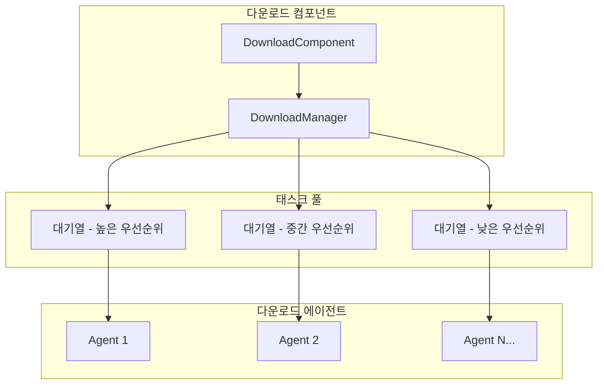
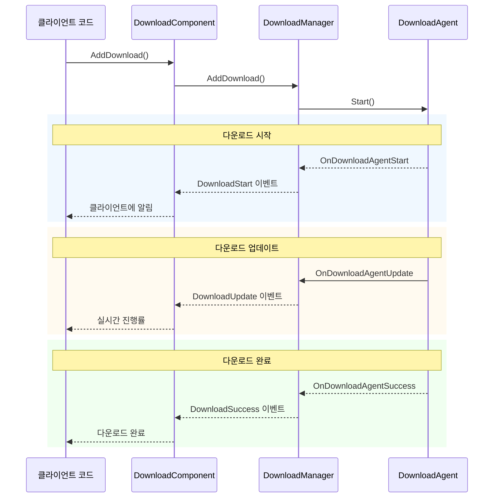
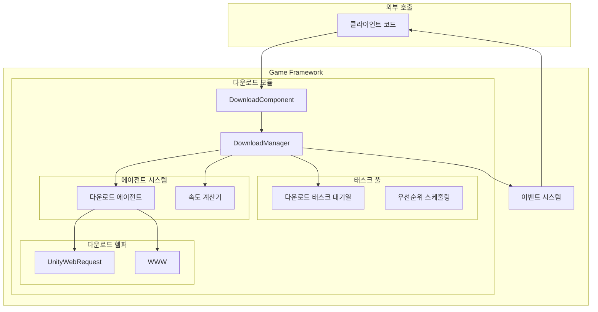

# 기능 특성

GameFrameX Download 다운로드 컴포넌트는 강력한 기능을 갖춘 Unity 리소스 다운로드 관리 모듈로, 완전한 다운로드 태스크 대기열 관리,断点续传(중단점 재개), 우선순위 스케줄링, 실시간 진행 모니터링 등의 기능을 제공합니다.

## 개요

다운로드 컴포넌트는 GameFrameX 프레임워크의 핵심 모듈 중 하나로, 게임 리소스 다운로드 요구를 처리하는 데 전문화되어 있습니다. 이 컴포넌트는 태스크 풀 아키텍처를 기반으로 설계되어 있으며, 멀티스레드 동시 다운로드를 지원하고 여러 다운로드 태스크를 동시에 관리할 수 있으며, 이벤트 메커니즘을 통해 실시간으로 다운로드 상태 업데이트를 푸시합니다.

> 컴포넌트 소개 및 아키텍처 설계에 대한 자세한 내용은 [플러그인 소개](./1-overview.introduction) 및 [아키텍처 개요](./4-core-concepts.architecture)를 참조하세요.

## 핵심 기능

### 1. 멀티태스크 대기열 관리

다운로드 컴포넌트는 태스크 풀(TaskPool) 아키텍처를 채택하여 여러 다운로드 태스크를 동시에 관리할 수 있습니다. 태스크 대기열의 특성은 다음과 같습니다:

- **FIFO 대기열**: 선입선출 순서로 태스크 처리
- **우선순위 스케줄링**: 높은 우선순위 태스크 우선 실행
- **태스크 상태 추적**: 각 태스크의 상태 실시간 기록 (대기 중, 실행 중, 완료, 오류)
- **직렬 ID 식별**: 각 태스크는 고유한 직렬 ID를 가지고 있어 추적 및 관리 용이



> 출처: [DownloadManager.cs](https://github.com/GameFrameX/com.gameframex.unity.download/blob/main/Runtime/Download/Download/DownloadManager.cs#L22-L44)

### 2.断点续传(중단점 재개) 지원

断点续传(중단점 재개)는 다운로드 컴포넌트의 핵심 기능 중 하나로, 대용량 파일 다운로드의 신뢰성을 크게 향상시킵니다:

- **자동 감지**: 시스템이 로컬에 미완료 다운로드 파일(`.download` 접미사)이 있는지 자동으로 감지합니다
- **Range 요청**: HTTP Range 헤더를 사용하여 마지막으로 중지된 위치에서 다운로드 계속
- **증분 다운로드**: 파일의 새 부분만 다운로드하여 대역폭 및 시간 절약
- **상태 검증**: 다운로드 완료 시 자동으로 파일 무결성 검증

```csharp
// DownloadAgent.cs의断点续传(중단점 재개) 핵심 로직
if (File.Exists(downloadFile))
{
    m_FileStream = File.OpenWrite(downloadFile);
    m_FileStream.Seek(0L, SeekOrigin.End);
    m_StartLength = m_SavedLength = m_FileStream.Length;
    m_DownloadedLength = 0L;
}
//断점(중단점) 위치에서 다운로드 계속
if (m_StartLength > 0L)
{
    m_Helper.Download(m_Task.DownloadUri, m_StartLength, m_Task.UserData);
}
```

> 출처: [DownloadManager.DownloadAgent.cs#L168-L204](https://github.com/GameFrameX/com.gameframex.unity.download/blob/main/Runtime/Download/Download/DownloadManager.DownloadAgent.cs#L168-L204)

### 3. 멀티 다운로드 에이전트 병렬 처리

다운로드 컴포넌트는 여러 다운로드 에이전트(Download Agent) 구성을 지원하여 병렬 다운로드를 구현합니다:

- **구성 가능 수**: 편집기에서 1-16개의 에이전트 구성 가능
- **작업 상태 모니터링**: 에이전트 작업 상태 실시간 가져오기
- **로드 밸런싱**: 태스크가 유휴 에이전트에 자동 할당
- **독립 실행**: 각 에이전트는 서로 독립적으로 작동하며 상호 간섭 없음

| 속성 | 설명 |
|------|------|
| TotalAgentCount | 다운로드 에이전트 총 개수 |
| FreeAgentCount | 사용 가능(유휴) 에이전트 개수 |
| WorkingAgentCount | 작업 중인 에이전트 개수 |
| WaitingTaskCount | 실행 대기 중인 태스크 개수 |

```csharp
// Start 메서드에서 여러 다운로드 에이전트 초기화
for (int i = 0; i < m_DownloadAgentHelperCount; i++)
{
    AddDownloadAgentHelper(i);
}
```

> 출처: [DownloadComponent.cs#L178-L181](https://github.com/GameFrameX/com.gameframex.unity.download/blob/main/Runtime/Download/DownloadComponent.cs#L178-L181)

### 4. 실시간 다운로드 속도 모니터링

컴포넌트에 내장된 다운로드 속도 계산기가 정확한 실시간 다운로드 속도를 제공합니다:

- **슬라이딩 윈도우 알고리즘**: 시간 창을 사용하여 순간 속도 계산
- **요청 시 업데이트**: 속도 값이 실제 다운로드 데이터에 따라 동적으로 업데이트
- **멀티 에이전트 집계**: 여러 에이전트의 속도가 자동으로 누적

```csharp
public float CurrentSpeed
{
    get { return m_DownloadCounter.CurrentSpeed; }
}
```

> 출처: [DownloadManager.cs#L117-L120](https://github.com/GameFrameX/com.gameframex.unity.download/blob/main/Runtime/Download/Download/DownloadManager.cs#L117-L120)

### 5. 이벤트驱动通知(이벤트 기반 알림)

완전한 생명 주기 이벤트 시스템으로, 다운로드 전체 프로세스를 커버합니다:



| 이벤트 | 설명 | 트리거 시점 |
|------|------|----------|
| DownloadStart | 다운로드 시작 | 에이전트가 태스크 처리를 시작할 때 |
| DownloadUpdate | 다운로드 업데이트 | 데이터 블록을 수신할 때 |
| DownloadSuccess | 다운로드 성공 | 파일이 완전히 다운로드 완료될 때 |
| DownloadFailure | 다운로드 실패 | 오류 발생 또는超时(타임아웃) 시 |

> 상세 이벤트 매개변수는 [다운로드 이벤트](./6-events.download-events)를 참조하세요.

### 6. 일시 중지 및 재개

전역 일시 중지 기능으로, 언제든지 모든 다운로드 태스크를 일시 중지/재개할 수 있습니다:

```csharp
// 모든 다운로드 일시 중지
downloadComponent.Paused = true;

// 다운로드 재개
downloadComponent.Paused = false;
```

> 출처: [DownloadComponent.cs#L46-L50](https://github.com/GameFrameX/com.gameframex.unity.download/blob/main/Runtime/Download/DownloadComponent.cs#L46-L50)

### 7. 태그化管理(태그 기반 관리)

태그(Tag)를 사용하여 다운로드 태스크를 그룹化管理(관리)할 수 있습니다:

- **태그별 查询(쿼리)**: 지정된 태그의 모든 다운로드 태스크 가져오기
- **태그별 제거**: 지정된 태그의 모든 태스크를 한 번에 제거
- **유연한 조직**: 리소스 유형, 업데이트 배치 등에 따라 태스크 구성 가능

```csharp
// 태그가 포함된 다운로드 태스크 추가
int serialId = downloadComponent.AddDownload(downloadPath, downloadUri, "resources");

// 지정된 태그의 태스크 정보 가져오기
TaskInfo[] tasks = downloadComponent.GetDownloadInfos("resources");

// 지정된 태그의 모든 태스크 제거
downloadComponent.RemoveDownloads("resources");
```

> 출처: [DownloadComponent.cs#L250-L253](https://github.com/GameFrameX/com.gameframex.unity.download/blob/main/Runtime/Download/DownloadComponent.cs#L250-L253)

### 8.超时(타임아웃) 및 버퍼 구성

유연한 다운로드 매개변수 구성:

| 구성항목 | 설명 | 기본값 |
|--------|------|--------|
| Timeout | 다운로드超时时间(타임아웃 시간) (초) | 30 |
| FlushSize | 버퍼가 디스크에 기록되는 임계값 (바이트) | 1 MB |

- **Timeout**: 단일 요청이 응답 없을 때의超时时间(타임아웃 시간)
- **FlushSize**: 메모리 버퍼가 이 크기에 도달하면 디스크에 강제 기록하여 데이터 손실 방지

```csharp
//超时时间(타임아웃 시간) 구성 (런타임)
downloadComponent.Timeout = 60f;

// FlushSize 구성 (런타임)
downloadComponent.FlushSize = 2 * 1024 * 1024; // 2MB
```

> 출처: [DownloadComponent.cs#L87-L100](https://github.com/GameFrameX/com.gameframex.unity.download/blob/main/Runtime/Download/DownloadComponent.cs#L87-L100)

### 9. 멀티 다운로드 에이전트 헬퍼

컴포넌트는 두 가지 다운로드 구현 방식을 제공합니다:

1. **UnityWebRequestDownloadAgentHelper** (권장)
   - 최신 Unity 네트워크 요청 API
   - Unity 2017.2+ 지원
   - 완전한断点续传(중단점 재개) 지원

2. **WWWDownloadAgentHelper** (호환성)
   - 기존 WWW 클래스
   - Unity 2018.3 이전 버전 지원
   -断点续传(중단점 재개)은 서버 지원에 의존

```csharp
//断점(중단점)에서 계속 다운로드하기 위해 UnityWebRequest 사용
m_UnityWebRequest.SetRequestHeader("Range",
    GameFrameX.Runtime.Utility.Text.Format("bytes={0}-", fromPosition));
m_UnityWebRequest.downloadHandler = new DownloadHandler(this);
```

> 출처: [UnityWebRequestDownloadAgentHelper.cs#L104-L121](https://github.com/GameFrameX/com.gameframex.unity.download/blob/main/Runtime/Download/UnityWebRequestDownloadAgentHelper.cs#L104-L121)

## 시스템 아키텍처



## 기능 비교

| 기능 | 설명 | 상태 |
|------|------|------|
| 멀티태스크 대기열 | 여러 다운로드 태스크 동시 관리 | ✅ 지원 |
|断点续传(중단점 재개) | 마지막 위치에서 다운로드 계속 | ✅ 지원 |
| 우선순위 스케줄링 | 높은 우선순위 태스크 우선 처리 | ✅ 지원 |
| 실시간 속도 | 현재 다운로드 속도 표시 | ✅ 지원 |
| 이벤트 알림 | 다운로드 상태 실시간 푸시 | ✅ 지원 |
| 멀티 에이전트 병렬 | 1-16개 에이전트 동시 다운로드 | ✅ 지원 |
| 일시 중지/재개 | 모든 태스크 일시 중지 및 재개 | ✅ 지원 |
| 태그 관리 | 태그별로 다운로드 태스크 구성 | ✅ 지원 |
|超时(타임아웃) 제어 | 네트워크超时时间(타임아웃 시간) 구성 | ✅ 지원 |
| 버퍼 관리 | 디스크 기록 빈도 제어 | ✅ 지원 |

## 관련 링크

- [플러그인 소개](./1-overview.introduction) - 플러그인 배경 및 설계 철학 이해
- [아키텍처 개요](./4-core-concepts.architecture) - 시스템 아키텍처 심층 이해
- [DownloadComponent](./4-core-concepts.download-component) - 핵심 컴포넌트 상세
- [다운로드 에이전트](./4-core-concepts.download-agent) - 다운로드 에이전트 메커니즘
- [API 참조](./5-api-reference.properties) - 완전한 API 문서
- [설치 가이드](./2-installation) - 빠른 설치 구성
