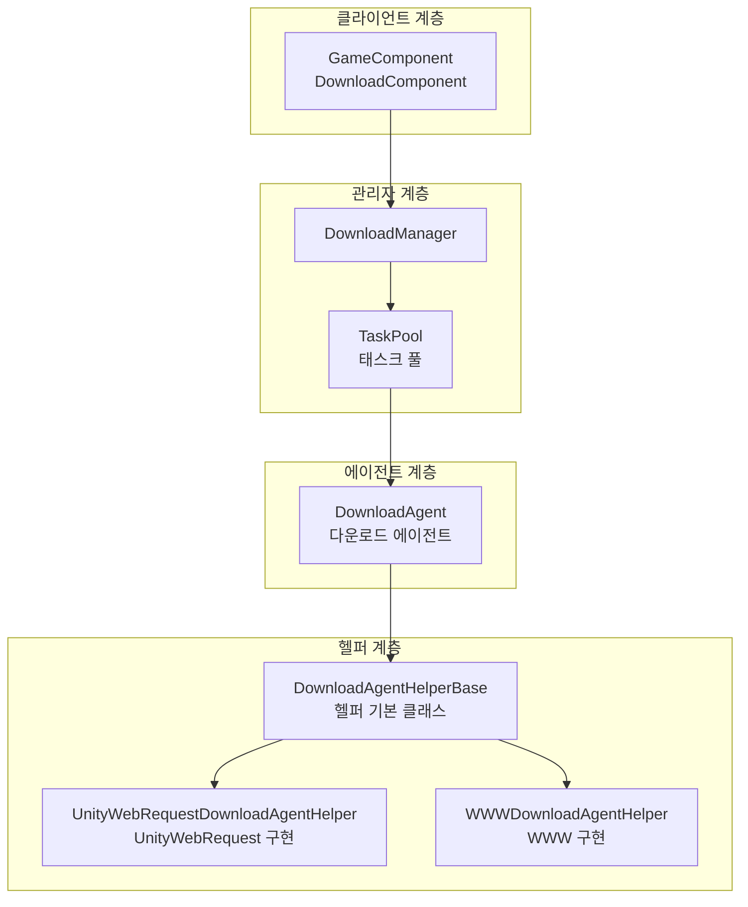
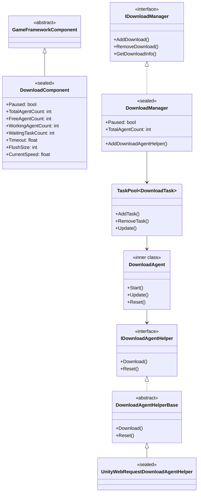
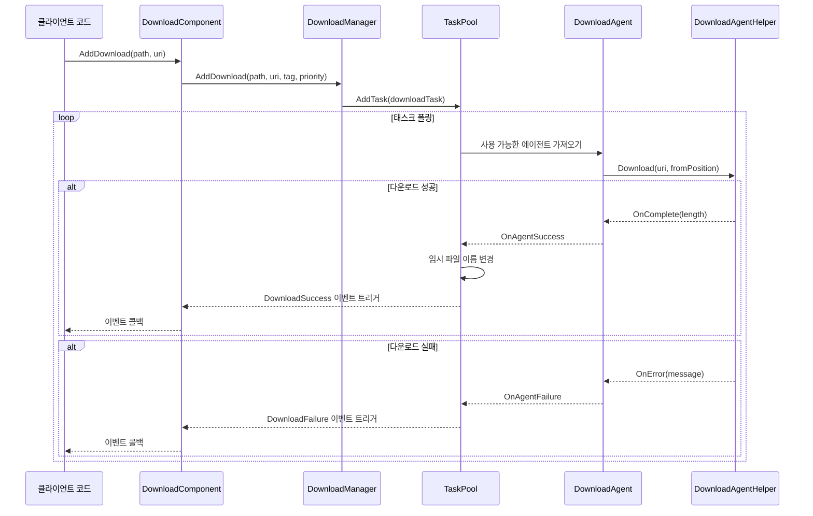
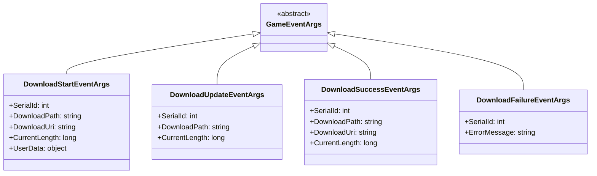

# 아키텍처 개요

GameFrameX Download 플러그인은 완전한 기능을 갖춘 Unity 다운로드 관리 프레임워크로, 통일된 태스크 스케줄링, 다운로드 에이전트 관리,断点续传(중단점 재개) 및 멀티스레드 다운로드 기능을 제공합니다.

## 개요

GameFrameX Download 플러그인은 GameFrameX 프레임워크의 핵심 컴포넌트 중 하나로, Unity 게임에 효율적이고 신뢰할 수 있는 리소스 다운로드 솔루션을 제공합니다. 이 플러그인은 모듈화 설계로 되어 있으며, 다운로드 태스크 관리, 에이전트 스케줄링 및底层 네트워크 통신(저수준 네트워크 통신)을 분리하여 확장 및 유지 관리가 용이합니다.

**설계 목표:**
- 통일된 다운로드 태스크 관리 인터페이스 제공
- 멀티스레드 동시 다운로드 지원
-断点续传(중단점 재개) 기능 구현
- 플러그 가능한(pluggable) 다운로드 에이전트 구현 지원
- 진행 모니터링을 위한 완전한 이벤트 시스템 제공

## 아키텍처 설계

이 플러그인은 상위에서 하위까지 4개의 주요 계층으로 구성된分层 아키텍처 설계(계층화 아키텍처 설계)를 채택합니다:



### 아키텍처 계층 설명

| 계층 | 컴포넌트 | 책임 |
|------|------|------|
| 클라이언트 계층 | DownloadComponent | 다운로드 기능을 외부에 노출하며, Unity 컴포넌트 시스템에 통합됨 |
| 관리자 계층 | DownloadManager | 다운로드 태스크, 이벤트, 에이전트 풀을 통일 관리함 |
| 에이전트 계층 | DownloadAgent | 단일 다운로드 태스크의 생명 주기를 처리함 |
| 헬퍼 계층 | DownloadAgentHelper |底层 네트워크 통신 구현(저수준 네트워크 통신 구현) |

## 핵심 컴포넌트

### 컴포넌트 관계도



### 핵심 컴포넌트 책임

#### 1. DownloadComponent (다운로드 컴포넌트)

`DownloadComponent`는 플러그인의 진입점이며, `GameFrameworkComponent`를 상속하고 Unity 씬에서 직접 마운트하여 사용됩니다. 책임:
- `DownloadManager` 모듈 초기화
- `DownloadAgentHelper` 인스턴스 생성 및 관리
- 외부에 다운로드 API 노출
- 다운로드 이벤트 구독 및 전달

> Source: [DownloadComponent.cs](https://github.com/GameFrameX/com.gameframex.unity.download/blob/main/Runtime/Download/DownloadComponent.cs#L1-L443)

핵심 속성:

```csharp
// 사용 가능한 다운로드 에이전트 수 가져오기
public int FreeAgentCount { get; }

// 작업 중인 다운로드 에이전트 수 가져오기
public int WorkingAgentCount { get; }

// 대기 중인 다운로드 태스크 수 가져오기
public int WaitingTaskCount { get; }

// 현재 다운로드 속도 가져오기 (바이트/초)
public float CurrentSpeed { get; }
```

#### 2. DownloadManager (다운로드 관리자)

`DownloadManager`는 핵심 모듈로, `GameFrameworkModule`을 상속하고 `IDownloadManager` 인터페이스를 구현합니다. 주요 기능:
- 태스크 풀(TaskPool) 관리
- 다운로드 에이전트 등록 및 스케줄링
- 다운로드 카운터(DownloadCounter) 유지
- 다운로드 이벤트 트리거

> Source: [DownloadManager.cs](https://github.com/GameFrameX/com.gameframex.unity.download/blob/main/Runtime/Download/Download/DownloadManager.cs#L1-L430)

```csharp
public sealed partial class DownloadManager : GameFrameworkModule, IDownloadManager
{
    private readonly TaskPool<DownloadTask> m_TaskPool;
    private readonly DownloadCounter m_DownloadCounter;
}
```

#### 3. DownloadAgent (다운로드 에이전트)

`DownloadAgent`는 내부 클래스로, `ITaskAgent<DownloadTask>` 인터페이스를 구현하며 단일 다운로드 태스크의 완전한 생명 주기를 담당합니다:
- 다운로드 임시 파일(.download 접미사) 생성
-断点续传(중단점 재개) 로직 처리
- 다운로드 데이터를 디스크에 기록
-超时检测(타임아웃 감지) 처리

> Source: [DownloadManager.DownloadAgent.cs](https://github.com/GameFrameX/com.gameframex.unity.download/blob/main/Runtime/Download/Download/DownloadManager.DownloadAgent.cs#L1-L358)

#### 4. DownloadAgentHelper (다운로드 에이전트 헬퍼)

헬퍼는 전략 패턴으로 설계되어 있으며 다양한底层 구현(저수준 구현)을 지원합니다:
- `IDownloadAgentHelper`: 헬퍼 인터페이스
- `DownloadAgentHelperBase`: 추상 기본 클래스
- `UnityWebRequestDownloadAgentHelper`: UnityWebRequest 기반 구현 (권장)
- `WWWDownloadAgentHelper`: WWW 기반 구현 (폐기됨)

> Source: [IDownloadAgentHelper.cs](https://github.com/GameFrameX/com.gameframex.unity.download/blob/main/Runtime/Download/Download/IDownloadAgentHelper.cs#L1-L66)
> Source: [UnityWebRequestDownloadAgentHelper.cs](https://github.com/GameFrameX/com.gameframex.unity.download/blob/main/Runtime/Download/UnityWebRequestDownloadAgentHelper.cs#L1-L230)

## 핵심 흐름

### 다운로드 태스크 흐름



###断点续传(중단점 재개) 흐름

다운로드 파일이 이미 존재할 때, 다운로드 에이전트가 자동으로 감지하여 다운로드 재개를 시도합니다:

```mermaid
flowchart TD
    A[다운로드 태스크 시작] --> B{.download 파일 존재 여부 확인?}
    B -->|예| C[파일 열기 및末尾(끝)으로 위치 이동]
    B -->|아니오| D[새 파일 생성]

    C --> E{파일 크기 > 0?}
    E -->|예| F[Range 요청 헤더 설정<br/>bytes=startPosition-]
    E -->|아니오| G[일반 다운로드 요청 시작]

    F --> H[서버断点续传(중단점 재개) 지원]
    H -->|예| I[중단점에서 계속 다운로드]
    H -->|아니오| J[처음부터 다시 다운로드]

    G --> I
    J --> I

    I --> K[다운로드 완료]
    K --> L[임시 파일 닫기]
    L --> M[이전 파일 삭제]
    M --> N[.download를 목표 파일로 이름 변경]
```

## 이벤트 시스템

플러그인은 다운로드 진행률 및 상태 모니터링을 위한 완전한 이벤트 시스템을 제공합니다:



### 이벤트 트리거 시점

| 이벤트 | 트리거 시점 |
|------|----------|
| DownloadStart | 다운로드 에이전트가 태스크 처리를 시작할 때 |
| DownloadUpdate | 다운로드 데이터 업데이트 시 (매 프레임 여러 번) |
| DownloadSuccess | 다운로드 완료 및 디스크에 기록될 때 |
| DownloadFailure | 다운로드 실패 또는 오류 발생 시 |

> 상세 이벤트 매개변수 설명은 [다운로드 이벤트](./6-events.download-events) 문서를 참조하세요.

## 구성 옵션

DownloadComponent는 다음 구성 항목을 제공합니다:

| 속성 | 유형 | 기본값 | 설명 |
|------|------|--------|------|
| DownloadAgentHelperTypeName | string | UnityWebRequestDownloadAgentHelper | 다운로드 에이전트 헬퍼 유형 |
| DownloadAgentHelperCount | int | 3 | 다운로드 에이전트 인스턴스 수 |
| Timeout | float | 30f | 다운로드超时时间(타임아웃 시간) (초) |
| FlushSize | int | 1MB | 버퍼 새로고침 크기 |

> 상세 구성 설명은 [편집기 구성](./7-configuration.editor-configuration) 및 [다운로드 에이전트 구성](./7-configuration.agent-configuration) 문서를 참조하세요.

## 확장 메커니즘

### 사용자 정의 다운로드 에이전트

`DownloadAgentHelperBase`를 상속하여 사용자 정의 다운로드 구현을 생성할 수 있습니다:

```csharp
public class CustomDownloadAgentHelper : DownloadAgentHelperBase
{
    public override void Download(string downloadUri, object userData)
    {
        // 사용자 정의 다운로드 로직 구현
    }

    public override void Download(string downloadUri, long fromPosition, object userData)
    {
        //断점续传(중단점 재개) 구현
    }

    public override void Download(string downloadUri, long fromPosition, long toPosition, object userData)
    {
        // 범위 다운로드 구현
    }

    public override void Reset()
    {
        // 리소스 정리
    }
}
```

> 상세 확장 설명은 [다운로드 에이전트](./4-core-concepts.download-agent) 문서를 참조하세요.

## 성능 특성

### 동시 다운로드

플러그인은 `DownloadAgentHelperCount`를 통해 멀티 에이전트 동시 다운로드를 지원합니다. 태스크 풀은 자동으로 태스크를 유휴 에이전트에 할당합니다.

### 속도 계산

이동 평균 알고리즘을 사용하여 다운로드 속도를 계산합니다:

```csharp
m_DownloadCounter = new DownloadCounter(1f, 10f);  // 1초 업데이트 간격, 10초 평균
```

> 상세 구현은 [DownloadCounter](./4-core-concepts.download-component) 문서를 참조하세요.

###断점续传(중단점 재개)

- 다운로드 과정에서 `.download` 임시 파일 사용
- 기존 임시 파일 감지 및 다운로드 재개 지원
- 다운로드 완료 시 자동으로 목표 파일로 이름 변경

## 관련 링크

- [DownloadComponent](./4-core-concepts.download-component) - 다운로드 컴포넌트 상세
- [다운로드 에이전트](./4-core-concepts.download-agent) - 에이전트 구현 상세
- [다운로드 이벤트](./6-events.download-events) - 이벤트 시스템 상세
- [편집기 구성](./7-configuration.editor-configuration) - 편집기 구성
- [다운로드 에이전트 구성](./7-configuration.agent-configuration) - 에이전트 구성
- [API 참조](./5-api-reference.properties) - 속성 API
- [API 참조](./5-api-reference.methods) - 메서드 API
