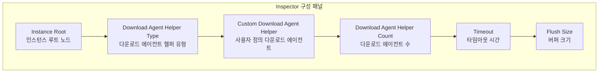
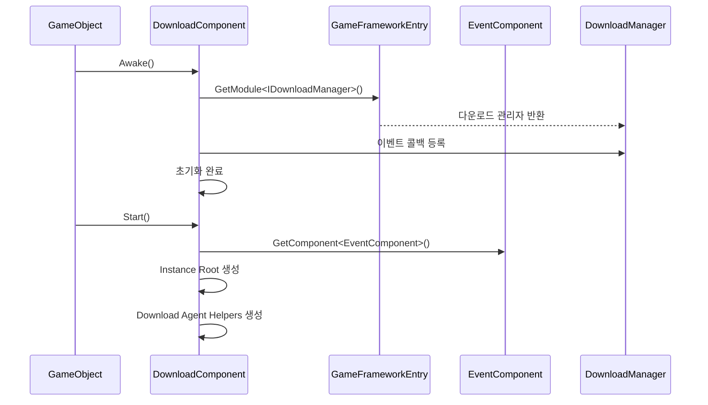

# 기본 구성

이 문서는 GameFrameX Download 플러그인의 기본 구성 방법을 소개하며, 컴포넌트 추가, 매개변수 설정 및 초기화 흐름을 포함합니다.

## 개요

Download 컴포넌트는 GameFrameX 프레임워크의 다운로드 관리 모듈로, 모든 다운로드 관련 태스크를 처리합니다. 다운로드 기능을 사용하기 전에 `DownloadComponent`를 올바르게 구성해야 합니다. 이 컴포넌트는 멀티 에이전트 동시 다운로드 메커니즘을 채택하며,断点续传(중단점 재개), 우선순위 스케줄링 및 실시간 진행 업데이트를 지원합니다.

## DownloadComponent 추가

### Unity 편집기를 통해 추가

Unity 씬에서 빈 게임 오브젝트를 생성한 다음 `Download` 컴포넌트를 추가합니다:

1. Unity 편집기에서 Hierarchy 패널을 우클릭합니다
2. **GameObject** → **Create Empty**를 선택하여 빈 게임 오브젝트를 생성합니다
3. Inspector 패널에서 **Add Component** 버튼을 클릭합니다
4. **Game Framework** → **Download**를 검색하여 선택합니다
5. 컴포넌트가 게임 오브젝트에 자동으로 추가됩니다

```csharp
// 컴포넌트 정의 소스
[DisallowMultipleComponent]
[AddComponentMenu("Game Framework/Download")]
public sealed class DownloadComponent : GameFrameworkComponent
```

> Source: [DownloadComponent.cs](https://github.com/GameFrameX/com.gameframex.unity.download/blob/main/Runtime/Download/DownloadComponent.cs#L21-L23)

### 코드를 통해 동적으로 추가

런타임에 코드에서 컴포넌트를 동적으로 생성할 수도 있습니다:

```csharp
// DownloadComponent 동적으로 추가
var downloadGameObject = new GameObject("Download");
var downloadComponent = downloadGameObject.AddComponent<DownloadComponent>();
```

> Source: [DownloadComponent.cs](https://github.com/GameFrameX/com.gameframex.unity.download/blob/main/Runtime/Download/DownloadComponent.cs#L142-L160)

## 구성 옵션 상세

### 편집기 구성 속성

Unity 편집기의 Inspector 패널에서 DownloadComponent는 다음 구성 가능한 속성을 포함합니다:



| 속성 | 유형 | 기본값 | 설명 |
|------|------|--------|------|
| Instance Root | Transform | null | 다운로드 에이전트 인스턴스의 부모 Transform, 비어 있으면 자동으로 생성됨 |
| Download Agent Helper Type | string | UnityWebRequestDownloadAgentHelper | 다운로드 에이전트 헬퍼의 유형 이름 |
| Custom Download Agent Helper | DownloadAgentHelperBase | null | 사용자 정의 다운로드 에이전트 헬퍼 인스턴스 |
| Download Agent Helper Count | int | 3 | 동시 다운로드 에이전트 수, 범위 1-16 |
| Timeout | float | 30 | 다운로드超时时间(타임아웃 시간) (초), 범위 0-120 |
| Flush Size | int | 1048576 | 버퍼가 디스크에 기록되는 임계 크기 (바이트), 기본값 1MB |

> Source: [DownloadComponentInspector.cs](https://github.com/GameFrameX/com.gameframex.unity.download/blob/main/Editor/Inspector/DownloadComponentInspector.cs#L29-L69)

### 각 구성항목 상세 설명

#### 1. Instance Root (인스턴스 루트 노드)

다운로드 에이전트 GameObject의 부모 Transform을 지정합니다. 설정되지 않으면 시스템이 자동으로 "Download Agent Instances"라는 빈 오브젝트를 부모 노드로 생성합니다.

```csharp
if (m_InstanceRoot == null)
{
    m_InstanceRoot = new GameObject("Download Agent Instances").transform;
    m_InstanceRoot.SetParent(gameObject.transform);
    m_InstanceRoot.localScale = Vector3.one;
}
```

> Source: [DownloadComponent.cs](https://github.com/GameFrameX/com.gameframex.unity.download/blob/main/Runtime/Download/DownloadComponent.cs#L171-L176)

#### 2. Download Agent Helper Type (다운로드 에이전트 헬퍼 유형)

실제 다운로드 작업을 실행하는 헬퍼의 유형을 지정합니다. 플러그인에는 두 가지内置 구현이 제공됩니다:

| 유형 이름 | 설명 |
|----------|------|
| UnityWebRequestDownloadAgentHelper | Unity의 UnityWebRequest를 사용하여 다운로드 (권장) |
| WWWDownloadAgentHelper | 기존 WWW 클래스를 사용하여 다운로드 (이전 버전 호환성) |

#### 3. Download Agent Helper Count (다운로드 에이전트 수)

동시 다운로드 에이전트의 수를 설정합니다. 각 에이전트는 한 번에 하나의 다운로드 태스크만 처리할 수 있지만, 여러 에이전트를 동시에 실행하여 병렬 다운로드를 구현할 수 있습니다.

```csharp
// 기본적으로 3개의 다운로드 에이전트 생성
for (int i = 0; i < m_DownloadAgentHelperCount; i++)
{
    AddDownloadAgentHelper(i);
}
```

> Source: [DownloadComponent.cs](https://github.com/GameFrameX/com.gameframex.unity.download/blob/main/Runtime/Download/DownloadComponent.cs#L178-L181)

**구성 제안:**
- 소형 리소스 (< 10MB): 에이전트 2-3개
- 중형 리소스 (10-100MB): 에이전트 3-5개
- 대형 리소스 (> 100MB): 에이전트 5-8개
- 최대 지원: 에이전트 16개

#### 4. Timeout (타임아웃 시간)

단일 다운로드 태스크의 최대 대기 시간(초)을 설정합니다. 이 시간을 초과하면 다운로드가 실패로 간주되어 오류 이벤트가 트리거됩니다.

```csharp
[SerializeField]
private float m_Timeout = 30f;
```

> Source: [DownloadComponent.cs](https://github.com/GameFrameX/com.gameframex.unity.download/blob/main/Runtime/Download/DownloadComponent.cs#L39)

**구성 제안:**
-局域网下载(랜局域网 다운로드): 10-15초
- 인터넷 다운로드: 30-60초
- 대용량 파일 다운로드: 60-120초

#### 5. Flush Size (버퍼 크기)

다운로드 버퍼를 디스크에 기록하는 임계 크기를 설정합니다. 이 매개변수는断点续传(중단점 재개) 기능이 활성화된 경우에만 유효하며, 데이터 새로고침 빈도를 제어하는 데 사용됩니다.

```csharp
private const int OneMegaBytes = 1024 * 1024;
[SerializeField]
private int m_FlushSize = OneMegaBytes;
```

> Source: [DownloadComponent.cs](https://github.com/GameFrameX/com.gameframex.unity.download/blob/main/Runtime/Download/DownloadComponent.cs#L25-L26#L41)

**구성 제안:**
- 소형 파일: 512KB - 1MB
- 중형 파일: 1MB - 2MB
- 대형 파일: 2MB - 5MB

## 컴포넌트 초기화 흐름

DownloadComponent의 초기화는 두 단계로 나뉩니다:



### 첫 번째 단계: Awake

```csharp
protected override void Awake()
{
    ImplementationComponentType = Utility.Assembly.GetType(componentType);
    InterfaceComponentType = typeof(IDownloadManager);
    base.Awake();
    m_DownloadManager = GameFrameworkEntry.GetModule<IDownloadManager>();

    // 다운로드 이벤트 등록
    m_DownloadManager.DownloadStart += OnDownloadStart;
    m_DownloadManager.DownloadUpdate += OnDownloadUpdate;
    m_DownloadManager.DownloadSuccess += OnDownloadSuccess;
    m_DownloadManager.DownloadFailure += OnDownloadFailure;

    m_DownloadManager.FlushSize = m_FlushSize;
    m_DownloadManager.Timeout = m_Timeout;
}
```

> Source: [DownloadComponent.cs](https://github.com/GameFrameX/com.gameframex.unity.download/blob/main/Runtime/Download/DownloadComponent.cs#L142-L160)

### 두 번째 단계: Start

```csharp
private void Start()
{
    // 이벤트 컴포넌트 가져오기 (필수)
    m_EventComponent = GameEntry.GetComponent<EventComponent>();
    if (m_EventComponent == null)
    {
        Log.Fatal("Event component is invalid.");
        return;
    }

    // 인스턴스 루트 노드 생성
    if (m_InstanceRoot == null)
    {
        m_InstanceRoot = new GameObject("Download Agent Instances").transform;
        m_InstanceRoot.SetParent(gameObject.transform);
        m_InstanceRoot.localScale = Vector3.one;
    }

    // 다운로드 에이전트 헬퍼 생성
    for (int i = 0; i < m_DownloadAgentHelperCount; i++)
    {
        AddDownloadAgentHelper(i);
    }
}
```

> Source: [DownloadComponent.cs](https://github.com/GameFrameX/com.gameframex.unity.download/blob/main/Runtime/Download/DownloadComponent.cs#L162-L182)

## 다운로드 에이전트 헬퍼

### 기본 구현: UnityWebRequestDownloadAgentHelper

플러그인은 기본적으로 `UnityWebRequestDownloadAgentHelper`를 다운로드 에이전트 헬퍼로 사용하며, Unity의 `UnityWebRequest` API를 기반으로 구현되어 다음을 지원합니다:

- HTTP/HTTPS 프로토콜
-断点续传(중단점 재개) (Range 헤더를 통해)
- SSL 인증서 검증 (기본값: 건너뛰기)
- 진행률 추적

```csharp
public partial class UnityWebRequestDownloadAgentHelper : DownloadAgentHelperBase, IDisposable
{
    // UnityWebRequest를 사용하여 다운로드
    m_UnityWebRequest = new UnityWebRequest(downloadUri);
    m_UnityWebRequest.certificateHandler = new DownloadCertificateHandler();
    m_UnityWebRequest.downloadHandler = new DownloadHandler(this);
    m_UnityWebRequest.SendWebRequest();
}
```

> Source: [UnityWebRequestDownloadAgentHelper.cs](https://github.com/GameFrameX/com.gameframex.unity.download/blob/main/Runtime/Download/UnityWebRequestDownloadAgentHelper.cs#L80-L96)

### 사용자 정의 다운로드 에이전트 생성

사용자 정의 다운로드 에이전트를 생성하려면 `DownloadAgentHelperBase`를 상속하고 관련 인터페이스를 구현해야 합니다:

```csharp
public abstract class DownloadAgentHelperBase : MonoBehaviour, IDownloadAgentHelper
{
    // 이벤트 정의
    public abstract event EventHandler<DownloadAgentHelperUpdateBytesEventArgs> DownloadAgentHelperUpdateBytes;
    public abstract event EventHandler<DownloadAgentHelperUpdateLengthEventArgs> DownloadAgentHelperUpdateLength;
    public abstract event EventHandler<DownloadAgentHelperCompleteEventArgs> DownloadAgentHelperComplete;
    public abstract event EventHandler<DownloadAgentHelperErrorEventArgs> DownloadAgentHelperError;

    // 다운로드 메서드
    public abstract void Download(string downloadUri, object userData);
    public abstract void Download(string downloadUri, long fromPosition, object userData);
    public abstract void Download(string downloadUri, long fromPosition, long toPosition, object userData);

    // 재설정 메서드
    public abstract void Reset();
}
```

> Source: [DownloadAgentHelperBase.cs](https://github.com/GameFrameX/com.gameframex.unity.download/blob/main/Runtime/Download/DownloadAgentHelperBase.cs#L17-L72)

## 구성 속성 API

DownloadComponent는 코드 액세스를 위한 다음 공개 속성을 제공합니다:

### 런타임 속성

| 속성 | 유형 | 설명 |
|------|------|------|
| Paused | bool | 다운로드가 일시 중지되었는지 가져오거나 설정 |
| TotalAgentCount | int | 다운로드 에이전트 총 개수 가져오기 |
| FreeAgentCount | int | 사용 가능한 다운로드 에이전트 개수 가져오기 |
| WorkingAgentCount | int | 작업 중인 다운로드 에이전트 개수 가져오기 |
| WaitingTaskCount | int | 대기 중인 다운로드 태스크 개수 가져오기 |
| Timeout | float | 다운로드超时时间(타임아웃 시간) 가져오기 또는 설정 (초) |
| FlushSize | int | 버퍼가 디스크에 기록되는 임계 크기 가져오기 또는 설정 |
| CurrentSpeed | float | 현재 다운로드 속도 가져오기 (바이트/초) |

```csharp
// 예제: 현재 다운로드 상태 가져오기
var downloadComponent = GameEntry.GetComponent<DownloadComponent>();
Debug.Log($"사용 가능한 에이전트: {downloadComponent.FreeAgentCount}");
Debug.Log($"대기 중인 태스크: {downloadComponent.WaitingTaskCount}");
Debug.Log($"다운로드 속도: {downloadComponent.CurrentSpeed} bytes/s");
```

> Source: [DownloadComponent.cs](https://github.com/GameFrameX/com.gameframex.unity.download/blob/main/Runtime/Download/DownloadComponent.cs#L46-L108)

## 의존 요구사항

DownloadComponent는 다음 컴포넌트 및 서비스에 의존합니다:

1. **EventComponent** - 필수 컴포넌트로, 다운로드 이벤트 알림 트리거에 사용됨
2. **GameFrameworkEntry** - 프레임워크 진입점으로, 모듈 초기화 제공
3. **GameFrameworkModule** - 기본 모듈 기본 클래스

```csharp
// 의존성 확인
private void Start()
{
    m_EventComponent = GameEntry.GetComponent<EventComponent>();
    if (m_EventComponent == null)
    {
        Log.Fatal("Event component is invalid.");
        return;
    }
}
```

> Source: [DownloadComponent.cs](https://github.com/GameFrameX/com.gameframex.unity.download/blob/main/Runtime/Download/DownloadComponent.cs#L164-L169)

## 모범 구성 사례

### 개발 환경

```csharp
// 개발 환경 권장 구성
Timeout = 60f;           // 긴 타임아웃으로 내성 확보
FlushSize = 512 * 1024;   // 512KB로 자주 새로고침하여 디버깅 용이
AgentCount = 3;           // 적당한 동시성 수
```

### 운영 환경

```csharp
// 운영 환경 권장 구성
Timeout = 30f;            // 짧은 타임아웃으로 빠른 실패 재시도
FlushSize = 2 * 1024 * 1024;  // 2MB로 IO 빈도 줄이기
AgentCount = 5;           // 더 많은 동시성으로 다운로드 속도 향상
```

### 대용량 파일 다운로드

```csharp
// 대용량 파일 다운로드 구성
Timeout = 120f;               // 긴 타임아웃
FlushSize = 5 * 1024 * 1024;  // 5MB 대형 버퍼
AgentCount = 8;               // 높은 동시성
```

## 관련 링크

- [설치 가이드](./2-installation)
- [첫 번째 예제](./3-getting-started.first-example)
- [아키텍처 개요](./4-core-concepts.architecture)
- [DownloadComponent 핵심 개념](./4-core-concepts.download-component)
- [다운로드 에이전트](./4-core-concepts.download-agent)
- [편집기 구성](./7-configuration.editor-configuration)
- [다운로드 에이전트 구성](./7-configuration.agent-configuration)
- [다운로드 이벤트](./6-events.download-events)
