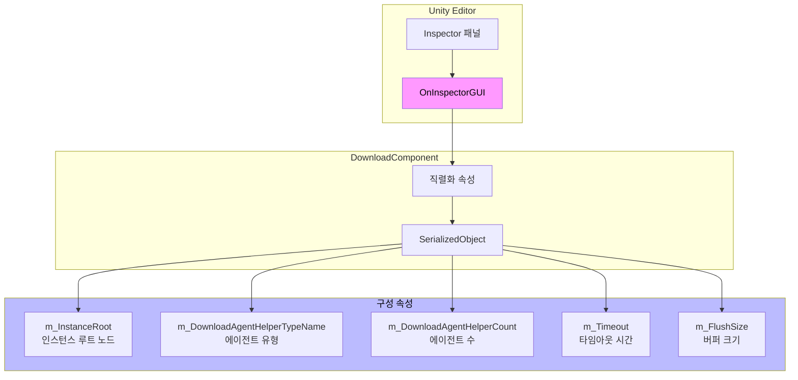
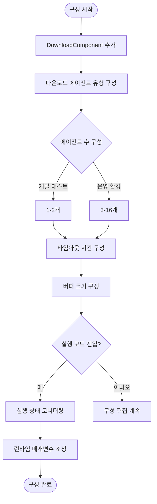

# 편집기 구성

이 문서는 GameFrameX Download 컴포넌트의 Unity 편집기에서 구성 옵션을 상세히 소개하며, 컴포넌트의 Inspector 패널 구성 및 설계 의도를 포함합니다.

## 개요

GameFrameX Download 컴포넌트는 Unity의 사용자 정의 Inspector 인터페이스를 통해直관적인(직관적인) 편집기 구성 기능을 제공합니다. 개발자는 편집기에서 다운로드 에이전트 수,超时时长(타임아웃 시간), 버퍼 크기 등의 주요 매개변수를 구성할 수 있으며, 코드 작성 없이 기본 구성을 완료할 수 있습니다.

> Source: [DownloadComponentInspector.cs](https://github.com/GameFrameX/com.gameframex.unity.download/blob/main/Editor/Inspector/DownloadComponentInspector.cs#L19-L156)

## 구성 인터페이스 상세

### DownloadComponent 추가

Unity 씬에서 다음 방법을 통해 Download 컴포넌트를 추가합니다:

1. Hierarchy 패널에서 우클릭하여 **GameObject** → **Create Empty** 선택
2. Inspector 패널에서 **Add Component** 클릭
3. **Download** (또는 `Game Framework/Download`) 검색하여 선택
4. 컴포넌트가 게임 오브젝트에 자동으로 추가됩니다

```csharp
// AddComponentMenu 특성을 통해 Unity 메뉴에 등록된 컴포넌트
[AddComponentMenu("Game Framework/Download")]
public sealed class DownloadComponent : GameFrameworkComponent
```

> Source: [DownloadComponent.cs](https://github.com/GameFrameX/com.gameframex.unity.download/blob/main/Runtime/Download/DownloadComponent.cs#L22-L23)

### Inspector 구성 패널

DownloadComponent가 포함된 게임 오브젝트를 씬에서 선택하면, Inspector 패널에 다음 구성 옵션이 표시됩니다:

```csharp
private SerializedProperty m_InstanceRoot = null;
private SerializedProperty m_DownloadAgentHelperCount = null;
private SerializedProperty m_Timeout = null;
private SerializedProperty m_FlushSize = null;

private HelperInfo<DownloadAgentHelperBase> m_DownloadAgentHelperInfo = new HelperInfo<DownloadAgentHelperBase>("DownloadAgent");
```

> Source: [DownloadComponentInspector.cs](https://github.com/GameFrameX/com.gameframex.unity.download/blob/main/Editor/Inspector/DownloadComponentInspector.cs#L22-L27)

## 구성 옵션 상세

### 1. Instance Root (인스턴스 루트 노드)

| 속성 | 설명 |
|------|------|
| **유형** | Transform |
| **기본값** | null (자동 생성) |
| **런타임** | 읽기 가능 |

**기능 설명**: 다운로드 에이전트 인스턴스의 부모 Transform을 지정합니다. 비어 있으면 컴포넌트가 자동으로 "Download Agent Instances"라는 빈 게임 오브젝트를 부모 노드로 생성합니다.

```csharp
if (m_InstanceRoot == null)
{
    m_InstanceRoot = new GameObject("Download Agent Instances").transform;
    m_InstanceRoot.SetParent(gameObject.transform);
    m_InstanceRoot.localScale = Vector3.one;
}
```

> Source: [DownloadComponent.cs](https://github.com/GameFrameX/com.gameframex.unity.download/blob/main/Runtime/Download/DownloadComponent.cs#L171-L176)

---

### 2. Download Agent Helper Type (다운로드 에이전트 유형)

| 속성 | 설명 |
|------|------|
| **유형** | string (유형 이름) |
| **기본값** | UnityGameFramework.Runtime.UnityWebRequestDownloadAgentHelper |
| **런타임** | 읽기 전용 |

**기능 설명**: 실제 다운로드 작업을 실행하는 에이전트 헬퍼 유형을 지정합니다. 플러그인에는 두 가지 내장 구현이 제공됩니다:

- **UnityWebRequestDownloadAgentHelper**: Unity의 `UnityWebRequest` API를 기반으로 하며,断点续传(중단점 재개) 지원
- **WWWDownloadAgentHelper**: 기존 `WWW` 클래스 기반 (폐기됨)

```csharp
[SerializeField] private string m_DownloadAgentHelperTypeName = "UnityGameFramework.Runtime.UnityWebRequestDownloadAgentHelper";
```

> Source: [DownloadComponent.cs](https://github.com/GameFrameX/com.gameframex.unity.download/blob/main/Runtime/Download/DownloadComponent.cs#L33)

**사용자 정의 에이전트**: 개발자는 `DownloadAgentHelperBase` 클래스를 상속하여 자신의 다운로드 에이전트 헬퍼를 구현할 수도 있습니다.

---

### 3. Download Agent Helper Count (다운로드 에이전트 수)

| 속성 | 설명 |
|------|------|
| **유형** | int |
| **범위** | 1 - 16 |
| **기본값** | 3 |
| **런타임** | 수정 불가 |

**기능 설명**: 동시 다운로드 에이전트의 수를 구성합니다. 에이전트 수를 늘리면 병렬 다운로드 능력이 향상되지만, 더 많은 시스템 리소스를 차지합니다.

```csharp
m_DownloadAgentHelperCount.intValue = EditorGUILayout.IntSlider("Download Agent Helper Count", m_DownloadAgentHelperCount.intValue, 1, 16);
```

> Source: [DownloadComponentInspector.cs](https://github.com/GameFrameX/com.gameframex.unity.download/blob/main/Editor/Inspector/DownloadComponentInspector.cs#L41)

**구성 제안**:
| 시나리오 | 권장값 |
|------|--------|
| 개발 테스트 | 1-2 |
| 모바일 게임 | 3-5 |
| PC/콘솔 게임 | 5-10 |
| 대용량 파일 멀티스레드 다운로드 | 10-16 |

---

### 4. Timeout (타임아웃 시간)

| 속성 | 설명 |
|------|------|
| **유형** | float |
| **범위** | 0 - 120 초 |
| **기본값** | 30 초 |
| **런타임** | 수정 가능 |

**기능 설명**: 다운로드 요청의超时时间(타임아웃 시간)을 설정합니다. 다운로드 시간이 이 값을 초과하면 다운로드 태스크가 실패로 간주되어 오류 이벤트가 트리거됩니다.

```csharp
float timeout = EditorGUILayout.Slider("Timeout", m_Timeout.floatValue, 0f, 120f);
if (timeout != m_Timeout.floatValue)
{
    if (EditorApplication.isPlaying)
    {
        t.Timeout = timeout;  // 런타임 수정
    }
    else
    {
        m_Timeout.floatValue = timeout;  // 편집기 수정
    }
}
```

> Source: [DownloadComponentInspector.cs](https://github.com/GameFrameX/com.gameframex.unity.download/blob/main/Editor/Inspector/DownloadComponentInspector.cs#L45-L56)

**설계 의도**:超时 설정은 네트워크 문제로 인한 무한 대기를 방지할 수 있습니다. 편집기模式下(모드)에서 수정하면 컴포넌트 구성에 저장되고, 런타임에서 수정하면 직접 적용됩니다.

---

### 5. Flush Size (버퍼 새로고침 크기)

| 속성 | 설명 |
|------|------|
| **유형** | int |
| **기본값** | 1048576 (1 MB) |
| **런타임** | 수정 가능 |

**기능 설명**: 메모리 버퍼 데이터를 디스크에 기록하는 임계 크기를 설정합니다.断点续传(중단점 재개) 기능이 활성화된 경우에만 유효합니다. 이 값은 데이터가 디스크에 기록되는 빈도를 결정하며, 값이 크면 성능이 향상되지만断点续传(중단점 재개) 정밀도가 낮아집니다.

```csharp
private const int OneMegaBytes = 1024 * 1024;

[SerializeField] private int m_FlushSize = OneMegaBytes;
```

> Source: [DownloadComponent.cs](https://github.com/GameFrameX/com.gameframex.unity.download/blob/main/Runtime/Download/DownloadComponent.cs#L26#L41)

```csharp
int flushSize = EditorGUILayout.DelayedIntField("Flush Size", m_FlushSize.intValue);
```

> Source: [DownloadComponentInspector.cs](https://github.com/GameFrameX/com.gameframex.unity.download/blob/main/Editor/Inspector/DownloadComponentInspector.cs#L58)

**구성 제안**:
| 시나리오 | 권장값 | 설명 |
|------|--------|------|
| 소형 파일 다운로드 | 64KB - 256KB | 더 자주 기록하여 데이터 안전성 향상 |
| 대형 파일 다운로드 | 512KB - 2MB | 성능 향상, 디스크 IO 감소 |
| 네트워크 불안정 | 작은 값 |断点续传(중단점 재개) 실패概率(확률) 감소 |

---

## 런타임 상태 모니터링

실행模式下(모드)에서 Inspector 패널에 현재 다운로드 컴포넌트의 실시간 상태 정보가 표시됩니다:

```csharp
if (EditorApplication.isPlaying && IsPrefabInHierarchy(t.gameObject))
{
    EditorGUILayout.LabelField("Paused", t.Paused.ToString());
    EditorGUILayout.LabelField("Total Agent Count", t.TotalAgentCount.ToString());
    EditorGUILayout.LabelField("Free Agent Count", t.FreeAgentCount.ToString());
    EditorGUILayout.LabelField("Working Agent Count", t.WorkingAgentCount.ToString());
    EditorGUILayout.LabelField("Waiting Agent Count", t.WaitingTaskCount.ToString());
    EditorGUILayout.LabelField("Current Speed", t.CurrentSpeed.ToString());
}
```

> Source: [DownloadComponentInspector.cs](https://github.com/GameFrameX/com.gameframex.unity.download/blob/main/Editor/Inspector/DownloadComponentInspector.cs#L71-L78)

### 런타임 속성 설명

| 속성 | 유형 | 설명 |
|------|------|------|
| Paused | bool | 다운로드가 일시 중지되었는지 여부 |
| TotalAgentCount | int | 다운로드 에이전트 총 개수 |
| FreeAgentCount | int | 사용 가능한 다운로드 에이전트 개수 |
| WorkingAgentCount | int | 작업 중인 다운로드 에이전트 개수 |
| WaitingTaskCount | int | 대기 중인 태스크 개수 |
| CurrentSpeed | float | 현재 다운로드 속도 (바이트/초) |

---

## CSV 내보내기 기능

런타임状态下(상태)에서 Inspector 패널에 다운로드 태스크 정보 내보내기 기능이 제공됩니다:

```csharp
if (GUILayout.Button("Export CSV Data"))
{
    string exportFileName = EditorUtility.SaveFilePanel("Export CSV Data", string.Empty, "Download Task Data.csv", string.Empty);
    if (!string.IsNullOrEmpty(exportFileName))
    {
        // 내보내기 로직...
    }
}
```

> Source: [DownloadComponentInspector.cs](https://github.com/GameFrameX/com.gameframex.unity.download/blob/main/Editor/Inspector/DownloadComponentInspector.cs#L89-L112)

버튼을 클릭하면 현재 모든 다운로드 태스크 정보를 다음 필드를 포함하는 CSV 파일로 내보낼 수 있습니다:
- Download Path (다운로드 경로)
- Serial Id (직렬 번호)
- Tag (태그)
- Priority (우선순위)
- Status (상태)

---

## 편집기 구성 아키텍처



---

## 구성 흐름도



---

## 관련 링크

- [다운로드 에이전트 구성](./7-configuration.agent-configuration) - 다운로드 에이전트의 상세 구성 이해
- [DownloadComponent](./4-core-concepts.download-component) - 핵심 컴포넌트 상세
- [다운로드 에이전트](./4-core-concepts.download-agent) - 다운로드 에이전트 작업 원리
- [API 참조](./5-api-reference.properties) - 속성 상세 설명
- [API 참조](./5-api-reference.methods) - 메서드 상세 설명
