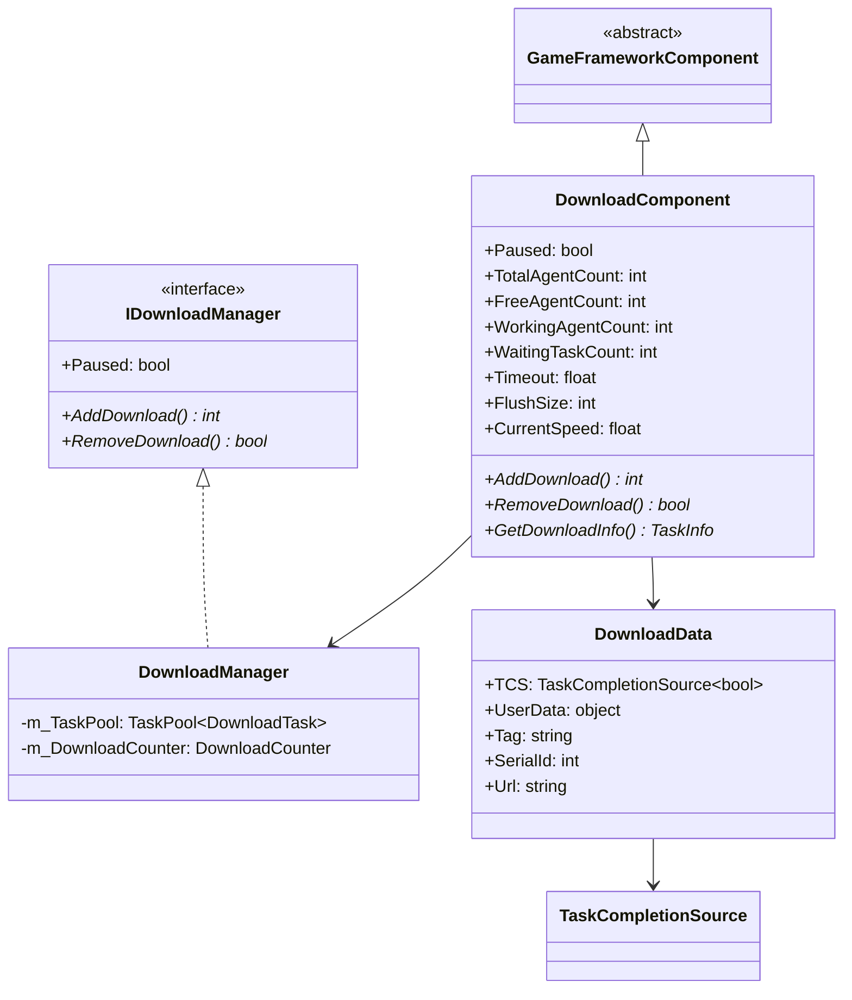
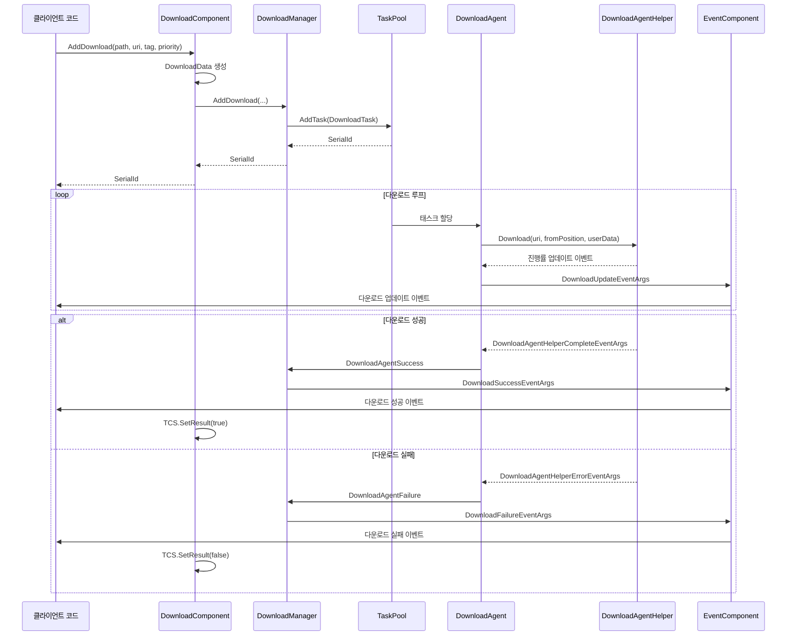
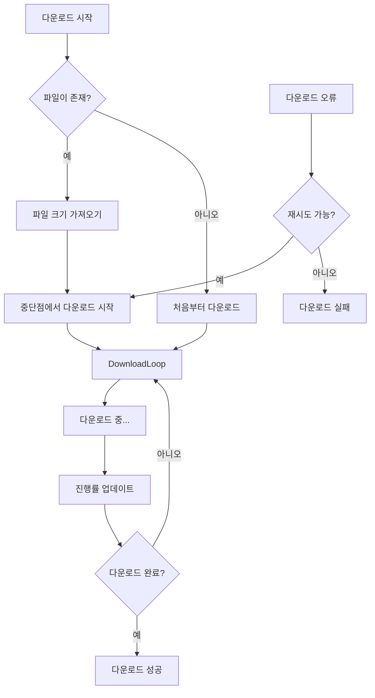

# DownloadComponent

DownloadComponent는 Game Framework 다운로드 시스템의 Unity 컴포넌트 계층으로, IDownloadManager 인터페이스의 퍼사드(Facade) 역할을 하며 Unity 프로젝트에便捷한(편리한) 다운로드 기능 통합을 제공합니다.

## 개요

DownloadComponent는 게임 프레임워크 다운로드 모듈의 핵심 Unity 컴포넌트로, GameFrameworkComponent를 상속합니다. DownloadManager의 기능을 캡슐화하고 Unity 생명 주기와 통합합니다. MonoBehaviour로, 개발자는 게임 씬에 직접 추가하여 Inspector 패널 또는 코드를 통해 구성하고 사용할 수 있습니다.

이 컴포넌트의 핵심 설계 목표:
-简洁한 Unity API 인터페이스 제공
- 여러 다운로드 에이전트(Download Agent) 인스턴스 관리
- 이벤트 시스템을 통해 다운로드 진행률 및 상태 변경 알림
- 태스크 우선순위, 태그 분류,断点续传(중단점 재개) 등의 고급 기능 지원

## 아키텍처

DownloadComponent는 전체 다운로드 시스템에서 진입점 계층 역할을 하며, 다음 다이어그램은 각 컴포넌트와의 관계를 보여줍니다:

```mermaid
flowchart TD
    subgraph UnityLayer["Unity 계층"]
        DC[DownloadComponent]
        Inspector[DownloadComponentInspector]
    end

    subgraph Core["핵심 모듈"]
        DM[DownloadManager]
        IDM[IDownloadManager 인터페이스]
    end

    subgraph TaskPool["태스크 풀"]
        TP[TaskPool&lt;DownloadTask&gt;]
        DA[DownloadAgent x N]
    end

    subgraph AgentHelper["다운로드 에이전트 헬퍼"]
        DAHB[DownloadAgentHelperBase]
        UWR[UnityWebRequestDownloadAgentHelper]
        WWW[WWWDownloadAgentHelper]
    end

    subgraph Events["이벤트 시스템"]
        EC[EventComponent]
        DE[DownloadEventArgs]
    end

    DC --> DM
    DC --> Inspector
    DM --> IDM
    IDM <|.. DM
    DM --> TP
    TP --> DA
    DA --> DAHB
    DAHB --> UWR
    DAHB --> WWW
    DM --> EC
    EC --> DE
```

### 컴포넌트 계층 설명

**Unity 계층**
- DownloadComponent: 메인 컴포넌트로, Unity 친화적 API 제공
- DownloadComponentInspector: Editor Inspector로, 시각적 구성에 사용됨

**핵심 모듈**
- DownloadManager: 다운로드 관리자 구현으로, 핵심 로직 처리
- IDownloadManager: 다운로드 관리자 인터페이스로, 규범 정의

**태스크 풀 계층**
- TaskPool: 범용 태스크 풀로, 다운로드 태스크 및 에이전트 관리
- DownloadAgent: 다운로드 에이전트로, 구체적인 다운로드 태스크 실행

**에이전트 헬퍼 계층**
- DownloadAgentHelperBase: 다운로드 에이전트 헬퍼 기본 클래스
- UnityWebRequestDownloadAgentHelper: UnityWebRequest 기반 구현
- WWWDownloadAgentHelper: WWW 기반 구현 (이전 버전 호환성)

### 핵심 클래스 다이어그램



## 핵심 기능

### 1. 다운로드 태스크 관리

DownloadComponent는 다양한 다운로드 태스크 관리 기능을 제공합니다:

```csharp
// 기본 다운로드 태스크 추가
int serialId = downloadComponent.AddDownload(downloadPath, downloadUri);

// 태그가 포함된 다운로드 태스크 추가
int serialId = downloadComponent.AddDownload(downloadPath, downloadUri, "resources");

// 우선순위가 포함된 다운로드 태스크 추가
int serialId = downloadComponent.AddDownload(downloadPath, downloadUri, 100);

// 사용자 데이터가 포함된 다운로드 태스크 추가
int serialId = downloadComponent.AddDownload(downloadPath, downloadUri, userData);

// 전체 매개변수: 경로, URI, 태그, 우선순위, 사용자 데이터
int serialId = downloadComponent.AddDownload(downloadPath, downloadUri, "update", 100, userData);
```
> Source: [DownloadComponent.cs](https://github.com/GameFrameX/com.gameframex.unity.download/blob/main/Runtime/Download/DownloadComponent.cs#L238-L350)

### 2. 비동기 다운로드 지원

DownloadComponent는 Task를 통해 다운로드 결과를 반환하는 비동기 다운로드 모드를 지원합니다:

```csharp
// 비동기 다운로드 및 결과 대기
public async void StartDownload()
{
    var downloadComponent = GameEntry.GetComponent<DownloadComponent>();
    Task<bool> task = downloadComponent.Download(downloadPath, downloadUri);
    bool success = await task;
    Debug.Log($"Download {(success ? "succeeded" : "failed")}");
}
```
> Source: [DownloadComponent.cs](https://github.com/GameFrameX/com.gameframex.unity.download/blob/main/Runtime/Download/DownloadComponent.cs#L273-L282)

### 3. 태스크 查询(쿼리) 및 제거

```csharp
// 직렬 번호로 다운로드 태스크 정보 가져오기
TaskInfo info = downloadComponent.GetDownloadInfo(serialId);

// 태그로 일치하는 모든 다운로드 태스크 가져오기
TaskInfo[] infos = downloadComponent.GetDownloadInfos("resources");

// 모든 다운로드 태스크 가져오기
TaskInfo[] allInfos = downloadComponent.GetAllDownloadInfos();

// 지정된 태스크 제거
bool removed = downloadComponent.RemoveDownload(serialId);

// 지정된 태그의 모든 태스크 제거
int count = downloadComponent.RemoveDownloads("resources");

// 모든 태스크 제거
downloadComponent.RemoveAllDownloads();
```
> Source: [DownloadComponent.cs](https://github.com/GameFrameX/com.gameframex.unity.download/blob/main/Runtime/Download/DownloadComponent.cs#L189-L392)

### 4. 다운로드 상태 모니터링

컴포넌트는 다운로드 상태 모니터링을 위한 여러 읽기 전용 속성을 제공합니다:

```csharp
// 다운로드 에이전트 상태 가져오기
int totalCount = downloadComponent.TotalAgentCount;    // 총 에이전트 수
int freeCount = downloadComponent.FreeAgentCount;       // 유휴 에이전트 수
int workingCount = downloadComponent.WorkingAgentCount; // 작업 에이전트 수
int waitingCount = downloadComponent.WaitaitingTaskCount; // 대기 태스크 수

// 현재 다운로드 속도 가져오기 (바이트/초)
float speed = downloadComponent.CurrentSpeed;

// 일시 중지 상태 가져오기/설정
downloadComponent.Paused = true;
```

### 5. 구성 속성

| 속성 | 유형 | 기본값 | 설명 |
|------|------|--------|------|
| InstanceRoot | Transform | null | 다운로드 에이전트 인스턴스의 루트 노드 |
| DownloadAgentHelperTypeName | string | UnityWebRequestDownloadAgentHelper | 다운로드 에이전트 헬퍼 유형 |
| DownloadAgentHelperCount | int | 3 | 다운로드 에이전트 인스턴스 수 (1-16) |
| Timeout | float | 30f | 다운로드超时时间(타임아웃 시간) (초, 0-120) |
| FlushSize | int | 1MB | 버퍼가 디스크에 기록되는 임계 크기 |

> Source: [DownloadComponentInspector.cs](https://github.com/GameFrameX/com.gameframex.unity.download/blob/main/Editor/Inspector/DownloadComponentInspector.cs#L39-L69)

## 다운로드 흐름

### 시퀀스 다이어그램



###断点续传(중단점 재개) 흐름

DownloadComponent는断点续传(중단점 재개) 기능을 지원하여, 다운로드가 중단된 후 이전 위치에서 계속 다운로드할 수 있습니다:



断点续传(중단점 재개)는 DownloadAgentHelper에서 HTTP Range 헤더를 설정하여 구현됩니다:

```csharp
// UnityWebRequestDownloadAgentHelper.cs의断点续传(중단점 재개) 구현
m_UnityWebRequest.SetRequestHeader("Range", GameFrameX.Runtime.Utility.Text.Format("bytes={0}-", fromPosition));
```
> Source: [UnityWebRequestDownloadAgentHelper.cs](https://github.com/GameFrameX/com.gameframex.unity.download/blob/main/Runtime/Download/UnityWebRequestDownloadAgentHelper.cs#L114)

## 사용 예제

### 기본 사용법

```csharp
using GameFrameX.Runtime;
using GameFrameX.Download.Runtime;

// 컴포넌트 가져오기
var downloadComponent = GameEntry.GetComponent<DownloadComponent>();

// 다운로드 태스크 추가
string localPath = Application.persistentDataPath + "/Resources/texture.png";
string remoteUrl = "https://example.com/texture.png";

int serialId = downloadComponent.AddDownload(localPath, remoteUrl);
```
> Source: [DownloadComponent.cs](https://github.com/GameFrameX/com.gameframex.unity.download/blob/main/Runtime/Download/DownloadComponent.cs#L238-L241)

### 다운로드 이벤트 리스닝

```csharp
using GameFrameX.Runtime;
using GameFrameX.Download.Runtime;

// 다운로드 이벤트 구독
var downloadComponent = GameEntry.GetComponent<DownloadComponent>();
downloadComponent.DownloadStart += OnDownloadStart;
downloadComponent.DownloadUpdate += OnDownloadUpdate;
downloadComponent.DownloadSuccess += OnDownloadSuccess;
downloadComponent.DownloadFailure += OnDownloadFailure;

private void OnDownloadStart(object sender, DownloadStartEventArgs e)
{
    Debug.Log($"다운로드 시작: {e.DownloadUri}");
}

private void OnDownloadUpdate(object sender, DownloadUpdateEventArgs e)
{
    Debug.Log($"다운로드 진행률: {e.CurrentLength} bytes");
}

private void OnDownloadSuccess(object sender, DownloadSuccessEventArgs e)
{
    Debug.Log($"다운로드 성공: {e.DownloadPath}");
}

private void OnDownloadFailure(object sender, DownloadFailureEventArgs e)
{
    Debug.Log($"다운로드 실패: {e.ErrorMessage}");
}
```
> Source: [DownloadComponent.cs](https://github.com/GameFrameX/com.gameframex.unity.download/blob/main/Runtime/Download/DownloadComponent.cs#L415-L442)

### 리소스 번들 일괄 다운로드

```csharp
public class ResourceUpdater
{
    private DownloadComponent _downloadComponent;
    private List<string> _pendingDownloads = new List<string>();

    public void StartUpdate(List<ResourceInfo> resources)
    {
        _downloadComponent = GameEntry.GetComponent<DownloadComponent>();

        foreach (var resource in resources)
        {
            // 각 리소스에 다운로드 태스크를 추가하고, 관리便捷을 위해 태그 설정
            _downloadComponent.AddDownload(
                resource.LocalPath,
                resource.RemoteUrl,
                "resources",  // 태그
                resource.Priority  // 우선순위
            );
        }
    }

    // 특정 태그의 다운로드 완료 리스닝
    private void OnDownloadSuccess(object sender, DownloadSuccessEventArgs e)
    {
        if (e.UserData is ResourceInfo info)
        {
            Debug.Log($"리소스 다운로드 완료: {info.Name}");
            CheckAllComplete();
        }
    }
}
```

### async/await 사용

```csharp
public async Task<bool> DownloadFileAsync(string url, string path)
{
    var downloadComponent = GameEntry.GetComponent<DownloadComponent>();

    // Task 기반 API 사용
    Task<bool> downloadTask = downloadComponent.Download(path, url);

    // 다운로드 완료 대기
    bool success = await downloadTask;

    return success;
}

// 호출 예제
bool result = await DownloadFileAsync(
    "https://example.com/bundle.zip",
    Application.persistentDataPath + "/bundle.zip"
);
```
> Source: [DownloadComponent.cs](https://github.com/GameFrameX/com.gameframex.unity.download/blob/main/Runtime/Download/DownloadComponent.cs#L273-L282)

## 이벤트 시스템

DownloadComponent는 EventComponent를 통해 다운로드 이벤트를 전달하며, 주요 이벤트는 다음과 같습니다:

| 이벤트 | 설명 | EventArgs |
|------|------|-----------|
| DownloadStart | 다운로드 시작 시 트리거 | DownloadStartEventArgs |
| DownloadUpdate | 다운로드 진행률 업데이트 시 트리거 | DownloadUpdateEventArgs |
| DownloadSuccess | 다운로드 성공 시 트리거 | DownloadSuccessEventArgs |
| DownloadFailure | 다운로드 실패 시 트리거 | DownloadFailureEventArgs |

### DownloadSuccessEventArgs 속성

```csharp
public sealed class DownloadSuccessEventArgs : GameEventArgs
{
    public int SerialId { get; }           // 태스크 직렬 번호
    public string DownloadPath { get; }    // 로컬 저장 경로
    public string DownloadUri { get; }    // 원본 다운로드 주소
    public long CurrentLength { get; }     // 다운로드된 크기
    public object UserData { get; }         // 사용자 정의 데이터
}
```
> Source: [DownloadSuccessEventArgs.cs](https://github.com/GameFrameX/com.gameframex.unity.download/blob/main/Runtime/EventArgs/DownloadSuccessEventArgs.cs#L36-L56)

## 구성 설명

### Inspector 구성

Unity 편집기에서 DownloadComponent가 포함된 GameObject를 선택하면, Inspector 패널에서 다음 속성을 구성할 수 있습니다:

```csharp
// DownloadComponentInspector.cs의 구성 인터페이스
EditorGUILayout.PropertyField(m_InstanceRoot);
m_DownloadAgentHelperInfo.Draw();
m_DownloadAgentHelperCount.intValue = EditorGUILayout.IntSlider("Download Agent Helper Count", ...);
float timeout = EditorGUILayout.Slider("Timeout", ...);
int flushSize = EditorGUILayout.DelayedIntField("Flush Size", ...);
```
> Source: [DownloadComponentInspector.cs](https://github.com/GameFrameX/com.gameframex.unity.download/blob/main/Editor/Inspector/DownloadComponentInspector.cs#L39-L69)

### 다운로드 에이전트 헬퍼

DownloadComponent는 사용자 정의 다운로드 에이전트 헬퍼를 지원하며, 기본적으로 UnityWebRequestDownloadAgentHelper를 사용합니다. 개발자는 DownloadAgentHelperBase를 상속하여 사용자 정의 구현을 생성할 수 있습니다:

```csharp
public abstract class DownloadAgentHelperBase : MonoBehaviour, IDownloadAgentHelper
{
    public abstract event EventHandler<DownloadAgentHelperUpdateBytesEventArgs> DownloadAgentHelperUpdateBytes;
    public abstract event EventHandler<DownloadAgentHelperUpdateLengthEventArgs> DownloadAgentHelperUpdateLength;
    public abstract event EventHandler<DownloadAgentHelperCompleteEventArgs> DownloadAgentHelperComplete;
    public abstract event EventHandler<DownloadAgentHelperErrorEventArgs> DownloadAgentHelperError;

    public abstract void Download(string downloadUri, object userData);
    public abstract void Download(string downloadUri, long fromPosition, object userData);
    public abstract void Download(string downloadUri, long fromPosition, long toPosition, object userData);
    public abstract void Reset();
}
```
> Source: [DownloadAgentHelperBase.cs](https://github.com/GameFrameX/com.gameframex.unity.download/blob/main/Runtime/Download/DownloadAgentHelperBase.cs#L17-L72)

## 내부 구현 상세

### DownloadData 내부 클래스

DownloadComponent는 내부 클래스 DownloadData를 사용하여 각 다운로드 태스크의 메타데이터를 저장합니다:

```csharp
sealed class DownloadData
{
    public TaskCompletionSource<bool> TCS { get; }  // 비동기 대기에 사용
    public object UserData { get; }                  // 사용자 데이터
    public string Tag { get; }                        // 태그
    public int SerialId { get; }                      // 직렬 번호
    public string Url { get; }                        // 다운로드 주소

    public DownloadData(string url, string tag, int serialId, object userData)
    {
        Url = url;
        Tag = tag;
        SerialId = serialId;
        UserData = userData;
        TCS = new TaskCompletionSource<bool>();
    }
}
```
> Source: [DownloadComponent.cs](https://github.com/GameFrameX/com.gameframex.unity.download/blob/main/Runtime/Download/DownloadComponent.cs#L118-L137)

### 생명 주기

1. **Awake()**: DownloadManager 모듈 초기화, 다운로드 이벤트 등록
2. **Start()**: EventComponent 가져오기, 다운로드 에이전트 헬퍼 인스턴스 생성
3. **Update()**: GameFramework가 자동으로 호출하여, 태스크 풀 업데이트 처리
4. **OnDestroy()**: 리소스 정리 (기본 클래스 구현을 통해)

```csharp
protected override void Awake()
{
    ImplementationComponentType = Utility.Assembly.GetType(componentType);
    InterfaceComponentType = typeof(IDownloadManager);
    base.Awake();
    m_DownloadManager = GameFrameworkEntry.GetModule<IDownloadManager>();
    // 이벤트 등록...
}

private void Start()
{
    m_EventComponent = GameEntry.GetComponent<EventComponent>();
    // 다운로드 에이전트 헬퍼 생성...
}
```
> Source: [DownloadComponent.cs](https://github.com/GameFrameX/com.gameframex.unity.download/blob/main/Runtime/Download/DownloadComponent.cs#L142-L182)

## 관련 링크

- [아키텍처 개요](./4-core-concepts.architecture) - 다운로드 시스템 전체 아키텍처
- [다운로드 에이전트](./4-core-concepts.download-agent) - DownloadAgent 상세
- [API 참조 - 속성](./5-api-reference.properties) - 완전한 속성 목록
- [API 참조 - 메서드](./5-api-reference.methods) - 완전한 메서드 목록
- [다운로드 이벤트](./6-events.download-events) - 다운로드 이벤트 상세
- [편집기 구성](./7-configuration.editor-configuration) - Editor Inspector 구성
- [다운로드 에이전트 구성](./7-configuration.agent-configuration) - 에이전트 헬퍼 구성
