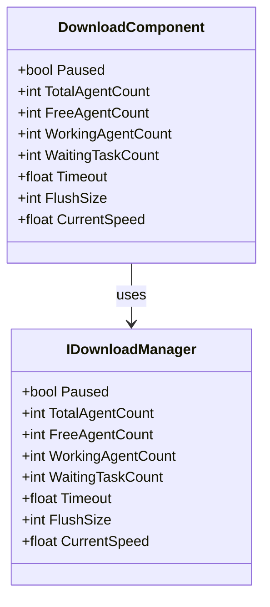
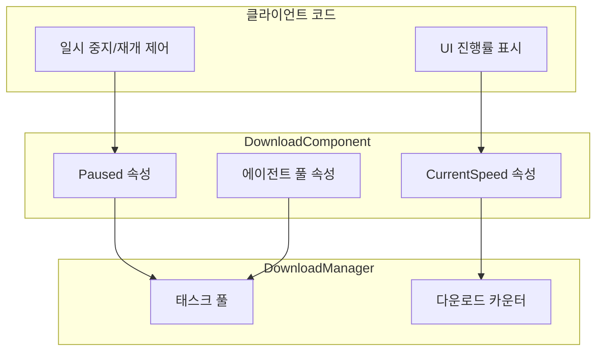

# 속성

이 문서는 DownloadComponent 컴포넌트 및 관련 인터페이스, 이벤트 매개변수에 노출된 모든 공개 속성을 상세히 소개합니다.

## 개요

다운로드 모듈은 다운로드 태스크 상태 모니터링 및 제어를 위해 다양한 속성을 제공합니다. 주요 속성은 다음과 같이 분류됩니다:

1. **상태 제어 속성** - 다운로드 일시 중지/재개 제어에 사용
2. **에이전트 풀 속성** - 다운로드 에이전트 사용 상황 모니터링에 사용
3. **성능 구성 속성** -超时(타임아웃) 및 버퍼 크기 구성에 사용
4. **모니터링 속성** - 실시간 다운로드 상태 가져오기에 사용



## DownloadComponent 속성

DownloadComponent는 다운로드 시스템의 핵심 컴포넌트로, GameFrameworkComponent를 상속합니다. 다음은 모든 공개 속성의 상세 설명입니다:

> Source: [DownloadComponent.cs](https://github.com/GameFrameX/com.gameframex.unity.download/blob/main/Runtime/Download/DownloadComponent.cs#L46-L108)

### `Paused`

```csharp
public bool Paused
{
    get { return m_DownloadManager.Paused; }
    set { m_DownloadManager.Paused = value; }
}
```

**유형:** `bool`
**읽기/쓰기:** 읽기 가능 쓰기 가능
**설명:** 다운로드가 일시 중지되었는지 가져오거나 설정합니다. `true`로 설정하면 진행 중인 모든 다운로드 태스크와 대기 중인 태스크가 일시 중지됩니다. `false`로 설정하면 일시 중지된 태스크가 계속 실행됩니다.

**사용 예제:**

```csharp
// 모든 다운로드 일시 중지
var downloadComponent = GameEntry.GetComponent<DownloadComponent>();
downloadComponent.Paused = true;

// 다운로드 재개
downloadComponent.Paused = false;
```

### `TotalAgentCount`

```csharp
public int TotalAgentCount
{
    get { return m_DownloadManager.TotalAgentCount; }
}
```

**유형:** `int`
**읽기/쓰기:** 읽기 전용
**설명:** 다운로드 에이전트 총 개수를 가져옵니다. 이는 시스템이 시작될 때 생성된 다운로드 에이전트 인스턴스 총수로, 시스템이 병렬로 처리할 수 있는 최대 다운로드 태스크 수를 반영합니다.

### `FreeAgentCount`

```csharp
public int FreeAgentCount
{
    get { return m_DownloadManager.FreeAgentCount; }
}
```

**유형:** `int`
**읽기/쓰기:** 읽기 전용
**설명:** 사용 가능(유휴) 다운로드 에이전트 개수를 가져옵니다. 이 값이 0보다 크면 새 다운로드 태스크를 즉시 추가할 수 있습니다.

### `WorkingAgentCount`

```csharp
public int WorkingAgentCount
{
    get { return m_DownloadManager.WorkingAgentCount; }
}
```

**유형:** `int`
**읽기/쓰기:** 읽기 전용
**설명:** 작업 중(사용 중) 다운로드 에이전트 개수를 가져옵니다. 현재 다운로드 태스크를 실행 중인 에이전트 수를 나타냅니다.

### `WaitingTaskCount`

```csharp
public int WaitingTaskCount
{
    get { return m_DownloadManager.WaitingTaskCount; }
}
```

**유형:** `int`
**읽기/쓰기:** 읽기 전용
**설명:** 대기 중인 다운로드 태스크 개수를 가져옵니다. 시스템의 다운로드 에이전트가 제한되어 있어 모든 에이전트가 사용 중일 때 새로 추가된 태스크는 대기 대기열에 들어갑니다.

### `Timeout`

```csharp
public float Timeout
{
    get { return m_DownloadManager.Timeout; }
    set { m_DownloadManager.Timeout = m_Timeout = value; }
}
```

**유형:** `float`
**읽기/쓰기:** 읽기 가능 쓰기 가능
**기본값:** `30.0f` (30초)
**설명:** 다운로드超时时长(타임아웃 시간)을 초 단위로 가져오거나 설정합니다. 단일 다운로드 태스크가 이 시간 내에 완료되지 않으면 다운로드 실패 이벤트가 트리거됩니다.

### `FlushSize`

```csharp
public int FlushSize
{
    get { return m_DownloadManager.FlushSize; }
    set { m_DownloadManager.FlushSize = m_FlushSize = value; }
}
```

**유형:** `int`
**읽기/쓰기:** 읽기 가능 쓰기 가능
**기본값:** `1048576` (1MB, 즉 1024 * 1024)
**설명:** 버퍼를 디스크에 기록하는 임계 크기를 가져오거나 설정하며,断点续传(중단점 재개)가 활성화된 경우에만 유효합니다. 이 값은 데이터가 최종 파일에 기록되기 전에 메모리 버퍼에서 누적되어야 하는 크기를 결정하며, 값이 크면 쓰기 성능이 향상되지만 메모리 사용량이 증가합니다.

### `CurrentSpeed`

```csharp
public float CurrentSpeed
{
    get { return m_DownloadManager.CurrentSpeed; }
}
```

**유형:** `float`
**읽기/쓰기:** 읽기 전용
**단위:** 바이트/초 (B/s)
**설명:** 현재 다운로드 속도를 가져옵니다. 이는 시스템이 실시간으로 계산한 다운로드 속도로, 다운로드 진행률 UI 표시에 사용할 수 있습니다.

## 이벤트 매개변수 속성

다운로드 모듈은 이벤트 시스템을 통해 외부에 다운로드 상태 변경을 알립니다. 다음은 각 이벤트 매개변수 클래스에 노출된 속성입니다:

### DownloadStartEventArgs

다운로드가 시작될 때 트리거되는 이벤트 매개변수입니다.

> Source: [DownloadStartEventArgs.cs](https://github.com/GameFrameX/com.gameframex.unity.download/blob/main/Runtime/EventArgs/DownloadStartEventArgs.cs#L35-L55)

| 속성 | 유형 | 설명 |
|------|------|------|
| `SerialId` | `int` | 다운로드 태스크의 직렬 번호로, 다운로드 태스크를 고유하게 식별하는 데 사용됩니다 |
| `DownloadPath` | `string` | 다운로드 후 저장되는 로컬 경로 |
| `DownloadUri` | `string` | 원본 다운로드 주소 (URL) |
| `CurrentLength` | `long` | 현재 다운로드된 크기 (바이트) |
| `UserData` | `object` | 사용자 정의 데이터 |

### DownloadUpdateEventArgs

다운로드 진행률이 업데이트될 때 트리거되는 이벤트 매개변수입니다.

> Source: [DownloadUpdateEventArgs.cs](https://github.com/GameFrameX/com.gameframex.unity.download/blob/main/Runtime/EventArgs/DownloadUpdateEventArgs.cs#L35-L55)

| 속성 | 유형 | 설명 |
|------|------|------|
| `SerialId` | `int` | 다운로드 태스크의 직렬 번호 |
| `DownloadPath` | `string` | 다운로드 후 저장되는 로컬 경로 |
| `DownloadUri` | `string` | 원본 다운로드 주소 |
| `CurrentLength` | `long` | 현재 다운로드된 크기 |
| `UserData` | `object` | 사용자 정의 데이터 |

### DownloadSuccessEventArgs

다운로드가 성공적으로 완료될 때 트리거되는 이벤트 매개변수입니다.

> Source: [DownloadSuccessEventArgs.cs](https://github.com/GameFrameX/com.gameframex.unity.download/blob/main/Runtime/EventArgs/DownloadSuccessEventArgs.cs#L35-L56)

| 속성 | 유형 | 설명 |
|------|------|------|
| `SerialId` | `int` | 다운로드 태스크의 직렬 번호 |
| `DownloadPath` | `string` | 다운로드 후 저장되는 로컬 경로 |
| `DownloadUri` | `string` | 원본 다운로드 주소 |
| `CurrentLength` | `long` | 최종 다운로드 파일 크기 |
| `UserData` | `object` | 사용자 정의 데이터 |

### DownloadFailureEventArgs

다운로드가 실패할 때 트리거되는 이벤트 매개변수입니다.

> Source: [DownloadFailureEventArgs.cs](https://github.com/GameFrameX/com.gameframex.unity.download/blob/main/Runtime/EventArgs/DownloadFailureEventArgs.cs#L35-L55)

| 속성 | 유형 | 설명 |
|------|------|------|
| `SerialId` | `int` | 다운로드 태스크의 직렬 번호 |
| `DownloadPath` | `string` | 다운로드 후 저장되는 로컬 경로 |
| `DownloadUri` | `string` | 원본 다운로드 주소 |
| `ErrorMessage` | `string` | 오류 정보 설명 |
| `UserData` | `object` | 사용자 정의 데이터 |

## 속성 관계 및 데이터 흐름

다음图表는 각 속성 간의 관계와 데이터 흐름을 보여줍니다:



## 사용 예제

### 다운로드 상태 모니터링

다음 예제는 속성을 사용하여 다운로드 시스템 상태를 모니터링하는 방법을 보여줍니다:

```csharp
public class DownloadStatusMonitor : MonoBehaviour
{
    private DownloadComponent _downloadComponent;

    private void Start()
    {
        _downloadComponent = GameEntry.GetComponent<DownloadComponent>();
    }

    private void Update()
    {
        // 실시간 다운로드 속도 가져오기
        float speed = _downloadComponent.CurrentSpeed;

        // 에이전트 풀 상태 가져오기
        int total = _downloadComponent.TotalAgentCount;
        int free = _downloadComponent.FreeAgentCount;
        int working = _downloadComponent.WorkingAgentCount;
        int waiting = _downloadComponent.WaitingTaskCount;

        // UI 표시 업데이트
        UpdateDownloadUI(speed, total, free, working, waiting);
    }

    private void UpdateDownloadUI(float speed, int total, int free, int working, int waiting)
    {
        // 바이트를 MB/s로 변환
        float speedMB = speed / (1024 * 1024);
        Debug.Log($"다운로드 속도: {speedMB:F2} MB/s | 에이전트 상태: {free}/{total} 유휴 | 작업 중: {working} | 대기: {waiting}");
    }
}
```
> Source: [DownloadComponent.cs](https://github.com/GameFrameX/com.gameframex.unity.download/blob/main/Runtime/Download/DownloadComponent.cs#L100-L108)

### 다운로드 일시 중지 및 재개

```csharp
public class DownloadController
{
    private DownloadComponent _downloadComponent;

    public void PauseAllDownloads()
    {
        _downloadComponent = GameEntry.GetComponent<DownloadComponent>();
        _downloadComponent.Paused = true;
        Debug.Log("모든 다운로드가 일시 중지됨");
    }

    public void ResumeAllDownloads()
    {
        if (_downloadComponent == null)
        {
            _downloadComponent = GameEntry.GetComponent<DownloadComponent>();
        }
        _downloadComponent.Paused = false;
        Debug.Log("다운로드 재개됨");
    }
}
```
> Source: [DownloadComponent.cs](https://github.com/GameFrameX/com.gameframex.unity.download/blob/main/Runtime/Download/DownloadComponent.cs#L46-L50)

### 다운로드 매개변수 구성

```csharp
public void ConfigureDownload()
{
    var downloadComponent = GameEntry.GetComponent<DownloadComponent>();

    //超时时间(타임아웃 시간)을 60초로 설정
    downloadComponent.Timeout = 60f;

    // 버퍼 새로고침 크기를 2MB로 설정
    downloadComponent.FlushSize = 2 * 1024 * 1024;

    Debug.Log($"타임아웃: {downloadComponent.Timeout}s, 버퍼: {downloadComponent.FlushSize} bytes");
}
```
> Source: [DownloadComponent.cs](https://github.com/GameFrameX/com.gameframex.unity.download/blob/main/Runtime/Download/DownloadComponent.cs#L87-L100)

## 구성 옵션汇总表(총괄표)

| 속성 | 유형 | 기본값 | 설명 |
|------|------|--------|------|
| `Paused` | `bool` | `false` | 다운로드가 일시 중지되었는지 여부 |
| `TotalAgentCount` | `int` | 구성에 따름 | 다운로드 에이전트 총 개수 |
| `FreeAgentCount` | `int` | - | 사용 가능한 다운로드 에이전트 개수 |
| `WorkingAgentCount` | `int` | - | 작업 중인 다운로드 에이전트 개수 |
| `WaitingTaskCount` | `int` | - | 대기 중인 다운로드 태스크 개수 |
| `Timeout` | `float` | `30.0f` | 다운로드超时时长(타임아웃 시간) (초) |
| `FlushSize` | `int` | `1048576` | 버퍼가 디스크에 기록되는 임계 크기 (바이트) |
| `CurrentSpeed` | `float` | - | 현재 다운로드 속도 (바이트/초) |

## 관련 링크

- [메서드](./5-api-reference.methods) - DownloadComponent의 모든 메서드 알아보기
- [다운로드 이벤트](./6-events.download-events) - 다운로드 이벤트 시스템 상세히 알아보기
- [아키텍처 개요](./4-core-concepts.architecture) - 다운로드 모듈의 전체 아키텍처 보기
- [DownloadComponent](./4-core-concepts.download-component) - DownloadComponent 핵심 개념 알아보기
