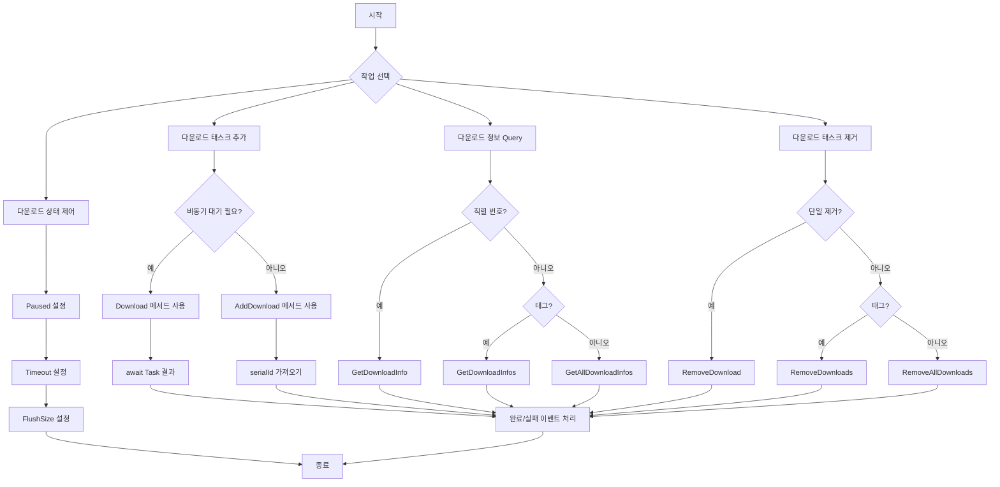

# 메서드

이 문서는 DownloadComponent 컴포넌트가 제공하는 모든 공개 메서드를 상세히 소개합니다. 이러한 메서드는 다운로드 태스크 관리, 다운로드 상태 查询(쿼리) 및 다운로드 행동 제어를 위해 사용됩니다.

## 개요

DownloadComponent는 게임 다운로드 기능의 핵심 컴포넌트로, 완전한 비동기 다운로드 태스크 관리 API 세트를 제공합니다. 이 메서드를 통해 개발자는 다음을 할 수 있습니다:

- 다운로드 태스크 추가 (우선순위, 태그, 사용자 정의 데이터 지원)
- 다운로드 태스크 상태 및 진행률 查询(쿼리)
- 다운로드 일시 중지/재개
- 단일 또는 배치 다운로드 태스크 제거
- 실시간 다운로드 속도 가져오기

## 다운로드 태스크 관리

### 다운로드 태스크 추가

DownloadComponent는 8개의 `AddDownload` 메서드 오버로드를 제공하여 다양한 사용 시나리오를 충족합니다. 모든 오버로드는 새로 추가된 다운로드 태스크의 직렬 번호(serialId)를 반환합니다.

#### 기본 추가 메서드

```csharp
public int AddDownload(string downloadPath, string downloadUri)
```

기본 다운로드 태스크를 추가합니다.

**매개변수:**
- `downloadPath` (string): 다운로드 파일의 로컬 저장 경로
- `downloadUri` (string): 원격 파일의 다운로드 주소

**반환값:** 새로 추가된 다운로드 태스크의 직렬 번호

**예제:**
```csharp
var downloadComponent = GameEntry.GetComponent<DownloadComponent>();
int serialId = downloadComponent.AddDownload(Application.persistentDataPath + "/file.dat", "https://example.com/file.dat");
```

> Source: [DownloadComponent.cs](https://github.com/GameFrameX/com.gameframex.unity.download/blob/main/Runtime/Download/DownloadComponent.cs#L238-L241)

---

#### 태그가 포함된 추가 메서드

```csharp
public int AddDownload(string downloadPath, string downloadUri, string tag)
```

그룹 관리를 위해 태그가 포함된 다운로드 태스크를 추가합니다.

**매개변수:**
- `downloadPath` (string): 다운로드 파일의 로컬 저장 경로
- `downloadUri` (string): 원격 파일의 다운로드 주소
- `tag` (string): 다운로드 태스크의 태그로, 그룹 관리에 사용됨

**반환값:** 새로 추가된 다운로드 태스크의 직렬 번호

**예제:**
```csharp
int serialId = downloadComponent.AddDownload(path, uri, "resources");
```

> Source: [DownloadComponent.cs](https://github.com/GameFrameX/com.gameframex.unity.download/blob/main/Runtime/Download/DownloadComponent.cs#L250-L253)

---

#### 우선순위가 포함된 추가 메서드

```csharp
public int AddDownload(string downloadPath, string downloadUri, int priority)
```

우선순위가 포함된 다운로드 태스크를 추가합니다.

**매개변수:**
- `downloadPath` (string): 다운로드 파일의 로컬 저장 경로
- `downloadUri` (string): 원격 파일의 다운로드 주소
- `priority` (int): 다운로드 태스크의 우선순위로, 값이 높을수록 우선순위가 높음

**반환값:** 새로 추가된 다운로드 태스크의 직렬 번호

> Source: [DownloadComponent.cs](https://github.com/GameFrameX/com.gameframex.unity.download/blob/main/Runtime/Download/DownloadComponent.cs#L262-L265)

---

#### 사용자 데이터가 포함된 추가 메서드

```csharp
public int AddDownload(string downloadPath, string downloadUri, object userData)
```

사용자 정의 데이터가 포함된 다운로드 태스크를 추가합니다.

**매개변수:**
- `downloadPath` (string): 다운로드 파일의 로컬 저장 경로
- `downloadUri` (string): 원격 파일의 다운로드 주소
- `userData` (object): 사용자 정의 데이터로, 이벤트에서 전달됨

**반환값:** 새로 추가된 다운로드 태스크의 직렬 번호

**예제:**
```csharp
var userData = new { fileType = "texture", version = "1.0" };
int serialId = downloadComponent.AddDownload(path, uri, userData);
```

> Source: [DownloadComponent.cs](https://github.com/GameFrameX/com.gameframex.unity.download/blob/main/Runtime/Download/DownloadComponent.cs#L291-L294)

---

#### 전체 매개변수 추가 메서드

```csharp
public int AddDownload(string downloadPath, string downloadUri, string tag, int priority, object userData)
```

모든 매개변수가 포함된 다운로드 태스크를 추가합니다.

**매개변수:**
- `downloadPath` (string): 다운로드 파일의 로컬 저장 경로
- `downloadUri` (string): 원격 파일의 다운로드 주소
- `tag` (string): 다운로드 태스크의 태그
- `priority` (int): 다운로드 태스크의 우선순위
- `userData` (object): 사용자 정의 데이터

**반환값:** 새로 추가된 다운로드 태스크의 직렬 번호

> Source: [DownloadComponent.cs](https://github.com/GameFrameX/com.gameframex.unity.download/blob/main/Runtime/Download/DownloadComponent.cs#L344-L350)

---

### 비동기 다운로드 메서드

```csharp
public Task<bool> Download(string downloadPath, string downloadUri)
```

다운로드 태스크를 추가하고 Task 객체를 반환하며, async/await 모드 사용에便捷합니다.

**매개변수:**
- `downloadPath` (string): 다운로드 파일의 로컬 저장 경로
- `downloadUri` (string): 원격 파일의 다운로드 주소

**반환값:** `Task<bool>`, 다운로드 완료 시 true, 실패 시 false 반환

**예제:**
```csharp
var downloadComponent = GameEntry.GetComponent<DownloadComponent>();
bool success = await downloadComponent.Download(Application.persistentDataPath + "/file.dat", "https://example.com/file.dat");
```

> Source: [DownloadComponent.cs](https://github.com/GameFrameX/com.gameframex.unity.download/blob/main/Runtime/Download/DownloadComponent.cs#L273-L282)

---

### 다운로드 태스크 제거

#### 직렬 번호로 제거

```csharp
public bool RemoveDownload(int serialId)
```

다운로드 태스크의 직렬 번호로 지정된 다운로드 태스크를 제거합니다.

**매개변수:**
- `serialId` (int): 제거할 다운로드 태스크의 직렬 번호

**반환값:** bool, 제거 성공 여부

**예제:**
```csharp
bool removed = downloadComponent.RemoveDownload(serialId);
```

> Source: [DownloadComponent.cs](https://github.com/GameFrameX/com.gameframex.unity.download/blob/main/Runtime/Download/DownloadComponent.cs#L357-L361)

---

#### 태그로 제거

```csharp
public int RemoveDownloads(string tag)
```

다운로드 태스크의 태그로 일치하는 모든 다운로드 태스크를 제거합니다.

**매개변수:**
- `tag` (string): 제거할 다운로드 태스크의 태그

**반환값:** int, 제거된 태스크 수

**예제:**
```csharp
// "resources" 태그가 표시된 모든 다운로드 태스크 제거
int removedCount = downloadComponent.RemoveDownloads("resources");
```

> Source: [DownloadComponent.cs](https://github.com/GameFrameX/com.gameframex.unity.download/blob/main/Runtime/Download/DownloadComponent.cs#L368-L382)

---

#### 모든 태스크 제거

```csharp
public int RemoveAllDownloads()
```

모든 다운로드 태스크를 제거합니다.

**반환값:** int, 제거된 태스크 수

**예제:**
```csharp
int removedCount = downloadComponent.RemoveAllDownloads();
```

> Source: [DownloadComponent.cs](https://github.com/GameFrameX/com.gameframex.unity.download/blob/main/Runtime/Download/DownloadComponent.cs#L388-L392)

---

## 다운로드 정보 查询(쿼리)

### 직렬 번호로 查询(쿼리)

```csharp
public TaskInfo GetDownloadInfo(int serialId)
```

다운로드 태스크의 직렬 번호로 다운로드 태스크 정보를 가져옵니다.

**매개변수:**
- `serialId` (int): 정보를 가져올 다운로드 태스크의 직렬 번호

**반환값:** TaskInfo로, 다운로드 태스크의 상세 정보를 포함합니다

> Source: [DownloadComponent.cs](https://github.com/GameFrameX/com.gameframex.unity.download/blob/main/Runtime/Download/DownloadComponent.cs#L189-L192)

---

### 태그로 查询(쿼리)

```csharp
public TaskInfo[] GetDownloadInfos(string tag)
```

다운로드 태스크의 태그로 일치하는 모든 다운로드 태스크 정보를 가져옵니다.

**매개변수:**
- `tag` (string): 정보를 가져올 다운로드 태스크의 태그

**반환값:** TaskInfo[]로, 일치하는 다운로드 태스크 정보 배열입니다

```csharp
public void GetDownloadInfos(string tag, List<TaskInfo> results)
```

일치하는 다운로드 태스크 정보를 지정된 목록에 추가합니다 (메모리 할당 방지).

**매개변수:**
- `tag` (string): 정보를 가져올 다운로드 태스크의 태그
- `results` (List&lt;TaskInfo&gt;): 결과를 저장할 태스크 정보 목록입니다

> Source: [DownloadComponent.cs](https://github.com/GameFrameX/com.gameframex.unity.download/blob/main/Runtime/Download/DownloadComponent.cs#L199-L212)

---

### 모든 태스크 查询(쿼리)

```csharp
public TaskInfo[] GetAllDownloadInfos()
```

모든 다운로드 태스크 정보를 가져옵니다.

**반환값:** TaskInfo[]로, 모든 다운로드 태스크 정보 배열입니다

```csharp
public void GetAllDownloadInfos(List<TaskInfo> results)
```

모든 다운로드 태스크 정보를 지정된 목록에 추가합니다 (메모리 할당 방지).

**매개변수:**
- `results` (List&lt;TaskInfo&gt;): 결과를 저장할 태스크 정보 목록입니다

> Source: [DownloadComponent.cs](https://github.com/GameFrameX/com.gameframex.unity.download/blob/main/Runtime/Download/DownloadComponent.cs#L218-L230)

---

## 다운로드 제어 속성

### 일시 중지/재개 제어

```csharp
public bool Paused { get; set; }
```

다운로드가 일시 중지되었는지 가져오거나 설정합니다. true로 설정하면 모든 대기 중인 다운로드 태스크가 일시 중지됩니다.

**속성값:** bool, true는 일시 중지를 의미하고, false는 계속을 의미합니다

**예제:**
```csharp
// 모든 다운로드 일시 중지
downloadComponent.Paused = true;

// 다운로드 재개
downloadComponent.Paused = false;
```

> Source: [DownloadComponent.cs](https://github.com/GameFrameX/com.gameframex.unity.download/blob/main/Runtime/Download/DownloadComponent.cs#L46-L50)

---

###超时(타임아웃) 설정

```csharp
public float Timeout { get; set; }
```

다운로드超时时长(타임아웃 시간)을 초 단위로 가져오거나 설정합니다. 기본값은 30초입니다.

**속성값:** float로,超时时长(타임아웃 시간) (초)입니다

**예제:**
```csharp
// 다운로드 타임아웃을 60초로 설정
downloadComponent.Timeout = 60f;
```

> Source: [DownloadComponent.cs](https://github.com/GameFrameX/com.gameframex.unity.download/blob/main/Runtime/Download/DownloadComponent.cs#L87-L91)

---

### 버퍼 크기 설정

```csharp
public int FlushSize { get; set; }
```

버퍼를 디스크에 기록하는 임계 크기를 가져오거나 설정합니다.断点续传(중단점 재개)가 활성화된 경우에만 유효합니다. 기본값은 1MB입니다.

**속성값:** int로, 버퍼 크기 (바이트)입니다

> Source: [DownloadComponent.cs](https://github.com/GameFrameX/com.gameframex.unity.download/blob/main/Runtime/Download/DownloadComponent.cs#L96-L100)

---

## 상태 Query 속성(쿼리 속성)

### 에이전트 상태

```csharp
public int TotalAgentCount { get; }
```

다운로드 에이전트 총 개수를 가져옵니다.

---

```csharp
public int FreeAgentCount { get; }
```

사용 가능(유휴) 다운로드 에이전트 개수를 가져옵니다.

---

```csharp
public int WorkingAgentCount { get; }
```

작업 중인 다운로드 에이전트 개수를 가져옵니다.

---

```csharp
public int WaitingTaskCount { get; }
```

대기 다운로드 태스크 개수를 가져옵니다.

---

### 다운로드 속도

```csharp
public float CurrentSpeed { get; }
```

현재 다운로드 속도 (바이트/초)를 가져옵니다.

**예제:**
```csharp
float speed = downloadComponent.CurrentSpeed;
Debug.Log($"현재 다운로드 속도: {speed / 1024 / 1024:F2} MB/s");
```

> Source: [DownloadComponent.cs](https://github.com/GameFrameX/com.gameframex.unity.download/blob/main/Runtime/Download/DownloadComponent.cs#L105-L108)

---

## 메서드 사용 흐름



---

## 완전한 사용 예제

```csharp
using UnityEngine;
using GameFrameX.Runtime;
using GameFrameX.Download.Runtime;

public class DownloadExample : MonoBehaviour
{
    private DownloadComponent downloadComponent;

    private void Start()
    {
        downloadComponent = GameEntry.GetComponent<DownloadComponent>();

        // 예제1: 기본 다운로드
        int serialId = downloadComponent.AddDownload(
            Application.persistentDataPath + "/data.bin",
            "https://example.com/data.bin"
        );

        // 예제2: 우선순위 및 태그가 포함된 다운로드
        int serialId2 = downloadComponent.AddDownload(
            Application.persistentDataPath + "/texture.png",
            "https://example.com/texture.png",
            "resources",  // 태그
            100,         // 우선순위
            null         // 사용자 데이터
        );

        // 예제3: 비동기 다운로드
        _ = AsyncDownload();
    }

    private async Task AsyncDownload()
    {
        bool success = await downloadComponent.Download(
            Application.persistentDataPath + "/config.json",
            "https://example.com/config.json"
        );

        Debug.Log($"다운로드 결과: {(success ? "성공" : "실패")}");
    }

    private void Update()
    {
        // 다운로드 상태 Query
        if (downloadComponent != null)
        {
            TaskInfo[] allTasks = downloadComponent.GetAllDownloadInfos();
            foreach (var task in allTasks)
            {
                Debug.Log($"태스크 {task.SerialId}: {task.Status} - {task.Description}");
            }

            // 다운로드 속도 표시
            Debug.Log($"속도: {downloadComponent.CurrentSpeed / 1024:F2} KB/s");
        }
    }
}
```

---

## 자주 묻는 질문

###断点续传(중단점 재개)를 구현하려면 어떻게 해야 합니까?

断点续传(중단점 재개)는 기본적으로 활성화되어 있습니다. 다운로드가 중단된 후 동일한 경로의 다운로드 태스크를 다시 추가하면 시스템이 자동으로 다운로드된 부분을 감지하고 중단점에서 계속 다운로드합니다.

### 동시 다운로드 수를 제한하려면 어떻게 해야 합니까?

DownloadComponent의 Inspector 패널에서 `Download Agent Helper Count` 속성을 설정합니다. 이 값은 동시에 실행할 수 있는 최대 다운로드 태스크 수를 결정합니다.

### 다운로드 실패 후 재시도하려면 어떻게 해야 합니까?

`DownloadFailure` 이벤트를 리스닝하여 실패 정보를 가져오고, 콜백에서 `AddDownload` 메서드를 다시 호출하여 재시도 태스크를 추가할 수 있습니다.

---

## 관련 링크

- [속성](./5-api-reference.properties) - DownloadComponent 속성 문서
- [다운로드 이벤트](./6-events.download-events) - 다운로드 관련 이벤트
- [에이전트 이벤트](./6-events.agent-events) - 다운로드 에이전트 관련 이벤트
- [다운로드 에이전트 구성](./7-configuration.agent-configuration) - 다운로드 에이전트 구성
- [DownloadComponent 핵심 개념](./4-core-concepts.download-component) - 컴포넌트 상세 소개
