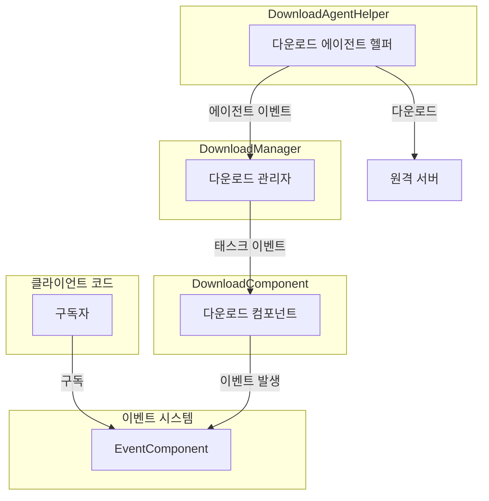
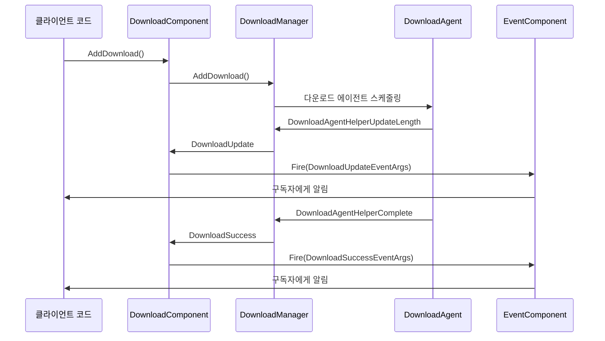

# 다운로드 이벤트

이 문서는 GameFrameX 다운로드 모듈의 이벤트 시스템을 상세히 소개하며, 다운로드 태스크 이벤트와 다운로드 에이전트 이벤트 두 가지 큰 범주를 포함합니다.

## 개요

GameFrameX 다운로드 모듈은 이벤트驱动 아키텍처('événement-driven architecture')를 채택하여, 통일된 이벤트 시스템을 통해 다운로드 상태의 실시간 알림을 실현합니다. 이벤트 시스템은 두 가지 계층으로 나뉩니다:

1. **다운로드 태스크 이벤트** - 전체 다운로드 태스크의 상태 변경 알림
2. **다운로드 에이전트 이벤트** - 다운로드 에이전트 헬퍼의底层 상태 알림

이러한分层 설계(계층화 설계)는 개발자가 요구에 따라 다양한粒도(granularity)의 이벤트 리스닝을 선택할 수 있게 하며,高层 다운로드 태스크 상태를 리스닝하거나底层 에이전트 데이터 전송 상태를 리스닝할 수 있습니다.

## 이벤트 아키텍처

다운로드 이벤트 시스템은 发布-订阅 패턴을 채택하며, `EventComponent`를 통해 이벤트를 통일 관리하고 분배합니다.



### 이벤트 흐름 설명

1. 클라이언트가 `EventComponent`를 통해 관심 있는 다운로드 이벤트를 구독합니다
2. `DownloadComponent.AddDownload()`를 호출하여 다운로드 태스크를 추가하면 태스크가 다운로드 대기열에 들어갑니다
3. `DownloadManager`가 다운로드 에이전트를 스케줄링하여 실제 다운로드 작업을 실행합니다
4. 다운로드 과정에서 발생하는 다양한 이벤트가 `DownloadComponent`를 통해 `EventComponent`에 전달됩니다
5. 구독자가 이벤트 알림을 수신하고 해당 로직을 실행합니다

## 다운로드 태스크 이벤트

다운로드 태스크 이벤트는 `IDownloadManager` 인터페이스에서 정의되며, `DownloadComponent`가 외부에 통일하여 노출합니다. 이러한 이벤트는 다운로드 태스크 완전한 생명 주기 내의 주요 상태 변경 알림을 제공합니다.

> Source: [IDownloadManager.cs](https://github.com/GameFrameX/com.gameframex.unity.download/blob/main/Runtime/Download/Download/IDownloadManager.cs#L86-L104)

### 이벤트 목록

| 이벤트 이름 | 이벤트 매개변수 클래스 | 트리거 시점 |
|---------|-----------|---------|
| 다운로드 시작 | `DownloadStartEventArgs` | 다운로드 태스크 실행 시작 시 |
| 다운로드 업데이트 | `DownloadUpdateEventArgs` | 다운로드 진행률 업데이트 시 |
| 다운로드 성공 | `DownloadSuccessEventArgs` | 다운로드 성공 완료 시 |
| 다운로드 실패 | `DownloadFailureEventArgs` | 다운로드 실패 시 |

### DownloadStartEventArgs

다운로드 시작 이벤트로, 다운로드 태스크가 다운로드 에이전트에 의해 수신되어 처리를 시작할 때 트리거됩니다.

> Source: [DownloadStartEventArgs.cs](https://github.com/GameFrameX/com.gameframex.unity.download/blob/main/Runtime/EventArgs/DownloadStartEventArgs.cs#L1-L94)

### DownloadUpdateEventArgs

다운로드 업데이트 이벤트로, 다운로드 과정에서 지속적으로 트리거되어 현재 다운로드 진행률을 보고합니다.

> Source: [DownloadUpdateEventArgs.cs](https://github.com/GameFrameX/com.gameframex.unity.download/blob/main/Runtime/EventArgs/DownloadUpdateEventArgs.cs#L1-L94)

### DownloadSuccessEventArgs

다운로드 성공 이벤트로, 다운로드 태스크가 성공적으로 완료될 때 트리거됩니다.

> Source: [DownloadSuccessEventArgs.cs](https://github.com/GameFrameX/com.gameframex.unity.download/blob/main/Runtime/EventArgs/DownloadSuccessEventArgs.cs#L1-L95)

### DownloadFailureEventArgs

다운로드 실패 이벤트로, 다운로드 과정에서 오류가 발생할 때 트리거됩니다.

> Source: [DownloadFailureEventArgs.cs](https://github.com/GameFrameX/com.gameframex.unity.download/blob/main/Runtime/EventArgs/DownloadFailureEventArgs.cs#L1-L94)

## 다운로드 에이전트 이벤트

다운로드 에이전트 이벤트는 `DownloadAgentHelperBase` 추상 클래스에서 정의되며, 더底层(저수준)의 다운로드 상태 알림을 제공합니다. 이러한 이벤트는 주로 `DownloadManager` 내부에서 사용되어 다운로드 에이전트의 작업 상태를 추적합니다.

> Source: [DownloadAgentHelperBase.cs](https://github.com/GameFrameX/com.gameframex.unity.download/blob/main/Runtime/Download/DownloadAgentHelperBase.cs#L19-L42)

### 이벤트 목록

| 이벤트 이름 | 이벤트 매개변수 클래스 | 트리거 시점 |
|---------|-----------|---------|
| 에이전트 데이터 스트림 업데이트 | `DownloadAgentHelperUpdateBytesEventArgs` | 다운로드 에이전트가 새로운 데이터 블록을 수신할 때 |
| 에이전트 데이터 크기 업데이트 | `DownloadAgentHelperUpdateLengthEventArgs` | 다운로드 에이전트의 데이터 크기가 변경될 때 |
| 에이전트 완료 | `DownloadAgentHelperCompleteEventArgs` | 다운로드 에이전트가 다운로드 완료 시 |
| 에이전트 오류 | `DownloadAgentHelperErrorEventArgs` | 다운로드 에이전트에서 오류 발생 시 |

### DownloadAgentHelperUpdateBytesEventArgs

에이전트 데이터 스트림 업데이트 이벤트로, 다운로드 데이터의 원시 바이트 내용을 제공합니다.

> Source: [DownloadAgentHelperUpdateBytesEventArgs.cs](https://github.com/GameFrameX/com.gameframex.unity.download/blob/main/Runtime/EventArgs/DownloadAgentHelperUpdateBytesEventArgs.cs#L1-L104)

### DownloadAgentHelperUpdateLengthEventArgs

에이전트 데이터 크기 업데이트 이벤트로, 다운로드 데이터의增量 크기를 제공합니다.

> Source: [DownloadAgentHelperUpdateLengthEventArgs.cs](https://github.com/GameFrameX/com.gameframex.unity.download/blob/main/Runtime/EventArgs/DownloadAgentHelperUpdateLengthEventArgs.cs#L1-L63)

### DownloadAgentHelperCompleteEventArgs

에이전트 완료 이벤트로, 다운로드 에이전트가 다운로드 완료 시 트리거됩니다.

> Source: [DownloadAgentHelperCompleteEventArgs.cs](https://github.com/GameFrameX/com.gameframex.unity.download/blob/main/Runtime/EventArgs/DownloadAgentHelperCompleteEventArgs.cs#L1-L63)

### DownloadAgentHelperErrorEventArgs

에이전트 오류 이벤트로, 다운로드 에이전트에서 오류가 발생할 때 트리거됩니다.

> Source: [DownloadAgentHelperErrorEventArgs.cs](https://github.com/GameFrameX/com.gameframex.unity.download/blob/main/Runtime/EventArgs/DownloadAgentHelperErrorEventArgs.cs#L1-L67)

## 이벤트 구독 및 사용

개발자는 `EventComponent`를 통해 다운로드 이벤트를 구독하여 다운로드 상태 변경을 리스닝할 수 있습니다.

### 이벤트 구독 예제

```csharp
using GameFrameX.Download.Runtime;
using GameFrameX.Event.Runtime;
using UnityEngine;

public class DownloadExample : MonoBehaviour
{
    private EventComponent m_EventComponent;

    private void Start()
    {
        m_EventComponent = GameEntry.GetComponent<EventComponent>();

        // 다운로드 시작 이벤트 구독
        m_EventComponent.Subscribe(DownloadStartEventArgs.EventId, OnDownloadStart);

        // 다운로드 업데이트 이벤트 구독
        m_EventComponent.Subscribe(DownloadUpdateEventArgs.EventId, OnDownloadUpdate);

        // 다운로드 성공 이벤트 구독
        m_EventComponent.Subscribe(DownloadSuccessEventArgs.EventId, OnDownloadSuccess);

        // 다운로드 실패 이벤트 구독
        m_EventComponent.Subscribe(DownloadFailureEventArgs.EventId, OnDownloadFailure);
    }

    private void OnDownloadStart(object sender, GameEventArgs e)
    {
        var args = (DownloadStartEventArgs)e;
        Debug.Log($"다운로드 시작: SerialId={args.SerialId}, Path={args.DownloadPath}");
    }

    private void OnDownloadUpdate(object sender, GameEventArgs e)
    {
        var args = (DownloadUpdateEventArgs)e;
        Debug.Log($"다운로드 진행률: SerialId={args.SerialId}, CurrentLength={args.CurrentLength}");
    }

    private void OnDownloadSuccess(object sender, GameEventArgs e)
    {
        var args = (DownloadSuccessEventArgs)e;
        Debug.Log($"다운로드 성공: SerialId={args.SerialId}, Path={args.DownloadPath}");
    }

    private void OnDownloadFailure(object sender, GameEventArgs e)
    {
        var args = (DownloadFailureEventArgs)e;
        Debug.LogError($"다운로드 실패: SerialId={args.SerialId}, Error={args.ErrorMessage}");
    }
}
```

> Source: [DownloadComponent.cs](https://github.com/GameFrameX/com.gameframex.unity.download/blob/main/Runtime/Download/DownloadComponent.cs#L415-L442)

### 이벤트 트리거 흐름



## 이벤트 매개변수 속성 참조

### 다운로드 태스크 이벤트 속성

| 속성 | 유형 | 설명 | 해당 이벤트 |
|-----|------|------|---------|
| `SerialId` | `int` | 다운로드 태스크의 고유 직렬 번호 | 전체 |
| `DownloadPath` | `string` | 다운로드 후 저장되는 로컬 경로 | 전체 |
| `DownloadUri` | `string` | 원격 다운로드 주소 | 전체 |
| `CurrentLength` | `long` | 현재 다운로드된 데이터 크기 (바이트) | Start/Update/Success |
| `ErrorMessage` | `string` | 오류 설명 정보 | Failure |
| `UserData` | `object` | 사용자 정의 데이터 | 전체 |

### 에이전트 이벤트 속성

| 속성 | 유형 | 설명 | 해당 이벤트 |
|-----|------|------|---------|
| `Bytes[]` | `byte[]` | 다운로드된 원시 데이터 바이트 | UpdateBytes |
| `Offset` | `int` | 데이터 스트림의偏移量(오프셋) | UpdateBytes |
| `Length` | `int` | 데이터 스트림의 길이 | UpdateBytes/Complete |
| `DeltaLength` | `int` | 이번 다운로드의增量 크기 | UpdateLength |
| `DeleteDownloading` | `bool` | 다운로드 중인 파일을 삭제해야 하는지 여부 | Error |
| `ErrorMessage` | `string` | 오류 설명 정보 | Error |

## 이벤트 사용 제안

1. **적절한 이벤트粒도(granularity) 선택**
   - 다운로드 태스크 이벤트 (`DownloadStart`/`DownloadUpdate`/`DownloadSuccess`/`DownloadFailure`)를 리스닝하여 비즈니스 로직 처리
   - 에이전트 이벤트를 리스닝하여 다운로드 진행률 표시줄 또는 디버깅 구현

2. **이벤트 매개변수 풀링**
   - 모든 이벤트 매개변수는 `ReferencePool`을 통해 풀化管理(관리)됩니다
   - `Create()` 메서드를 사용하여 이벤트를 생성하고, `Clear()` 메서드를 사용하여 회수합니다

3. **오류 처리**
   - 다운로드 실패 상황을 포착하려면 항상 `DownloadFailure` 이벤트를 구독하세요
   - 실패 이벤트의 `ErrorMessage`에 상세한 오류 정보가 포함되어 있습니다

## 관련 링크

- [에이전트 이벤트](./6-events.agent-events) - 다운로드 에이전트底层 이벤트 상세
- [DownloadComponent](./4-core-concepts.download-component) - 다운로드 컴포넌트 상세
- [다운로드 에이전트](./4-core-concepts.download-agent) - 다운로드 에이전트 개념 설명
- [API 참조](./5-api-reference) - 완전한 API 참조 문서
