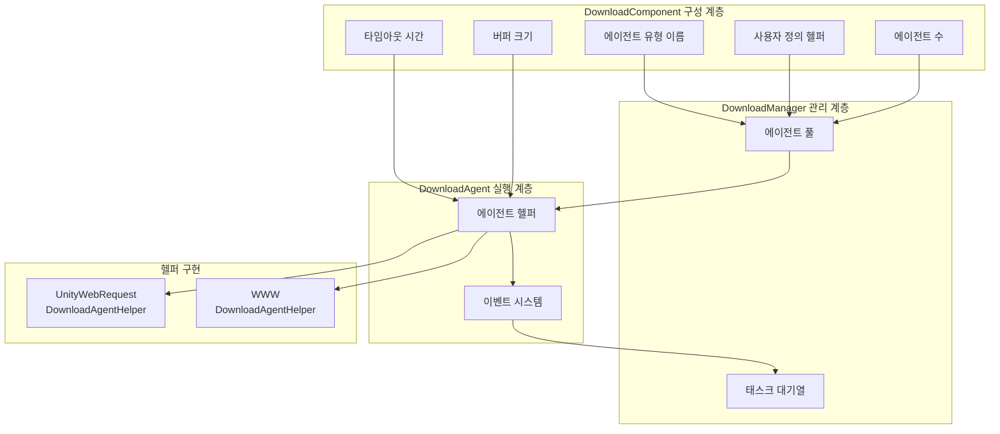

# 다운로드 에이전트 구성

다운로드 에이전트 구성은 에이전트 유형 선택, 동시 수,超时(타임아웃) 설정 등 다운로드 시스템의 핵심 동작을 설정하는 데 사용됩니다.

## 개요

다운로드 에이전트(Download Agent)는 다운로드 시스템의 핵심 실행 유닛으로, 실제 네트워크 요청 및 데이터 기록 작업을 담당합니다. 각 다운로드 에이전트는 다운로드 에이전트 헬퍼(DownloadAgentHelper)를 통해 구체적인 다운로드 기능을 구현합니다. 시스템은 병렬로 작동하는 여러 다운로드 에이전트 구성을 지원하여 멀티파일 다운로드 효율을 향상시킵니다.

다운로드 에이전트 구성은 주로 `DownloadComponent` 컴포넌트를 통해 Unity 편집기에서 설정하며, 코드를 통해 동적으로 조정할 수도 있습니다.

## 구성항목 상세

### 에이전트 헬퍼 유형 구성

에이전트 헬퍼 유형은 실제 다운로드 작업을 실행하는 구체적인 구현 클래스를 결정합니다.

| 구성항목 | 유형 | 기본값 | 설명 |
|--------|------|--------|------|
| 헬퍼 유형 이름 | string | "GameFrameX.Download.Runtime.UnityWebRequestDownloadAgentHelper" | 헬퍼 클래스의 완전한 유형명 |
| 사용자 정의 헬퍼 인스턴스 | DownloadAgentHelperBase | null | 직접 참조하는 사용자 정의 헬퍼 객체 |

```csharp
// DownloadComponent.cs의 구성 정의
[SerializeField] private string m_DownloadAgentHelperTypeName = "GameFrameX.Download.Runtime.UnityWebRequestDownloadAgentHelper";

[SerializeField] private DownloadAgentHelperBase m_CustomDownloadAgentHelper = null;
```
> Source: [DownloadComponent.cs](https://github.com/GameFrameX/com.gameframex.unity.download/blob/main/Runtime/Download/DownloadComponent.cs#L33-L35)

**사용 설명:**
- 유형 이름으로 생성: 시스템이 문자열 유형 이름에 따라 리플렉션으로 헬퍼 인스턴스를 생성합니다
- 사용자 정의 인스턴스 직접 참조: 사용자 정의 헬퍼를 사전에 생성하여 `m_CustomDownloadAgentHelper`에 할당할 수 있습니다

### 에이전트 수 구성

```csharp
// 기본적으로 3개의 병렬 다운로드 에이전트 생성
[SerializeField] private int m_DownloadAgentHelperCount = 3;
```
> Source: [DownloadComponent.cs](https://github.com/GameFrameX/com.gameframex.unity.download/blob/main/Runtime/Download/DownloadComponent.cs#L37)

```csharp
// 시작 시 모든 다운로드 에이전트 생성
for (int i = 0; i < m_DownloadAgentHelperCount; i++)
{
    AddDownloadAgentHelper(i);
}
```
> Source: [DownloadComponent.cs](https://github.com/GameFrameX/com.gameframex.unity.download/blob/main/Runtime/Download/DownloadComponent.cs#L178-L181)

| 구성항목 | 유형 | 기본값 |取值 범위 | 설명 |
|--------|------|--------|----------|------|
| 에이전트 수 | int | 3 | 1-16 | 동시에 작동하는 다운로드 에이전트 수 |

**성능 제안:**
- 수가 많을수록 병렬 다운로드 능력이 강해지지만, 네트워크 대역폭 소비가 커집니다
- 실제 네트워크 조건 및 서버 제한에 따라 설정하는 것이 좋습니다
- 모바일 쪽은 2-4개, PC 쪽은 4-8개로 설정하는 것을 권장합니다

###超时(타임아웃) 구성

```csharp
// 다운로드 타임아웃 시간 (초)
[SerializeField] private float m_Timeout = 30f;
```
> Source: [DownloadComponent.cs](https://github.com/GameFrameX/com.gameframex.unity.download/blob/main/Runtime/Download/DownloadComponent.cs#L39)

| 구성항목 | 유형 | 기본값 |取值 범위 | 설명 |
|--------|------|--------|----------|------|
|超时时间(타임아웃 시간) | float | 30초 | 0-120초 | 단일 다운로드 요청의 최대 대기 시간 |

**超时 판단 로직:**
```csharp
// DownloadAgent.cs의超时 판단
m_WaitTime += realElapseSeconds;
if (m_WaitTime >= m_Task.Timeout)
{
    // 타임아웃 오류 트리거
    DownloadAgentHelperErrorEventArgs.Create(false, "Timeout");
}
```
> Source: [DownloadManager.DownloadAgent.cs](https://github.com/GameFrameX/com.gameframex.unity.download/blob/main/Runtime/Download/Download/DownloadManager.DownloadAgent.cs#L127-L138)

### 버퍼 구성

```csharp
// 버퍼 크기 (바이트), 기본값 1MB
private const int OneMegaBytes = 1024 * 1024;
[SerializeField] private int m_FlushSize = OneMegaBytes;
```
> Source: [DownloadComponent.cs](https://github.com/GameFrameX/com.gameframex.unity.download/blob/main/Runtime/Download/DownloadComponent.cs#L25-L41)

| 구성항목 | 유형 | 기본값 | 설명 |
|--------|------|--------|------|
| 버퍼 크기 | int | 1048576 (1MB) | 디스크 기록을 트리거하는 버퍼 임계값 |

**断点续传(중단점 재개) 원리:**
```csharp
// 데이터 기록 시 버퍼를 누적하고, 임계값에 도달하면 디스크에 새로고침
m_FileStream.Write(e.GetBytes(), e.Offset, e.Length);
m_WaitFlushSize += e.Length;
if (m_WaitFlushSize >= m_Task.FlushSize)
{
    m_FileStream.Flush();  // 디스크에 새로고침
    m_WaitFlushSize = 0;
}
```
> Source: [DownloadManager.DownloadAgent.cs](https://github.com/GameFrameX/com.gameframex.unity.download/blob/main/Runtime/Download/Download/DownloadManager.DownloadAgent.cs#L270-L291)

## 내장 에이전트 헬퍼

### UnityWebRequestDownloadAgentHelper

시스템의 기본 다운로드 에이전트 헬퍼로, Unity의 `UnityWebRequest`를 기반으로 구현됩니다.

**특성:**
-断点续传(중단점 재개) 지원 (Range 요청)
- HTTPS/SSL 지원
- 자동 인증서 처리 (기본값: 모든 인증서 수락)
- Unity 2017.2+ 호환

**주요 구현:**
```csharp
public partial class UnityWebRequestDownloadAgentHelper : DownloadAgentHelperBase, IDisposable
{
    // 3가지 다운로드 모드 지원:
    // 1. 전체 다운로드
    public override void Download(string downloadUri, object userData);

    // 2. 지정 위치에서断点续传(중단점 재개) 시작
    public override void Download(string downloadUri, long fromPosition, object userData);

    // 3. 지정 범위 다운로드
    public override void Download(string downloadUri, long fromPosition, long toPosition, object userData);
}
```
> Source: [UnityWebRequestDownloadAgentHelper.cs](https://github.com/GameFrameX/com.gameframex.unity.download/blob/main/Runtime/Download/UnityWebRequestDownloadAgentHelper.cs#L26-L147)

**인증서 처리:**
```csharp
// 기본적으로 모든 SSL 인증서 수락 (개발 환경 사용)
public sealed class DownloadCertificateHandler : CertificateHandler
{
    protected override bool ValidateCertificate(byte[] certificateData)
    {
        return true; // 모든 인증서 수락
    }
}
```
> Source: [UnityWebRequestDownloadAgentHelper.cs](https://github.com/GameFrameX/com.gameframex.unity.download/blob/main/Runtime/Download/UnityWebRequestDownloadAgentHelper.cs#L14-L21)

### WWWDownloadAgentHelper

기존 다운로드 헬퍼로, `WWW` 클래스를 기반으로 구현되며 Unity 2018.3 이전 버전에서만 사용 가능합니다.

```csharp
#if !UNITY_2018_3_OR_NEWER
public class WWWDownloadAgentHelper : DownloadAgentHelperBase, IDisposable
{
    // UnityWebRequestDownloadAgentHelper와 동일한 인터페이스
}
#endif
```
> Source: [WWWDownloadAgentHelper.cs](https://github.com/GameFrameX/com.gameframex.unity.download/blob/main/Runtime/Download/WWWDownloadAgentHelper.cs#L8-L22)

**주의:** `UnityWebRequestDownloadAgentHelper` 사용을 권장하며, `WWW` 클래스는 Unity 2018.3에서 폐기되었습니다.

## 아키텍처 다이어그램



## 에이전트 헬퍼 인터페이스

모든 다운로드 에이전트 헬퍼는 `IDownloadAgentHelper` 인터페이스를 구현해야 합니다:

```csharp
public interface IDownloadAgentHelper
{
    /// 다운로드 에이전트 헬퍼 데이터 스트림 업데이트 이벤트
    event EventHandler<DownloadAgentHelperUpdateBytesEventArgs> DownloadAgentHelperUpdateBytes;

    /// 다운로드 에이전트 헬퍼 데이터 크기 업데이트 이벤트
    event EventHandler<DownloadAgentHelperUpdateLengthEventArgs> DownloadAgentHelperUpdateLength;

    /// 다운로드 에이전트 헬퍼 완료 이벤트
    event EventHandler<DownloadAgentHelperCompleteEventArgs> DownloadAgentHelperComplete;

    /// 다운로드 에이전트 헬퍼 오류 이벤트
    event EventHandler<DownloadAgentHelperErrorEventArgs> DownloadAgentHelperError;

    /// 다운로드 에이전트 헬퍼를 통해 지정된 주소의 데이터 다운로드
    void Download(string downloadUri, object userData);
    void Download(string downloadUri, long fromPosition, object userData);
    void Download(string downloadUri, long fromPosition, long toPosition, object userData);

    /// 다운로드 에이전트 헬퍼 재설정
    void Reset();
}
```
> Source: [IDownloadAgentHelper.cs](https://github.com/GameFrameX/com.gameframex.unity.download/blob/main/Runtime/Download/Download/IDownloadAgentHelper.cs#L15-L65)

## 사용자 정의 에이전트 헬퍼

`DownloadAgentHelperBase`를 상속하여 사용자 정의 다운로드 에이전트 헬퍼를 생성할 수 있습니다:

```csharp
public abstract class DownloadAgentHelperBase : MonoBehaviour, IDownloadAgentHelper
{
    /// 범위 부적합 오류 코드
    protected const int RangeNotSatisfiableErrorCode = 416;

    /// 반드시 구현해야 하는 4가지 이벤트
    public abstract event EventHandler<DownloadAgentHelperUpdateBytesEventArgs> DownloadAgentHelperUpdateBytes;
    public abstract event EventHandler<DownloadAgentHelperUpdateLengthEventArgs> DownloadAgentHelperUpdateLength;
    public abstract event EventHandler<DownloadAgentHelperCompleteEventArgs> DownloadAgentHelperComplete;
    public abstract event EventHandler<DownloadAgentHelperErrorEventArgs> DownloadAgentHelperError;

    /// 반드시 구현해야 하는 3가지 다운로드 메서드 (断点续传(중단점 재개) 지원)
    public abstract void Download(string downloadUri, object userData);
    public abstract void Download(string downloadUri, long fromPosition, object userData);
    public abstract void Download(string downloadUri, long fromPosition, long toPosition, object userData);

    /// 헬퍼 상태 재설정
    public abstract void Reset();
}
```
> Source: [DownloadAgentHelperBase.cs](https://github.com/GameFrameX/com.gameframex.unity.download/blob/main/Runtime/Download/DownloadAgentHelperBase.cs#L17-L72)

## 편집기 구성

Unity 편집기에서 `DownloadComponent` 컴포넌트의 패널을 통해 시각적 구성을 수행할 수 있습니다:

```csharp
// Inspector의 구성항목
EditorGUILayout.PropertyField(m_InstanceRoot);  // 인스턴스 루트 노드
m_DownloadAgentHelperInfo.Draw();               // 에이전트 헬퍼 유형 선택
m_DownloadAgentHelperCount.intValue = EditorGUILayout.IntSlider("Download Agent Helper Count", ...); // 에이전트 수
EditorGUILayout.Slider("Timeout", ...);        // 타임아웃 시간
EditorGUILayout.DelayedIntField("Flush Size", ...); // 버퍼 크기
```
> Source: [DownloadComponentInspector.cs](https://github.com/GameFrameX/com.gameframex.unity.download/blob/main/Editor/Inspector/DownloadComponentInspector.cs#L38-L69)

## 이벤트 시스템

다운로드 에이전트 헬퍼는 이벤트를 통해 상위 계층에 다운로드 상태를 보고합니다:

| 이벤트 | 매개변수 유형 | 트리거 시점 |
|------|----------|----------|
| DownloadAgentHelperUpdateBytes | DownloadAgentHelperUpdateBytesEventArgs | 다운로드 데이터를 수신할 때 |
| DownloadAgentHelperUpdateLength | DownloadAgentHelperUpdateLengthEventArgs | 데이터 크기가 업데이트될 때 |
| DownloadAgentHelperComplete | DownloadAgentHelperCompleteEventArgs | 다운로드 완료 시 |
| DownloadAgentHelperError | DownloadAgentHelperErrorEventArgs | 다운로드 오류 시 |

이러한 이벤트는 `DownloadAgent`에 의해 수신 및 처리되어 최종적으로 더 상위의 다운로드 이벤트를 트리거합니다.

## 관련 링크

- [편집기 구성](./7-configuration.editor-configuration) - 편집기 관련 구성 설명
- [핵심 개념 - 다운로드 에이전트](./4-core-concepts.download-agent) - 다운로드 에이전트 핵심 개념 상세
- [API 참조 - 속성](./5-api-reference.properties) - DownloadComponent 속성API
- [API 참조 - 메서드](./5-api-reference.methods) - DownloadComponent 메서드API
- [다운로드 이벤트](./6-events.download-events) - 다운로드 관련 이벤트 설명
- [에이전트 이벤트](./6-events.agent-events) - 에이전트 관련 이벤트 설명
