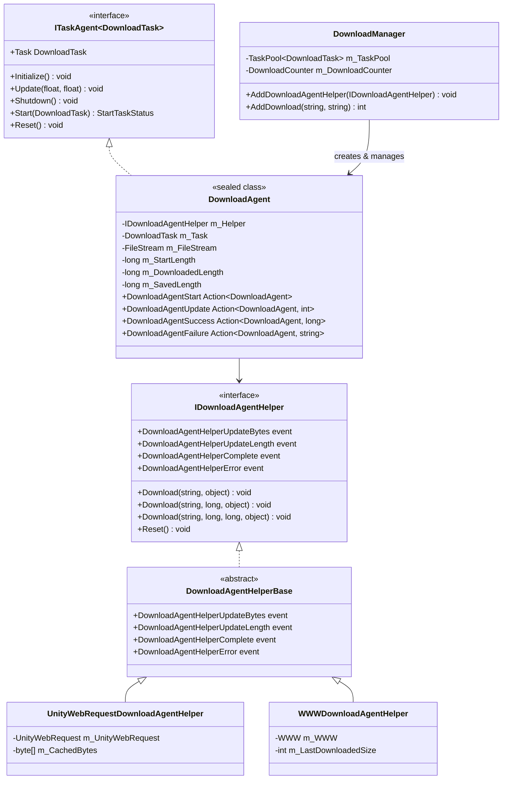
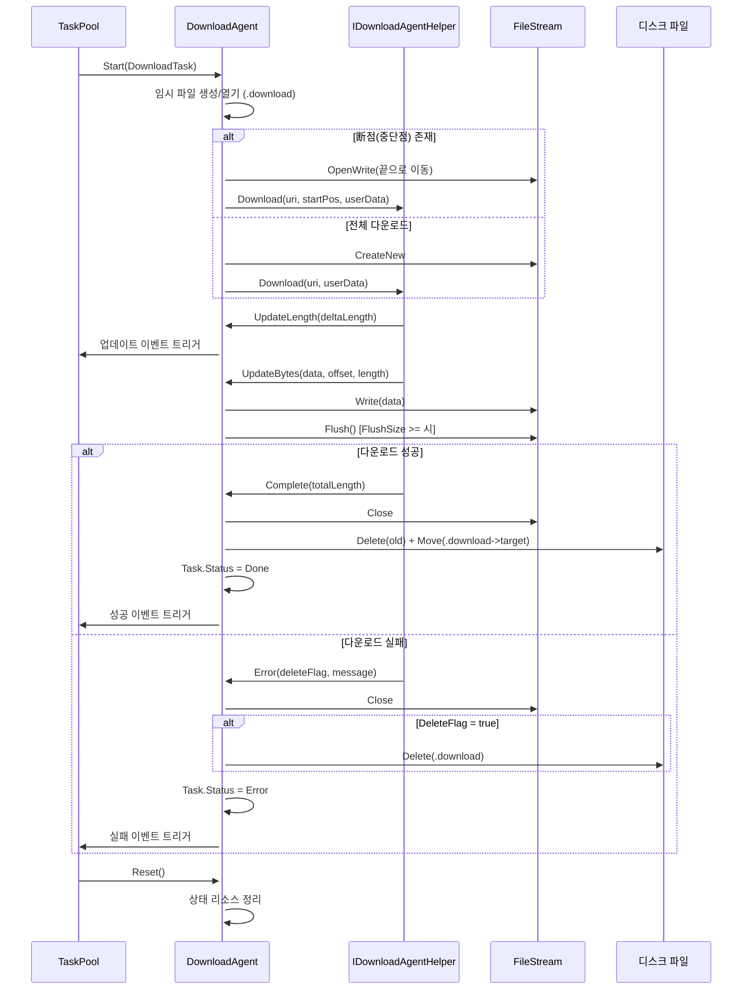

# 다운로드 에이전트

다운로드 에이전트(Download Agent)는 GameFrameX 다운로드 시스템의 핵심 실행 유닛으로, 실제 다운로드 태스크 실행을 담당합니다. 각 다운로드 에이전트 인스턴스는 다운로드 에이전트 헬퍼(Download Agent Helper)와 상호 작용하여 네트워크 요청 및 데이터 저장을 완료합니다.

## 개요

다운로드 에이전트는 `DownloadManager` 내부의 태스크 실행기로, `ITaskAgent<DownloadTask>` 인터페이스를 구현합니다. 단일 다운로드 태스크의 완전한 생명 주기를 관리하며, 다음을 포함합니다:

- **태스크 시작**: 파일 스트림 초기화,断点续传(중단점 재개) 확인, 다운로드 시작
- **진행률 모니터링**: 다운로드 진행률 실시간 추적,超时(타임아웃) 처리, 다운로드 속도 계산
- **데이터 기록**: 다운로드 데이터 블록을 임시 파일에 기록 (.download 접미사)
- **태스크 완료**: 임시 파일의 이름을 목표 파일로 변경
- **오류 처리**: 네트워크 오류,超时 오류, IO 오류 처리

다운로드 에이전트는 전략 패턴을 채택하여 설계되었으며, 다양한 다운로드 에이전트 헬퍼(`IDownloadAgentHelper`)를 서로 다른 의존성 주입을 통해 지원합니다. 프레임워크는 두 가지 내장 구현을 제공합니다:
- `UnityWebRequestDownloadAgentHelper`: Unity의 `UnityWebRequest` API 기반 (권장, Unity 2017.2+ 호환)
- `WWWDownloadAgentHelper`: 기존 `WWW` 클래스 기반 (Unity 2018.3 이하 버전만 지원)

## 아키텍처

다운로드 에이전트 시스템은分层 아키텍처 설계(계층화 아키텍처 설계)를 채택하며, 핵심 컴포넌트는 다음과 같습니다:



**아키텍처 설계 포인트:**

1. **태스크 에이전트 패턴**: `DownloadAgent`가 `ITaskAgent<DownloadTask>` 인터페이스를 구현하여 `TaskPool` 태스크 풀 시스템에 통합되어 태스크의 통일된 스케줄링 및 관리를 실현합니다.

2. **의존성 주입**: `DownloadAgent`가 생성자를 통해 `IDownloadAgentHelper` 인스턴스를 수신하여底层 다운로드 구현을 추상화하여 확장 및 테스트가 용이합니다.

3. **이벤트驱动**: `DownloadAgent`가 `IDownloadAgentHelper`의 이벤트를 구독하여 다운로드 진행률 및 상태 변경을 감지하고 구체적인 다운로드 구현과 분리된 상태를 유지합니다.

4. **생명 주기 관리**: `DownloadAgent`가 `IDisposable` 인터페이스를 구현하여 리소스(특히 파일 스트림 및 네트워크 요청)가 올바르게 해제되도록 보장합니다.

## 핵심 흐름

다운로드 에이전트가 단일 다운로드 태스크를 처리하는 완전한 흐름은 다음과 같습니다:



**주요 설계 결정:**

1. **임시 파일 메커니즘**: 다운로드 데이터가 먼저 `.download` 접미사가 붙은 임시 파일에 기록되며, 완료后才(후에야) 목표 파일로 이름이 변경됩니다. 이를 통해 다음을 보장합니다:
   - 다운로드 중단 시 기존 목표 파일이 손상되지 않음
   -断点续传(중단점 재개) 지원 (임시 파일 크기 확인을 통해)

2. **버퍼 기록**: `DownloadAgent`가 내부 버퍼를 유지하며 `FlushSize`(기본값 1MB)에 도달时才(때만) 물리적 기록을 실행하여 IO 작업 횟수를 줄입니다.

3. **超时 감지**: 데이터를 수신하거나 진행률이 업데이트될 때마다 대기 타이머를 재설정하며, `Timeout`(기본값 30초) 내에 데이터가 수신되지 않으면超时 오류로 판단합니다.

## 핵심 속성

`DownloadAgent`는 외부 Query를 위해 다음 공개 속성을 제공합니다:

| 속성 | 유형 | 설명 |
|------|------|------|
| `Task` | `DownloadTask` | 현재 처리 중인 다운로드 태스크 |
| `WaitTime` | `float` | 마지막으로 데이터를 수신한 이후 경과 시간 (초) |
| `StartLength` | `long` | 다운로드 시작 시 파일이 이미 존재하는 크기 (断点续传(중단점 재개)용) |
| `DownloadedLength` | `long` | 이번 다운로드로 수신된 데이터 크기 |
| `CurrentLength` | `long` | 현재 총 크기 (StartLength + DownloadedLength) |
| `SavedLength` | `long` | 디스크에 이미 저장된 데이터 크기 |

```csharp
// 사용 예제: 다운로드 진행률 Query
DownloadAgent agent = /* 이벤트 또는 풀에서 가져오기 */;
long totalSize = agent.CurrentLength;
long downloaded = agent.DownloadedLength;
float progress = (float)downloaded / totalSize * 100f;
Debug.Log($"다운로드 진행률: {progress:F1}% ({downloaded}/{totalSize} bytes)");
```

## 이벤트 시스템

다운로드 에이전트는 다음 콜백 이벤트를 통해 외부와 통신합니다:

```csharp
// 다운로드 시작 이벤트
public Action<DownloadAgent> DownloadAgentStart;

// 다운로드 진행률 업데이트 이벤트 (새 데이터 블록을 수신할 때마다)
public Action<DownloadAgent, int> DownloadAgentUpdate;

// 다운로드 성공 완료 이벤트
public Action<DownloadAgent, long> DownloadAgentSuccess;

// 다운로드 실패 이벤트
public Action<DownloadAgent, string> DownloadAgentFailure;
```

이러한 이벤트는 `DownloadManager.AddDownloadAgentHelper()` 시점에 관리자의 이벤트 시스템에 바인딩되어 통일된 이벤트 흐름을 형성합니다.

## 다운로드 에이전트 헬퍼

### IDownloadAgentHelper 인터페이스

`IDownloadAgentHelper`는 다운로드 에이전트 헬퍼의 핵심 계약을 정의합니다:

> Source: [IDownloadAgentHelper.cs](https://github.com/GameFrameX/com.gameframex.unity.download/blob/main/Runtime/Download/Download/IDownloadAgentHelper.cs#L15-L65)

```csharp
public interface IDownloadAgentHelper
{
    // 이벤트: 다운로드 데이터 스트림 업데이트
    event EventHandler<DownloadAgentHelperUpdateBytesEventArgs> DownloadAgentHelperUpdateBytes;

    // 이벤트: 다운로드 길이 업데이트 (증량)
    event EventHandler<DownloadAgentHelperUpdateLengthEventArgs> DownloadAgentHelperUpdateLength;

    // 이벤트: 다운로드 완료
    event EventHandler<DownloadAgentHelperCompleteEventArgs> DownloadAgentHelperComplete;

    // 이벤트: 다운로드 오류
    event EventHandler<DownloadAgentHelperErrorEventArgs> DownloadAgentHelperError;

    // 메서드: 처음부터 다운로드
    void Download(string downloadUri, object userData);

    // 메서드: 지정 위치에서 계속 다운로드 (断点续传(중단점 재개))
    void Download(string downloadUri, long fromPosition, object userData);

    // 메서드: 지정 범위의 데이터 다운로드
    void Download(string downloadUri, long fromPosition, long toPosition, object userData);

    // 메서드: 헬퍼 상태 재설정
    void Reset();
}
```

### UnityWebRequestDownloadAgentHelper

UnityWebRequest 기반 구현으로, 최신 Unity 버전(2017.2+)을 지원합니다:

> Source: [UnityWebRequestDownloadAgentHelper.cs](https://github.com/GameFrameX/com.gameframex.unity.download/blob/main/Runtime/Download/UnityWebRequestDownloadAgentHelper.cs#L26-L229)

**특성:**
- `DownloadHandlerScript` 하위 클래스를 사용하여增量 데이터 콜백 구현
- 내장 SSL 인증서 검증 핸들러 (기본값: 모든 인증서 수락)
- HTTP Range 헤더를 지원하여断点续传(중단점 재개) 구현
- Unity 2017.2부터 최신 버전까지 호환

**사용 방식:**

```csharp
// UnityWebRequest 헬퍼 인스턴스 생성
var helper = gameObject.AddComponent<UnityWebRequestDownloadAgentHelper>();

// 다운로드 관리자에 추가
var downloadManager = GameEntry.GetComponent<DownloadManager>();
downloadManager.AddDownloadAgentHelper(helper);
```

### WWWDownloadAgentHelper

기존 WWW 기반 구현으로, Unity 2018.3 이하 버전만 적용 가능합니다 (사용 중단으로 표시됨):

> Source: [WWWDownloadAgentHelper.cs](https://github.com/GameFrameX/com.gameframex.unity.download/blob/main/Runtime/Download/WWWDownloadAgentHelper.cs#L21-L244)

**주의:** 이 구현은 `#if !UNITY_2018_3_OR_NEWER` 조건부 컴파일에 의해 보호되며, Unity 2018.3 이상 버전에서는 사용할 수 없습니다.

## 사용자 정의 다운로드 에이전트 헬퍼

개발자는 `DownloadAgentHelperBase`를 상속하여 사용자 정의 다운로드 로직을 구현할 수 있습니다:

```csharp
using UnityEngine;
using GameFrameX.Download.Runtime;

public class CustomDownloadAgentHelper : DownloadAgentHelperBase
{
    // 상속된 이벤트 및 추상 메서드 구현...

    public override void Download(string downloadUri, object userData)
    {
        // 사용자 정의 다운로드 로직 구현
        // 중요: 적절한 시점에 이벤트 트리거
    }

    public override void Reset()
    {
        // 리소스 정리
    }
}
```

## 이벤트 매개변수

### DownloadAgentHelperUpdateBytesEventArgs

다운로드 데이터 스트림 업데이트 이벤트 매개변수:

> Source: [DownloadAgentHelperUpdateBytesEventArgs.cs](https://github.com/GameFrameX/com.gameframex.unity.download/blob/main/Runtime/EventArgs/DownloadAgentHelperUpdateBytesEventArgs.cs#L16-L62)

| 속성 | 유형 | 설명 |
|------|------|------|
| `Bytes` | `byte[]` | 다운로드된 데이터 블록 |
| `Offset` | `int` | 데이터 시작偏移(오프셋) |
| `Length` | `int` | 데이터 길이 |

### DownloadAgentHelperUpdateLengthEventArgs

다운로드增量 크기 이벤트 매개변수:

> Source: [DownloadAgentHelperUpdateLengthEventArgs.cs](https://github.com/GameFrameX/com.gameframex.unity.download/blob/main/Runtime/EventArgs/DownloadAgentHelperUpdateLengthEventArgs.cs#L16-L47)

| 속성 | 유형 | 설명 |
|------|------|------|
| `DeltaLength` | `int` | 이번에 새로 추가된 다운로드 데이터 크기 |

### DownloadAgentHelperCompleteEventArgs

다운로드 완료 이벤트 매개변수:

> Source: [DownloadAgentHelperCompleteEventArgs.cs](https://github.com/GameFrameX/com.gameframex.unity.download/blob/main/Runtime/EventArgs/DownloadAgentHelperCompleteEventArgs.cs#L16-L62)

| 속성 | 유형 | 설명 |
|------|------|------|
| `Length` | `long` | 다운로드된 총 데이터 크기 |

### DownloadAgentHelperErrorEventArgs

다운로드 오류 이벤트 매개변수:

> Source: [DownloadAgentHelperErrorEventArgs.cs](https://github.com/GameFrameX/com.gameframex.unity.download/blob/main/Runtime/EventArgs/DownloadAgentHelperErrorEventArgs.cs#L16-L66)

| 속성 | 유형 | 설명 |
|------|------|------|
| `DeleteDownloading` | `bool` | 다운로드 중인 임시 파일을 삭제해야 하는지 여부 |
| `ErrorMessage` | `string` | 오류 설명 정보 |

## 자주 묻는 질문

###断点续传(중단점 재개)이 작동하지 않음

**증상**: 게임을 다시 시작한 후 다운로드 태스크가 이전 중단 위치에서 계속하는 대신 처음부터 시작됩니다.

**가능한 원인**:
1. 서버가 HTTP Range 헤더를 지원하지 않음
2. 임시 파일(.download)이 실수로 삭제됨
3. 다운로드 경로가 일치하지 않음

**조사 방법:**
```csharp
// 다운로드 에이전트의 StartLength 속성 확인
DownloadAgent agent = /* 에이전트 가져오기 */;
Debug.Log($"StartLength: {agent.StartLength}");
// 0이면断점(중단점)이 감지되지 않았음을 의미
```

### 다운로드超时(타임아웃)

**증상**: 다운로드가 장시간 응답이 없으며 결국 "Timeout" 오류가 발생합니다.

**솔루션:**
```csharp
// 다운로드 타임아웃 설정 조정
var downloadManager = GameEntry.GetComponent<DownloadManager>();
downloadManager.Timeout = 120f; // 120초로 조정
```

### 메모리 사용량 과다

**증상**: 대용량 파일 다운로드 시 메모리 사용량이 급증합니다.

**원인 분석**:
`UnityWebRequestDownloadAgentHelper`는 4KB의 고정 버퍼를 사용하며, 다운로드 속도가 매우 빠르고 제때 처리되지 않으면 데이터가积압(축적)될 수 있습니다.

**최적화 제안:**
- `FlushSize`를 줄여 디스크 기록 빈도를 늘립니다
- `WorkingAgentCount`를 모니터링하여 동시 다운로드 수를 제한합니다

## 관련 링크

- [다운로드 컴포넌트](./4-core-concepts.download-component) - 다운로드 컴포넌트 사용
- [아키텍처 개요](./4-core-concepts.architecture) - 전체 시스템 아키텍처
- [다운로드 이벤트](./6-events.download-events) - 다운로드 관련 이벤트 상세
- [에이전트 이벤트](./6-events.agent-events) - 에이전트 관련 이벤트 상세
- [API 참조](./5-api-reference.properties) - 속성 및 메서드의 완전한 정의
