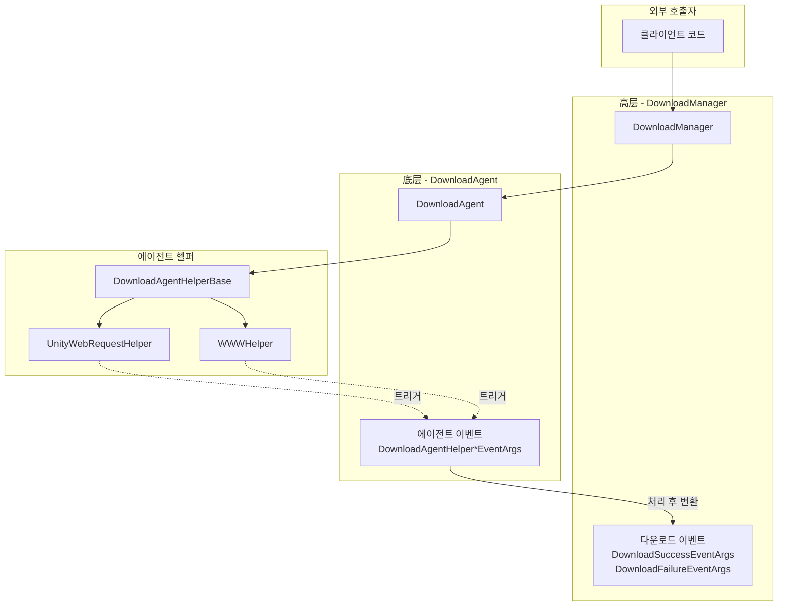
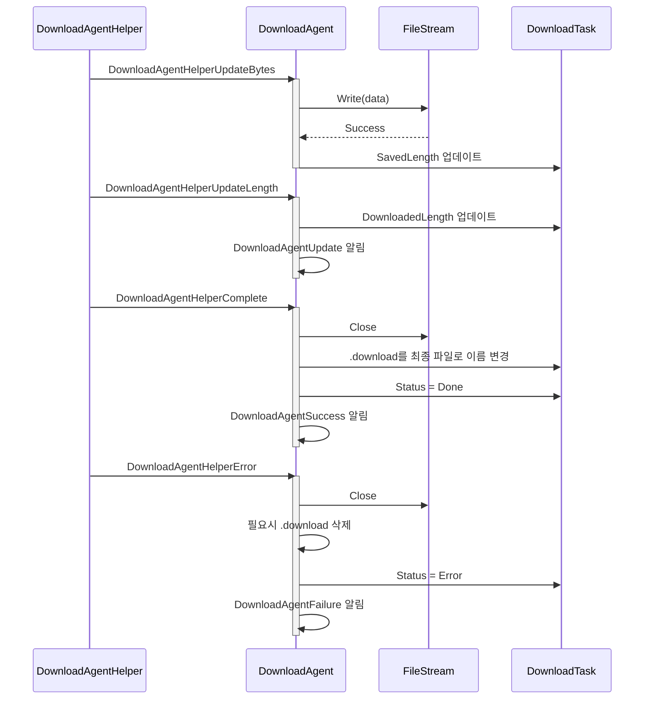
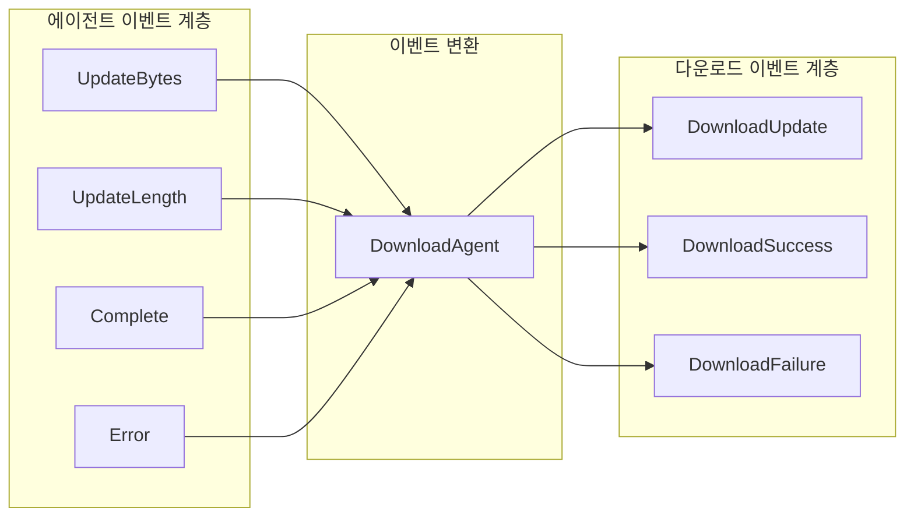

# 에이전트 이벤트

에이전트 이벤트는 다운로드 에이전트 헬퍼(Download Agent Helper)가 다운로드 작업을 실행할 때 트리거되는底层(저수준) 이벤트입니다. 이러한 이벤트는 다운로드 과정의 각 단계에 대한 세밀한 제어를 제공하여 개발자가 다운로드 데이터 흐름 상태를 모니터링하고 처리할 수 있게 합니다.

## 개요

에이전트 이벤트는 다운로드 시스템의 **底层 이벤트**로, DownloadManager에서 발생하는高层 다운로드 이벤트(다운로드 성공, 다운로드 실패 등)와 다릅니다. 에이전트 이벤트는 다운로드 에이전트 헬퍼 수준에서 직접 작동하여 다운로드 데이터 흐름에 대한 정밀한 제어 능력을 제공합니다.

**에이전트 이벤트와 다운로드 이벤트의 차이:**

| 특성 | 에이전트 이벤트 | 다운로드 이벤트 |
|------|----------|----------|
| 트리거 계층 | 다운로드 에이전트 헬퍼 계층 (底层) | DownloadManager 계층 (高层) |
| 이벤트粒도(granularity) | 세밀 (바이트 스트림, 진행률 업데이트) |粗(거칠) (태스크 완료/실패) |
| 사용 시나리오 | 다운로드 데이터를 처리해야 하는 시나리오 | 태스크 전체 상태를感知(감지)해야 하는 시나리오 |

**4가지 에이전트 이벤트:**
1. `DownloadAgentHelperUpdateBytesEventArgs` - 다운로드 데이터 스트림 업데이트 이벤트
2. `DownloadAgentHelperUpdateLengthEventArgs` - 다운로드 데이터 크기 업데이트 이벤트
3. `DownloadAgentHelperCompleteEventArgs` - 다운로드 완료 이벤트
4. `DownloadAgentHelperErrorEventArgs` - 다운로드 오류 이벤트

## 이벤트 체계 아키텍처



### 이벤트 흐름 설명

1. **클라이언트**가 `DownloadManager`를 통해 다운로드 태스크를 추가합니다
2. **DownloadManager**가 태스크를 **DownloadAgent**에 할당하여 처리합니다
3. **DownloadAgent**가 **DownloadAgentHelper**를 호출하여 실제 다운로드를 실행합니다
4. **DownloadAgentHelper**(예: UnityWebRequestHelper)가 다운로드 과정에서 **에이전트 이벤트**를 트리거합니다
5. **DownloadAgent**가 이러한 이벤트를 수신 및 처리하여 태스크 상태를 업데이트합니다
6. 태스크 완료 후 **DownloadManager**가高层 **다운로드 이벤트**를 발생시킵니다

## 핵심 이벤트 상세

### DownloadAgentHelperUpdateBytesEventArgs

다운로드 데이터 스트림 업데이트 이벤트로, 다운로드 과정에서 새로운 데이터 블록이 도착할 때 트리거됩니다.

**사용 시나리오:**
- 다운로드 데이터 스트림 실시간 처리
- 다운로드 데이터 암호화/복호화 처리
- 다운로드 중 저장소에 기록

### DownloadAgentHelperUpdateLengthEventArgs

다운로드 데이터 크기 업데이트 이벤트로, 다운로드 데이터의增量(증가분) 변화를 보고합니다.

**사용 시나리오:**
- 다운로드 진행률 실시간 업데이트
- 다운로드 속도 계산
- 다운로드 백분율 표시

### DownloadAgentHelperCompleteEventArgs

다운로드 완료 이벤트로, 다운로드 에이전트 헬퍼가 다운로드를 완료할 때 트리거됩니다.

**사용 시나리오:**
- 다운로드 완료 후 데이터 검증
- 후속 처리 흐름 트리거

### DownloadAgentHelperErrorEventArgs

다운로드 오류 이벤트로, 다운로드 과정에서 오류가 발생할 때 트리거됩니다.

**사용 시나리오:**
- 오류 로그 기록
- 재시도 메커니즘 트리거
- 불완전한 다운로드 파일 정리

## 이벤트 구독 및 처리

### DownloadAgent에서 에이전트 이벤트 처리

```csharp
// Source: Runtime/Download/Download/DownloadManager.DownloadAgent.cs#L114-L120
/// <summary>
/// 다운로드 에이전트를 초기화합니다.
/// </summary>
public void Initialize()
{
    m_Helper.DownloadAgentHelperUpdateBytes += OnDownloadAgentHelperUpdateBytes;
    m_Helper.DownloadAgentHelperUpdateLength += OnDownloadAgentHelperUpdateLength;
    m_Helper.DownloadAgentHelperComplete += OnDownloadAgentHelperComplete;
    m_Helper.DownloadAgentHelperError += OnDownloadAgentHelperError;
}
```

### 이벤트 처리 흐름



## 에이전트 이벤트와 다운로드 이벤트의 관계



에이전트 이벤트는 DownloadAgent에서 처리된 후高层 다운로드 이벤트로 변환됩니다:

| 에이전트 이벤트 | 변환 결과 |
|----------|----------|
| UpdateBytes | 파일에 기록, SavedLength 업데이트 |
| UpdateLength | DownloadAgentUpdate 콜백 트리거 |
| Complete | DownloadAgentSuccess → DownloadSuccessEventArgs |
| Error | DownloadAgentFailure → DownloadFailureEventArgs |

## 이벤트 매개변수 참조

### DownloadAgentHelperUpdateBytesEventArgs

| 속성 | 유형 | 설명 |
|------|------|------|
| Offset | int | 데이터 스트림의偏移量(오프셋) |
| Length | int | 데이터 스트림의 길이 |
| GetBytes() | byte[] | 완전한 바이트 배열 가져오기 |

### DownloadAgentHelperUpdateLengthEventArgs

| 속성 | 유형 | 설명 |
|------|------|------|
| DeltaLength | int | 이번 다운로드의增量 데이터 크기 |

### DownloadAgentHelperCompleteEventArgs

| 속성 | 유형 | 설명 |
|------|------|------|
| Length | long | 다운로드된 총 데이터 크기 |

### DownloadAgentHelperErrorEventArgs

| 속성 | 유형 | 설명 |
|------|------|------|
| DeleteDownloading | bool | 다운로드 중인 파일을 삭제해야 하는지 여부 |
| ErrorMessage | string | 오류 정보 |

## 언제 에이전트 이벤트를 사용해야 하는가

에이전트 이벤트는 다음 시나리오에 적합합니다:

1. **다운로드 데이터 스트림 처리 필요**: 실시간 복호화, 다운로드 중 처리 등
2. **정밀한 진행률 제어 필요**: 각 데이터 블록 업데이트 가져오기
3. **사용자 정의 저장 전략 필요**: 파일 기록 방식을 완전히 제어
4. **断点续传(중단점 재개) 구현 필요**: 데이터 크기 변화 리스닝

대부분의 시나리오에서는高层 **다운로드 이벤트** 사용을 권장합니다. 이러한 이벤트는 더简洁한 API와 완전한 태스크 정보를 제공하기 때문입니다. 위 특수 기능이 필요한 경우에만 에이전트 이벤트를 사용하세요.

## 관련 링크

- [다운로드 이벤트](./6-events.download-events) -高层 다운로드 이벤트
- [다운로드 에이전트](./4-core-concepts.download-agent) - 다운로드 에이전트 개념
- [DownloadAgentHelper](./4-core-concepts.download-agent) - 에이전트 헬퍼
- [IDownloadAgentHelper](./5-api-reference.methods) - 에이전트 헬퍼 인터페이스
- [DownloadComponent](./7-configuration.download-component) - 다운로드 컴포넌트 구성
