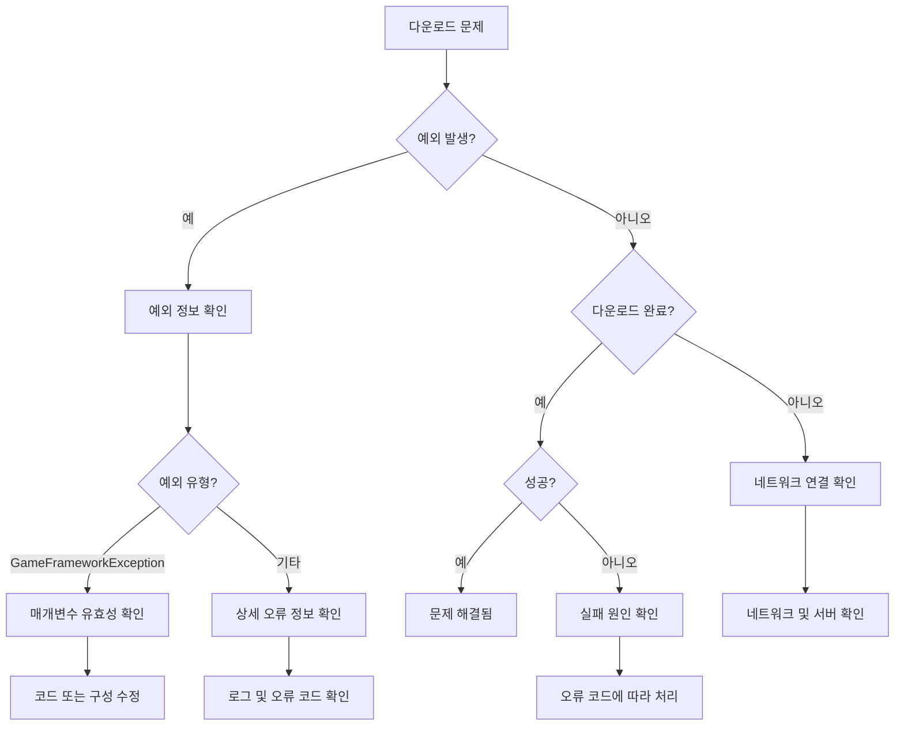

# 자주 묻는 질문

이 문서는 GameFrameX Download 다운로드 컴포넌트 사용 과정에서 발생할 수 있는 일반적인 문제와 그 해결 방법을 수집합니다.

## 개요

Download 컴포넌트는 GameFrameX 프레임워크에서 다운로드 태스크를 처리하는 핵심 컴포넌트입니다. 실제 사용 과정에서 구성 부적절, 의존성 누락 또는 네트워크 환경 등의 요인으로 인해 다양한 문제가 발생할 수 있습니다. 이 문서는 개발자가 이러한 문제를 빠르게 파악하고 해결할 수 있도록 돕는 것을 목표로 합니다.

## 초기화 문제

### 문제: 게임 시작 시 "Download manager is invalid" 메시지가 표시됨

**오류 정보:**
```
Log.Fatal("Download manager is invalid.");
```

**원인 분석:**
DownloadComponent는 IDownloadManager 모듈에 의존하지만, 해당 모듈이 GameFramework 시스템에 올바르게 등록되지 않았습니다.

**솔루션:**
1. DownloadManager 모듈이 올바르게 등록되었는지 확인합니다. 시작 시 관련 모듈 등록 코드가 호출되었는지 확인합니다.
2. GameFrameworkEntry가 IDownloadManager 인터페이스를 올바르게解析(파싱)할 수 있는지 확인합니다.

---

### 문제: 게임 시작 시 "Event component is invalid" 메시지가 표시됨

**오류 정보:**
```
Log.Fatal("Event component is invalid.");
```

**원인 분석:**
DownloadComponent는 이벤트 배포를 위해 EventComponent에 의존하지만, EventComponent가 올바르게 초기화되지 않았습니다.

**솔루션:**
1. EventComponent가 씬에 존재하는지 확인합니다.
2. EventComponent는 DownloadComponent보다 먼저 초기화되어야 합니다.
3. EventComponent에 대한 상세 정보는 [Event 컴포넌트 문서](https://github.com/GameFrameX/com.gameframex.unity.event)를 참조하세요.

---

### 문제: "Can not create download agent helper" 메시지가 표시됨

**오류 정보:**
```
Log.Error("Can not create download agent helper.");
```

**원인 분석:**
구성된 유형 이름으로 다운로드 에이전트 헬퍼 인스턴스를 생성할 수 없습니다.

**솔루션:**
1. DownloadComponent의 `DownloadAgentHelperTypeName` 필드 구성이 올바른지 확인합니다.
2. 기본값은 `UnityGameFramework.Runtime.UnityWebRequestDownloadAgentHelper`입니다.
3. 사용자 정의 다운로드 에이전트 헬퍼를 사용하는 경우, 유형 이름이 어셈블리의 완전한 한정 이름과 일치하는지 확인합니다.

---

## API 사용 문제

### 문제: AddDownload 호출 시 "Download path is invalid" 예외 발생

**오류 정보:**
```
GameFrameworkException: Download path is invalid.
```

**원인 분석:**
AddDownload 메서드에 전달된 downloadPath 매개변수가 비어 있거나 null입니다.

**솔루션:**
downloadPath 매개변수가 유효한지 확인합니다:
```csharp
// 잘못된 예제
int id = downloadComponent.AddDownload("", "http://example.com/file.zip");

// 올바른 예제
int id = downloadComponent.AddDownload(Application.persistentDataPath + "/file.zip", "http://example.com/file.zip");
```

> Source: [DownloadManager.cs](https://github.com/GameFrameX/com.gameframex.unity.download/blob/main/Runtime/Download/Download/DownloadManager.cs#L338-L341)

---

### 문제: AddDownload 호출 시 "Download uri is invalid" 예외 발생

**오류 정보:**
```
GameFrameworkException: Download uri is invalid.
```

**원인 분석:**
AddDownload 메서드에 전달된 downloadUri 매개변수가 비어 있거나 null입니다.

**솔루션:**
downloadUri 매개변수가 유효한지 확인합니다:
```csharp
// 잘못된 예제
int id = downloadComponent.AddDownload(Application.persistentDataPath + "/file.zip", "");

// 올바른 예제
int id = downloadComponent.AddDownload(Application.persistentDataPath + "/file.zip", "http://example.com/file.zip");
```

> Source: [DownloadManager.cs](https://github.com/GameFrameX/com.gameframex.unity.download/blob/main/Runtime/Download/Download/DownloadManager.cs#L343-L346)

---

### 문제: AddDownload 호출 시 "You must add download agent first" 예외 발생

**오류 정보:**
```
GameFrameworkException: You must add download agent first.
```

**원인 분석:**
다운로드 태스크를 추가하기 전에 다운로드 에이전트 헬퍼를 먼저 추가해야 합니다.

**솔루션:**
1. DownloadComponent는 Start 메서드에서 지정된 수의 에이전트 헬퍼를 자동으로 생성합니다.
2. DownloadComponent가 씬에 올바르게 추가되었는지 확인합니다.
3. `DownloadAgentHelperCount` 속성이 0보다 큰지 확인합니다 (기본값은 3).

```csharp
// DownloadComponent Inspector에서 설정
[SerializeField] private int m_DownloadAgentHelperCount = 3;
```

> Source: [DownloadManager.cs](https://github.com/GameFrameX/com.gameframex.unity.download/blob/main/Runtime/Download/Download/DownloadManager.cs#L348-L351)

---

## 네트워크 및 다운로드 문제

### 문제: 다운로드 실패, "Timeout" 메시지 표시

**오류 정보:**
```
Download failure, download serial id '0', download path '...', download uri '...', error message 'Timeout'.
```

**원인 분석:**
다운로드 요청이 지정된超时 시간 내에 완료되지 않았습니다. 기본超时 시간은 30초입니다.

**솔루션:**
1.超时时间(타임아웃 시간)을 늘립니다:
```csharp
//超时 시간(타임아웃 시간)을 120초로 설정
downloadComponent.Timeout = 120f;
```

2. 네트워크 연결이 안정적인지 확인합니다.

3. 서버 응답 시간이 정상인지 확인합니다. 브라우저나 다른 도구를 사용하여 다운로드 링크에 액세스할 수 있는지 확인합니다.

4. 대용량 파일 다운로드인 경우,超时 시간 조정 또는断点续传(중단점 재개) 구현을 고려합니다.

---

### 문제: 다운로드 시 네트워크 오류 발생

**오류 정보:**
```
error: "Network error"
```

**원인 분석:**
UnityWebRequest가 네트워크层面的 오류를 감지했으며, 가능한 원인은 다음과 같습니다:
- 네트워크 연결 중단
- DNS解析(파싱) 실패
- 연결 수립 불가

**솔루션:**
1. 장치 네트워크 연결 상태를 확인합니다.
2. 다운로드 URL에 접근할 수 있는지 확인합니다.
3. 모바일 장치에서 테스트하는 경우, 네트워크 권한이 추가되었는지 확인합니다 (Android: INTERNET, ACCESS_NETWORK_STATE; iOS: NSAppTransportSecurity).
4. 장치 로그에서 더 상세한 오류 정보를 확인합니다.

---

### 문제: 다운로드 시 HTTP 오류 발생

**오류 정보:**
```
error: "HTTP Error 404"
error: "HTTP Error 500"
```

**원인 분석:**
서버가 오류 상태 코드를 반환했으며, 일반적인 상태 코드는 다음과 같습니다:
- 404: 파일이 존재하지 않음
- 500: 서버 내부 오류
- 502: 게이트웨이 오류
- 503: 서비스 사용 불가

**솔루션:**
1. 다운로드 링크가 정확한지 확인합니다.
2. 서버 측 파일이 존재하는지 확인합니다.
3. API 요청인 경우 API 인터페이스가 정확한지 확인합니다.
4. 서버 로그에서 더 상세한 오류 정보를 확인합니다.

---

### 문제:断点续传(중단점 재개)이 적용되지 않음

**원인 분석:**
断点续传(중단점 재개) 기능은 서버가 HTTP Range 헤더를 지원해야 합니다.

**솔루션:**
1. 서버가断点续传(중단점 재개)를 지원하는지 확인합니다 (HTTP 206 상태 코드).
2. FlushSize 구성을 확인하여 파일 기록 로직이 정상적인지 확인합니다:
```csharp
// 디스크에 기록하는 임계 크기 설정 (기본값 1MB)
downloadComponent.FlushSize = 1024 * 1024;
```

3. 다운로드 디렉토리에 충분한 디스크 공간이 있는지 확인합니다.

---

## 파일 시스템 문제

### 문제: 다운로드 파일 기록 실패

**원인 분석:**
- 디스크 공간 부족
- 기록 경로에 권한 없음
- 디렉토리가 존재하지 않음

**솔루션:**
1. 대상 디렉토리가 존재하는지 확인합니다:
```csharp
string directory = Path.GetDirectoryName(downloadPath);
if (!Directory.Exists(directory))
{
    Directory.CreateDirectory(directory);
}
```

2. 디스크 남은 공간을 확인합니다.

3. 애플리케이션의 기록 권한을 확인합니다.

4. Android에서는 Application.dataPath가 아닌 Application.persistentDataPath를 사용해야 합니다.

---

## 이벤트 구독 문제

### 문제: 다운로드 이벤트를 수신할 수 없음

**원인 분석:**
DownloadComponent 또는 DownloadManager의 이벤트를 올바르게 구독하지 않았습니다.

**솔루션:**
이벤트를 올바르게 구독하는 방식:
```csharp
// EventComponent를 통해 구독
var eventComponent = GameEntry.GetComponent<EventComponent>();
eventComponent.Subscribe(DownloadSuccessEventArgs.EventId, OnDownloadSuccess);
eventComponent.Subscribe(DownloadFailureEventArgs.EventId, OnDownloadFailure);

// 콜백 처리
private void OnDownloadSuccess(object sender, GameEventArgs e)
{
    var ne = (DownloadSuccessEventArgs)e;
    Debug.Log($"Download success: {ne.DownloadPath}");
}

private void OnDownloadFailure(object sender, GameEventArgs e)
{
    var ne = (DownloadFailureEventArgs)e;
    Debug.Log($"Download failed: {ne.ErrorMessage}");
}
```

> Source: [README.md](https://github.com/GameFrameX/com.gameframex.unity.download/blob/main/README.md#L94-L106)

---

### 문제: Task가 null 반환

**원인 정보:**
Download 메서드가 null 대신 Task 객체를 반환합니다.

**원인 분석:**
Download 메서드에서 serialId가 m_Downloads 사전에 없으면 null을 반환합니다.

**솔루션:**
올바른 직렬 ID를 사용하도록 확인합니다:
```csharp
// AddDownload가 반환한 serialId 사용
int serialId = downloadComponent.AddDownload(downloadPath, downloadUri);

// 다운로드 완료 대기
var task = downloadComponent.Download(downloadPath, downloadUri);
if (task != null)
{
    bool success = await task;
}
```

> Source: [DownloadComponent.cs](https://github.com/GameFrameX/com.gameframex.unity.download/blob/main/Runtime/Download/DownloadComponent.cs#L273-L282)

---

## 구성 문제

### 문제: 다운로드 속도가 너무 느림

**가능한 원인:**
- 에이전트 수 부족
-超时 시간 설정이 너무 짧음
- 네트워크 대역폭 제한

**솔루션:**
1. 다운로드 에이전트 수를 늘립니다:
```csharp
// Inspector에서 더 높은 DownloadAgentHelperCount 설정
// 권장값: 에이전트 3-5개
```

2.超时 시간 조정:
```csharp
downloadComponent.Timeout = 60f; // 60초로 증가
```

3. FlushSize 조정:
```csharp
// 기록 버퍼 크기를 늘리면 대용량 파일 다운로드 성능 향상
downloadComponent.FlushSize = 2 * 1024 * 1024; // 2MB
```

---

### 문제: 사용자 정의 다운로드 에이전트 헬퍼를 생성할 수 없음

**원인 분석:**
사용자 정의 다운로드 에이전트 헬퍼 유형이 올바르게 등록되지 않았거나 어셈블리에 포함되지 않았습니다.

**솔루션:**
1. 사용자 정의 헬퍼가 DownloadAgentHelperBase를 상속하는지 확인합니다:
```csharp
public class CustomDownloadAgentHelper : DownloadAgentHelperBase
{
    // 필요한 메서드 구현
}
```

2. DownloadComponent Inspector에서 올바른 유형 이름을 설정합니다:
```
DownloadAgentHelperTypeName: "YourNamespace.CustomDownloadAgentHelper"
```

3. 어셈블리가 Unity 프로젝트의 Assembly Definition에 올바르게 추가되었는지 확인합니다.

---

## 디버깅 기법

### 상세 로그 활성화

개발 단계에서 문제 파악을 돕기 위해 상세한 디버그 로그를 활성화할 수 있습니다:

```csharp
// 모든 다운로드 이벤트를 구독하여 상태 모니터링
downloadComponent.DownloadStart += (s, e) => Debug.Log($"Start: {e.DownloadUri}");
downloadComponent.DownloadUpdate += (s, e) => Debug.Log($"Progress: {e.CurrentLength}");
downloadComponent.DownloadSuccess += (s, e) => Debug.Log($"Success: {e.DownloadPath}");
downloadComponent.DownloadFailure += (s, e) => Debug.Log($"Failure: {e.ErrorMessage}");
```

### 다운로드 상태 확인

DownloadComponent가 제공하는 메서드를 사용하여 현재 다운로드 상태를 확인합니다:

```csharp
// 대기 중인 다운로드 태스크 수 가져오기
int waitingCount = downloadComponent.WaitingTaskCount;

// 작업 중인 에이전트 수 가져오기
int workingCount = downloadComponent.WorkingAgentCount;

// 사용 가능한 에이전트 수 가져오기
int freeCount = downloadComponent.FreeAgentCount;

// 현재 다운로드 속도 가져오기
float speed = downloadComponent.CurrentSpeed;
```

### 태스크 정보 가져오기

```csharp
// 직렬 번호로 다운로드 태스크 정보 가져오기
var info = downloadComponent.GetDownloadInfo(serialId);

// 태그로 다운로드 태스크 정보 가져오기
var infos = downloadComponent.GetDownloadInfos("myTag");

// 모든 다운로드 태스크 정보 가져오기
var allInfos = downloadComponent.GetAllDownloadInfos();
```

---

## 진단 흐름도



---

## 관련 링크

- [플러그인 소개](./1-overview.introduction)
- [기능 특성](./1-overview.features)
- [설치](./2-installation)
- [기본 구성](./3-getting-started.basic-setup)
- [첫 번째 예제](./3-getting-started.first-example)
- [아키텍처 개요](./4-core-concepts.architecture)
- [DownloadComponent](./4-core-concepts.download-component)
- [다운로드 에이전트](./4-core-concepts.download-agent)
- [API 참조 - 속성](./5-api-reference.properties)
- [API 참조 - 메서드](./5-api-reference.methods)
- [다운로드 이벤트](./6-events.download-events)
- [에이전트 이벤트](./6-events.agent-events)
- [편집기 구성](./7-configuration.editor-configuration)
- [다운로드 에이전트 구성](./7-configuration.agent-configuration)
