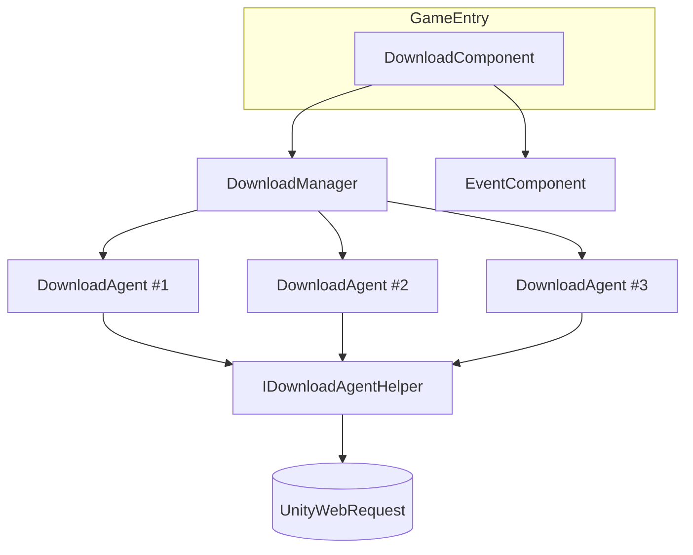

# 다운로드 컴포넌트 소개

GameFrameX 다운로드 컴포넌트는 Unity 환경에서 동작하는 멀티 에이전트 다운로드 관리자로, 동시 파일 다운로드, 우선순위 큐 스케줄링, 일시정지/재개, 실시간 속도 보고 및 이벤트 콜백을 담당합니다. `GameEntry`에 마운트되는 `DownloadComponent`를 외부 진입점으로 사용하며, 내부적으로 `DownloadManager`와 플러그 가능한 다운로드 에이전트 헬퍼(`IDownloadAgentHelper`)를 캡슐화하고 있어, 리소스 패키지, 핫 업데이트 파일, 패치 등을 로컬 디스크에 저장하는 다운로드 시나리오에 적합합니다.

## 빠른 시작

1. **컴포넌트 설치**: `Packages/manifest.json`에 Scoped Registry와 의존성을 추가합니다:

   ```json
   {
     "scopedRegistries": [
       {
         "name": "GameFrameX",
         "url": "https://gameframex.upm.alianblank.uk",
         "scopes": ["com.gameframex"]
       }
     ],
     "dependencies": {
       "com.gameframex.unity.download": "1.1.2"
     }
   }
   ```

   출처: [README.zh-CN.md](https://github.com/GameFrameX/com.gameframex.unity.download/blob/main/README.zh-CN.md#L68-L84)

2. **컴포넌트 인스턴스 가져오기**: 프레임워크 진입점을 통해 `DownloadComponent`를 가져옵니다:

   ```csharp
   var downloadComponent = GameEntry.GetComponent<DownloadComponent>();
   ```

   출처: [DownloadComponent.cs](https://github.com/GameFrameX/com.gameframex.unity.download/blob/main/Runtime/Download/DownloadComponent.cs#L46-L60)

3. **다운로드 작업 추가**(비동기 방식):

   ```csharp
   bool success = await downloadComponent.Download(
       "/本地保存路径/file.zip",
       "https://example.com/file.zip"
   );
   ```

   출처: [README.zh-CN.md](https://github.com/GameFrameX/com.gameframex.unity.download/blob/main/README.zh-CN.md#L131-L143)

4. **또는 이벤트 기반 방식 사용**:

   ```csharp
   var eventComponent = GameEntry.GetComponent<EventComponent>();
   eventComponent.Subscribe(DownloadSuccessEventArgs.EventId, OnDownloadSuccess);
   eventComponent.Subscribe(DownloadFailureEventArgs.EventId, OnDownloadFailure);

   int serialId = downloadComponent.AddDownload(
       "/本地保存路径/file.zip",
       "https://example.com/file.zip"
   );
   ```

   출처: [README.zh-CN.md](https://github.com/GameFrameX/com.gameframex.unity.download/blob/main/README.zh-CN.md#L96-L127)

5. **태그별 그룹화 및 일시정지/재개**:

   ```csharp
   int id = downloadComponent.AddDownload(path, uri, tag: "assets", priority: 10);
   downloadComponent.GetDownloadInfos("assets");
   downloadComponent.RemoveDownloads("assets");

   downloadComponent.Paused = true;   // 전체 일시정지
   downloadComponent.Paused = false;  // 재개
   ```

   출처: [README.zh-CN.md](https://github.com/GameFrameX/com.gameframex.unity.download/blob/main/README.zh-CN.md#L145-L167)

## 작동 원리 개요

컴포넌트는 외부에 `DownloadComponent`만 노출하며, 내부에서는 세 종류의 객체가 협력하여 동작합니다:



- `DownloadComponent`는 파라미터(에이전트 수, 타임아웃, `FlushSize`, 헬퍼 타입)를 관리하고 호출을 전달합니다.
- `DownloadManager`는 작업 큐와 에이전트 풀을 유지 관리하며, 우선순위에 따라 작업을 배분합니다.
- `IDownloadAgentHelper`는 실제로 네트워크 요청을 보내는 추상 계층이며, 기본 구현은 `UnityWebRequestDownloadAgentHelper`로 Inspector에서 교체하거나 커스터마이즈할 수 있습니다.
- 완료/실패는 이벤트 버스를 통해 구독자에게 브로드캐스트됩니다.

출처: [DownloadComponent.cs](https://github.com/GameFrameX/com.gameframex.unity.download/blob/main/Runtime/Download/DownloadComponent.cs#L46-L80)

## 핵심 기능 개요

| 기능 | 설명 |
|------|------|
| 멀티 에이전트 동시 처리 | 기본 3개의 다운로드 에이전트가 병렬로 동작하며, Inspector에서 수정 가능 |
| 우선순위 스케줄링 | 값이 클수록 먼저 배분됨 |
| 태그 그룹화 | 태그별로 작업 추가, 조회, 제거 지원 |
| 일시정지 및 재개 | `Paused = true/false`가 전역 적용됨 |
| 타임아웃 및 디스크 플러시 | `Timeout`(기본 30초) 및 `FlushSize`(기본 1 MB)로 이어받기 지원 |
| 실시간 지표 | `CurrentSpeed`, `TotalAgentCount`, `WaitingTaskCount` |
| 이벤트 기반 | `EventComponent`를 통해 `DownloadStart` / `DownloadUpdate` / `DownloadSuccess` / `DownloadFailure` 디스패치 |
| 비동기 지원 | `Download()`가 `Task<bool>`를 반환하며 바로 await 가능 |
| 플러그 가능한 백엔드 | `UnityWebRequestDownloadAgentHelper` 내장, 직접 `IDownloadAgentHelper` 구현도 가능 |

출처: [README.zh-CN.md](https://github.com/GameFrameX/com.gameframex.unity.download/blob/main/README.zh-CN.md#L28-L38)

## 다음 단계

- 다운로드 작업을 추가하고 결과를 처리하는 방법은 《다운로드를 시작하는 방법》을 참고하세요.
- 태그별로 작업을 관리하는 방법은 《태그 그룹화로 다운로드를 관리하는 방법》을 참고하세요.
- 일시정지/재개, 타임아웃 및 플러시 임계값 수정은 《다운로드 컴포넌트 구성 방법》을 참고하세요.
- 이벤트 구독 및 비동기 인터페이스 선택은 《다운로드 이벤트 구독 방법》을 참고하세요.
- 다운로드 백엔드 교체 또는 커스터마이즈는 《다운로드 에이전트 헬퍼 교체 방법》을 참고하세요.
- 다운로드 실패 문제 해결은 《다운로드 실패 시 대처 방법》을 참고하세요.