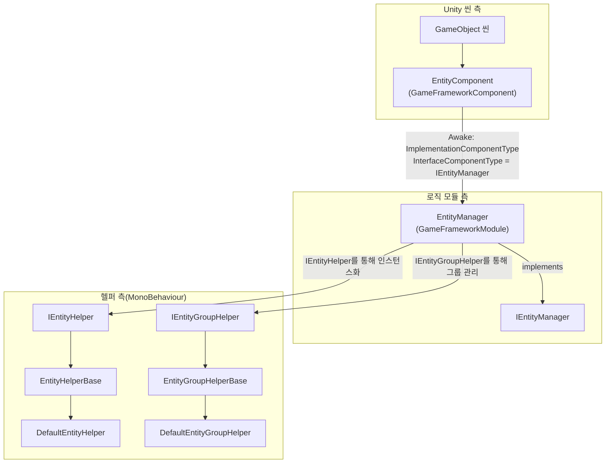

# 동작 원리: Manager-Component-Helper 아키텍처와 엔티티 생명 주기

엔티티(Entity) 모듈은 GameFrameX 프레임워크의 범용 **Manager + Component + Helper** 3계층 아키텍처를 채택합니다. Unity 측의 `EntityComponent`는 씬(Scene) 지향의 진입점으로, 로직 측의 `EntityManager`를 보유하여 모든 엔티티의 생명 주기(`Init → Show → Hide → Recycle`)를 통합적으로调度(스케줄링)합니다. 또한 `IEntityHelper` / `IEntityGroupHelper`라는 두 개의 Helper 인터페이스를 통해 "어떻게 생성할지 / 어떻게 그룹화할지"라는 구체적인 동작을 사용자가 교체할 수 있는 구현으로 위임합니다.

## 3계층 역할一览(한눈에 보기)

| 계층 | 타입 | 네임스페이스 | 책임 |
|----|------|--------------|------|
| Component(컴포넌트) | `EntityComponent : GameFrameworkComponent` | `GameFrameX.Entity.Runtime` | 씬 GameObject에 부착되어 프레임워크 모듈 진입점 역할을 하며, `Awake` 시 `IEntityManager` 구현 클래스를 프레임워크에 바인딩함. 엔티티 그룹의 등록과 획득을 제공 |
| Manager(매니저) | `EntityManager : GameFrameworkModule, IEntityManager` | `GameFrameX.Entity.Runtime` | partial class, 순수 로직 모듈. 엔티티 / 엔티티 그룹 딕셔너리, 상태 머신 진행, `ShowEntity` / `HideEntity` / `RecycleEntity` 메인 흐름을 담당 |
| Helper(헬퍼) | `IEntityHelper` / `IEntityGroupHelper` 및 대응되는 `*Base`, `Default*` 구현 | `GameFrameX.Entity.Runtime` | 사용자 또는 프레임워크 기본 제공 `MonoBehaviour`. Helper가 "엔티티를 어떻게 인스턴스화할지 / 엔티티를 어느 그룹에 붙일지"를 결정 |

## 빠른 시작(모듈 실행하기)

1. 씬에 빈 GameObject를 하나 배치하고 `EntityComponent`를 추가합니다(Inspector의 Add Component → GameFrameX/Entity에서 찾을 수 있음).
2. `MonoBehaviour`가 `EntityHelperBase`를 상속하여 엔티티 헬퍼를 구현하거나, 내장된 `DefaultEntityHelper`를 직접 사용합니다.
3. `MonoBehaviour`가 `EntityGroupHelperBase`를 상속하여 엔티티 그룹 헬퍼를 구현하거나, 내장된 `DefaultEntityGroupHelper`를 직접 사용합니다.
4. 게임 시작 시 `GameEntry.GetComponent<EntityComponent>()`로 컴포넌트를 가져와 `AddEntityGroup(...)`을 호출해 여러 그룹을 등록한 후, `ShowEntity`를 호출하여 인스턴스를 생성합니다.

소스 코드 진입점:[EntityComponent.cs](https://github.com/GameFrameX/com.gameframex.unity.entity/blob/main/Runtime/Entity/EntityComponent.cs#L100-L120)

## Manager-Component-Helper 관계



- 시작: `EntityComponent.Awake()`는 소스 파일에서 `InterfaceComponentType = typeof(IEntityManager)` 및 `ImplementationComponentType = Utility.Assembly.GetType(componentType)`를 수행하며, 프레임워크가 이를 조립하여 전역 접근용 `IEntityManager`를 만듭니다.

소스:[EntityComponent.cs](https://github.com/GameFrameX/com.gameframex.unity.entity/blob/main/Runtime/Entity/EntityComponent.cs)

## 엔티티 생명 주기

엔티티의 생성부터 소멸까지의 전 과정은 `EntityStatus` 상태 머신에 의해 진행되며, 열거형은 `Entity/EntityManager.EntityStatus.cs`에 정의되어 있습니다:

| 상태 | 의미 | 트리거 동작 |
|------|------|----------|
| `Unknown` | 기본 플레이스홀더 | — |
| `WillInit` | 초기화 예정 | Manager가 리소스를 준비하고 Helper를 호출 |
| `Inited` | 초기화 완료 | 리소스 준비 완료, 콜백 `OnInit` |
| `WillShow` | 표시 예정 | Helper의 `CreateEntity` 호출 |
| `Showed` | 표시됨, 씬에서 활성 | 콜백 `OnShow` |
| `WillHide` | 숨김 예정 | 표시 회수 준비 |
| `Hidden` | 숨겨짐, 인스턴스 유지 | 콜백 `OnHide` |
| `WillRecycle` | 재활용 예정 | 참조 카운트가 0이 됨 |
| `Recycled` | 재활용됨, 재사용 또는 파괴 가능 | 콜백 `OnRecycle` |

소스:[EntityManager.EntityStatus.cs](https://github.com/GameFrameX/com.gameframex.unity.entity/blob/main/Runtime/Entity/Entity/EntityManager.EntityStatus.cs#L38-L52)

### 상태 진행 4단계

Manager는 `ShowEntity` / `HideEntity` 메인 진입점을 통해 위 상태들을 순서대로 진행시키며, 각 단계는 Helper에 위임됩니다:

1. **Init**: `InstantiateEntity(entityAsset)`이 `IEntityHelper`를 통해 해당 그룹 컨테이너에서 엔티티를 인스턴스화합니다.
2. **Show**: `CreateEntity(entityInstance, entityGroup, userData)`가 Helper에 의해 `IEntity`를 구성하고, Transform 및 부모 노드를 설정합니다.
3. **Hide**: `EntityManager.Hide*` 흐름이 `Showed → WillHide → Hidden`으로 전환하며, 인스턴스는 재사용을 위해 그룹에 유지됩니다.
4. **Recycle**: `ReleaseEntity(entityAsset, entityInstance)`이 Helper에 의해 오브젝트를 파괴하거나 오브젝트 풀에 반환합니다.

`IEntityHelper`의 인터페이스 정의:

```csharp
public interface IEntityHelper
{
    object InstantiateEntity(object entityAsset);
    IEntity CreateEntity(object entityInstance, IEntityGroup entityGroup, object userData);
    void ReleaseEntity(object entityAsset, object entityInstance);
}
```

소스:[IEntityHelper.cs](https://github.com/GameFrameX/com.gameframex.unity.entity/blob/main/Runtime/Entity/Entity/IEntityHelper.cs#L37-L61)

## Helper의 교체 가능 지점

| 인터페이스 | 기본 구현 | 커스텀 Helper로 교체하는 시나리오 |
|------|----------|--------------------------|
| `IEntityHelper` | `DefaultEntityHelper : EntityHelperBase` | Addressables, 오브젝트 풀 또는 커스텀 사전 로드 전략을 사용하고 싶을 때, `EntityHelperBase`를 상속 |
| `IEntityGroupHelper` | `DefaultEntityGroupHelper : EntityGroupHelperBase` | 엔티티를 서로 다른 부모 노드에 붙이거나, 계층별 LOD/분할 화면 표시를 하고 싶을 때, `EntityGroupHelperBase`를 상속 |

두 Helper 추상 클래스 모두 `MonoBehaviour`를 상속하므로, Inspector에서 임의의 GameObject에 바인딩할 수 있으며, Manager는 호출 시 인터페이스를 통해 인스턴스를 가져옵니다.

소스:[EntityHelperBase.cs](https://github.com/GameFrameX/com.gameframex.unity.entity/blob/main/Runtime/Entity/EntityHelperBase.cs#L38-L40)、[EntityGroupHelperBase.cs](https://github.com/GameFrameX/com.gameframex.unity.entity/blob/main/Runtime/Entity/EntityGroupHelperBase.cs#L38-L40)

## 다음 단계

- 엔티티 그룹을 추가하고 엔티티를 표시하려면《방법: 엔티티 그룹 등록 및 ShowEntity》를 참조하세요.
- `ShowEntity`가 `Entity ... is not inited` 또는 유사한 오류를 반환하면《엔티티 생명 주기 예외 처리 방법》을 참조하세요.
- 공개 API의 메서드 시그니처와 기본값은《엔티티 모듈 API 빠른 참조》를 참조하세요.