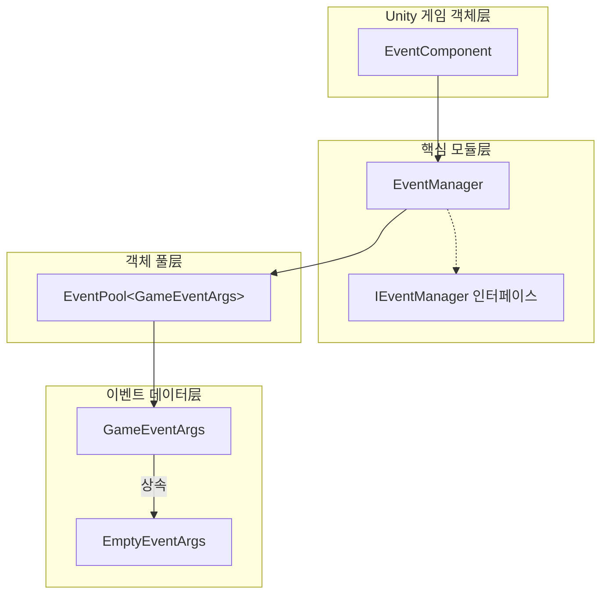
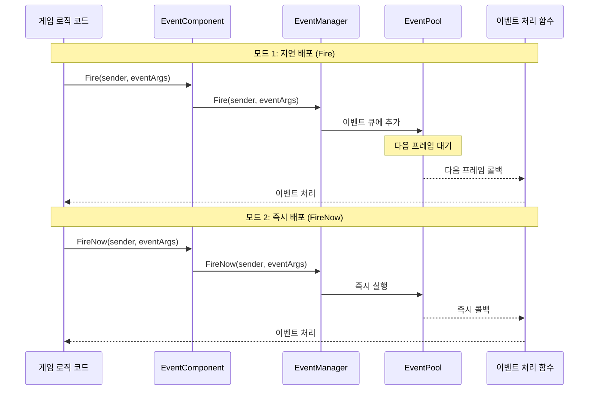
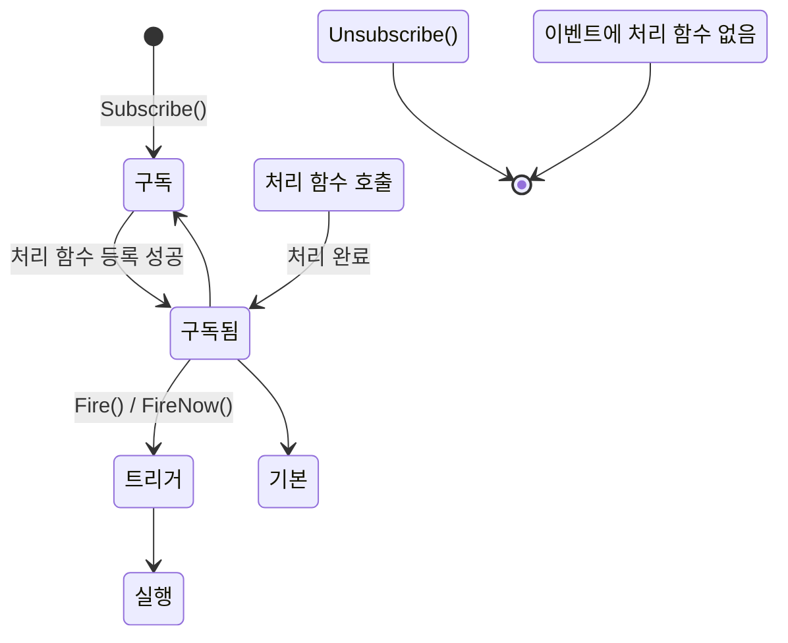

# 플러그인 소개

GameFrameX Event 플러그인은 GameFrameX 게임 프레임워크의 핵심 컴포넌트 중 하나로, 완전한 게임 이벤트 시스템 솔루션을 제공합니다. 이 플러그인은 옵저버 패턴(Observer Pattern)을 구현하여 게임 객체 간의 느슨한 결합(松耦合) 통신을 가능하게 하며,事件驱动型 게임 아키텍처를 구축하는 데 이상적인 선택입니다.

## 개요

GameFrameX Event 이벤트 시스템 컴포넌트는 가볍고 고성능인 Unity 이벤트 관리 프레임워크로, 게임 개발를 위해 설계되었습니다. 이는 전통적인 Unity 이벤트 시스템(예: UnityEvent, SendMessage)의 여러 제약 사항을 해결하며 더욱 강하고 유연한 이벤트 처리 능력을 제공합니다.

이벤트 시스템의 핵심 설계理念은事件的**발신자**와**수신자**를 분리하여, 게임의 각 모듈이 서로를 직접 참조하지 않고 이벤트를 통해 통신할 수 있도록 하는 것입니다. 이러한 설계 모드는 코드 유지보수성과 확장성을 크게 향상시키며, 특히大型 게임 프로젝트 개발에 적합합니다.

### 핵심 특성

| 특성 | 설명 |
|------|------|
| **스레드 안전성** | 백그라운드 스레드에서 이벤트 트리거 지원, 메인 스레드에서 콜백 자동 처리 |
| **지연 배포** | Fire() 메서드가 이벤트를 다음 프레임으로 지연하여 성능 떨림 방지 |
| **즉시 배포** | FireNow() 메서드가 즉시 이벤트 배포 지원, 실시간 응답 시나리오에 적합 |
| **객체 풀** | 내부적으로 객체 풀 기술 사용, 메모리 할당 및 GC压力 감소 |
| **기본 핸들러** | 미구독 이벤트를 캡처하기 위한 기본 이벤트 처리 함수 설정 지원 |
| **다중 구독** |同一 이벤트 ID에 여러 처리 함수 바인딩 허용 |

### 이벤트 시스템 아키텍처

GameFrameX Event 이벤트 시스템은 명확한职责分工을 가진 여러 핵심 컴포넌트로 구성됩니다:



**아키텍처 설명:**

- **EventComponent**: Unity 컴포넌트로 존재하며, 게임 스크립트가 직접 호출하는 공개 API를 제공합니다. 이벤트 시스템과 게임 코드의 브릿지 역할을 합니다. `GameFrameworkComponent`를 상속하여 GameFrameX 프레임워크의 컴포넌트 규범을 따릅니다.

- **EventManager**: 이벤트 시스템의 핵심 모듈로, `GameFrameworkModule`를 상속하고 `IEventManager` 인터페이스를 구현합니다. 모든 이벤트 구독, 구독 취소 및 배포 로직을 관리합니다.

- **EventPool**: 내부적으로 사용되는 이벤트 풀 구현으로, 이벤트 객체의 획득 및 회수를 담당하여 게임 실행 시 메모리 할당을 효과적으로 줄입니다.

- **GameEventArgs**: 모든 게임 이벤트의 基类로, 개발자는 이 클래스를 상속하여自定义 이벤트 타입을 생성해야 합니다.

- **EmptyEventArgs**: 사전 구성된 단순 이벤트 클래스로, 이벤트 ID만 포함하며 추가 데이터를 전달할 필요가 없는 시나리오에 적합합니다.

## 이벤트 순환 메커니즘

### 이벤트 배포 모드

GameFrameX Event는 서로 다른 요구 사항을 충족하기 위해 두 가지 이벤트 배포 모드를 제공합니다:



**지연 배포(Fire) 특징:**
- 이벤트가 큐에 추가되어 다음 프레임에서統一 처리됩니다
- 완전한 스레드 안전성, 임의의 스레드에서 호출 가능
- 대부분의 게임 로직 이벤트에 적합
- 특정 프레임에서 성능 피크 발생 방지 가능

**즉시 배포(FireNow) 특징:**
- 이벤트 즉시 배포, 모든 처리 함수 동기 실행
- 스레드 안전성 없음, 메인 스레드에서 호출해야 함
- 즉시 응답이 필요한 이벤트에 적합
- 게임의 즉각적인 피드백 처리에 적합

### 이벤트 생명주기



## 빠른 사용 예시

### 기본 구독 및 트리거

```csharp
// 1. 自定义 이벤트 클래스 정의
public class PlayerDeadEventArgs : GameEventArgs
{
    public int PlayerId { get; set; }
    public string Reason { get; set; }
}

// 2. EventComponent 컴포넌트 참조 획득
var eventComponent = UnityEngine.GameObject.Find("GameRoot").GetComponent<EventComponent>();

// 3. 이벤트 구독
eventComponent.CheckSubscribe("player_dead", OnPlayerDead);

// 4. 이벤트 처리 함수 정의
private void OnPlayerDead(object sender, GameEventArgs e)
{
    var args = (PlayerDeadEventArgs)e;
    UnityEngine.Debug.Log($"플레이어 {args.PlayerId} 사망, 원인: {args.Reason}");
}

// 5. 이벤트 트리거
eventComponent.Fire(this, new PlayerDeadEventArgs 
{ 
    PlayerId = 1001, 
    Reason = "괴물에게 살해됨" 
});
```

> Source: [Runtime/EventComponent.cs](https://github.com/GameFrameX/com.gameframex.unity.event/blob/main/Runtime/EventComponent.cs#L90-L99)

### 빈 이벤트 사용

```csharp
// 데이터 없는 단순 이벤트 트리거
eventComponent.Fire(this, "game_start");
```

> Source: [Runtime/EventComponent.cs](https://github.com/GameFrameX/com.gameframex.unity.event/blob/main/Runtime/EventComponent.cs#L140-L144)

### 구독 상태 확인 및 취소

```csharp
// 이벤트 처리 함수가是否存在 확인
bool exists = eventComponent.Check("player_dead", OnPlayerDead);

// 구독 취소
eventComponent.Unsubscribe("player_dead", OnPlayerDead);
```

> Source: [Runtime/EventComponent.cs](https://github.com/GameFrameX/com.gameframex.unity.event/blob/main/Runtime/EventComponent.cs#L72-L75)

## 이벤트 시스템 설계 장점

### Unity原生 이벤트 시스템 대비 장점

| 특성 | UnityEvent / SendMessage | GameFrameX Event |
|------|-------------------------|------------------|
| 성능 |较差, 리플렉션 오버헤드 있음 |高性能, 리플렉션 없음 |
| 타입 안전성 |弱类型 |强类型 |
| 스레드 안전성 |不支持 |支持 |
| 객체 풀 |不支持 |支持 |
| 제네릭 지원 |不支持 |支持 |

### 전형적인 적용 시나리오

1. **UI와 게임 로직 분리**: 게임 데이터 변화 시 이벤트를 통해 UI 层에 통지하여 업데이트, UI가 게임 로직 코드를 직접 참조할 필요 없음

2. **모듈 간 통신**: 서로 다른 게임 모듈(가방 시스템, 퀘스트 시스템, 달성 시스템 등) 간 이벤트를 통해 통신, 模块 간 결합도 감소

3. **플러그인 시스템**: 게임 플러그인 또는 확장 모듈은 이벤트를 구독하여 게임 이벤트에 대응할 수 있으며, 핵심 코드 수정 필요 없음

4. **디버깅 및 로깅**: 전역 이벤트를 구독하여 게임 행동 모니터링 및 로깅 구현 가능

## 기술 구현 상세

### 핵심 클래스 설명

**EventComponent 클래스**

EventComponent는 Unity에서 이벤트 시스템의 진입점이며, `GameFrameworkComponent`를 상속하여 `Awake()` 메서드에서 EventManager 모듈을 초기화합니다:

```csharp
protected override void Awake()
{
    ImplementationComponentType = Utility.Assembly.GetType(componentType);
    InterfaceComponentType = typeof(IEventManager);
    base.Awake();
    m_EventManager = GameFrameworkEntry.GetModule<IEventManager>();
}
```

> Source: [Runtime/EventComponent.cs](https://github.com/GameFrameX/com.gameframex.unity.event/blob/main/Runtime/EventComponent.cs#L43-L54)

**EventManager 클래스**

EventManager는 `IEventManager` 인터페이스를 구현하여 내부적으로 `EventPool<GameEventArgs>`를 사용하여 이벤트 관리합니다:

```csharp
public EventManager()
{
    m_EventPool = new EventPool<GameEventArgs>(EventPoolMode.AllowNoHandler | EventPoolMode.AllowMultiHandler);
}
```

> Source: [Runtime/Event/EventManager.cs](https://github.com/GameFrameX/com.gameframex.unity.event/blob/main/Runtime/Event/EventManager.cs#L24-L27)

**CheckSubscribe 메서드**

해당 메서드는「구독 확인」모드를 구현하여, 이벤트 처리 함수가存在하지 않으면 자동으로 구독합니다:

```csharp
public void CheckSubscribe(string id, EventHandler<GameEventArgs> handler)
{
    if (!Check(id, handler))
    {
        m_EventManager.Subscribe(id, handler);
    }
}
```

> Source: [Runtime/EventComponent.cs](https://github.com/GameFrameX/com.gameframex.unity.event/blob/main/Runtime/EventComponent.cs#L82-L88)

이러한 설계는 중복 구독으로 인한 중복 호출 문제를 방지하며, 개발자의 사용 로직을简化합니다.

## 관련 링크

- [설치 방식](./02.installation.md) - 플러그인 설치 및 설정 방법 이해
- [빠른 시작](./03.getting-started.md) - 이벤트 시스템 사용 빠르게 시작
- [이벤트 시스템 아키텍처](./04.features.md) - 이벤트 시스템 아키텍처 설계深入了解
- [EventComponent API 참고](./05.event-component.md) - 완전한 API 문서
- [EventManager API 참고](./06.event-manager.md) - 이벤트 관리자 API 문서
- [GameEventArgs API 참고](./07.game-event-args.md) - 이벤트 파라미터 클래스 API 문서