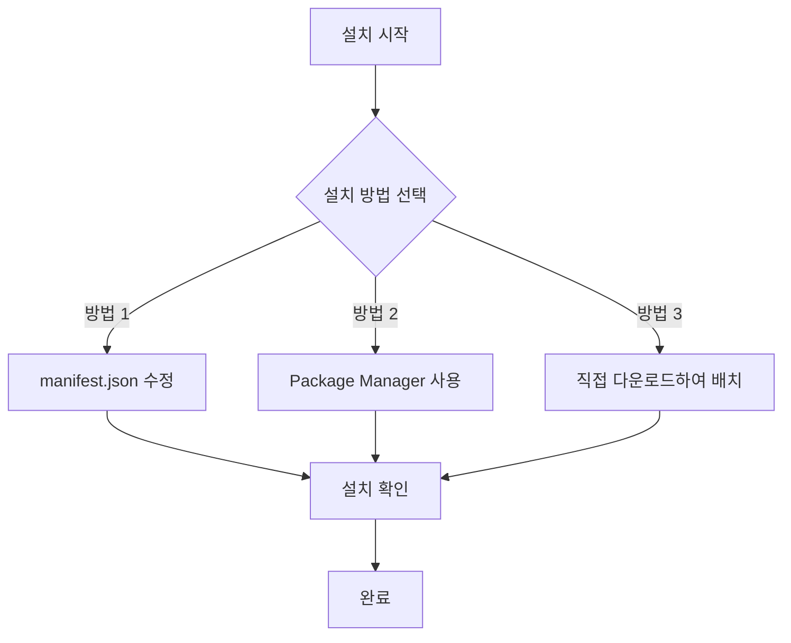
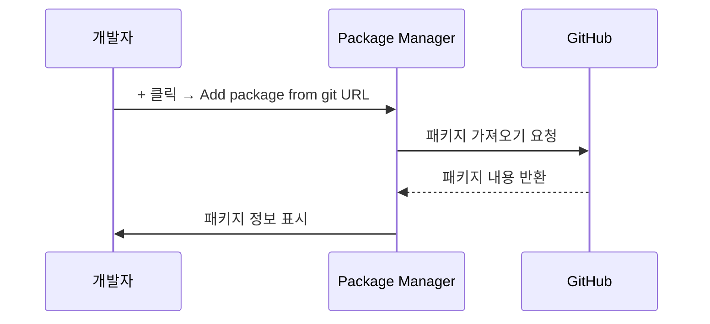

# 설치 방법

이 문서는 Game Frame X Event 이벤트 시스템 컴포넌트를 Unity 프로젝트에 설치하는 방법을 설명합니다.

## 개요

Game Frame X Event는 Game Frame X 게임 프레임워크의 이벤트 시스템 컴포넌트로, 게임 내 이벤트의 구독, 발송 및 관리 기능을 제공합니다. 이 컴포넌트는 스레드 안전한 비동기 이벤트 발송을 지원하며, 다양한 게임 개발 시나리오에 적용할 수 있습니다.

**패키지 정보:**
| 속성 | 값 |
|------|-----|
| 패키지 이름 | com.gameframex.unity.event |
| 버전 | 1.1.0 |
| Unity 버전 | 2017.1+ |

## 설치 전 준비

설치를 시작하기 전에 개발 환경이 다음 요구 사항을 충족하는지 확인하십시오:

- Unity 2017.1 이상
- Git 도구가 설치되어 있어야 함 (Git URL을 통한 설치에 사용)

## 설치 방법

Game Frame X Event는 세 가지 설치 방법을 제공합니다. 프로젝트 요구 사항에 따라 하나를 선택하십시오.



### 방법 1: manifest.json을 통한 설치

패키지를 프로젝트 종속성으로 버전 관리해야 하는 시나리오에 적합합니다.

1. Unity 프로젝트의 `Packages` 폴더를 엽니다
2. `manifest.json` 파일을 찾아 편집합니다
3. `dependencies` 노드 아래에 다음 내용을 추가합니다:

```json
{
  "dependencies": {
    "com.gameframex.unity.event": "https://github.com/GameFrameX/com.gameframex.unity.event.git"
  }
}
```

4. 파일을 저장하고 Unity가 자동으로 패키지를 다운로드하고 가져올 때까지 기다립니다

> **참고:** 이 방식은 Git 저장소에서 최신 버전을 자동으로 가져옵니다. 특정 버전을 지정하려면 Git의 버전 태그를 사용할 수 있습니다.

### 방법 2: Unity Package Manager를 통한 설치

가장 많이 사용되는 설치 방법으로, 대부분의 프로젝트에 적합합니다.

1. Unity 에디터를 엽니다
2. 메뉴에서 **Window → Package Manager**를 선택합니다
3. Package Manager 창에서 좌측 상단의 **+** 버튼을 클릭합니다
4. **Add package from git URL...**를 선택합니다
5. 입력란에 다음 주소를 붙여넣습니다:

```
https://github.com/GameFrameX/com.gameframex.unity.event.git
```

6. **Add** 버튼을 클릭하여 설치를 시작합니다
7. 다운로드 및 가져오기가 완료될 때까지 기다립니다



### 방법 3: 직접 다운로드하여 배치

오프라인 환경이나 사용자 정의 수정이 필요한 시나리오에 적합합니다.

1. GitHub 저장소에 접속합니다:
   > https://github.com/GameFrameX/com.gameframex.unity.event.git

2. **Code** 버튼을 클릭하고 **Download ZIP**을 선택하여 소스 코드를 다운로드합니다
3. 다운로드한 ZIP 파일의 압축을 풉니다
4. 압축을 푼 폴더의 이름을 `com.gameframex.unity.event`로 변경합니다
5. 해당 폴더를 Unity 프로젝트의 `Packages` 디렉토리에 복사합니다
6. Unity가 자동으로 패키지를 인식하고 로드합니다

> **팁:** 배치 후 패키지 폴더에 `package.json` 파일이 포함되어야 Unity가 올바르게 인식할 수 있습니다.

## 설치 확인

설치가 완료되면 다음 방법으로 설치 성공 여부를 확인할 수 있습니다:

### 방법 1: Package Manager 확인

**Window → Package Manager**를 열고 목록에서 **Game Frame X Event**를 찾아 설치됨 상태인지 확인합니다.

### 방법 2: 스크립트 참조 확인

프로젝트에 테스트 스크립트를 생성하고 EventComponent를 참조해 봅니다:

```csharp
using GameFrameX.Event.Runtime;

// EventComponent가 정상적으로 사용 가능한지 확인
public class TestScript : MonoBehaviour
{
    private EventComponent _eventComponent;
    
    void Start()
    {
        _eventComponent = GetComponent<EventComponent>();
        Debug.Log("Event 컴포넌트가 성공적으로 설치되었습니다!");
    }
}
```

### 방법 3: 어셈블리 확인

프로젝트에 다음 어셈블리가 로드되었는지 확인합니다:
- `GameFrameX.Event.Runtime`
- `GameFrameX.Event.Editor` (에디터에서 사용하는 경우)

## 종속 항목 설명

Game Frame X Event 컴포넌트는 다음 핵심 모듈에 종속됩니다:

| 종속 모듈 | 설명 |
|---------|------|
| GameFrameX.Runtime | 게임 프레임워크 런타임 핵심 |

> **참고:** 프로젝트에 GameFrameX.Runtime이 설치되어 있지 않은 경우 이 종속 항목을 먼저 설치해야 합니다. EventComponent는 `GameFrameworkComponent`를 상속하므로 프레임워크 핵심 지원이 필요합니다.

## 자주 묻는 질문

### Q1: 설치 후 GameFrameworkComponent를 찾을 수 없다는 오류가 발생합니다

GameFrameX.Runtime 핵심 모듈이 누락되었기 때문입니다. 게임 프레임워크의 핵심 런타임 컴포넌트를 먼저 설치한 다음 Event 모듈을 설치하십시오.

### Q2: 최신 버전으로 업데이트하려면 어떻게 합니까

- **방법 1/2**: manifest.json에서 해당 항목을 삭제한 후 다시 추가하거나, Package Manager에서 업데이트 버튼을 클릭합니다
- **방법 3**: 최신 버전을 다시 다운로드하여 교체합니다

### Q3: 어떤 Unity 버전을 지원합니까

이 컴포넌트는 Unity 2017.1 이상을 지원합니다. 최상의 호환성을 위해 최신 LTS 버전을 사용하는 것을 권장합니다.

## 관련 링크

- [플러그인 소개](./01.overview.md)
- [빠른 시작](./03.getting-started.md)
- [핵심 개념](./04.features.md)
- [GitHub 저장소](https://github.com/GameFrameX/com.gameframex.unity.event.git)
- [공식 웹사이트](https://gameframex.doc.alianblank.com)
