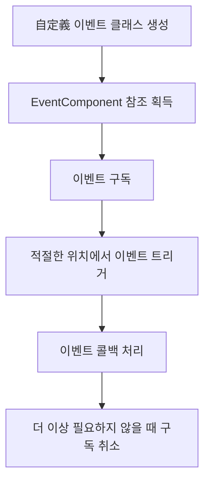

# 빠른 시작

본 문서는 GameFrameX 이벤트 시스템을 빠르게 시작할 수 있도록 도움을 줍니다. 이 가이드를 읽으면 Unity 프로젝트에서 이벤트 컴포넌트를 구성하고 사용하여 게임의事件驱动 프로그래밍을 구현하는 방법을 이해할 수 있습니다.

## 개요

GameFrameX 이벤트 시스템은 경량의 이벤트 관리 프레임워크로, 옵저버 모드를 구현하여 게임의 서로 다른 모듈이 이벤트를 통해 느슨하게 통신할 수 있도록 합니다. 문자열을 이벤트 식별자로 사용하여 이벤트를 구독하고 처리할 수 있습니다.

## 사전 조건

이벤트 시스템을 사용하기 전에 다음 사항을 확인하세요:

1. Unity 2017.1 이상 버전
2. GameFrameX 핵심 프레임워크가 올바르게 설치됨
3. 프로젝트에 Event 컴포넌트 패키지가 추가됨

> **팁:** 설치 안내는 [설치 방식](./02.installation.md)을 참조하세요.

## 기본 사용 흐름

이벤트 시스템의 전형적인 사용 흐름은 다음과 같습니다:



## 첫 번째 단계: 自定义 이벤트 클래스 생성

먼저 `GameEventArgs`를 상속하는 이벤트 파라미터 클래스를 정의해야 합니다:

```csharp
using GameFrameX.Event.Runtime;

/// <summary>
/// 게임 시작 이벤트 파라미터
/// </summary>
public class GameStartEventArgs : GameEventArgs
{
    /// <summary>
    /// 이벤트 ID 식별자
    /// </summary>
    public override string Id => "game_start";

    /// <summary>
    /// 현재 게임 레벨
    /// </summary>
    public int CurrentLevel { get; set; }

    /// <summary>
    /// 플레이어 이름
    /// </summary>
    public string PlayerName { get; set; }

    /// <summary>
    /// 이벤트 데이터 정리
    /// </summary>
    public override void Clear()
    {
        CurrentLevel = 0;
        PlayerName = null;
    }
}
```

> Source: [GameEventArgs.cs](https://github.com/GameFrameX/com.gameframex.unity.event/blob/main/Runtime/EventArgs/GameEventArgs.cs#L12-L18)

## 두 번째 단계: 장면에 EventComponent 추가

Unity 편집기에서 다음 단계에 따라 이벤트 컴포넌트를 추가합니다:

1. 장면에 빈 게임 객체를 생성합니다 (또는 기존 게임 객체 선택)
2. **Add Component** 버튼을 클릭합니다
3. **Event** 컴포넌트를 검색합니다
4. **Game Framework → Event**를 선택합니다

컴포넌트 추가 후 EventComponent가 자동으로 이벤트 관리자를 초기화합니다.

## 세 번째 단계: 이벤트 구독

이벤트를 리스닝해야 하는 스크립트에서 해당 이벤트를 구독합니다:

```csharp
using UnityEngine;
using GameFrameX.Event.Runtime;

/// <summary>
/// 게임 관리자 - 게임 생명주기 관리 담당
/// </summary>
public class GameManager : MonoBehaviour
{
    private EventComponent _eventComponent;

    private void Awake()
    {
        // 이벤트 컴포넌트 참조 획득
        _eventComponent = UnityEngine.GameObject.FindObjectOfType<EventComponent>();
    }

    private void OnEnable()
    {
        // 게임 시작 이벤트 구독
        // CheckSubscribe는存在하지 않을 때 자동으로 구독하여 중복 구독을 방지합니다
        _eventComponent.CheckSubscribe("game_start", OnGameStart);
    }

    private void OnDisable()
    {
        // 게임 시작 이벤트 구독 취소
        _eventComponent.Unsubscribe("game_start", OnGameStart);
    }

    /// <summary>
    /// 게임 시작 이벤트 처리 함수
    /// </summary>
    private void OnGameStart(object sender, GameEventArgs e)
    {
        if (e is GameStartEventArgs args)
        {
            Debug.Log($"게임 시작! 레벨: {args.CurrentLevel}, 플레이어: {args.PlayerName}");
        }
    }
}
```

> Source: [EventComponent.cs](https://github.com/GameFrameX/com.gameframex.unity.event/blob/main/Runtime/EventComponent.cs#L82-L88)

## 네 번째 단계: 이벤트 트리거

게임 상태가 변화하면 해당 이벤트를 트리거합니다:

```csharp
// 게임 시작 흐름에서 이벤트 트리거
public class GameStarter : MonoBehaviour
{
    public EventComponent eventComponent;

    private void Start()
    {
        // 이벤트 파라미터 생성
        var eventArgs = new GameStartEventArgs
        {
            CurrentLevel = 1,
            PlayerName = "Player1"
        };

        // 이벤트 트리거 - Fire는 스레드 안전하며 다음 프레임에 배포됩니다
        eventComponent.Fire(this, eventArgs);

        // 또는 FireNow를 사용하여 즉시 배포 (스레드 안전하지 않음)
        // eventComponent.FireNow(this, eventArgs);
    }
}
```

> Source: [EventComponent.cs](https://github.com/GameFrameX/com.gameframex.unity.event/blob/main/Runtime/EventComponent.cs#L130-L144)

## 이벤트 배포 모드

이벤트 컴포넌트는 두 가지 이벤트 배포 방식을 제공합니다:

| 모드 | 메서드 | 스레드 안전성 | 적용 시나리오 |
|------|------|----------|----------|
| 지연 배포 | `Fire()` | ✅ 안전 | 대부분의 경우, 권장 사용 |
| 즉시 배포 | `FireNow()` | ❌ 안전하지 않음 | 긴급 이벤트 또는 확정성 요구가 높은情况 |

```csharp
// 지연 배포 - 이벤트가 다음 프레임에서 처리됩니다
eventComponent.Fire(sender, new GameEventArgs());

// 즉시 배포 - 이벤트가 즉시 처리됩니다
eventComponent.FireNow(sender, new GameEventArgs());
```

## 간소화된 이벤트 사용

복잡한 이벤트 데이터를 전달할 필요가 없으면 간소화된 문자열 이벤트를 사용할 수 있습니다:

```csharp
// 단순 이벤트 트리거
eventComponent.Fire(this, "player_dead");

// 이벤트 처리 함수에서 수신
private void OnPlayerDead(object sender, GameEventArgs e)
{
    // e.Id에는 "player_dead"가 포함됩니다
    Debug.Log("플레이어 사망!");
}
```

> Source: [EmptyEventArgs.cs](https://github.com/GameFrameX/com.gameframex.unity.event/blob/main/Runtime/EventArgs/EmptyEventArgs.cs#L32-L37)

## 완전한 예시: 플레이어 사망 이벤트

다음은 플레이어 사망 이벤트 시스템을 구현하는 완전한 예시입니다:

```csharp
using UnityEngine;
using GameFrameX.Event.Runtime;

/// <summary>
/// 플레이어 사망 이벤트 파라미터
/// </summary>
public class PlayerDeadEventArgs : GameEventArgs
{
    public override string Id => "player_dead";
    public int PlayerId { get; set; }
    public string Reason { get; set; }
    public override void Clear()
    {
        PlayerId = 0;
        Reason = null;
    }
}

/// <summary>
/// 플레이어 컨트롤러
/// </summary>
public class PlayerController : MonoBehaviour
{
    private EventComponent _eventComponent;
    private int _health = 100;

    private void Awake()
    {
        _eventComponent = FindObjectOfType<EventComponent>();
    }

    private void OnEnable()
    {
        _eventComponent.CheckSubscribe("player_dead", OnPlayerDead);
    }

    private void OnDisable()
    {
        _eventComponent.Unsubscribe("player_dead", OnPlayerDead);
    }

    /// <summary>
    /// 플레이어가 피해를 입음
    /// </summary>
    public void TakeDamage(int damage)
    {
        _health -= damage;
        
        if (_health <= 0)
        {
            // 플레이어 사망 이벤트 트리거
            var args = new PlayerDeadEventArgs
            {
                PlayerId = GetInstanceID(),
                Reason = "생명력 소진"
            };
            _eventComponent.Fire(this, args);
        }
    }

    private void OnPlayerDead(object sender, GameEventArgs e)
    {
        if (e is PlayerDeadEventArgs args)
        {
            Debug.Log($"플레이어 {args.PlayerId} 사망, 원인: {args.Reason}");
            // 여기에 게임 종료 로직 추가 가능
        }
    }
}
```

## 기본 이벤트 처리 함수

이벤트 컴포넌트에 기본 핸들러를 설정하여 명확하게 구독되지 않은 이벤트를 캡처할 수 있습니다:

```csharp
private void Start()
{
    var eventComponent = GetComponent<EventComponent>();
    eventComponent.SetDefaultHandler(OnUnhandledEvent);
}

private void OnUnhandledEvent(object sender, GameEventArgs e)
{
    Debug.Log($"미처리된 이벤트: {e.Id}");
}
```

> Source: [EventComponent.cs](https://github.com/GameFrameX/com.gameframex.unity.event/blob/main/Runtime/EventComponent.cs#L120-L123)

## 이벤트 통계

이벤트 시스템의 현재 상태를随时获取할 수 있습니다:

```csharp
// 이벤트 처리 함수 총 수 획득
int handlerCount = eventComponent.EventHandlerCount;

// 이벤트 타입 총 수 획득
int eventCount = eventComponent.EventCount;

// 특정 이벤트의 처리 함수 수 획득
int specificCount = eventComponent.Count("game_start");
```

> Source: [EventComponent.cs](https://github.com/GameFrameX/com.gameframex.unity.event/blob/main/Runtime/EventComponent.cs#L27-L38)

## 모범 사례

1. **적시에 구독 취소**: `OnDisable` 또는 `OnDestroy`에서 이벤트 구독을 취소하여 메모리 누수 방지
2. **CheckSubscribe 사용**: `CheckSubscribe` 메서드를 사용하여 중복 구독 방지
3. **Fire而非 FireNow 사용**: 특수한 요구가 없으면 스레드 안전성을 보장하기 위해 `Fire` 메서드 사용
4. **이벤트 데이터 정리**: 自定义 이벤트 클래스에서 `Clear()` 메서드를 올바르게 구현하여 객체 풀 재사용 용이하게 함

## 관련 링크

- [플러그인 소개](./01.overview.md) - 이벤트 시스템 개요 자세히 알아보기
- [설치 방식](./02.installation.md) - 자세한 설치 안내 查看
- [이벤트 시스템 아키텍처](./04.features.md) - 내부 아키텍처深入了解
- [EventComponent API 참고](./05.event-component.md) - 완전한 API 문서
- [EventManager API 참고](./06.event-manager.md) - 이벤트 관리자 API
- [GameEventArgs API 참고](./07.game-event-args.md) - 이벤트 파라미터 基类
- [자주 묻는 질문](./08.troubleshooting.md) - 일반적인 문제 및 해결책